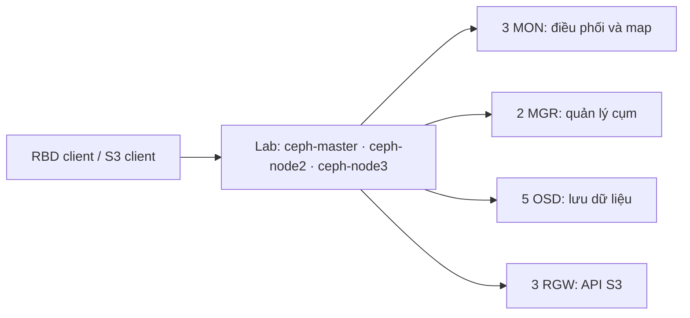
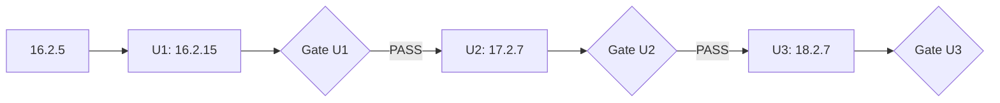
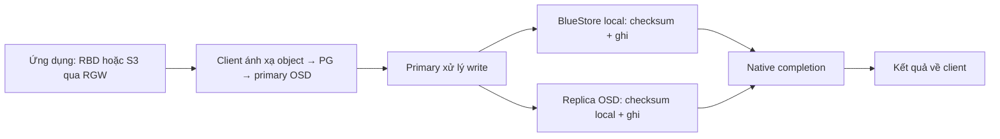
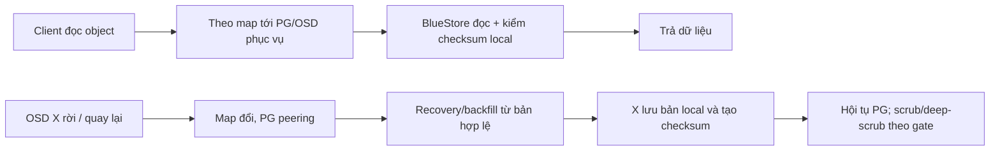
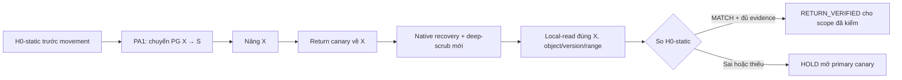

# Báo cáo một tháng nghiên cứu và kế hoạch thử nâng cấp Ceph trên lab

**Ngày cập nhật:** 02/10/2026 
**Hạn của kế hoạch:** 01/11/2026 
**Đối tượng:** lãnh đạo và quản lý kỹ thuật nội bộ 
**Thời lượng:** 15 slide, khoảng 15 phút 40 giây trình bày và 3–4 phút trao đổi 
**Lời thuyết trình:** [02_Loi_thuyet_trinh_Ceph_va_H0.md](./02_Loi_thuyet_trinh_Ceph_va_H0.md)

Phần trình bày chính đi từ lý do nâng cấp, cách xây phương án, kết quả một tháng đến luồng dữ liệu và kế hoạch. Chi tiết gate MON cùng raw evidence giữ trong phụ lục để trả lời khi được hỏi. **18.2.7 là target lab cố định, không phải quyết định rollout production.** H0 vẫn là ý tưởng thiết kế cần xây và thử; không dùng checksum test cũ làm kết quả H0.

## Mạch trình bày

| Slide | Nội dung | Thời gian |
| ---: | --- | ---: |
| 1 | Nghiên cứu phương án nâng cấp Ceph | 20 giây |
| 2 | Vì sao thử nâng lên Reef 18.2.7? | 75 giây |
| 3 | Cách xây phương án: 5 bước | 65 giây |
| 4 | Cụm Ceph lab | 65 giây |
| 5 | Kế hoạch nâng toàn cụm | 80 giây |
| 6 | Sau một tháng, em học được gì? | 65 giây |
| 7 | Sau một tháng, em đã làm được gì? | 65 giây |
| 8 | Thử tải RBD và RGW để học cách đo | 65 giây |
| 9 | Luồng ghi dữ liệu bình thường của Ceph | 65 giây |
| 10 | Luồng đọc và phục hồi dữ liệu của Ceph | 65 giây |
| 11 | Ý tưởng H0: ba mức kiểm trên đường ghi | 80 giây |
| 12 | Ceph hiện có gì, phần kiểm thêm nhằm làm gì? | 70 giây |
| 13 | Kiểm dữ liệu sau khi OSD hồi phục | 70 giây |
| 14 | Kế hoạch đến 01/11 và đầu ra | 75 giây |
| 15 | Cảm ơn các anh chị đã lắng nghe | 15 giây |

## Phần trình bày chính

### Slide 1 — Nghiên cứu phương án nâng cấp Ceph

**Nội dung trên slide**

> **Nghiên cứu phương án nâng cấp Ceph** 
> Kết quả sau một tháng và kế hoạch lab đến 01/11/2026

**Ghi chú:** mở bằng mục tiêu: kiểm chứng được đường nâng toàn cụm và bàn giao MOP chạy lại được trên lab. H0 là hướng thử kiểm dữ liệu bổ sung trong PA1.

### Slide 2 — Vì sao thử nâng lên Reef 18.2.7?

**Nội dung trên slide**

| Lý do | Giá trị cần kiểm trên lab |
| --- | --- |
| Pacific 16.2.5 đã EOL | Cần đường nâng có kiểm soát; không giữ bản cũ làm mốc vận hành dài hạn |
| Qua Quincy: mClock `balanced` | Scheduler chia nguồn lực cho client I/O và recovery; phải đo latency và thời gian recovery trên workload thật |
| Reef: RocksDB 7.9.2 | Cải thiện iteration/compaction và write amplification ở một số workload, đặc biệt RGW; chưa suy ra lab mình nhanh hơn |
| Reef: read balancer | Tùy chọn offline để cân bằng primary PG cho đọc; chỉ thử sau inventory client, không bật mặc định trong lúc rolling upgrade |
| Chọn 18.2.7 cho lab | Sửa critical BlueStore regression có ở Reef 18.2.5/18.2.6; pin tag/image để tái lập MOP và build thử H0 |

**Kết luận:** lab đi **16.2.5 → 16.2.15 → 17.2.7 → 18.2.7**. 18.2.8 đã có và Reef đã EOL; target production phải đánh giá vòng đời hỗ trợ, artifact và compatibility bằng quyết định riêng.

**Ghi chú kỹ thuật:** mClock là thay đổi từ Quincy, không gọi là tính năng mới của riêng Reef. Con số hiệu năng RocksDB của Ceph là theo workload công bố, không áp vào cụm lab nếu chưa đo. Read balancer của Reef dùng `osdmaptool` offline và `pg-upmap-primary`; kiểm kernel/client trước khi áp dụng. Nguồn: [phân tích nội bộ](./ceph-analysis.md), [Quincy mClock](https://docs.ceph.com/en/quincy/rados/configuration/mclock-config-ref/), [Reef release notes](https://docs.ceph.com/en/latest/releases/reef/), [read balancer](https://docs.ceph.com/en/reef/rados/operations/read-balancer/), [18.2.7 release](https://ceph.io/en/news/blog/2025/v18-2-7-reef-released/), [vòng đời Ceph](https://docs.ceph.com/en/latest/releases/).

### Slide 3 — Cách xây phương án: 5 bước

**Nội dung trên slide**

| Bước | Việc làm | Đầu ra |
| ---: | --- | --- |
| 1 | Đọc diff/release note theo thành phần đang dùng | Rủi ro và bài kiểm |
| 2 | Chụp baseline lab: version, image, PG, dịch vụ, dữ liệu mẫu | Mốc để so trước/sau |
| 3 | Viết MOP: thao tác, điều kiện bắt đầu/dừng, evidence | Runbook có thể review |
| 4 | Chạy từng chặng, canary rồi mới mở rộng | Log và kết quả thật |
| 5 | Đối chiếu health, dữ liệu và workload | PASS/HOLD/FAIL theo bằng chứng |

**Ghi chú:** kết quả phân tích mã nguồn chỉ có ích khi nối được với bước thao tác và phép thử. Với mỗi chặng, ghi cả trạng thái còn thiếu; không coi daemon `running` là nghiệm thu toàn cụm.

### Slide 4 — Cụm Ceph lab

**Nội dung trên slide**

- Baseline trước nâng MON ngày 01/10: MON/RGW ở 16.2.5; hai MGR và một OSD đã ở 16.2.15.
- Ảnh cuối phiên 01/10: ba MON `running` ở 16.2.15. Cụm vẫn pha trộn phiên bản; cần inventory mới trước mỗi run.
- Lab dùng RBD và S3 làm đường kiểm ứng dụng, thêm checksum corpus để kiểm dữ liệu.

**Ghi chú:** sơ đồ là phạm vi lab, không đại diện topology production. Xác nhận lại OSD/PG, host, image digest và dịch vụ thực có trước khi áp MOP.

### Slide 5 — Kế hoạch nâng toàn cụm

**Nội dung trên slide**

**Trong mỗi chặng:** baseline → MGR → MON → OSD canary (PA1) → các OSD còn lại → RGW và dịch vụ theo inventory → soak/cleanup.

**Gate bắt buộc:** runtime version và image đúng; MON giữ quorum; PG/replica hội tụ; RBD và S3 đọc/ghi được; dữ liệu cũ checksum khớp, ghi mới đọc lại đạt; capacity/latency và log lỗi có kết luận. Chặng sau chỉ mở khi chặng trước PASS.

**Trạng thái 02/10:** U1 chưa nghiệm thu toàn cụm. Quincy strict gate chưa đóng, U2/U3 chưa chạy. Mốc 18.2.7 là kế hoạch lab có điều kiện.

**Ghi chú:** MOP điều hành phải chốt thứ tự thực tế theo cephadm và service inventory; [Cephadm upgrade](https://docs.ceph.com/en/reef/cephadm/upgrade/) mô tả thứ tự MGR → MON → OSD → RGW (cùng các daemon khác nếu triển khai). Với PA1, canary một OSD trước; kiểm cả drain sang spare, nâng X, return về X, rồi mới mở rộng. Không biến việc đã nâng ba MON thành U1 PASS.

### Slide 6 — Sau một tháng, em học được gì?

**Nội dung trên slide**

- **Version cấu hình khác version thực chạy:** phải kiểm daemon và image sau thao tác.
- **Nâng một daemon tác động cả cụm:** MON cần quorum; OSD thay mapping kéo theo recovery/backfill và tải trên máy còn lại.
- **Health tốt chưa đủ:** phải giữ đường RBD/S3 chạy và đối chiếu dữ liệu cũ lẫn ghi mới.
- **Evidence phải gắn với run:** thời điểm, topology, workload, log và điều kiện đạt; không cộng kết quả của hai run khác nhau.

**Ghi chú:** đây là các nguyên tắc đã chuyển vào MOP và checklist. Một phép thử ngắn hoặc ảnh chụp `running` chỉ chứng minh đúng cửa sổ quan sát của nó.

### Slide 7 — Sau một tháng, em đã làm được gì?

**Nội dung trên slide**

| Việc đã làm | Kết quả và giới hạn |
| --- | --- |
| Diff Pacific 16.2.5 → 16.2.15 | Bộ phân tích hoàn tất acceptance; rút checklist theo component |
| Diff Pacific 16.2.15 → Quincy 17.2.7 | Đã có inventory/báo cáo; phân loại tác động còn tiếp tục, strict gate chưa đạt |
| MOP lab | Có bản MGR, MON, OSD/PA1; cần thống nhất bản điều hành và đóng evidence |
| Web RBD/RGW | Có workload và kiểm dữ liệu; validation công cụ ngày 24/09, không phải upgrade PASS |
| Thực hành nâng | Hai MGR, một OSD và ba MON đã chạy 16.2.15 trong các bước lab; toàn hop U1 chưa nghiệm thu |

**Ghi chú:** OSD thử nghiệm có hồ sơ đối chiếu 16/16 mẫu checksum. Ảnh MON ngày 01/10 chỉ xác nhận version/running. Chi tiết gate và lỗi observer giữ ở Phụ lục B; không cần trình bày trên slide này.

### Slide 8 — Thử tải RBD và RGW để học cách đo

**Nội dung trên slide**

**Mục đích:** làm quen công cụ và cách dựng workload RBD/S3, chưa phải bài kiểm của một chặng nâng cấp Ceph.

| Bài thử | Điều kiện / kết quả đã ghi |
| --- | --- |
| RBD `fio`, 01/09 | 4 KiB `randrw`, đọc/ghi 70/30, `iodepth=4`, 60 giây; **read 1.510 IOPS, write 645 IOPS, err=0** |
| RGW `Warp` | Đã thử workload S3 theo người thực hiện; workspace chưa có raw log để chốt throughput/latency |

**Cách dùng kết quả:** fio là **một run để học cách đo**, không dùng số này làm baseline nghiệm thu, so sánh trước/sau hoặc kết luận hiệu năng nâng cấp. Warp cũng là bài làm quen công cụ; không đưa số khi thiếu command, version tool, topology, workload và log gốc.

**Minh chứng:** ảnh fio nhúng trong [RBD.docx](./RBD.docx) (`word/media/image2.png`); hiện chưa có fio raw log dạng máy đọc được trong workspace. Khi đo lại, giữ nguyên RBD image/client path, working set, job file, warm-up và điều kiện cụm. Nguồn kế hoạch kiểm hiệu năng trong [MOP Pacific](./MOP/MOP-Ceph-Pacific-16.2.5-to-16.2.15.md).

### Slide 9 — Luồng ghi dữ liệu bình thường của Ceph

**Nội dung trên slide**

- Primary điều phối ghi local và replica; các nhánh có thể diễn ra song song.
- BlueStore giữ checksum theo dữ liệu **tại mỗi OSD**. Kết quả thành công cần completion native của các thành phần bắt buộc, không suy ra từ một callback local.
- MON cung cấp map/quorum cho điều phối; không nằm trên đường chuyển payload của từng write.

**Ghi chú:** đây là luồng logic replicated PG để giải thích điểm kiểm, không là thứ tự callback cố định của mọi request. RBD/S3 có thể tách thao tác ở lớp trên; prototype H0 sau này chốt phạm vi ở RADOS object write. Nguồn [H0 Feature §2.1](<./H0_Feature_Ket_hop_PA1_va_Web_Canary (3).md>) và [BlueStore checksums](https://docs.ceph.com/en/reef/rados/configuration/bluestore-config-ref/#checksums).

### Slide 10 — Luồng đọc và phục hồi dữ liệu của Ceph

**Nội dung trên slide**

- Đọc qua client có thể nhận dữ liệu từ OSD phục vụ hợp lệ; một lần GET khớp **không chứng minh bản local trên X** đúng.
- Khi OSD quay lại, Ceph dùng map/PG state để đồng bộ phần thiếu; `active+clean` cho biết trạng thái hội tụ, còn checksum/scrub kiểm ở các ranh giới native của chúng.

**Ghi chú:** PA1 phải lưu acting set/epoch trước drain, sau chuyển sang spare và sau return về X. Deep-scrub mới có thể là gate của canary; không giả định việc đổi binary tự tính lại checksum mọi object. Nguồn [H0 Feature §2.5](<./H0_Feature_Ket_hop_PA1_va_Web_Canary (3).md>) và [MOP PA1](./MOP/MOP_PA1_Canary_1_OSD_Lab.docx).

### Slide 11 — Ý tưởng H0: ba mức kiểm trên đường ghi

**Nội dung trên slide**

**H0-W:** client tạo reference cho đúng payload **trước khi request tới primary**. Mức chọn bổ sung điều kiện kiểm trước khi trả kết quả ghi thành công; native durable completion vẫn phải đạt.

| Mức | Điểm kiểm thêm | Giới hạn |
| --- | --- | --- |
| **1 — Primary buffer** | So final buffer tại primary với reference trước submit | Chưa kiểm buffer replica hay đọc lại store |
| **2 — Primary + replica** | Mức 1 và so buffer của mọi replica bắt buộc | Chưa chứng minh dữ liệu đọc lại sau commit |
| **3 — Persisted read-back** | Mức 2 và đọc lại local đúng generation/range sau commit | Phụ thuộc reader/cache/durability contract; không bảo đảm dữ liệu không hỏng về sau |

**Nguyên tắc thiết kế:** thiếu reference/capability/evidence thì không tự hạ mức và vẫn báo protected success. Đây là điều kiện đề xuất cho đường ghi RADOS, không phải cơ chế native của Ceph.

**Ghi chú:** chọn một mức cho mỗi run, mức cao kế thừa mức thấp. Web chọn policy và hiển thị receipt; điều kiện ACK phải được thực thi trong data path Ceph build thử. H0-R thuộc nhánh recovery, không phải mức thứ tư. Nguồn [H0 Feature §3, §6–8](<./H0_Feature_Ket_hop_PA1_va_Web_Canary (3).md>).

### Slide 12 — Ceph hiện có gì, phần kiểm thêm nhằm làm gì?

**Nội dung trên slide**

| Ceph native đã có | Giả thuyết H0 cần thử |
| --- | --- |
| BlueStore checksum local | Reference tạo trước OSD có phát hiện được payload bị đổi trước lúc tạo checksum local? |
| Replication và native durable completion | Gate bổ sung có chặn success khi reference không khớp mà vẫn giữ điều kiện completion gốc? |
| Recovery/backfill, scrub/deep-scrub | Có chứng minh đúng bản local của đúng OSD sau return PA1, ngoài trạng thái PG chung? |

**Bài thử quyết định:** giữ native checks; fault injection có kiểm soát vào **sau khi tạo reference, trước điểm kiểm H0** và ở các nhánh replica/store; so upstream, H0-off và H0-on cùng workload. Đo phát hiện sai ở stage nào, false success, latency/throughput và overhead.

**Ranh giới kết luận:** reference sai từ đầu, hoặc lỗi sau điểm kiểm, nằm ngoài một số bảo đảm của H0-W. Chưa có bằng chứng thực tế rằng cụm đã gặp lỗi H0 nêu; hiệu quả là giả thuyết cần kiểm chứng, không phải tính năng đã có.

**Nguồn:** [thiết kế H0](<./H0_Feature_Ket_hop_PA1_va_Web_Canary (3).md>) và [BlueStore checksums](https://docs.ceph.com/en/reef/rados/configuration/bluestore-config-ref/#checksums).

### Slide 13 — Kiểm dữ liệu sau khi OSD hồi phục

**Nội dung trên slide**

- **H0-R** dùng reference tĩnh của corpus bất biến, khác `Hclient` của write mới.
- `RETURN_VERIFIED` chỉ chứng nhận object/generation/target đã kiểm; client GET từ peer không thay được local-read trên X.
- Khi X qua return gate, mới mở primary canary và bài ghi H0-W theo mức chọn.

**Phạm vi ý tưởng:** H0-R đặt sau recovery/backfill và kiểm bản local trên X trước khi mở canary; nó không phải mức thứ tư của H0-W. Nguồn [H0 Feature §5, §10](<./H0_Feature_Ket_hop_PA1_va_Web_Canary (3).md>) và [MOP PA1](./MOP/MOP_PA1_Canary_1_OSD_Lab.docx).

### Slide 14 — Kế hoạch đến 01/11 và đầu ra

**Nội dung trên slide**

| Mốc dự kiến | Nâng cấp lab | H0 và web |
| --- | --- | --- |
| **02–11/10** | Hoàn thiện U1, evidence MGR/MON, strict gate Quincy | Chốt scope, reference/descriptor, build và local-reader |
| **12–18/10** | U2 tới 17.2.7 **nếu U1 + Quincy gate PASS** | Thử hook H0-W mức 1, receipt H0-R trên build riêng |
| **19–25/10** | U3 tới 18.2.7 **nếu U2 PASS**; PA1 canary | Nối H0 với PA1/Web, kiểm local X và primary canary |
| **26–31/10** | RBD/S3, dữ liệu, fault/retry, soak và chốt MOP | End-to-end demo, test report, overhead và lỗi còn mở |
| **01/11** | Review MOP, run log và trạng thái gate thực tế | Demo lab, source/build, receipt và phạm vi chưa hỗ trợ |

**Đầu ra xin review:** MOP ba chặng, hồ sơ kiểm RBD/S3/dữ liệu theo run, demo H0 PA1/Web trong scope lab. Cần lab/clone, spare, máy build, quyền thu evidence và reviewer tại các gate. Nếu gate không đạt, dừng chặng phụ thuộc và bàn giao đúng trạng thái; **không tự chuyển thành rollout production**.

**Ghi chú:** công việc thiết kế/build H0 có thể song song với phân tích và nâng lab nhưng chỉ nghiệm thu demo khi có trace, receipt, test/fault và khả năng chạy lại. H0 hiện mới là ý tưởng. Mốc 01/11 là deadline kế hoạch, không phải cam kết PASS bất chấp gate.

### Slide 15 — Cảm ơn các anh chị đã lắng nghe

**Nội dung trên slide**

> **Cảm ơn các anh chị đã lắng nghe** 
> Em xin nhận câu hỏi về kết quả một tháng và kế hoạch lab đến 01/11.

## Phụ lục A — Tiêu chí kiểm chi tiết cho người phản biện kỹ thuật

Phụ lục này phục vụ câu hỏi sau phần trình bày, không đưa nguyên bảng lên slide chính.

1. **Baseline:** FSID, danh sách host/daemon, runtime version và image digest, trạng thái MON/MGR/OSD/PG, capacity, dịch vụ RBD/RGW, cấu hình có hiệu lực, dữ liệu mẫu và checksum.
2. **MOP theo từng chặng:** thao tác, điều kiện bắt đầu, ngưỡng dừng, log cần lưu, phương án khôi phục, người thực hiện và người review. Từng chặng 16.2.5→16.2.15, 16.2.15→17.2.7, 17.2.7→18.2.7 có run và hồ sơ riêng.
3. **MON/MGR:** active/standby và chuyển vai trò MGR; MON giữ quorum khi nâng từng daemon; thời điểm stop/rejoin, journal và image digest theo host; xác thực CephX và đường client sau lần nâng cuối.
4. **OSD:** làm canary trước; kiểm dữ liệu rời OSD, sức chứa và tải của nơi nhận, điều kiện dừng an toàn, phiên bản sau redeploy, mapping/PG và bản dữ liệu khi trở lại. Không coi container “running” là kết thúc canary.
   Bài thử PA1 trước đó dùng osd.1 và nơi nhận osd.3 cùng host ceph-node2; kết quả này chưa chứng minh khả năng chịu lỗi khi mất cả host.
5. **Dịch vụ/dữ liệu:** corpus cố định, đọc lại dữ liệu cũ, ghi/đọc mới qua RBD và S3, checksum, latency/capacity trong ngưỡng đã chốt, reopen/cleanup và lưu raw evidence.
6. **Kết luận:** chỉ PASS khi đủ điều kiện của run đó; thiếu evidence là HOLD. Phép kiểm mới có run ID riêng, không ghi đè hay đóng hồi tố một cửa sổ thiếu của run cũ.

## Phụ lục B — Giải thích ngắn về MON để trả lời khi được hỏi

Ảnh cuối phiên 01/10 và hồ sơ sau nâng xác nhận **ba MON running ở 16.2.15**. Timeline gốc có **2.083 mẫu**, trong đó **2.079 mẫu hợp lệ đều ghi quorum 3/3**. Bốn mẫu trả mã lỗi 1 xảy ra **trước thao tác nâng MON đầu tiên**. Stderr cho thấy đường gọi cephadm của công cụ quan sát lỗi khi chuyển giá trị MemUsage “--” thành số; các mẫu ngay trước/sau vẫn là 3/3. Vì vậy bốn mẫu này **không được tính là sự cố quorum do nâng cấp**. Chúng cũng không chứng minh toàn run không gián đoạn vì còn các khoảng thiếu log và journal hai host. Xem [biên bản đối chiếu raw evidence](./test/MON-20261001-QUORUM-VA-GATE-CLOSEOUT.md).

Gate MON vẫn **HOLD** vì nhiều mục nghiệm thu chưa đủ. Riêng run 01/10, auth kết thúc 16:33:44 UTC và S3 kết thúc 16:33:31 UTC, trước mốc 30 phút sớm nhất sau MON cuối là 16:38:44 UTC. RBD và timeline quorum đi tiếp lâu hơn, nhưng không thay cửa sổ auth/S3. Ngoài ra còn thiếu preflight, digest/journal từng host, corpus cố định, một số kiểm sau run và cleanup.

Run S3 độc lập ngày 02/10 đạt **58/58 PUT+GET trong 120,716 giây**, không lỗi, đọc lại bằng client mới và checksum đạt, dọn object thử đạt. Phép thử chỉ xác nhận **S3 trong hai phút**; không đo MON/quorum, auth hay RBD đồng thời. [Summary](./test/evidence-s3-20261002/summary.json) · [CSV](./test/evidence-s3-20261002/s3.csv). Phép kiểm chung 30 phút và phần hồ sơ MON còn thiếu sẽ tiếp tục sau; MG0–MG8 chưa được đổi sang PASS.

## Phụ lục C — Phạm vi của phần kiểm dữ liệu thử nghiệm

Đề xuất demo giới hạn ở **RADOS replicated, object mới và ghi toàn bộ object** trên lab riêng dùng bản build 18.2.7. Khi chuyển dữ liệu của OSD thử, phải giữ object/generation cố định và có cách đọc local đúng OSD được kiểm; một lần GET có thể đọc bản trên máy khác. Với đường ghi, reference tạo trước khi yêu cầu đến primary phải gắn với đúng object, thế hệ dữ liệu và thao tác; kết quả kiểm chỉ có ý nghĩa cùng trạng thái hoàn tất gốc của Ceph. Web dùng để chọn phạm vi và xem bằng chứng, không tự quyết định dữ liệu đã an toàn.

Đây là mục tiêu nghiên cứu, **chưa triển khai**. Mức 1 là phạm vi demo đầu tiên; mức 2/3 ở slide 11 mô tả hướng mở rộng, chưa có capability hoặc kết quả kiểm. RGW/RBD/EC tổng quát và đánh giá production nằm ngoài demo đầu tiên. Chi tiết kỹ thuật trong [thiết kế h0-new.md](./h0-new.md) và [phương án kết hợp PA1/Web](<./H0_Feature_Ket_hop_PA1_va_Web_Canary (3).md>).

## Phụ lục D — Nguồn và hình nên chuẩn bị

| Slide | Nguồn / minh chứng |
| --- | --- |
| 2 | [Phân tích Ceph nội bộ](./ceph-analysis.md), [vòng đời release](https://docs.ceph.com/en/latest/releases/), [Reef release notes](https://docs.ceph.com/en/latest/releases/reef/), [18.2.7](https://ceph.io/en/news/blog/2025/v18-2-7-reef-released/), [18.2.8](https://ceph.io/en/news/blog/2026/v18-2-8-reef-released/) |
| 3–5, 14 | [Plan tổng](./plan-tổng.md), [Cephadm upgrade](https://docs.ceph.com/en/reef/cephadm/upgrade/), [MOP PA1](./MOP/MOP_PA1_Canary_1_OSD_Lab.docx) và inventory mới trước run |
| 6–7 | [Pacific comparison README](./comparison/pacific-16.2.5-to-16.2.15/README.md), [Quincy comparison README](./comparison/pacific-16.2.15-to-quincy-17.2.7/README.md), [Web validation 24/09](./code/rgw-console/VALIDATION.md), [MOP MON 01/10](<./MOP/MOP-MON-16.2.5-to-16.2.15 (1).md>) |
| 8 | Ảnh fio trong [RBD.docx](./RBD.docx) (`word/media/image2.png`), ngày 01/09, một run. Warp chưa có raw log trong workspace; không trích số throughput/latency |
| 9–13 | [H0 Feature kết hợp PA1 và Web Canary](<./H0_Feature_Ket_hop_PA1_va_Web_Canary (3).md>), [h0-new.md](./h0-new.md), [BlueStore checksums](https://docs.ceph.com/en/reef/rados/configuration/bluestore-config-ref/#checksums) |
| Phụ lục B | [Gate MON](<./test/GATE-MON-16.2.5-to-16.2.15 (1).md>), [biên bản đối chiếu](./test/MON-20261001-QUORUM-VA-GATE-CLOSEOUT.md), [S3 smoke 02/10](./test/evidence-s3-20261002/summary.json) |

Các số của từng run chỉ dùng đúng thời điểm và phạm vi ghi trong nguồn. Trước buổi báo cáo, cập nhật lại ảnh inventory mới nếu tiếp tục thao tác trên lab. Không dùng ảnh chụp cũ để khẳng định trạng thái hiện tại của cả cụm.
