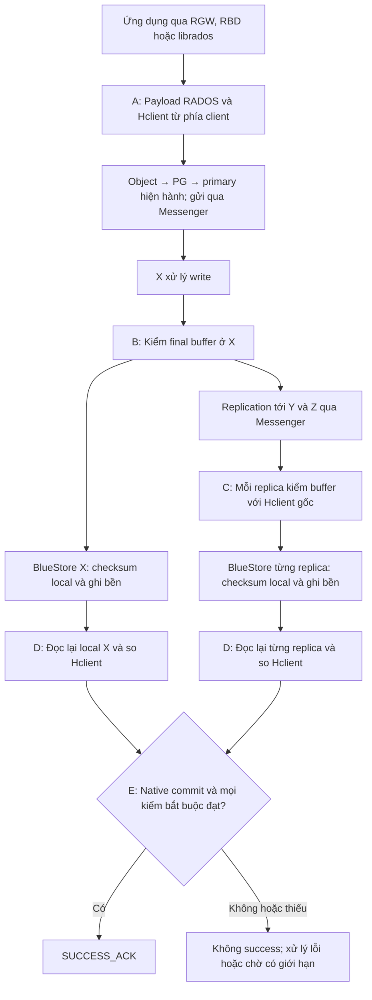
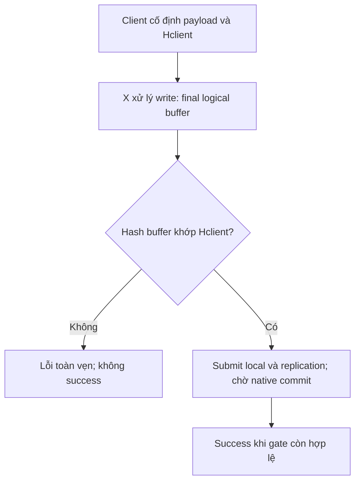
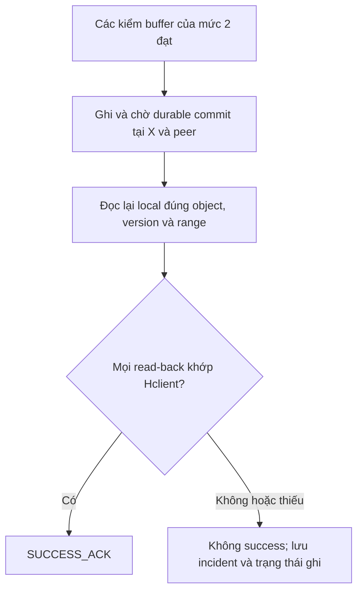

# H0 Feature — Recovery Gate và Primary Write ACK Gate cho OSD canary

**Bản thiết kế:** 2.1 · **Ngày:** 28/09/2026
**Nguồn yêu cầu:** `Pasted markdown(7).md`, luồng lưu trong `Pasted text(20260928-033131).txt` và yêu cầu cho phép chọn ba mức kiểm.
**Phạm vi:** OSD X vừa nâng cấp trong PA1; một số PG canary ít I/O, thuộc replicated pool.
**Trạng thái:** thiết kế chưa triển khai. Các checksum test đã chạy trước đây không phải kết quả H0-R hoặc H0-W.

Bản này thay phạm vi H0 v1.2 bằng hai phần đúng theo nội dung pasted: **H0-R kiểm dữ liệu khi trả về X sau recovery/backfill** và **H0-W thêm điều kiện toàn vẹn trước khi trả kết quả ghi thành công cho client**. H0-W có ba mức lựa chọn. Phần trọng tâm là đường ghi khi X làm primary; muốn thực hiện gate bên trong OSD phải phát triển mã Ceph và giao thức kiểm tương ứng.

## 1. Hai tình huống cần giải quyết

Quy ước: **X** là OSD vừa nâng cấp; **S** là spare của PA1; **Y/Z** là các peer. Minh họa dùng pool có ba bản. Primary/replica là vai trò của OSD đối với từng PG, không phải vai trò cố định của toàn OSD.

| Tình huống                                   | Nguy cơ đang xét                                                                                                 | Phần phụ trách                         |
| ---------------------------------------------- | ------------------------------------------------------------------------------------------------------------------- | ----------------------------------------- |
| Dữ liệu cũ được recovery/backfill vào X | Bản ở X sai sau quá trình nhận/ghi; cần kiểm trước khi đưa X vào bài primary canary                    | **H0-R — Recovery Integrity Gate** |
| X đã làm primary và nhận write mới       | Payload bị đổi trước replication/checksum, khiến các bản cùng lưu nội dung sai nhưng tự khớp checksum | **H0-W — Primary Write ACK Gate**  |

Ở tình huống thứ nhất, peer còn bản dữ liệu của cùng version có thể làm đối chứng. Ở tình huống thứ hai, nếu sai trước khi primary gửi sang peer thì tất cả có thể nhận cùng nội dung sai. Đây là hai mô hình lỗi khác nhau; không dùng cùng một lời giải thích cho cả hai.

**Ví dụ của H0-W:** client gửi `ABC`, nhưng một lỗi trên X biến buffer thành `AXC` trước lúc tạo checksum và gửi replication. X/Y/Z có thể cùng lưu `AXC` kèm checksum của `AXC`. So sánh các bản với nhau không tự khôi phục được ý nghĩa “client đã gửi ABC”. Đây là mô hình lỗi để thiết kế và fault injection, chưa phải một bug đã quan sát trong lab.

## 2. Cơ chế Ceph được giữ nguyên và phần H0 bổ sung

Ceph đã có bảo vệ dữ liệu ở các lớp khác nhau. BlueStore tạo checksum cho dữ liệu ghi xuống disk; deep-scrub kiểm dữ liệu và sự nhất quán của các bản. Với mô hình lỗi xảy ra trước khi tạo các checksum tương ứng, những phép kiểm này có thể vẫn khớp với payload đã bị đổi. [C1][C2]

Ceph native có điều kiện hoàn tất ghi bền trước khi báo hoàn tất cho client. Thiết kế H0 giữ điều kiện đó và thêm kết quả kiểm toàn vẹn; không ACK sớm để bù chi phí hash. Không giả định primary luôn commit sau replica: các nhánh có thể hoàn tất theo thứ tự khác nhau. [C3]

Trong tài liệu này, **SUCCESS_ACK** nghĩa là kết quả thành công của thao tác ghi được bảo vệ, với ngữ nghĩa hoàn tất ghi bền đã chốt. Nó không chỉ là tên event `commit_sent`: event ghi việc gửi reply, còn cần kiểm cả mã kết quả, cờ completion và operation ID. [C4][C7]

| Phần | H0 bổ sung                                                                                                 | Giới hạn                                                         |
| ----- | ----------------------------------------------------------------------------------------------------------- | ------------------------------------------------------------------ |
| H0-R  | Yêu cầu kiểm ngay sau đợt trả PG, gắn kết quả với lần recovery và bản local của X             | Không thay native recovery hoặc tự quyết định sửa bản nào |
| H0-W  | Mang digest từ trước OSD X vào các điểm kiểm; chặn success khi điều kiện toàn vẹn chưa đạt | Bảo đảm đến đâu phụ thuộc mức 1/2/3 và vị trí lỗi    |

Việc đổi binary không phải lý do để cho rằng mọi object được tính lại checksum. Đối tượng nghiên cứu ở đây là các lần nhận, xử lý, copy và ghi dữ liệu trong canary nâng cấp.

### 2.1. Luồng lưu dữ liệu native, từ ứng dụng tới hoàn tất ghi

Xét một replicated PG khỏe với primary X và replica Y/Z. Đây là luồng logic để đặt điểm kiểm, không phải lời khẳng định mọi bước nội bộ luôn chạy tuần tự hoặc chỉ có một buffer vật lý.

| Bước                         | Dữ liệu đi đâu / Ceph làm gì                                                              | Kiểm native và ý nghĩa                                                                                   |
| ------------------------------ | ------------------------------------------------------------------------------------------------ | ------------------------------------------------------------------------------------------------------------ |
| 1 — Tạo thao tác RADOS      | S3 qua RGW/librados; RBD qua librbd hoặc kernel client; tạo object write/extent tương ứng   | Object/file ứng dụng có thể được chia thành nhiều thao tác; cần chốt đúng lớp byte            |
| 2 — Tìm nơi gửi            | Client dùng OSDMap, ánh xạ object vào PG, xác định acting set/primary hiện hành         | Hash dùng cho placement không phải checksum của payload; MON không nằm trên đường ghi payload này |
| 3 — Gửi tới X               | Messenger đóng gói và truyền request đến primary                                          | Bảo vệ transport theo protocol/mode đã thương lượng; không phải BlueStore checksum                 |
| 4 — X xử lý write           | Queue, kiểm PG/quyền, điều phối khóa và operation, chuẩn bị dữ liệu/transaction       | PG log/version theo dõi lịch sử/ordering; không thay reference nội dung từ client                      |
| 5 — Ghi local và replication | X điều phối transaction local và gửi operation/data sang Y/Z                                | Các nhánh có thể tiến triển đồng thời; không cần chờ X commit rồi mới gửi replica             |
| 6 — Store tại từng OSD      | BlueStore của X, Y, Z xử lý dữ liệu riêng, tạo checksum local và ghi theo cơ chế store | Không lấy checksum BlueStore của X rồi mặc định lưu cùng checksum đó tại Y/Z                     |
| 7 — Hoàn tất native         | Primary tổng hợp trạng thái ghi bền local và các peer bắt buộc của operation           | Commit local riêng lẻ chưa đủ để kết luận cả write đã hoàn tất                                 |
| 8 — Phản hồi                | Đường completion gửi kết quả cho client khi điều kiện native đạt                      | H0-W sẽ bổ sung điều kiện tại đây cho request thuộc scope                                           |

Kiến trúc phân tầng/placement ở [C8]; checksum BlueStore ở [C1]; completion của replicated PG và các event ở [C3][C4]. H0 bảo vệ RADOS write trong prototype, không tự chứng minh mọi mutation metadata của RGW/RBD đã được bao phủ.

**Transport:** nếu dùng msgr2 CRC mode, payload trên đường truyền được kiểm CRC32C; secure mode bổ sung mã hóa và kiểm toàn vẹn mật mã. Cần xác nhận mode thực tế của kết nối, không gán CRC mode cho mọi kết nối lab. Đây vẫn là bảo vệ giữa hai đầu truyền, không tự giữ nguyên một expected digest từ trước bước xử lý primary. [C9]

**BlueStore:** checksum data được quản lý theo block/chunk của local store, không đồng nhất với SHA-256 toàn object dùng trong prototype. Dữ liệu và thông tin checksum có layout quản lý riêng; ký hiệu `ABC + CRC(ABC)` chỉ minh họa quan hệ nội dung/checksum, không phải layout vật lý bắt buộc. Đường I/O, metadata và deferred write phụ thuộc implementation; không giản lược durable completion thành một syscall ghi duy nhất. [C1][C10]

### 2.2. Năm điểm H0 trên luồng ghi mới

| Điểm                          | Vị trí can thiệp                                                        | Việc cần thực hiện                                                                                        | Mức dùng |
| ------------------------------- | -------------------------------------------------------------------------- | ------------------------------------------------------------------------------------------------------------- | ---------- |
| **A — Tạo reference**   | Phía client/generator, trước khi payload đi vào X                     | Cố định bytes; tạo Hclient; gắn object/request/range và policy                                          | 1, 2, 3    |
| **B — Primary verify**   | Sau xử lý write cần bảo vệ, trước submit local và fan-out          | Hash đúng final logical write data, so với Hclient; ràng buộc bytes đã kiểm với bytes được submit | 1, 2, 3    |
| **C — Replica verify**   | Tại từng replica, trước submit store của replica                      | So buffer sắp ghi với Hclient gốc, gửi kết quả gắn đúng operation                                    | 2, 3       |
| **D — Read-back verify** | Sau durable commit tại từng OSD, trước success của request            | Đọc lại local đúng version/range, kiểm đường đọc/cache và so Hclient                              | 3          |
| **E — Success gate**     | Đường tổng hợp completion ở primary, trước phản hồi thành công | Kết hợp native durable condition với toàn bộ kết quả H0 mà mức chọn yêu cầu                       | 1, 2, 3    |

**A/B/C/D là các điểm tạo hoặc kiểm tham chiếu; E là điểm quyết định trả success.** Chỉ thêm E mà không có bằng chứng từ đúng điểm kiểm không tạo ra integrity gate.

Sơ đồ sau hiển thị đủ các điểm của **mức 3**. Với mức 1 bỏ C và D; với mức 2 bỏ D; mọi mức đều giữ native commit và E. Y/Z được gom trên hình cho gọn nhưng mỗi OSD phải có verifier, store và kết quả riêng.



Đây là luồng thành công minh họa. Mismatch tại B/C phải chặn nhánh tương ứng trước submit, không đi tiếp ghi rồi mới báo ở E. Kết quả D có thể chỉ về primary sau khi peer đã gửi thông tin commit native; E phải chờ cả hai loại bằng chứng, không trộn “đã commit” với “đã verify”.

### 2.3. Vị trí lỗi quyết định mức nào có giá trị

| Vị trí lỗi giả định                                                                       | Mức 1                                                 | Mức 2                          | Mức 3                                                             |
| ----------------------------------------------------------------------------------------------- | ------------------------------------------------------ | ------------------------------- | ------------------------------------------------------------------ |
| Payload đã sai trước A, Hclient lấy từ dữ liệu sai đó                                 | Không có reference gốc để phát hiện             | Tương tự                     | Tương tự                                                        |
| Payload đổi giữa A và B, reference đúng                                                   | B phát hiện                                          | B phát hiện                   | B phát hiện                                                      |
| Dữ liệu replica đổi sau B nhưng trước C, vượt qua được native checks trước C      | Không có verifier replica                            | C phát hiện                   | C phát hiện                                                      |
| Store X hoặc peer làm đổi payload sau điểm kiểm buffer, checksum nội bộ vẫn tự khớp | Không có bảo đảm read-back                        | Không có bảo đảm read-back | D phát hiện nếu reader quan sát đúng trạng thái đó       |
| Dữ liệu hỏng sau khi các kiểm hoàn tất hoặc sau ACK                                     | Không được bao phủ bởi lần kiểm write đã qua | Tương tự                     | Tương tự; còn cần native read/scrub hoặc bài kiểm sau đó |

Đây là phạm vi dự kiến trong mô hình reference/verifier đáng tin, chưa phải kết quả đo. Lỗi sau B nhưng trước khi tạo cả các nhánh replication có thể bị C phát hiện trên peer ở mức 2; lỗi chỉ xảy ra ở store local của X thì cần đọc lại X ở mức 3. Không kết luận chung “mọi lỗi sau primary check đều được mức 2 bắt”.

### 2.4. Sửa cách đọc các event commit trong bản pasted

- `op_commit`: tài liệu mô tả commit tại **primary**, không phải bằng chứng độc lập rằng mọi replica đã commit.
- `sub_op_commit_rec` và các sự kiện tương ứng: bằng chứng primary nhận tiến độ completion của peer, tùy implementation/loại operation.
- `commit_sent`: ghi nhận reply đã được gửi; muốn kết luận success cần xem mã kết quả và semantics completion của đúng request.

Vì vậy mô hình cần dùng là **local durable completion + peer completions bắt buộc + điều kiện H0 của mức chọn → cho phép success**. Không vẽ một chuỗi cố định “mọi replica commit → op_commit → ACK” rồi dùng riêng event `op_commit` làm gate. Một số mô tả event trong tài liệu có thuật ngữ FileStore cũ; khi patch BlueStore phải đối chiếu callback và đường reply của đúng tag. [C4][C7]

### 2.5. H0-R nằm trên nhánh recovery, không dùng Hclient của write mới

| Bước                         | Native path                                                                              | Điểm thêm H0                                                          |
| ------------------------------ | ---------------------------------------------------------------------------------------- | ------------------------------------------------------------------------ |
| Source cung cấp dữ liệu cũ | Đọc phiên bản hợp lệ từ source, checksum khi đọc disk và truyền qua Messenger | H0-static đã chốt từ corpus ổn định trước lượt chuyển        |
| X nhận và lưu               | Recovery/backfill ghi vào BlueStore X, tạo checksum local cho dữ liệu được ghi    | Chưa kết luận MATCH chỉ từ native completion                        |
| Sau hội tụ                   | X có dữ liệu theo mapping; yêu cầu deep-scrub mới cho PG canary                    | Local verification trên X so đúng object/version/range với H0-static |
| Trước primary canary         | Xác nhận vai trò/epoch và capability                                                 | Return gate đạt mới mở workload H0-W                                 |

Đường nhận dữ liệu của replica và target recovery đều đi xuống local store, nhưng protocol, ordering và nguồn reference khác nhau. Việc có điểm C cho write replication không tự làm verifier recovery hoạt động; tích hợp recovery cần được kiểm riêng. GET có thể đọc peer khác nên không thay local evidence của X. Chi tiết H0-R ở mục 5.

## 3. Ba mức của H0-W để lựa chọn

**Chọn một mức cho mỗi run.** Mức cao hơn kế thừa các điểm kiểm của mức thấp hơn; cả ba cùng dùng H0-R làm bước kiểm dữ liệu trả về trước khi mở workload primary canary. H0-R không phải mức thứ tư.

| Thuộc tính                   | Mức 1 — Primary buffer                                         | Mức 2 — Primary + replica buffer                                    | Mức 3 — Persisted read-back                                                                                              |
| ------------------------------ | ---------------------------------------------------------------- | --------------------------------------------------------------------- | -------------------------------------------------------------------------------------------------------------------------- |
| Mã cấu hình thiết kế      | `L1_PRIMARY_BUFFER`                                            | `L2_REPLICA_BUFFER`                                                 | `L3_PERSISTED_READBACK`                                                                                                  |
| Reference                      | Hclient tạo trước khi gửi write                              | Cùng Hclient, giữ nguyên đến peer                                | Cùng Hclient, giữ đến bước đọc lại                                                                                |
| Điểm kiểm                   | Buffer ghi logic cuối của X, trước submit local/replication  | Mức 1 + buffer tại từng replica, trước submit store của replica | Mức 2 + đọc lại đúng dữ liệu sau durable commit tại X và từng replica bắt buộc                                |
| Điều kiện success           | Native commit đạt + kiểm primary đạt                        | Native commit đạt + kiểm primary và các replica đạt            | Native commit đạt + mọi kiểm buffer và read-back bắt buộc đạt                                                     |
| Mục tiêu phát hiện         | Payload bị đổi trước điểm kiểm cuối ở primary          | Thêm sai lệch trên đường tới điểm kiểm của replica         | Thêm sai lệch sau kiểm buffer, quan sát được qua đường đọc lại từ store                                      |
| Chưa bảo đảm               | Nội dung sau điểm kiểm, buffer replica, nội dung đọc lại | Nội dung bị đổi trong store sau kiểm buffer; chưa có read-back | Không bảo đảm dữ liệu không hỏng sau ACK; kết luận phụ thuộc đường đọc, cache và giả định phần cứng |
| Thành phần cần phát triển | Client/generator + primary OSD + success gate                    | Thêm truyền reference, verifier và kết quả kiểm ở các peer    | Thêm read-back trong OSD/store, ordering, trạng thái sau commit và gate trước reply                                  |
| Chi phí dự kiến             | Thấp nhất trong ba mức: hash ở primary                       | Thêm hash/metadata tại các replica và chờ kết quả              | Cao nhất dự kiến: thêm I/O đọc, hash, thời gian giữ request và xử lý lỗi sau commit                            |

Đây là đánh giá tương đối theo thiết kế, chưa có số đo overhead. Mức 1 phù hợp để chứng minh lỗi trước fan-out; mức 2 mở rộng phạm vi buffer; mức 3 dành cho bài yêu cầu kiểm trạng thái lưu trước success trên canary ít IOPS, chấp nhận tăng latency.

**Một OSD vừa nâng không có nghĩa pool chỉ có một replica.** Có thể chỉ nâng X nhưng giữ pool X/Y/Z size=3 để kiểm replication. Mức 2 và mức 3 đầy đủ cần peer có khả năng H0 tương ứng; pool size=1 không được báo đã nghiệm thu kiểm replica.

## 4. Reference cho write mới phải đến từ trước X

Client hoặc canary generator cố định payload rồi tính:

`Hclient = SHA256(payload)`

Payload và expected digest phải đi cùng danh tính của chính write đó. Không dùng một H0 trước nâng cho mọi ghi mới và không để X tính lại expected digest từ buffer đang được kiểm.

### 4.1. Hợp đồng request dự kiến

| Trường                                        | Mục đích                                    |
| ----------------------------------------------- | ---------------------------------------------- |
| `run_id`, `policy_revision`, `level`      | Xác định bài canary và mức bắt buộc    |
| Cluster/pool/namespace/object                   | Ràng buộc đúng đích ghi                  |
| `client_request_id`, `op_index`, generation | Phân biệt request, retry và từng thao tác |
| Operation type, offset, length                  | Xác định chính xác byte cần kiểm        |
| `representation`                              | Lớp byte logic dùng để tính hash          |
| Algorithm,`expected_digest`                   | SHA-256 dự kiến và Hclient bất biến       |

Đây là schema thiết kế, chưa phải tham số/API có sẵn của Ceph. Không chỉ thêm một header S3 hoặc xattr rồi mặc định OSD đã thực thi ACK gate.

### 4.2. Những điều phải giữ đúng

- Generator giữ payload không đổi từ lúc hash đến khi gửi; reference có nguồn và kênh truyền được xác minh.
- Reference được liên kết với operation từ client tới primary và replica; không gửi một giá trị rời có thể gắn nhầm sang write khác.
- Hash trước/sau phải trên cùng representation. Hash toàn file S3 không bằng hash RADOS tail object; hash file trong RBD không bằng hash một extent bất kỳ.
- Các bytes đã được kiểm phải chính là bytes được submit. Nếu serialize/copy/transform tiếp, phải ràng buộc phiên bản buffer hoặc kiểm thêm ở ranh giới tương ứng; một bản sao đúng để hash không bảo vệ một bản sao khác bị sai để ghi.
- X được kiểm reference, không được rebaseline reference để làm write đạt.

Giả định lỗi cần thử là lỗi làm đổi payload trong khi reference và verifier còn đáng tin. H0 không bảo đảm chống lại OSD tùy ý giả mạo cả dữ liệu, digest và kết quả kiểm. Digest khớp cũng không chứng minh ứng dụng đã tạo đúng dữ liệu trước điểm lấy Hclient.

## 5. H0-R — kiểm dữ liệu sau recovery/backfill

H0-R kiểm dữ liệu cũ đang được đưa về X. Nó dùng **H0-static** của một corpus ổn định; H0-W dùng **Hclient** riêng cho mỗi write mới. Hai reference này không thay thế nhau.

### 5.1. Trình tự return gate

1. Chọn một số PG ít I/O và corpus đã có reference; lưu object/version hoặc snapshot/range cùng nguồn tạo H0-static.
2. Trả canary PG về X sau nâng, quan sát mapping và chờ recovery/backfill hoàn tất.
3. Xác nhận đủ bản, trạng thái PG và các điều kiện native phù hợp; `active+clean` là một điều kiện, không phải chứng nhận mới quét toàn bộ payload.
4. Yêu cầu deep-scrub các PG canary và chờ **kết quả của lần scrub sau recovery**. Ghi thời điểm, epoch, participants và lỗi; việc lệnh được nhận chưa phải scrub PASS.
5. Đối chiếu corpus với H0-static qua đường đọc đã chứng minh truy cập bản local của X; ghi object/version/range và số byte.
6. Chỉ đánh dấu `RETURN_VERIFIED` khi đủ bằng chứng bắt buộc. Có lỗi, thiếu reference hoặc thiếu local-read evidence thì dừng mở rộng và xử lý.

Deep-scrub là kiểm theo PG có các replica tham gia. Dù dùng lệnh chọn qua một OSD ở phiên bản có hỗ trợ, không được hiểu kết quả thành việc chỉ đọc riêng ổ của X. Chọn PG nhỏ và theo dõi tải trên cả primary lẫn các peer. [C2][C5]

### 5.2. H0-static ở case 1 dùng để làm gì?

Nó bổ sung một reference có từ trước lượt chuyển dữ liệu, để đối chiếu nội dung mong đợi; deep-scrub cung cấp kiểm nhất quán/native sau recovery. **Không cần phát minh H0-static chỉ để khỏi chờ lịch scrub**: controller đã có thể yêu cầu native deep-scrub theo kế hoạch.

H0-static có giá trị khi cần bằng chứng độc lập về payload của corpus. Nó không tự biết dữ liệu đúng từ lúc tạo nếu reference ban đầu đã lấy từ bản sai. Trong phạm vi tài liệu này, return gate đầy đủ gồm native checks và static verification của corpus đã khai báo; nếu mới chạy native checks thì chỉ ghi kết quả native, chưa ghi H0-R đầy đủ PASS.

### 5.3. Phải chứng minh đã đọc X

GET/RADOS read thông thường có thể đọc primary hoặc cache, nên không đủ để nói replica X đã được hash. Thiết kế cần local verifier có kiểm soát trong daemon/store, hoặc instrumentation của quá trình scrub để thu bằng chứng đúng bản X. Công cụ phải được phát triển và nghiệm thu trước; không giả định đã có một lệnh `read(X path)` dùng được ngay.

Native scrub của PG đạt và client read MATCH là bằng chứng có ích, nhưng chưa thay được yêu cầu đọc riêng X trong H0-R đang đặc tả. Không đánh dấu `RETURN_VERIFIED` dựa vào tên OSD trên giao diện.

### 5.4. “Cho X làm primary” là trạng thái canary có kiểm soát

Controller chỉ mở workload primary canary sau return gate và sau khi xác nhận X là primary của đúng PG/epoch. Hạ `primary-affinity` hỗ trợ điều khiển lựa chọn primary; nó không phải cơ chế kiểm toàn vẹn hoặc khóa cứng vai trò theo H0. [C6]

Nếu X được Ceph chọn làm primary sớm hơn dự kiến, workload canary vẫn phải đóng. Muốn chặn cả write của client ngoài harness trên phạm vi đó cần thêm admission gate trong OSD; controller/web đơn thuần không tạo bảo đảm này. Bản triển khai đầu dùng pool/corpus kiểm soát được writer. Recovery và peering cần thiết không bị chặn nhầm bởi gate dành cho client write canary.

## 6. H0-W mức 1 — kiểm final buffer tại primary

Mục tiêu là phát hiện payload đã đổi trước điểm kiểm cuối tại primary, trước khi submit transaction ghi local và gửi dữ liệu cho replica.



Không chỉ kiểm tại lúc nhận packet rồi để payload tiếp tục thay đổi mà không được kiểm. Điểm gắn cụ thể phụ thuộc write path của từng tag Ceph; sơ đồ là hợp đồng mong muốn, không phải danh sách hàm đã tồn tại.

Invariant, với write `w` thuộc scope và policy hợp lệ:

`SUCCESS_ACK(w) ⇒ NativeDurableOK(w) ∧ PrimaryBufferOK(w)`

`PrimaryBufferOK` phải gắn với đúng request, reference và bytes sẽ ghi/gửi. Nó không có nghĩa “BlueStore đã lưu đúng byte” hoặc “mọi replica đã đọc lại đúng”. Lỗi xảy ra sau verifier có thể nằm ngoài khả năng của mức 1.

Nếu mismatch được phát hiện trước khi submit bất kỳ mutation nào, đường lỗi phải trả mã lỗi phù hợp và ghi bằng chứng. Không tiếp tục replication rồi chỉ ghi warning.

## 7. H0-W mức 2 — kiểm thêm tại replica

Mức 2 giữ kiểm primary và chuyển **Hclient gốc** cùng operation identity tới các replica. Mỗi replica kiểm buffer logic sắp submit vào store và báo kết quả về primary; không chỉ so với hash mới do primary tự tính từ payload nó sắp gửi.

Với `R(w)` là các replica bắt buộc của write trong bài canary:

`SUCCESS_ACK(w) ⇒ NativeDurableOK(w) ∧ PrimaryBufferOK(w) ∧ ∀r∈R(w): ReplicaBufferOK(r,w)`

| Điều kiện                               | Cách xử lý thiết kế                                                           |
| ------------------------------------------ | ---------------------------------------------------------------------------------- |
| Mọi buffer đạt và native commit đạt  | Có thể trả success nếu policy/epoch vẫn hợp lệ                              |
| Một replica báo mismatch                 | Không success; ghi rõ peer, request và điểm kiểm; dừng mở rộng canary     |
| Thiếu reference hoặc kết quả của peer | Không suy ra PASS từ commit native; lỗi/chờ có giới hạn theo trạng thái   |
| Peer không hỗ trợ H0 mức 2             | Báo không đủ capability; không âm thầm chạy như mức 1                    |
| Acting set/primary thay đổi              | Reconcile policy và write đang dở; không áp dụng kết quả cũ cho peer mới |

Prototype đầu dùng PG khỏe, đầy đủ số bản theo cấu hình; chưa mở rộng bài chịu ghi trong trạng thái degraded. `min_size` không được dùng như “đủ từng ấy hash là success”; phải thỏa cả điều kiện native và tập verifier bắt buộc đã chốt.

Mức 2 chưa chứng minh nội dung lưu tại store sau điểm kiểm. Nếu replica đã qua verifier nhưng store làm đổi byte, native checksum có thể kiểm được hoặc không tùy điểm lỗi; không gán cho mức 2 bảo đảm read-back mà nó chưa thực hiện.

**X không phải daemon duy nhất cần sửa ở mức 2.** Các peer có thể giữ version Ceph nền cũ trong bài mixed-version, nhưng vẫn phải có build/protocol H0 tương thích và đã kiểm capability.

## 8. H0-W mức 3 — ghi bền rồi đọc lại trước success

Mức 3 kế thừa mức 2 và thêm kiểm sau ghi tại **X cùng các replica bắt buộc**. Nếu mới đọc lại X thì chỉ có coverage read-back tại X, chưa đủ gọi là mức 3 đầy đủ trong tài liệu này.



`SUCCESS_ACK(w) ⇒ NativeDurableOK(w) ∧ PrimaryBufferOK(w) ∧ ∀r∈R(w): ReplicaBufferOK(r,w) ∧ ∀o∈{X}∪R(w): PersistedReadbackOK(o,w)`

### 8.1. Điều kiện để gọi là persisted read-back

- Chờ completion ghi bền của đúng operation; không đọc trước khi transaction tương ứng hoàn tất.
- Read-back diễn ra trong đường thực thi OSD/store đã tích hợp gate, trước khi phản hồi thành công ra client. Một script PUT nhận success rồi GET lại không đáp ứng mức 3.
- Đọc đúng object/version/range. Prototype dùng object mới, một full-object write, không cho overwrite/delete trong cửa sổ verify để tránh đọc nhầm version tiếp theo.
- Reader phải kiểm soát việc trả dữ liệu từ buffer/cache đã ghi và chứng minh đường I/O tới backing store. Chỉ đặt một cờ “no-cache” chưa tự chứng minh đã vượt mọi lớp cache.
- Dữ liệu so sánh là logical bytes cùng representation với Hclient, không so hash logical payload trực tiếp với bytes nén/mã hóa trên media.
- Lưu kết quả theo từng OSD và operation. Thiếu bằng chứng đường đọc/capability thì báo `READBACK_UNSUPPORTED` hoặc chưa đủ kết luận, không hạ tiêu chuẩn rồi vẫn ghi mức 3.

Giới hạn diễn đạt: mức 3 kiểm trạng thái mà store trả lại sau durable completion dưới các giả định cache, thiết bị và flush đã công bố. Nó không phải chứng minh tuyệt đối từng cell vật lý, không bảo đảm ổ đĩa không mất dữ liệu sau ACK, và không loại bỏ nhu cầu thử crash/restart riêng.

### 8.2. Read-back sau commit làm thay đổi độ phức tạp lỗi

Phát hiện mismatch sau commit có nghĩa mutation có thể đã tồn tại tại một hoặc nhiều OSD. **Chặn success không tự rollback write.** Dữ liệu cũng có thể đã nhìn thấy qua đường đọc khác; muốn bảo đảm “chưa verify thì không ai đọc được” cần thiết kế visibility riêng, ngoài success gate này.

Không giữ khóa theo cách ngăn completion/read-back tiến triển. Implementation cần một trạng thái bất đồng bộ theo operation, xử lý thứ tự và giải phóng tài nguyên rõ ràng. Đây là lý do mức 3 là prototype riêng có chi phí lớn hơn, dù corpus ít IOPS.

## 9. Lỗi, timeout, retry và failover

Các nhãn sau là **trạng thái thiết kế của feature**, chưa phải errno hoặc API Ceph hiện có:

| Trạng thái                | Ý nghĩa                                                         | Điều kiện phản hồi                                                      |
| --------------------------- | ----------------------------------------------------------------- | ---------------------------------------------------------------------------- |
| `INTEGRITY_MISMATCH`      | Đã có bằng chứng không khớp reference                      | Không success; trả lỗi rõ nếu kênh phản hồi còn hoạt động        |
| `REFERENCE_MISSING`       | Write thuộc scope không có reference hợp lệ                  | Không bypass sang native-only                                               |
| `CAPABILITY_MISSING`      | Thiếu thành phần bắt buộc của mức chọn                    | Không kích hoạt mức đó hoặc dừng admission của run                  |
| `READBACK_UNSUPPORTED`    | Chưa chứng minh được read-back theo yêu cầu mức 3         | Không báo mức 3 đạt                                                     |
| `VERIFY_TIMEOUT`          | Chưa đủ kết quả trong budget kiểm                           | Không báo success; ghi trạng thái commit để reconcile                  |
| `COMMITTED_UNVERIFIED`    | Có bằng chứng đã commit nhưng verification chưa hoàn tất | Trạng thái nội bộ cần xử lý; không đồng nghĩa write chưa xảy ra |
| `POLICY_OR_EPOCH_CHANGED` | Policy/primary/participants đã thay đổi                       | Đối chiếu operation và năng lực trước khi tiếp tục                 |

Mục tiêu của feature là trả lỗi có ý nghĩa thay vì cố tình treo request khi đã phát hiện mismatch. Tuy nhiên mất kết nối hoặc daemon chết vẫn có thể khiến client chỉ thấy timeout; không thể bảo đảm mọi lỗi đều đến client dưới dạng một thông báo hoàn chỉnh.

### 9.1. Ghi có thể đã xảy ra dù client không nhận success

Ở mức 1, mismatch trước submit có thể được từ chối trước mutation. Ở mức 2, các nhánh ghi có thể đã tiến triển khác nhau. Ở mức 3, read-back diễn ra sau commit. Phải ghi được `not_submitted / submitted / committed / uncertain` theo evidence, không suy trạng thái từ mỗi mã lỗi.

Không chỉ sửa mã trả về ở một callback rồi bỏ qua PG log và replica state. Đường lỗi cần giữ nhất quán recovery, xử lý request trùng và trạng thái cuối của operation. Hash không cung cấp payload để sửa hoặc undo dữ liệu.

### 9.2. Không để retry đi vòng qua H0

Request retry phải giữ danh tính và reference. Nếu dữ liệu đã ghi nhưng H0 chưa đạt, đường xử lý duplicate không được trả success chỉ vì native ghi nhận request đã commit. Cần lưu/khôi phục trạng thái verification hoặc thực hiện kiểm lại theo policy trước success.

Khi primary failover, primary mới phải có năng lực mức đã chọn và đủ trạng thái của write. Không dùng kết quả kiểm thuộc PG interval cũ như bằng chứng cho các bản mới mà chưa đối chiếu. Prototype phải thử crash tại cả thời điểm trước commit, sau commit và trước reply.

“Quarantine” trong thiết kế này là dừng admission/workload và dừng mở rộng đối với scope lỗi để điều tra. Nó không tự động mang nghĩa mark-out cả OSD hoặc sửa/xóa object; những hành động đó phải dựa vào trạng thái dữ liệu và khả năng phục hồi.

## 10. Kết hợp với PA1

Tài liệu này bắt đầu ở pha OSD của quy trình nâng cấp đã được chuẩn bị. X đã được nâng và các peer/spare đang giữ dữ liệu hợp lệ theo bằng chứng hiện có.

| Bước                  | Việc thực hiện                                                                       | Gate                                                                |
| ----------------------- | --------------------------------------------------------------------------------------- | ------------------------------------------------------------------- |
| A — Chọn canary       | Chọn 1–N PG ít I/O, corpus, X/peer và mức H0-W; kiểm capability trước khi chạy | Plan/policy đầy đủ, corpus/writer kiểm soát được           |
| B — Trả dữ liệu     | Đưa canary PG về X, chờ recovery/backfill hội tụ                                  | Mapping/replica/native health đạt                                 |
| C — H0-R               | Chạy deep-scrub sau recovery và static verify đúng bản local X                     | `RETURN_VERIFIED` cho scope đã kiểm                            |
| D — Mở primary canary | Xác nhận X làm primary đúng PG/epoch; arm mức 1/2/3 rồi mở workload mới        | H0-R và capability hợp lệ, không có bypass                     |
| E — H0-W               | Ghi mới với Hclient; mỗi write tuân thủ mức đã chọn                            | Chỉ trả success khi native và integrity cùng đạt              |
| F — Soak               | Theo dõi mismatch, lỗi, latency, CPU/I/O và các biến động role                   | Đủ coverage, không incident chưa xử lý, đạt budget          |
| G — Mở rộng          | Tăng số PG theo batch; đối chiếu lại scope và năng lực peer                    | Lặp các gate liên quan, không kế thừa PASS cho PG chưa kiểm |

Nếu X lỗi trong khi PG vẫn phục vụ trên S/peer hiện hành, PA1 có thể giữ phạm vi đó để xử lý X. Sau khi đã trả dữ liệu về X, không mặc định S vẫn là bản mới nhất. H0 không thay thế backup hoặc native recovery.

Không tự hạ mức 3 xuống 2/1 vì chậm hoặc mất peer. Muốn đổi mức: dừng cấp write mới, đối chiếu các request đang dở, tạo revision/run mới và ghi mức mới vào báo cáo. Request đang chạy giữ policy lúc được nhận hoặc phải được kết thúc/reconcile rõ ràng.

## 11. Chọn mức trên web và cấu hình run

Web là nơi chọn phạm vi, mức kiểm và xem bằng chứng; việc chặn success ACK thực thi tại OSD/client protocol đã tích hợp. Tắt tab trình duyệt hoặc mất web không được làm OSD bỏ qua gate của write đã nhận.

### 11.1. Các trường cần có trên giao diện

| Trường       | Nội dung                                                                                    |
| -------------- | -------------------------------------------------------------------------------------------- |
| OSD cần kiểm | X, version/build, host                                                                       |
| PG canary      | Danh sách cụ thể, primary/acting set, IOPS và dung lượng quan sát                     |
| H0-R           | Corpus/H0-static, tình trạng recovery, scrub sau recovery, local verification X            |
| Mức H0-W      | Chọn đúng một trong mức 1, mức 2, mức 3; kèm bảng bảo đảm/chi phí ở mục 3     |
| Capability     | OSD nào có primary verifier, replica verifier, read-back; những điều kiện còn thiếu  |
| Budget         | Workload rate, số write đồng thời, thời gian verify, ngưỡng latency và soak          |
| Kết quả      | Mức yêu cầu/thực tế, verified operations, mismatch, commit status, sự cố và coverage |

Trong hiện trạng chưa có implementation, giao diện phải ghi **chưa triển khai**. Sau khi triển khai, lựa chọn thiếu capability bị chặn với lý do rõ ràng; không chỉ đổi nhãn UI rồi chạy bài checksum cũ.

### 11.2. Cấu hình minh họa của feature, không phải cấu hình Ceph có sẵn

```yaml
h0_canary:
  run_id: "<run-id>"
  cluster_fsid: "<fsid>"
  target_osd: "<X>"
  canary_pgs: ["<pool-id.pg-id>"]
  policy_revision: 1
  return_gate:
    require_recovery_complete: true
    require_fresh_deep_scrub: true
    require_x_local_static_verify: true
  write_gate:
    level: L2_REPLICA_BUFFER  # Chọn L1_PRIMARY_BUFFER / L2_REPLICA_BUFFER / L3_PERSISTED_READBACK
    reference_origin: CLIENT
    algorithm: SHA256
    operation_profile: NEW_OBJECT_FULL_WRITE
    allow_silent_fallback: false
```

Ngưỡng timeout/rate/soak phải lấy từ bài đo và yêu cầu lab; ví dụ này không đặt một giá trị tùy ý thành mặc định an toàn. UI có thể đề nghị chạy từ mức 1 để làm baseline, nhưng mức người dùng chọn mới là policy của run.

## 12. Phạm vi prototype và phần mã cần sửa

Prototype đầu ưu tiên **RADOS full-object write vào object mới**, trên corpus kiểm soát trong replicated pool, ít writer và không overwrite trong cửa sổ kiểm. Cách này cho Hclient, final buffer và read-back cùng lớp byte, đồng thời giảm rủi ro nhầm generation.

| Thành phần            | Công việc                                                                                            |
| ----------------------- | ------------------------------------------------------------------------------------------------------ |
| Canary client/generator | Cố định payload; tạo Hclient, identity và mức; nhận/ghi kết quả đúng operation              |
| Primary OSD             | Xác thực scope/policy/reference; kiểm final write data; tích hợp success gate và xử lý lỗi    |
| Replica path            | Từ mức 2: nhận reference gốc, kiểm bytes sắp ghi, gửi kết quả ràng buộc operation           |
| Store/read-back         | Mức 3: đợi durable completion, đọc local đúng state, kiểm cache/order và tổng hợp kết quả |
| Recovery verifier       | H0-R: native scrub evidence và local verification corpus trên X                                      |
| Controller/web          | Chọn mức, điều khiển admission, thu evidence và dừng/mở rộng PA1 theo gate                    |

Mã Pacific v16.2.15 có các đường callback commit, `eval_repop`, gửi reply và xử lý duplicate liên quan cần khảo sát. Đây là vị trí bắt đầu source review, **không phải patch chỉ cần thêm một câu if trước `commit_sent`**. Mỗi tag nâng cấp phải được rà lại đường thực thi và tương thích giao thức. [C7]

Lộ trình tăng dần: hoàn thiện reference và local verifier → nghiệm thu H0-R → prototype mức 1 → mở replica protocol mức 2 → thêm read-back và crash/retry semantics mức 3. UI giữ ba lựa chọn, nhưng chỉ cho chạy mức đã có build được nghiệm thu.

S3/RBD chỉ mở rộng sau khi có adapter phân rã đúng write/version/range và đường truyền reference tới OSD. Không kế thừa kết luận từ prototype RADOS sang toàn bộ RGW/RBD. EC, partial write, append, clone/copy và thao tác nhiều sub-op cần hợp đồng riêng; operation ngoài profile trong scope bắt buộc phải bị từ chối/báo không hỗ trợ, không bypass âm thầm.

## 13. Kiểm thử và tiêu chí nghiệm thu

So sánh cùng corpus/topology/load: **native-only để đối chứng**, mức 1, mức 2 và mức 3. Native-only là cấu hình đối chứng, không phải mức thứ tư của feature. Giữ checksum và scrub native; không tắt chúng để làm nổi bật H0.

| ID  | Bài thử                                                                                          | Kết quả cần chứng minh                                                        |
| --- | -------------------------------------------------------------------------------------------------- | --------------------------------------------------------------------------------- |
| R01 | Recovery xong, PG clean, corpus đúng                                                             | H0-R chỉ đạt sau scrub mới và static local verification X                    |
| R02 | Bản X sai, peer đúng                                                                            | Gate không mở; lưu kết quả native và H0 riêng, xác định nguồn evidence |
| R03 | Client read MATCH nhưng chưa đọc riêng X                                                      | Không cấp`RETURN_VERIFIED` chỉ từ kết quả client                          |
| W01 | Payload đúng                                                                                     | Mức chọn đạt; success chỉ sau mọi điều kiện native/H0 bắt buộc         |
| W02 | Đổi ABC→AXC trước primary final-buffer check                                                  | Cả ba mức phát hiện; không success                                           |
| W03 | Đổi buffer replica trước verifier replica, có checksum truyền tương ứng hợp lệ          | Mức 2/3 phát hiện; mức 1 không được tuyên bố có bảo đảm ở đây    |
| W04 | Đổi nội dung trong store sau buffer checks, giữ checksum nội bộ phù hợp với dữ liệu sai | Mức 3 phải phát hiện qua read-back; mức 1/2 không có bảo đảm này       |
| W05 | Read-back trả buffer/cache cũ đúng, backing store sai                                          | Không chấp nhận reader đó là nghiệm thu persisted read-back                |
| W06 | Thiếu reference, sai request/range hoặc peer thiếu capability                                   | Không success/bypass; lỗi có lý do                                            |
| W07 | Commit xong, verify chưa xong rồi crash/retry                                                    | Duplicate/failover không trả success chỉ vì đã có commit native            |
| W08 | Verify xong, reply mất; client retry                                                              | Kết quả hợp lệ, không tạo mutation mới ngoài ý muốn; giữ trace         |
| W09 | Đổi mức/primary/acting set giữa run                                                            | Không trộn policy hoặc dùng evidence của peer cũ cho peer mới              |
| W10 | Native commit lỗi dù H0 khớp                                                                    | Không success; H0 không thay điều kiện ghi bền                              |
| P01 | Soak và tăng canary PG                                                                           | Có số đo, đủ coverage và gate cho từng batch; dừng mở rộng khi lỗi     |

Fault injection phải ghi chính xác điểm làm sai so với từng lớp kiểm. Một byte đổi trước Messenger kiểm tra có thể bị native bắt trước H0; điều đó không chứng minh verifier H0 đã chạy. W04 cần injection trong store có kiểm soát để mô phỏng đúng case “payload sai nhưng checksum tự khớp”; một PUT hợp lệ từ client với Hclient mới không tạo ra case đó.

Thu thập p95/p99 latency ghi, IOPS/throughput, CPU hash, byte/I/O read-back, thời gian gate, timeout, số write đang chờ và ảnh hưởng recovery/scrub. Tăng tải trên PG canary trong budget; chưa có kết quả thì ghi “chưa đo”, không đặt phần trăm overhead giả.

Mỗi attempt lưu tối thiểu: run/policy/level, request/object/version/range, expected/observed digest, verifier stage, OSD/role/epoch, build, commit status, verify status và reply status. Giữ lần mismatch đầu dù lần sau đạt. Hash và metadata đủ phục vụ truy vết; không cần đưa payload nhạy cảm vào log.

## 14. Điều kiện hoàn thành feature

Một mức chỉ được coi là hoàn thành khi có build thực thi tại đúng điểm kiểm, client/protocol phù hợp, bài lỗi chứng minh không trả success sai trong phạm vi đó, thử retry/failover và số đo chi phí. Mức 3 còn cần chứng minh đường read-back và giới hạn cache; việc UI có ba nút chọn không thay các điều kiện này.

Cách mô tả kết quả đúng là: **“H0 canary bổ sung reference từ client và integrity gate vào luồng trả kết quả ghi; mức bảo đảm được chọn rõ cho từng run.”** H0-R chuẩn bị dữ liệu sau recovery; H0-W là trọng tâm kiểm write mới khi X làm primary. Cơ chế phát hiện/chặn success không tự cung cấp dữ liệu backup, rollback hoặc sửa lỗi.

## 15. Nguồn kỹ thuật

Tài liệu pasted là nguồn xác định phạm vi. Các nguồn dưới đây dùng kiểm cơ chế Ceph nền; tên H0-R/H0-W, ba mức, schema, trạng thái và gate trong tài liệu này là thiết kế đề xuất.

- [C1 — BlueStore checksums](https://docs.ceph.com/en/quincy/rados/configuration/bluestore-config-ref/#checksums).
- [C2 — Repairing PG inconsistencies](https://docs.ceph.com/en/pacific/rados/operations/pg-repair/).
- [C3 — PG, peering và điều kiện hoàn tất ghi](https://docs.ceph.com/en/reef/rados/operations/monitoring-osd-pg/).
- [C4 — OSD operation events, gồm commit_sent](https://docs.ceph.com/en/pacific/rados/troubleshooting/troubleshooting-osd/#debugging-slow-requests).
- [C5 — Monitoring OSDs and PGs trên Pacific](https://docs.ceph.com/en/pacific/rados/operations/monitoring-osd-pg/).
- [C6 — CRUSH và primary affinity](https://docs.ceph.com/en/pacific/rados/operations/crush-map/#primary-affinity).
- [C7 — PrimaryLogPG.cc, Ceph v16.2.15](https://github.com/ceph/ceph/blob/v16.2.15/src/osd/PrimaryLogPG.cc).
- [C8 — Ceph architecture và đường dữ liệu](https://docs.ceph.com/en/pacific/architecture/).
- [C9 — Messenger v2, CRC và secure mode](https://docs.ceph.com/en/pacific/rados/configuration/msgr2/).
- [C10 — BlueStore internals](https://docs.ceph.com/en/pacific/dev/bluestore/).

Đây là đặc tả feature, chưa phải thay đổi mã hoặc kết quả chạy trên cluster.
