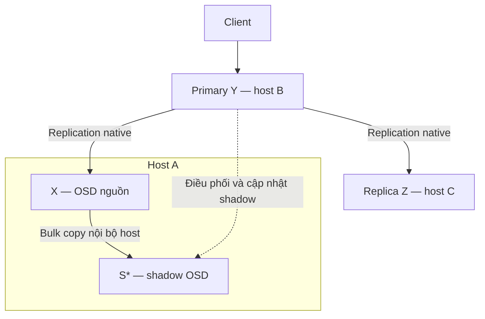

# PA2 — Maintenance Shadow Replica cùng host

**Thiết kế phát triển dựa trên các cơ chế có sẵn của Ceph**  
**Ngày hoàn thiện:** 26/09/2026 · **Phiên bản tài liệu:** 1.0  
**Baseline nghiên cứu:** Ceph Pacific 16.2.5 → 16.2.15, cephadm, BlueStore.  
**Bối cảnh:** khoảng 1.600 OSD, 24 PB dữ liệu, RGW + RBD; có nhiều disk/OSD spare và các host có thể lắp thêm ổ.  
**Trạng thái:** đề xuất kiến trúc và tiêu chí nghiệm thu; chưa phải feature có sẵn trong Ceph, chưa phải MOP có thể chạy ngay trên production.

Tài liệu này là phần PA2 độc lập, phát triển từ mục 4 của `plan(3) (1)(3).md`. Ký hiệu mục 4.x được giữ để có thể ghép lại vào plan. Những đoạn mô tả cơ chế Ceph có nguồn ở cuối tài liệu; các giao thức, trạng thái và chính sách shadow là thiết kế đề xuất của dự án.

## 4.1. Quyết định thiết kế

PA2 tạo một bản sao tạm thời S* trên OSD spare nằm **cùng host với X**, trong khi X vẫn tham gia phục vụ bình thường. Dữ liệu nền được đồng bộ trực tiếp X → S* qua đường nội bộ host. Primary của PG tiếp tục quản lý lịch sử dữ liệu và đồng bộ những thay đổi phát sinh. Khi S* đã hợp lệ, hệ thống chuyển membership từ X sang S, kiểm chứng PG phục vụ bình thường, rồi mới dừng và nâng X.

**Bản đầu tiên tái sử dụng `pg-upmap-items` để yêu cầu placement mới và dùng peering/recovery native để xác nhận S thành replica.** Phần phát triển tập trung vào pre-copy, theo dõi shadow, kiểm chứng dữ liệu và bàn giao dữ liệu đã seed cho PG native. Chưa đưa một loại placement mới vào OSDMap/MON. Upmap là cơ chế Ceph cho phép chỉ định ngoại lệ placement theo PG [R1].

| Quyết định | Lựa chọn của PA2 bản đầu tiên |
|---|---|
| Đích thay X | Một S* cùng host, cùng vị trí trong failure domain và phù hợp device class/rule |
| Dữ liệu nền | Luồng mới X → S*, tái sử dụng logic đọc/đóng gói/ghi recovery phù hợp |
| Dữ liệu phát sinh | Primary điều phối; ưu tiên truyền trạng thái object đã được materialize, không chạy lại lệnh ứng dụng |
| Client ACK | Giữ nguyên semantics native; S* không nằm trong tập ACK bắt buộc khi đang shadow |
| Chuyển membership | Upmap có kiểm soát, sau đó native peering và recovery nếu còn thiếu |
| Thời điểm dừng X | Mọi PG liên quan đã rời X, có đủ replica hợp lệ, QoS đạt và nhóm OSD qua `ok-to-stop` |
| Điều phối | Module ceph-mgr mới; primary/OSD vẫn là nơi kiểm tra điều kiện an toàn |
| Mức hoàn thiện ban đầu | Replicated pool + BlueStore; EC cần thiết kế và nghiệm thu riêng |

Việc dùng upmap ở thời điểm chuyển giao không làm PA2 trở thành PA1: PA1 thay placement rồi Ceph backfill vào S; PA2 chuẩn bị và kiểm chứng S* ngoài acting set trước, sau đó mới thay placement. Tuy nhiên, **PA2 bản đầu vẫn có chi phí quản lý upmap**, không tuyên bố đã loại bỏ hoàn toàn phụ thuộc này.

## 4.2. Phạm vi, topology và điều kiện áp dụng

### 4.2.1. Ký hiệu và ví dụ

| Ký hiệu | Ý nghĩa |
|---|---|
| X | OSD cần nâng, vẫn online trong giai đoạn chuẩn bị |
| S* | Vai trò shadow của OSD spare; chưa phải replica phục vụ bình thường |
| S | Cùng OSD đó sau khi được native peering chấp nhận vào acting set |
| Y, Z | Các replica khác của PG |
| P | Primary hiện tại; có thể là X, Y hoặc Z |
| P_X | Tập PG liên quan X trong up hoặc acting, được inventory và theo dõi tới bước dừng |
| M0 | Mapping và các override trước khi job thay đổi placement |
| Session | Một phiên đồng bộ có định danh, generation và PG interval ràng buộc |

Với replicated pool `size=3`, `min_size=2`:

| Giai đoạn | Host A | Host B | Host C | Membership phục vụ |
|---|---|---|---|---|
| Ban đầu | X | Y | Z | X, Y, Z |
| Pre-copy | X + S* | Y | Z | X, Y, Z |
| Sau chuyển giao | S; X đã rời PG | Y | Z | S, Y, Z |
| Nâng X | S phục vụ; X dừng | Y | Z | S, Y, Z |

S* cùng host không tạo failure domain thứ tư. Sau chuyển giao, S thay X tại cùng failure domain; phải kiểm tra toàn bộ CRUSH rule thực tế, kể cả rack và device class [R2]. Phạm vi maintenance là **daemon OSD X trên host vẫn hoạt động**. Reboot host, nâng kernel hoặc thay controller dùng chung cần phương án khác vì có thể làm X và S cùng dừng.

### 4.2.2. Điều kiện bắt buộc

- Tất cả pool/PG trên X thuộc loại được implementation hỗ trợ. Nếu X chứa PG EC chưa hỗ trợ thì chưa đủ điều kiện nâng toàn X bằng bản PA2 này.
- Cluster không có lỗi dữ liệu hay recovery ngoài kế hoạch chưa xử lý; PG liên quan khỏe tại baseline.
- S đủ usable capacity cho dữ liệu được giao, metadata, dữ liệu đang ghi dở và tăng trưởng trong maintenance. Không suy ra dung lượng chỉ từ CRUSH weight.
- CPU, RAM, HBA, disk và DB/WAL device dùng chung còn headroom. Thêm ổ không đồng nghĩa thêm tương ứng băng thông controller.
- X, S và primary tham gia shadow hỗ trợ protocol đã thống nhất. Có gate khi primary thay đổi sang daemon chưa hỗ trợ.
- Các thay đổi topology, autoscale PG và balancer được kiểm soát; mọi upmap/flag/config do job tạo đều có ownership và bản ghi giá trị trước đó.

**Mục tiêu vận hành:** chuẩn bị đủ replica trước khi dừng X, giới hạn ảnh hưởng tới SLO, giảm bulk traffic xuyên host. Không cam kết “không dùng mạng”, “không peering”, “không tăng latency” hay “không backfill lại” trước khi có kết quả đo.

## 4.3. Cơ chế Ceph được tái sử dụng và phần cần phát triển

| Cơ chế có sẵn | Cách dùng trong PA2 | Phần mở rộng cần làm |
|---|---|---|
| Primary log-based replication; PG version | Giữ primary làm nguồn quyết định thứ tự/lịch sử hợp lệ [R3] | Theo dõi tiến độ của một peer ngoài normal acting set |
| PG log và missing set | Xác định object/metadata cần đối chiếu hoặc đồng bộ [R3] | Cursor shadow, phát hiện khoảng thiếu và xử lý log đã bị trim |
| Recovery/backfill của replicated backend | Tái sử dụng primitive scan, object transfer, chunk progress và xử lý metadata thích hợp [R3] | Cho X làm bulk sender cùng host dưới quyền primary; shadow receiver riêng |
| Peering, PG history, past intervals | Kiểm tra membership và authoritative history khi chuyển giao [R4] | Bàn giao shadow store hợp lệ; không tự gán PG thành clean |
| ObjectStore/BlueStore | Ghi dữ liệu và metadata qua transaction của OSD; dùng checksum nền [R5] | Trạng thái shadow bền vững, checkpoint và protocol phục hồi sau crash |
| Recovery reservation và scheduler | Dùng chung ngân sách tài nguyên, ưu tiên client/native recovery [R6] | Hạch toán shadow vào budget; giới hạn byte/IOPS riêng |
| Scrub/deep-scrub | Dùng cơ chế native để kiểm chứng PG sau chuyển giao [R7] | Shadow verification trước chuyển giao vì S* chưa là normal replica |
| SnapSet, clone và SnapMapper | Bảo toàn snapshot và xử lý snaptrim theo semantics Ceph [R8] | Đưa đầy đủ các biến đổi này vào shadow synchronization |
| `pg-upmap-items`, OSDMap | Chỉ thay X bằng S cho PG được chọn [R1] | Controller kiểm tra mapping, merge override và journal rollback |
| ceph-mgr module, KV store, health checks | Điều phối job và lưu metadata cấp job [R9] | Module mới, reconcile, admission và báo cáo tiến độ |
| cephadm và `ok-to-stop` | Thực thi maintenance theo gate; giữ thứ tự nâng hợp lệ [R10, R11] | Adapter gắn job PA2 vào quy trình nâng đã được duyệt |

**Tái sử dụng primitive không có nghĩa API hiện tại đã hỗ trợ shadow.** Nhánh kiểm tra peer/membership, cách nhận message, cleanup và load PG đều phải được audit. Chỉ thêm một script hoặc module mgr sẽ không tạo được luồng local seed đúng semantics.

PG log không phải bản sao đầy đủ của dữ liệu object để có thể gửi log rồi tự tái dựng mọi byte. PA2 cần truyền cả dữ liệu và metadata cần thiết; log giúp xác định thứ tự và phần còn thiếu. Không dùng phép trừ đơn giản giữa hai chuỗi `eversion_t` thuộc các epoch khác nhau để tính số operation còn nợ [R3].

## 4.4. Kiến trúc đề xuất

Sơ đồ minh họa trường hợp **Y là primary, X chỉ là replica**:



### 4.4.1. Controller và quyền quyết định

Module mgr quản lý danh sách cặp X–S, allowlist PG, budget, trạng thái tổng hợp và các lệnh placement. Lưu kế hoạch/ownership cấp job bằng KV store của module; không đẩy nhật ký từng object vào MON [R9].

Primary cấp và xác minh session theo PG interval, kiểm soát nguồn copy, theo dõi lịch sử cập nhật và xác nhận điểm chuyển giao. X và S giữ trạng thái dữ liệu/checkpoint tại ObjectStore của chính mình. Trạng thái `READY` trong cache của mgr không có quyền thay thế xác nhận trực tiếp từ PG/OSD.

Mỗi message mới phải gắn tối thiểu: FSID, PG/shard ID, source/target OSD identity, session ID, generation, interval và loại operation. Dùng identity/incarnation phù hợp để tránh nhầm một OSD ID đã bị tái sử dụng. Message từ session/primary cũ bị từ chối. Controller restart phải reconcile trạng thái từ các OSD và OSDMap trước khi cấp bước mới.

### 4.4.2. Đường dữ liệu tại chỗ

Ưu tiên tái sử dụng Ceph Messenger và xác thực OSD, truyền trực tiếp giữa X và S bằng địa chỉ đã xác minh đi qua đường mạng nội bộ host. Không bắt đầu bằng shared memory hay giao thức không xác thực mới.

Phải đo route/net namespace, interface vật lý và byte truyền để chứng minh local path. Việc hai daemon có cùng hostname chưa đủ làm bằng chứng. Bulk local vẫn tiêu thụ CPU, memory bandwidth và I/O của host; replication bình thường và delta do primary ở host khác gửi vẫn dùng mạng cluster.

### 4.4.3. Lưu trữ và vòng đời shadow

Đích phát triển là dùng representation dữ liệu PG có thể được native backend tiếp nhận mà không phải ghi lại toàn bộ dữ liệu vào collection khác. Bổ sung chế độ `SHADOW` và marker bền vững cho collection/PG tại S; chỉ một instance được sở hữu cùng PG trên S.

Trong chế độ này, S* không nhận client I/O, không tự tham gia acting set và không tự làm recovery source. Cần sửa đường load/discovery/removal để không coi shadow là PG rác, đồng thời không cản xử lý pool deletion hợp lệ. Ceph có các đường xóa PG/stray riêng, nên đây là hạng mục bắt buộc [R12].

Chuyển từ shadow sang PG native phải có transaction/marker đủ để sau crash phân biệt: đang staging, đã chuẩn bị chuyển giao, hay đã được map chọn làm replica. Không giả định việc đổi tên collection hoặc copy `pg_info_t` là đủ. Tên API và representation cuối cùng phải chốt sau source audit đúng tag.

## 4.5. Quy trình chuẩn bị và đồng bộ

### B0 — Baseline và admission

1. Lấy mapping M0, pool/rule/class, phiên bản/image và toàn bộ P_X; đo S3/RBD cùng tải host.
2. Chọn S cùng host và failure-domain path hợp lệ; kiểm tra dữ liệu/capacity trên S.
3. Provision spare theo quy trình kiểm soát placement. Có thể park ở CRUSH weight 0; trước khi trở thành upmap target phải kiểm tra điều kiện weight/in/rule trên bản Ceph thực tế.
4. Nếu cần weight dương nhỏ, mô phỏng **toàn bộ PG** trước khi áp dụng. Chỉ nhận S vào job khi tác động ngoài scope đã được loại bỏ hoặc xử lý bằng kế hoạch riêng có kiểm chứng.
5. Giữ weight ổn định trong phiên; không dùng ramp weight để quyết định PG nào chuyển. Tắt balancer không làm CRUSH ngừng tính placement.

Đưa nhiều spare vào nhiều host cùng lúc cũng phải qua admission. Không suy ra tổng tác động nhỏ chỉ vì weight của từng spare nhỏ.

### B1 — Mở session trước khi scan

Primary xác minh X là bản sao dùng được trong lịch sử hiện tại; cấp session cho đúng PG và đúng S. Cơ chế theo dõi thay đổi phải bắt đầu **trước hoặc đồng thời với việc xác lập điểm bắt đầu scan**, để không mất write xảy ra giữa hai bước.

Nếu cần fence ngắn để đăng ký session/cursor nhất quán thì tính fence đó vào budget latency. Không freeze toàn cluster. Lưu checkpoint và bằng chứng coverage trước khi báo đã bắt đầu một khoảng scan.

### B2 — Bulk seed X → S*

- Đọc qua OSD/ObjectStore API; tái sử dụng locking và recovery logic đã xử lý tương tác với client writes.
- Đồng bộ object data, xattrs, OMAP header/keys, object metadata và cấu trúc snapshot thuộc phạm vi hỗ trợ. Không chỉ copy phần payload mà ứng dụng nhìn thấy.
- Chunk phải gắn phiên bản object và progress; không ghép các chunk thuộc những phiên bản khác nhau thành một object hoàn chỉnh.
- Nếu object thay đổi trong khi scan, retry/reconcile theo recovery semantics hoặc đưa vào tập cần đồng bộ lại. Không giữ khóa ghi suốt quá trình truyền một object lớn qua nhiều chunk.
- Chỉ ACK progress sau durable commit phù hợp. Nếu checkpoint tiến nhanh hơn dữ liệu đã bền vững, sau crash sẽ tạo false READY.

Không dùng `dd`, `rsync` thư mục BlueStore hay công cụ mở store offline để sao chép live OSD. S có OSD identity và store độc lập.

### B3 — Đồng bộ các thay đổi phát sinh

Trong bản đầu tiên, primary quản lý luồng shadow bất đồng bộ. Chọn cách chuyển **trạng thái object/metadata đã được materialize** bằng primitive recovery phù hợp; không chạy lại lệnh S3/RBD, object-class method hoặc phép `increment` trên S*.

PG log/cursor và tập object thay đổi được dùng để biết những gì cần đối chiếu. Dữ liệu nền vẫn từ X; object thay đổi có thể được primary gửi qua mạng. Chuyển cả delta sang đường X → S* là tối ưu về sau, chỉ làm khi X đã áp dụng đúng version và có protocol chứng minh thứ tự.

Normal client ACK không chờ S* ghi xong. Tuy nhiên shadow vẫn có chi phí CPU/I/O chung, vì vậy phải đo QoS. Nếu buffer/cursor không theo kịp, đánh dấu session chưa đủ coverage, pause/rebuild hoặc abort; không âm thầm bỏ event rồi báo READY.

### B4 — Bắt kịp và kiểm chứng

Chỉ chuyển sang READY khi scan đã phủ toàn bộ phạm vi, mọi thay đổi tới checkpoint được xử lý, không còn missing object/metadata/delete và integrity gate đạt. READY luôn gắn với checkpoint và session cụ thể; không có nghĩa dữ liệu sẽ tiếp tục khớp mãi khi client còn ghi.

Nếu log bị trim vượt quá phần shadow đã xác nhận, không còn bằng chứng cho khoảng thiếu. Bản đầu phải re-scan/rebuild hoặc abort session. Có thể thiết kế retention giới hạn, nhưng không giữ log vô hạn và không làm normal replicas bị giữ tài nguyên chỉ vì một shadow chậm.

## 4.6. Các bất biến bảo đảm đúng dữ liệu

| Tình huống | Quy tắc bắt buộc của protocol |
|---|---|
| Bulk cũ tới sau delta mới | So phiên bản trong cùng authoritative history; dữ liệu cũ không ghi đè bản mới |
| Delete tới trước bulk cũ | Giữ dấu xóa/version đủ lâu; object đã xóa không bị phục sinh |
| Object được tạo phía sau cursor scan | Luồng thay đổi bao phủ object đó; scan_complete chưa đủ để kết luận đầy đủ |
| Duplicate hoặc message đảo thứ tự | Idempotent theo session, object/version và chunk; không áp dụng hai lần một operation có hiệu ứng cộng dồn |
| Crash giữa ghi dữ liệu và checkpoint | Recovery checkpoint chỉ công nhận dữ liệu đã durable; phần chưa chắc chắn phải được xác minh/đồng bộ lại |
| Primary/interval thay đổi | Đánh dấu session STALE; re-peer/reconcile trước khi tiếp tục, không chỉ so số version lớn hơn |
| Snapshot/clone/snaptrim | Xử lý cả SnapSet, clone, SnapMapper và xóa clone; không chỉ đồng bộ head object [R8] |
| Mutation nhiều object/metadata phụ thuộc | Bảo toàn đơn vị transaction hoặc barrier tương đương; không publish trạng thái nửa chừng |
| Mất khoảng log/event | `coverage_valid=false`; không được suy đoán phần thiếu không quan trọng |
| Checksum hợp lệ nhưng sai phiên bản | Sync/version gate vẫn thất bại; checksum không thay thế authoritative history |

Shadow có thể tạm thời chưa nhất quán trong lúc seed vì chưa phục vụ, nhưng không được publish thành normal replica khi các điều kiện trên chưa hội tụ.

**Phân biệt hai gate:**

- **Sync gate:** session/history đúng; scan phủ đủ; thay đổi tới checkpoint được phản ánh; không missing hoặc gap.
- **Integrity gate:** kiểm tra byte và metadata của đúng version, gồm đọc lại dữ liệu đích theo policy, đối chiếu nguồn hợp lệ và manifest H0 của ứng dụng khi có.

BlueStore checksum phát hiện một số dạng hỏng dữ liệu lưu trữ; nó không tự chứng minh rằng S đã copy đúng trạng thái mong muốn [R5]. Native deep-scrub chưa tự kiểm tra S* đang ngoài acting set. Cần shadow verifier trước chuyển giao, và deep-scrub native trên PG sau chuyển giao theo budget [R7].

Verification không nên dồn một lần quét cả PG vào final fence. Kiểm chứng theo object/range và version trong lúc pre-copy; khi object đổi, đánh dấu phần đó cần verify lại. Final gate kiểm tra coverage đã được cập nhật đến điểm chuyển giao.

## 4.7. Barrier và chuyển giao bằng cơ chế native

### 4.7.1. Final fence phải chặn đúng loại thay đổi

Chỉ “đóng băng membership” không ngăn client tiếp tục ghi; vì vậy chưa tạo được điểm dữ liệu ổn định. Đề xuất fence **theo một PG hoặc batch rất nhỏ**, sau khi shadow đã gần bắt kịp:

1. Primary ngừng nhận thêm mutation vào pipeline của PG đó; request mới được xếp hàng trong budget đã chốt.
2. Drain các mutation đang in-flight theo semantics native; bao gồm background mutation liên quan như snaptrim, không chỉ client write.
3. Chốt `V_final` và history/interval hiện hành sau khi drain thành công.
4. S* hoàn tất và persist mọi dữ liệu/metadata cần thiết tới `V_final`; xác nhận sync và integrity coverage.
5. Primary và S persist bản ghi PREPARED gắn session, `V_final`, mapping hiện tại và mapping dự kiến thay X bằng S.

Fence có thể làm tăng latency của PG đó. Duration, timeout và số PG fence cùng lúc là tiêu chí nghiệm thu, không được gọi là “zero downtime” chỉ vì bulk copy đã xong.

### 4.7.2. Native placement và peering

Sau PREPARED, controller thực hiện yêu cầu upmap cho đúng PG. Nếu PG đã có upmap-items, phải hợp nhất và validate danh sách cần thiết; không ghi đè mù một cặp X→S làm mất override của người khác.

Native OSDMap và peering quyết định acting set mới. Lớp tích hợp shadow chỉ cung cấp dữ liệu, log/history và trạng thái missing đã được kiểm chứng để backend sử dụng; không tự đánh dấu `active+clean`, không tự tăng `last_epoch_started`, không coi việc copy metadata từ X là bằng chứng S hợp lệ [R4].

Ceph vẫn có thể cần scan hoặc đối chiếu metadata trong bước recovery/backfill. Mục tiêu tối ưu là tránh truyền và ghi lại toàn bộ dữ liệu đã seed hợp lệ; không dùng riêng tên state `backfilling` để kết luận pre-copy thành công hay thất bại.

PG chỉ đi qua PROMOTED khi:

- Mapping hiện tại phù hợp intent của session; S thay đúng vị trí của X và thỏa rule/failure domain.
- S được peering chấp nhận là normal replica; phần recovery còn lại hoàn tất.
- PG active+clean, đủ `size` replica theo thiết kế, không missing/unfound/inconsistent.
- Cơ chế native đã chuyển quyền phục vụ sang interval mới; không còn đường client dùng shadow chưa được publish.

Từ thời điểm này S tham gia replication/ACK theo native semantics. Với `size=3`, `min_size=2`, không diễn giải `min_size` thành quyền tùy ý ACK hai bản sao và bỏ qua replica thứ ba còn thuộc normal write path. Shadow chỉ đứng ngoài đường ACK **trước khi** thành normal replica [R4].

### 4.7.3. Những race phải được giải quyết trong implementation

| Trường hợp | Cách xử lý yêu cầu |
|---|---|
| Hết budget trước khi gửi thay đổi map | Hủy PREPARED, xác nhận mapping cũ, mở lại pipeline; X vẫn phục vụ |
| Lệnh map timeout, không biết đã commit chưa | Đưa job về trạng thái cần reconcile; đối chiếu kết quả MON/OSDMap và native PG state, không giả định “timeout = chưa đổi” |
| Map đã commit nhưng controller chết | OSD/PG hoàn tất hoặc phục hồi transition từ marker bền vững; không phụ thuộc RAM của controller |
| Thay đổi interval ngoài kế hoạch | Invalidate quyền READY/PREPARED cũ; native peering xác định lịch sử, rồi tạo session mới nếu còn phù hợp |
| Interval đổi do chính cutover đã chuẩn bị | Kiểm tra transition intent và history, tiếp nhận theo protocol bàn giao; không áp dụng máy móc quy tắc STALE như một thay đổi không rõ nguồn |
| Một OSDMap epoch mới không liên quan PG | Revalidate phần liên quan; không rebuild shadow chỉ vì số epoch toàn cluster tăng |
| S không thể dùng dữ liệu seed | Native recovery được phép khôi phục tính đúng đắn; đánh dấu mục tiêu tối ưu thất bại, không dừng X theo job này |

`pg-upmap-items` không cung cấp sẵn một transaction gộp “kiểm tra shadow READY + thay map”. Bản đầu cần controller duy nhất quản lý các PG này, intent bền vững và kiểm tra lại ở OSD khi tiếp nhận. Peering là hàng rào cuối bảo vệ dữ liệu; race vẫn có thể gây thêm recovery/độ trễ. Không tuyên bố transition đã atomic chỉ vì controller kiểm tra trước lệnh CLI.

Fence cần đường phục hồi tại PG khi controller mất, tránh giữ client I/O vô hạn. Việc mở lại phải dựa trên mapping và native authority hiện tại; watchdog không được tự mở hai membership cùng lúc. Nếu không chứng minh được xử lý các race trên, cutover chưa đạt điều kiện production.

### 4.7.4. Gate cấp OSD trước khi dừng

```text
DR_READY(X) =
  mọi PG cần thay X đã PROMOTED và active+clean
  AND X không còn trong up/acting của bất kỳ PG hiện tại nào
  AND S và các peer đủ replica, đúng failure domain
  AND không có transition/missing/integrity failure chưa xử lý
  AND QoS và health gate đạt
  AND ok-to-stop(cả nhóm X định dừng) đạt ở thời điểm cuối
```

Phải inventory lại mọi pool/PG trước stop, kể cả PG mới phát sinh so với P_X ban đầu. Chỉ kiểm tra số PG đã migrate bằng số PG baseline là chưa đủ. `ok-to-stop` xác nhận availability trước mắt, không thay thế các gate dữ liệu và QoS của PA2 [R11].

## 4.8. Nâng X, canary và đường trả dữ liệu

### 4.8.1. Nâng daemon

Sau DR_READY, dùng quy trình cephadm đã được kiểm chứng để dừng/redeploy đúng X với image digest đã chốt. Giữ các mapping bảo vệ S/Y/Z trong khi nâng. Mọi flag như `noout` phải có ownership và chỉ được gỡ nếu job này đã đặt.

PA2 quản lý an toàn dữ liệu ở bước OSD; nó không thay đổi thứ tự nâng mgr/mon/daemon của cả release hop. Phải kiểm tra khả năng của orchestrator đang chạy: các tham số staggered upgrade có mốc phiên bản hỗ trợ, không mặc định dùng được trên mgr 16.2.5 [R10].

Nếu một peer khác lỗi trong lúc X offline, dừng mở rộng rollout và ưu tiên native recovery. Với ví dụ size=3/min_size=2, sau khi S đã là replica hợp lệ, mất thêm Y để lại S và Z; điều này còn phụ thuộc peering và trạng thái thực tế, có thể có độ trễ chuyển trạng thái.

### 4.8.2. Không giả định X còn nguyên dữ liệu cũ

Sau khi PG đã được thay sang S, X có thể trở thành stray và được Ceph yêu cầu xóa bản sao cũ [R4, R12]. “Giữ nguyên ổ/BlueStore khi upgrade” không bảo đảm dữ liệu PG vẫn còn trên X.

| Lựa chọn trả dữ liệu | Cách làm | Cam kết được phép đưa ra |
|---|---|---|
| Bản thử nghiệm tối thiểu | Trả 1–2 PG rồi từng batch bằng mapping và native recovery | Có thể phải copy lại toàn bộ phần dữ liệu đã bị xóa; tính đủ network/time |
| Bản tối ưu tiếp theo | Dùng S làm source, X sau nâng làm shadow target; seed S→X cùng host rồi thực hiện cùng protocol ngược lại | Chỉ giảm full-copy qua mạng khi luồng ngược và target version hỗ trợ feature đã qua test |
| Giữ dữ liệu cũ trên X | Thêm retention có giới hạn và chống cleanup sai | Là một feature riêng phải phát triển; bản giữ lại vẫn stale và phải reconcile trước phục vụ |

**Đề xuất:** hoàn thành vòng đi bằng native return để chứng minh correctness trước; trước khi đánh giá lợi ích production, thử cả vòng đi–về. Không chỉ báo số byte local của chiều X→S rồi bỏ qua chi phí chiều S→X.

### 4.8.3. Canary sau nâng

Chọn 1–2 PG có dữ liệu đại diện cho operation cần kiểm chứng, gồm workload RBD/RGW tương ứng. Kiểm tra version/digest, khả năng mở store, application checksum, lỗi và latency. Nếu mục tiêu canary X ở vai trò replica, xác minh primary thực tế trên peer khác trước bước thử.

Canary fail: giữ workload trên S/Y/Z, cô lập X khỏi việc nhận PG mới và điều tra. Không coi hạ image cũ là rollback chắc chắn an toàn sau thay đổi format/feature. Rollback placement cũng có thể cần đồng bộ dữ liệu, không phải thao tác tức thời.

Canary pass: trả PG theo batch có QoS gate, đợi hội tụ; sau đó khôi phục đúng các override/config do job sở hữu và đưa S về trạng thái spare đã định. Không xóa dữ liệu shadow/PG trên một OSD còn là authoritative replica.

## 4.9. QoS, capacity và chạy song song

### 4.9.1. Phân bổ tài nguyên

Tái sử dụng recovery reservation nhưng bổ sung shadow budget riêng; cần tích hợp thật vào scheduler/accounting, không giả định các config recovery native sẽ tự điều tiết một luồng custom [R6].

Thứ tự ưu tiên vận hành: bảo toàn client SLO và khôi phục replica khi có lỗi; shadow preparation chỉ dùng phần tài nguyên được cấp. Pause shadow không được làm ngừng native recovery cần cho durability.

| Phạm vi | Budget cần có |
|---|---|
| Cặp X–S | Byte/s đọc nguồn, ghi đích; số object/chunk in-flight; queue memory |
| Host | Disk latency, HBA throughput, CPU, RAM, DB/WAL I/O, NIC |
| Primary/peer | Tải delta/recovery tăng thêm và mức nóng của PG |
| Rack/cluster | Tổng delta traffic, số batch đồng thời, số PG đang cutover |
| Client | p95/p99 S3 GET/PUT, RBD read/write; error/timeout; throughput floor |

Các lựa chọn scheduler/config khác nhau giữa Pacific và các bản sau. Đọc effective config trên đúng image; không sao chép bộ tuning mClock của Reef sang Pacific theo tên gần giống. Native recovery concurrency cũng không phải giới hạn byte/s chính xác [R13].

Khi vượt SLO: ngừng cấp việc mới, giảm/pause shadow theo khả năng bảo toàn coverage; batch đã đổi map ưu tiên hội tụ an toàn. Nếu backlog vượt giới hạn, đánh dấu stale hoặc abort trước cutover. Không giữ toàn bộ lịch sử vô hạn để cố cứu một job.

### 4.9.2. Dung lượng và khả năng bắt kịp

```text
free_usable(S) >= dữ liệu được giao
                + metadata/staging overhead
                + tăng trưởng trong thời gian job
                + headroom theo full/backfillfull policy
```

Capacity của S được tính theo tổng các PG đang seed/giữ, không theo con số CRUSH weight nhỏ. Verification và việc cập nhật object có thể tăng read/write amplification.

Khả năng catch-up được đánh giá bằng tốc độ xử lý backlog thực tế so với tốc độ tạo backlog. Byte client write không bằng byte cần đồng bộ: một cập nhật nhỏ có thể dẫn đến copy object hoặc metadata lớn hơn. Nếu backlog không giảm ở mức budget vẫn giữ được SLO, không promote PG đó; đổi thời điểm hoặc phương án.

### 4.9.3. Parallelism cho 1.600 OSD

Bắt đầu một cặp/host; nhiều host có thể chuẩn bị song song sau khi đã đo. Với các wave đầu, tránh hai X cùng thuộc một PG và tránh hai session tác động cùng PG. Phân tích conflict bằng mapping thực tế; “khác host” chưa có nghĩa độc lập vì vẫn có thể chung PG, primary hoặc rack uplink.

Trước stop, kiểm tra cả nhóm X và mô phỏng thêm một peer failure theo threat model. Chỉ tăng concurrency khi QoS và các gate vẫn đạt. Nhiều spare loại bỏ một ràng buộc capacity, nhưng không loại bỏ giới hạn I/O của host/cluster.

Ước lượng lịch cho từng release hop, dùng dữ liệu canary:

```text
T_pair_cycle = seed + verify + cutover + upgrade + canary + return + cleanup
T_hop ≈ ceil(số OSD cần xử lý / concurrency hiệu dụng) × T_pair_cycle
        + thời gian control-plane, soak, retry và cửa sổ không chạy
```

Đây là mô hình lập kế hoạch sơ bộ; thực tế cần tính phần overlap và các OSD chậm. Không suy ra đạt sáu tháng chỉ từ số spare. Cần xác định 24 PB là dữ liệu logical hay physical trước khi ước lượng khối lượng copy cho nhiều hop.

## 4.10. State machine và xử lý lỗi

### 4.10.1. State machine per-PG

| State đề xuất | Ý nghĩa | Được dừng X chưa? |
|---|---|---|
| REGISTERED | Session được xác nhận, chưa phủ dữ liệu | Chưa |
| SEEDING | Đang scan/copy và theo dõi thay đổi | Chưa |
| CATCHING_UP | Scan xong, còn backlog hoặc verification | Chưa |
| READY | Hợp lệ tới checkpoint hiện tại | Chưa |
| PREPARED | Final fence đạt, đã persist intent | Chưa |
| PROMOTING | Map/peering đang chuyển giao | Chưa |
| PROMOTED | PG native trên S/Y/Z đã đủ replica | Chỉ khi mọi PG và gate cấp OSD đều đạt |
| PAUSED | Dừng cấp công việc; coverage vẫn được kiểm tra | Chưa nếu chưa PROMOTED |
| STALE / FAILED / INTEGRITY_FAILED | Session không còn đủ bằng chứng hoặc có lỗi | Chưa |
| ABORTED / CLEANED | Hủy trước cutover hoặc đã cleanup hợp lệ | Không dùng state này để suy ra stop-safe |

Các tên state/metric trong tài liệu là interface đề xuất, không phải state Ceph hiện có.

### 4.10.2. Failure matrix

| Sự cố | Phản ứng bắt buộc |
|---|---|
| S chết khi seed | X/Y/Z tiếp tục native; session FAILED, không dừng X |
| X chết khi S* chưa được promote | Native peering/recovery xử lý; S* chưa được dùng làm replica/source chỉ vì đã copy gần xong |
| Primary đổi giữa scan | STALE; reconcile authoritative history rồi mới cấp session tiếp |
| Y/Z lỗi trước cutover | Dừng mục tiêu maintenance; ưu tiên phục hồi native |
| Mạng X–S mất hoặc đi qua NIC ngoài dự kiến | Pause/abort theo policy; không âm thầm chuyển sang full remote bulk làm vỡ budget |
| Host A chết | X và S cùng mất; native cluster xử lý theo replica/failure domain còn lại |
| Controller/MGR failover | Đọc job ledger và OSD state; không tự phát lệnh promote/stop từ cache cũ |
| MON không sẵn sàng hoặc map update không rõ kết quả | Không cấp stop; reconcile transition qua protocol, không gỡ fence mù |
| Shadow hết dung lượng/buffer/log coverage | Pause hoặc rebuild; client ACK native không chờ một shadow đã thất bại |
| Checksum/metadata mismatch | INTEGRITY_FAILED; giữ replica đang phục vụ, điều tra nguồn đúng |
| PG split/merge, đổi pool/rule ngoài kế hoạch | Vô hiệu session liên quan; không tái sử dụng cursor cũ cho phạm vi mới |
| S chết sau promotion khi X offline | Dừng rollout; native recovery hoặc khôi phục X theo trạng thái dữ liệu thực tế |
| X không chạy được image mới | Duy trì S/Y/Z; không tự trả PG vào X |
| Nhiều PG đã promote, một PG còn lại thất bại | X vẫn online; giữ các PG đã ổn định, reconcile phần còn lại; không dừng X theo tỷ lệ hoàn thành |

Trước khi map đổi, abort chủ yếu hủy shadow session và cleanup có kiểm chứng. Sau khi map đổi, “rollback” là một transition membership mới, phải đi qua kiểm tra dữ liệu/peering; không xóa S hoặc khôi phục map cũ một cách máy móc.

## 4.11. Quan sát, báo cáo và bằng chứng

### 4.11.1. Interface trạng thái đề xuất

Đây là schema thiết kế, **không phải output/lệnh hiện có của Ceph**:

```yaml
job_id: maintenance-001
source_osd: 10
shadow_osd: 99
pgid: 4.14
session_generation: 3
state: CATCHING_UP
native_interval_matches: true
scan_complete: true
coverage_valid: true
authoritative_version: "845'19328"
shadow_complete_through: "845'19280"
pending_update_records: 48
missing_objects: 7
missing_bytes: 16777216
integrity_coverage_valid: false
cutover_map_committed: false
native_membership_verified: false
stop_permitted: false
```

Các số trên chỉ minh họa. `shadow_complete_through` là checkpoint do protocol mới chứng minh; không được lấy giá trị lớn nhất từng thấy rồi gán thành native `last_complete`. `pending_update_records` là số bản ghi thực sự còn nợ trong lịch sử hợp lệ, không phải phép trừ tùy ý hai version.

Cần thêm metric: bulk local bytes, remote shadow bytes, delta backlog age, retry bytes, gap/rebuild count, source/target IOPS, verify bytes, fence duration, native recovery bytes sau cutover và tổng bytes chiều return. Không đưa byte replication thường xuyên của ứng dụng vào “chi phí shadow” mà không phân loại.

### 4.11.2. Evidence cho mỗi canary

Lưu một bộ evidence có timestamp, image digest và job/session ID:

- Baseline/final OSDMap, CRUSH map, pool/rule/class và PG up/acting.
- Mapping diff toàn cluster; danh sách PG dự kiến và PG thực sự đổi.
- State transitions, checkpoint, bản ghi PREPARED và kết quả map/peering.
- p95/p99 và error/throughput S3/RBD; disk/HBA/CPU/RAM/NIC theo thời gian.
- Byte bulk local, byte remote, retry và chiều trả PG.
- Hash/manifest gắn version, dữ liệu kiểm chứng snapshot/OMAP và kết quả scrub.
- Log fault injection, thời điểm khôi phục và điều kiện khiến controller dừng mở rộng.

## 4.12. Phạm vi phát triển và ràng buộc phiên bản

### 4.12.1. Work packages

| Hạng mục | Nơi cần audit trong source | Kết quả bắt buộc |
|---|---|---|
| Điều phối | `src/pybind/mgr/` và module mới | Job ledger, admission, QoS, reconcile và ownership |
| Session và fence | `PrimaryLogPG`, PG/peering state | Quyền theo primary/interval; điểm chuyển giao nhất quán |
| Local seed và delta | `ReplicatedBackend`, `PGBackend`, Messenger/message definitions | Transfer có version, metadata và durable progress |
| Coverage | `PGLog`, PG info/missing structures | Không false READY; xử lý log trim và divergent history |
| Persistence/adoption | OSD load PG, ObjectStore transaction, PG state | Restart/convert an toàn; dùng lại dữ liệu seed |
| Cleanup | OSD PG removal/stray handling | Bảo vệ shadow đúng phạm vi; không giữ hay xóa nhầm replica |
| Snapshots | `SnapMapper`, SnapSet và snaptrim paths | RBD snapshots/clones và metadata nhất quán |
| Placement | Controller dùng MON command native | Upmap hợp lệ; bảo toàn override; không cần format OSDMap mới trong MVP |
| Kiểm chứng | Test unit/integration, fault injection và lab workload | Bằng chứng correctness, QoS và mixed-version |

Các tên vùng code ở đây là **đích source audit**, chưa phải danh sách function đã kiểm chứng trên tag 16.2.5/16.2.15. Tài liệu đã đối chiếu tài liệu chính thức của Pacific, chưa build/chạy một implementation. Một số tài liệu internals cũng lưu ý tên method có thể đã cũ [R3]. Phải audit trực tiếp hai tag trước khi chốt patch.

Ba hạng mục cần chứng minh sớm nhất là: (1) consistent local seed khi X chỉ là replica; (2) durable coverage và cleanup sau restart; (3) native peering tiếp nhận S mà không copy lại toàn bộ. Nếu hạng mục (3) chưa đạt, PA2 có thể đúng dữ liệu nhưng chưa đạt mục tiêu giảm chi phí copy.

### 4.12.2. Mixed-version và bootstrap

Feature tắt mặc định. Có capability/version negotiation cho protocol và marker on-disk mới; không gửi message không được hỗ trợ cho daemon upstream. Image không hiểu trạng thái shadow không được mở store còn marker đó theo giả định “cùng major là đủ”.

Canary đầu triển khai trên test pool mà mọi OSD có thể trở thành primary đều đã hỗ trợ feature. Sau đó mới thiết kế/test cách giới hạn triển khai vào một tập OSD nhỏ hơn. Client vẫn dùng giao thức native; điều kiện tương thích upmap vẫn phải được kiểm tra [R1].

**Đưa PA2 vào cluster lần đầu cũng cần rollout code OSD đã sửa.** Không thể chỉ cài feature lên spare rồi yêu cầu X upstream phát local seed. Cần một quy trình rolling/native hoặc PA1 để đưa bản vá vào trước; tính công việc này vào thời gian dự án. Module mgr không giải quyết được điều kiện bootstrap này.

Hop 16.2.5 → 16.2.15 phải có ma trận image/protocol/marker được hỗ trợ. Hop 17.2.7 và 18.2.7 là các đợt port, source audit và test mới; không suy ra patch Pacific dùng nguyên trạng cho Quincy/Reef. Luồng reverse seed vào X sau nâng cũng yêu cầu target image hỗ trợ feature.

## 4.13. Kế hoạch lab và tiêu chí nghiệm thu

### 4.13.1. Các mốc phát triển

| Mốc | Phạm vi | Điều kiện qua mốc |
|---|---|---|
| L0 — Native baseline | Một cặp X–S cùng host; đo native mapping/backfill | Có số liệu network, thời gian và QoS để so sánh |
| L1 — Local seed | Một PG replicated có dữ liệu, X là replica | Byte bulk đi nội bộ host, dữ liệu/metadata đích đúng |
| L2 — Concurrent updates | Read/write/delete/OMAP/snapshot và restart | Coverage chính xác, không false READY, bounded resource |
| L3 — Native cutover | Một PG, rồi toàn bộ P_X của một OSD | PG native active+clean; không full-copy phần seed hợp lệ; gate stop chính xác |
| L4 — Full cycle | Nâng X, canary, return và cleanup | Dữ liệu ứng dụng đúng; đo đủ vòng đi–về; rollback đã thử |
| L5 — Parallel/soak | Nhiều host, PG conflicts và lỗi phát sinh | SLO, recovery priority và stop gate vẫn đạt ở concurrency đã chốt |

Trong lab ba host, cặp X–S được đặt cùng một host còn Y/Z trên hai host khác. Không tái sử dụng mặc định OSD ID, device path hoặc host của canary PA1 cũ; inventory lại trước khi cắm/provision spare.

### 4.13.2. Test matrix bắt buộc

| Nhóm test | Trường hợp cần kiểm chứng | PASS khi |
|---|---|---|
| Topology | Thêm S; thay từng PG; tồn tại upmap khác | Không có membership change ngoài scope chưa được duyệt |
| Locality | X là replica, primary ở host khác | Bulk X→S không đi NIC vật lý theo phép đo; phân biệt rõ delta remote |
| Dữ liệu cơ bản | Create/overwrite/truncate/delete đồng thời | Không stale overwrite, mất dữ liệu hoặc resurrect object |
| Operation thực tế | RBD write/discard/snapshot/clone; RGW PUT/GET/DELETE, multipart và bucket index | Workload ứng dụng và metadata đều đúng; operation chưa hỗ trợ bị chặn admission |
| Race dữ liệu | Message duplicate/reorder, bulk cũ sau delete/delta | Idempotent; authoritative version quyết định kết quả |
| Log gap | Ép backlog, trim log, overflow buffer | Mất coverage được phát hiện; không cho PREPARED |
| Crash durability | Kill X/S giữa data commit và checkpoint | Restart không công nhận dữ liệu chưa durable |
| Authority | Đổi primary/interval, message session cũ | Không tiếp tục bằng chứng cũ; peering/reconcile đúng |
| Cutover race | Crash trước/sau map commit, command timeout, mgr/mon failover | Không false PROMOTED; không stale read; có đường hội tụ hoặc dừng job rõ ràng |
| Seed adoption | Promote PG đã seed đầy đủ | Không retransmit đầy đủ dữ liệu nền; nếu còn copy, có định lượng và nguyên nhân |
| Cleanup | Restart S lúc shadow; PG removal; pool deletion | Không mất shadow hợp lệ hoặc giữ dữ liệu normal sai quyền |
| Availability | X offline rồi lỗi thêm một peer sau promotion | I/O phục hồi/tiếp tục theo min_size và budget đã chốt; dữ liệu đúng |
| Integrity | Chủ động tạo mismatch trong môi trường test | Integrity gate chặn promotion, không “repair” bằng nguồn chưa xác minh |
| Mixed-version | Image không hỗ trợ protocol/marker | Admission hoặc load path từ chối an toàn; không silent misdecode |
| Full cycle | X nâng lỗi, canary fail, native return/full rebuild | Workload giữ trên replica hợp lệ; rollback được đo đầy đủ |
| QoS/scale | PG nóng, OMAP lớn, nhiều cặp, shared HBA | Budget có hiệu lực; pause hoạt động; client/native recovery không bị starvation |

### 4.13.3. Acceptance contract phải chốt bằng số trước pilot

| Chỉ tiêu | Cách chốt |
|---|---|
| S3/RBD p95/p99, error/timeout và throughput floor | Theo SLO thực tế, đối chiếu baseline cùng workload |
| Budget fence/cutover | Đặt giới hạn tối đa và tiêu chí abort/reconcile; đo cả tình huống lỗi |
| Shadow bandwidth/concurrency | Tăng dần từ một PG/một cặp, tìm mức còn giữ SLO |
| Capacity/backfillfull và queue/log growth | Ngưỡng admission, pause và abort rõ ràng |
| Locality benefit | Báo byte remote tăng thêm và tổng thời gian so với baseline native |
| Seed reuse | Xác định trần byte retransmit sau cutover và nguyên nhân được chấp nhận |
| Correctness | Không mismatch, stale read, mất write đã ACK hoặc false READY/PROMOTED trong bộ test |
| Soak/chaos | Chốt thời lượng và số vòng thử theo release gate; không kết luận từ một lượt thành công |

Tất cả kết quả trong các bảng này hiện là **yêu cầu cần chứng minh**, không phải kết quả test đã có. Nếu correctness đạt nhưng QoS/locality không tốt hơn baseline, chỉ kết luận tính khả thi chức năng; chưa đủ căn cứ chọn rollout production.

## 4.14. Quy trình vận hành sau khi feature được nghiệm thu

1. Controller observe-only thu inventory, đo baseline và đề xuất cặp X–S/PG; chưa mutate placement.
2. Qua admission, mở session và seed cục bộ theo budget.
3. Bắt kịp, verify, thực hiện cutover từng PG/batch nhỏ bằng protocol ở mục 4.7.
4. Khi toàn bộ X đạt DR_READY, chạy gate cuối rồi thực hiện bước upgrade đã được kiểm chứng.
5. Canary X; nếu đạt thì return theo batch và cleanup ownership.
6. Đánh giá toàn bộ cycle trước khi mở wave tiếp theo; mọi lỗi replica hoặc vượt SLO dừng mở rộng.

Các thao tác `create/status/pause/resume/abort/cutover` của controller là **API sẽ phát triển**. Tài liệu không cung cấp lệnh `ceph ... shadow ...` giả như một lệnh native đang tồn tại.

Các lệnh native đọc trạng thái có thể dùng làm đầu vào, theo đúng quyền và cách vào cephadm của môi trường:

```bash
ceph -s
ceph health detail
ceph versions
ceph osd tree
ceph osd df tree
ceph osd pool ls detail
ceph osd dump -f json-pretty
ceph pg dump pgs -f json-pretty
ceph balancer status
```

Lệnh native cuối để kiểm tra nhóm định dừng là `ceph osd ok-to-stop <id1> <id2> ...`; nó được thực hiện sau các gate, không được dùng một mình để khởi động feature chưa triển khai [R11].

## 4.15. Cơ sở kỹ thuật và tài liệu tham khảo

Tài liệu Ceph dưới đây xác nhận các cơ chế nền. Chúng không công bố hay bảo đảm một feature Maintenance Shadow Replica như PA2. Việc ghép các cơ chế đó thành protocol mới là phần R&D của dự án.

- **[R1]** [Ceph Pacific — Using pg-upmap](https://docs.ceph.com/en/pacific/rados/operations/upmap/): ngoại lệ placement theo PG, tương thích client và tránh xung đột balancer.
- **[R2]** [Ceph Pacific — CRUSH Maps](https://docs.ceph.com/en/pacific/rados/operations/crush-map/): hierarchy, device class, failure domain và weight.
- **[R3]** [Ceph Pacific — Log Based PG](https://docs.ceph.com/en/pacific/dev/osd_internals/log_based_pg/): primary ordering, PG version/log và kiến trúc backend; có lưu ý một số interface mô tả có thể đã cũ.
- **[R4]** [Ceph Pacific — Peering](https://docs.ceph.com/en/pacific/dev/peering/): acting set, authoritative history, missing set, recovery và xử lý stray.
- **[R5]** [Ceph Pacific — BlueStore Configuration Reference](https://docs.ceph.com/en/pacific/rados/configuration/bluestore-config-ref/): checksum dữ liệu/metadata và các tài nguyên của BlueStore.
- **[R6]** [Ceph Pacific — Recovery Reservation](https://docs.ceph.com/en/pacific/dev/osd_internals/recovery_reservation/): local/remote reservation, backfill và giới hạn dung lượng đích.
- **[R7]** [Ceph Pacific — Scrub internals and diagnostics](https://docs.ceph.com/en/pacific/dev/osd_internals/scrub/): phạm vi và hoạt động scrub; đọc kèm phần scrubbing trong [R13].
- **[R8]** [Ceph Pacific — Snaps](https://docs.ceph.com/en/pacific/dev/osd_internals/snaps/): head/clone, SnapSet, snaptrim, SnapMapper và recovery.
- **[R9]** [Ceph Pacific — ceph-mgr module developer’s guide](https://docs.ceph.com/en/pacific/mgr/modules/): module KV store, cluster data và health checks.
- **[R10]** [Ceph Pacific — Upgrading Ceph](https://docs.ceph.com/en/pacific/cephadm/upgrade/): thứ tự nâng, custom image và mốc hỗ trợ staggered upgrade.
- **[R11]** [Ceph Pacific — MON command API: osd ok-to-stop](https://docs.ceph.com/en/pacific/api/mon_command_api/#osd-ok-to-stop): kiểm tra availability khi dừng danh sách OSD.
- **[R12]** [Ceph Pacific — PG Removal](https://docs.ceph.com/en/pacific/dev/osd_internals/pg_removal/): xóa PG, metadata và thứ tự cleanup/create.
- **[R13]** [Ceph Pacific — OSD Config Reference](https://docs.ceph.com/en/pacific/rados/configuration/osd-config-ref/): scheduler, recovery/backfill và scrub; effective config phải được kiểm tra trên image thực tế.

**Điểm chốt với mentor:** PA2 tận dụng nhiều spare cùng host để chuẩn bị bản sao thay thế trong khi X còn phục vụ. Dự án tái sử dụng replication metadata, recovery primitives, BlueStore, upmap và peering của Ceph; phần mới là local shadow synchronization cùng protocol chứng minh dữ liệu đủ điều kiện chuyển giao. Giá trị phải được đánh giá bằng correctness, QoS và tổng chi phí của cả chu kỳ nâng, trước khi mở rộng ra 1.600 OSD.
