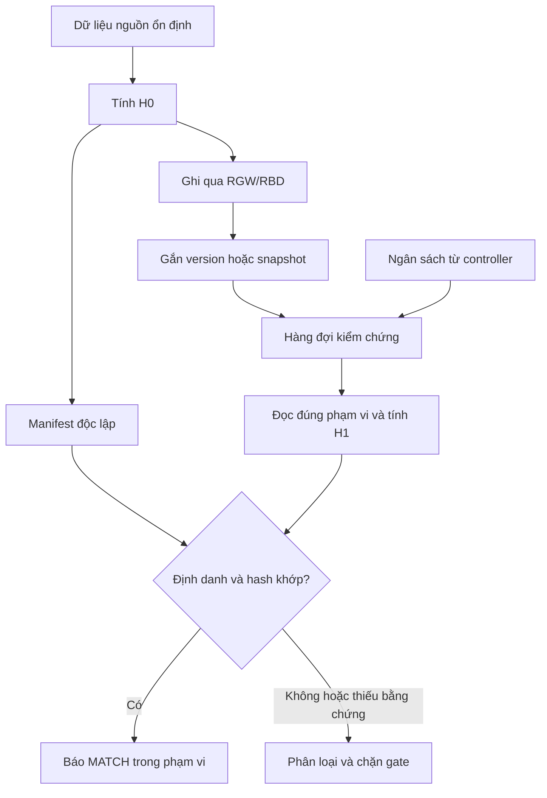

# V2 — Cải tiến 02: Kiểm chứng dữ liệu H0 tại client

**Dự án:** PRJ GD2 — Nâng cấp Ceph RGW/RBD  
**Phiên bản tài liệu:** V2 — 16/09/2026  
**Trạng thái:** thiết kế đề xuất để triển khai và kiểm thử; chưa có kết quả lab.  
**Phạm vi đầu tiên:** tập dữ liệu test được kiểm soát; kiểm chứng sau ghi, có giới hạn tài nguyên, giữ nguyên ACK của Ceph.

## Mục lục

1. Mục tiêu và định nghĩa H0
2. Phạm vi bảo vệ và giới hạn kết luận
3. Kiến trúc đề xuất
4. Manifest và tham chiếu độc lập
5. Luồng RGW/S3
6. Luồng RBD
7. Dữ liệu production đã tồn tại
8. Worker, hàng đợi và trạng thái kết quả
9. Giới hạn ảnh hưởng đến QoS
10. Tích hợp với canary và xử lý mismatch
11. Những thay đổi chưa đưa vào core Ceph
12. Kế hoạch triển khai và bài thử
13. Tiêu chí nghiệm thu
14. Further work và nguồn tham khảo

## 1. Mục tiêu và định nghĩa H0

H0 cung cấp một mốc tham chiếu cho byte dữ liệu trước đường ghi. Sau khi ghi và ở các mốc kiểm thử nâng cấp, client đọc lại đúng đối tượng/phiên bản/phạm vi, tính H1 và so với H0.

```text
D0 = dữ liệu gốc trong phạm vi kiểm thử
H0 = SHA-256(D0), được xác lập trước khi gửi ghi phạm vi đó
D1 = byte đọc lại của đúng phiên bản và đúng phạm vi
H1 = SHA-256(D1)
MATCH khi định danh/phạm vi hợp lệ, đủ byte và H1 = H0
```

Hash khớp là bằng chứng byte đọc lại khớp với tham chiếu trong phạm vi đã kiểm tra, với giả định thuật toán và hệ thống tham chiếu đáng tin cậy. Nó không chứng minh dữ liệu đúng về nghiệp vụ nếu D0 ban đầu đã sai.

H0 là cải tiến về kiểm chứng dữ liệu. Tính hash và đọc lại tiêu thụ CPU, mạng và I/O; không có tác dụng làm QoS tự tốt hơn. MVP phải ghép với bộ điều phối QoS và đo chi phí tăng thêm.

## 2. Phạm vi bảo vệ và giới hạn kết luận

| Lớp | Chứng minh hoặc hỗ trợ | Giới hạn |
| --- | --- | --- |
| Checksum BlueStore | Phát hiện một số lỗi dữ liệu/metadata trong phạm vi lưu trữ được bảo vệ | Byte đã sai trước điểm tạo checksum có thể vẫn có checksum hợp lệ. |
| Deep-scrub | Đọc dữ liệu và tìm bất nhất của PG | Các bản cùng chứa một nội dung sai có thể vẫn nhất quán với nhau. |
| H0/H1 qua client | Đối chiếu byte đọc được với mốc ngoài đường lưu trữ đang kiểm tra | Chỉ bao phủ version/phạm vi đã tích hợp; không tự đọc riêng mọi replica. |
| Backup độc lập | Giữ dữ liệu để phục hồi ở điểm đã chọn | Hash không thay dữ liệu backup; backup cần retention và thử restore. |

Ceph đã có checksum lưu trữ và deep-scrub. H0 thêm tham chiếu ở client; không thay các cơ chế đó. Xem [BlueStore checksums](https://docs.ceph.com/en/reef/rados/configuration/bluestore-config-ref/#checksums) và [PG inconsistencies](https://docs.ceph.com/en/pacific/rados/operations/pg-repair/).

Ví dụ suy luận trong mô hình lỗi: client dự định ghi `ABC`, H0 được tạo từ `ABC`; các bản lưu và lượt đọc lại đều thành `ABX`. H0/H1 có thể phát hiện chênh lệch đó dù các replica thống nhất với nhau. Điều này phụ thuộc vào tham chiếu H0 không bị thay đổi cùng lỗi.

Các giới hạn phải xuất hiện trong báo cáo:

- Một lần GET/read thành công không chứng minh mọi replica đều đúng hoặc mọi byte vừa được đọc từ đĩa vật lý.
- Đọc qua cache vẫn có thể trả byte đúng theo tham chiếu; bài chứng minh lưu bền và bài theo từng OSD phải được thiết kế riêng trong lab.
- H0/H1 không chỉ ra lỗi nằm ở client, mạng, RGW, OSD hay khâu tham chiếu; cần điều tra thêm.
- Dữ liệu cũ được hash trước nâng chỉ tạo baseline tại thời điểm đó, không chứng minh nó đúng từ khi được tạo.
- Sample đạt chỉ kết luận cho sample; không suy rộng thành toàn bộ 24 PB hoặc toàn bộ PG của canary.
- Hash nội dung không bao phủ ACL, metadata nghiệp vụ, bucket index, OMAP hoặc hành vi snapshot nếu không có bài kiểm tra bổ sung.

## 3. Kiến trúc đề xuất



Các module dự kiến: `reference_builder`, `manifest_store`, `rgw_adapter`, `rbd_adapter`, `verification_queue`, `rate_limiter`, `comparator`, `reporter`. Đây là đề xuất cấu trúc chương trình, không phải module Ceph có sẵn.

Manifest cần nằm ngoài bản dữ liệu đang kiểm tra, có lưu bền, kiểm soát cập nhật và lịch sử phiên bản. Không chỉ cất H0 trong metadata cùng object rồi coi đó là tham chiếu độc lập. Một DB trên máy quản trị có backup là phương án MVP; chính DB đó cũng cần kiểm tra khả năng đọc/khôi phục.

## 4. Manifest và tham chiếu độc lập

| Trường | Ý nghĩa |
| --- | --- |
| `manifest_id`, `schema_version`, `run_id` | Nhận diện tham chiếu và lần thử; không tái sử dụng nhầm giữa các phiên. |
| `origin` | `client_prewrite` cho dữ liệu mới; `preupgrade_baseline` cho dữ liệu cũ. |
| `resource` | RGW: endpoint logic, bucket, key và immutable version; RBD: cluster/pool/namespace/image cùng snapshot. |
| `scope` | Offset, length, tổng kích thước, chunk ID nếu kiểm chứng theo chunk. |
| `hash_algorithm`, `expected_hash` | Thuật toán và digest H0; không dùng ETag thay SHA-256. |
| `representation` | Biểu diễn byte được so sánh, thí dụ payload logic trả về client. |
| `consistency_method` | Unique immutable key, version ID, test quiesce, snapshot hoặc cách xác lập nhất quán cụ thể. |
| `created_at`, `write_completed_at` | Thời điểm nguồn và hoàn tất ghi; không dùng thời điểm thay cho version identity. |
| `reference_revision`, `status` | Phiên bản manifest và trạng thái vòng đời. |

Ví dụ schema cho RGW; đây là dữ liệu minh họa, không phải manifest hợp lệ để chạy:

```json
{
  "schema_version": 2,
  "manifest_id": "example-manifest",
  "run_id": "example-canary-run",
  "origin": "client_prewrite",
  "resource": {
    "kind": "rgw",
    "cluster_fsid": "TO_BE_SET",
    "bucket": "dedicated-test-bucket",
    "key": "unique-immutable-key",
    "version_id": null
  },
  "consistency_method": "unique_key_no_overwrite_no_delete",
  "scope": {"offset": 0, "length": 1048576},
  "representation": "logical_client_payload",
  "hash_algorithm": "sha256",
  "expected_hash": "TO_BE_COMPUTED_FROM_SOURCE",
  "reference_revision": 1,
  "status": "REFERENCE_READY"
}
```

Khi dùng unique key không versioning, phải kiểm soát không overwrite/delete trong toàn khoảng kiểm chứng. Nếu không bảo đảm được tính bất biến, không coi unique key là đủ. Khi hỗ trợ versioning đã được xác minh trên RGW đang chạy, lưu và đọc đúng version ID.

Không kết luận dựa trên `LastModified` hoặc size một mình. Một nội dung bị ghi đè có thể giữ cùng kích thước. `null` ở version ID chỉ được chấp nhận nếu có consistency method khác đã được kiểm soát và ghi rõ.

Manifest là một trust boundary: người/vai trò tạo tham chiếu và worker đọc tham chiếu phải có quyền phù hợp; mọi sửa H0 cần tạo revision mới có lý do. Bị lỗi đọc hoặc thiếu manifest phải trả `REFERENCE_ERROR`, không coi là đạt và không tự tạo H0 mới từ bản đang bị nghi lỗi.

## 5. Luồng RGW/S3

### 5.1. PUT/GET đơn giản — MVP đầu tiên

1. Chọn hoặc sinh file nguồn ổn định; giữ nguyên file trong suốt phép thử.
2. Đọc streaming file nguồn để tính H0 và size; lưu manifest `REFERENCE_READY` trước upload.
3. PUT vào bucket test riêng với key duy nhất; ghi lại kết quả của API, request ID và version ID nếu có.
4. Khi kết quả ghi xác định, chuyển manifest sang `WRITE_CONFIRMED` rồi đưa vào hàng đợi.
5. Worker nhận ngân sách, GET đúng version/key; kiểm tra nhận đủ byte, cập nhật H1 theo từng chunk.
6. So định danh, phạm vi và H1/H0; lưu kết quả cùng thời điểm, bytes verified và latency.

Việc pre-hash trước PUT có thể thêm một lượt đọc ở máy client; phải đo chi phí này. Không tải cả file lớn vào RAM. Nguồn cần được đóng băng hoặc spool thành bản riêng; chỉ so mtime không đủ bảo đảm byte upload đúng với file đã hash.

ACK Ceph/S3 vẫn theo cơ chế hiện có. Trạng thái `WRITE_CONFIRMED` và `VERIFIED_MATCH` là hai trạng thái khác nhau của công cụ. Không đổi lời hứa với ứng dụng thành “ghi đã được xác minh” khi worker còn chưa chạy.

### 5.2. Multipart và file lớn

Giữ buffer hữu hạn; H0 toàn object được tính theo đúng thứ tự byte nguồn, không phụ thuộc thứ tự part hoàn tất. Upload streaming từng part, ghi upload ID/part progress và chỉ đưa vào hàng đợi kiểm chứng sau khi CompleteMultipartUpload được xác nhận.

Có thể lưu thêm hash theo chunk để định vị sai khác. Không thay hash toàn object bằng cách nối chuỗi digest từng chunk rồi gọi đó là cùng một SHA-256. Nếu dùng một cây hash ở giai đoạn sau, phải định nghĩa thuật toán và định dạng manifest riêng.

ETag không được dùng thay H0 SHA-256. Range GET và conditional request có thể hỗ trợ đọc phạm vi và kiểm soát đối tượng; phải kiểm thử với đúng RGW/SDK/image. Các khả năng object, multipart và range được mô tả tại [RGW object operations](https://docs.ceph.com/en/reef/radosgw/s3/objectops/).

### 5.3. Retry và trạng thái ghi không chắc chắn

Timeout không chứng minh PUT thất bại. Trước retry, kiểm tra lại object/version và kết quả có thể đã hoàn thành. Ghi đè hoặc PUT lặp trên bucket versioned có thể tạo version mới; manifest không được vô tình gắn digest của phiên trước với version sau.

MVP dùng key duy nhất cho từng nội dung và giới hạn concurrent writers. Nếu không phân giải được phiên bản đã ghi, trả `INCONCLUSIVE`; không tự lấy latest để so với H0 của một phiên không xác định.

## 6. Luồng RBD

### 6.1. Dữ liệu mới trên image test

MVP chọn image test riêng, một writer và các vùng byte xác định. Trước từng ghi, tính H0 từ buffer nguồn; ghi lại offset/length. Nếu ghi đè chồng lấn, phải có expected state của kết quả cuối, không giữ hash một vùng cũ rồi so với dữ liệu đã được ghi đè hợp lệ.

Để đơn giản hóa bản đầu: chia image thành chunk cố định, cập nhật trọn chunk và tuần tự hóa những ghi cùng chunk. Sau khi tất cả ghi trong một checkpoint hoàn tất, thực hiện flush/barrier phù hợp với đường I/O đang dùng, quiesce writer, tạo snapshot và gắn manifest với snapshot đó. Worker đọc snapshot thay vì head đang tiếp tục thay đổi.

Mốc gắn snapshot chỉ hợp lệ nếu expected state tương ứng chính xác trạng thái writer đã hoàn tất trước snapshot. Snapshot không tự tạo ra bản đồ H0 đúng cho các ghi đồng thời.

### 6.2. Image có filesystem hoặc ứng dụng

RBD không biết tính nhất quán nội bộ của ứng dụng. Snapshot không được phối hợp với workload chỉ bảo đảm mức nhất quán hạn chế; ứng dụng/VM cần quiesce và flush thích hợp nếu yêu cầu khôi phục ở cấp ứng dụng. [RBD snapshots](https://docs.ceph.com/en/reef/rbd/rbd-snapshot/).

Với raw image test có writer kiểm soát, xác lập byte-level checkpoint là đủ cho phép so hash đã định nghĩa. Với database/VM production, bổ sung bài kiểm chứng ứng dụng; SHA-256 toàn image không tự thay bài đó.

Ghi rõ đường đọc là librbd, krbd hay qua guest filesystem. Kết quả đọc từ snapshot qua một đường không tự chứng minh mọi tầng cache của đường khác hoặc mọi bản sao vật lý.

## 7. Dữ liệu production đã tồn tại

Phân biệt hai loại nguồn tham chiếu trong mọi báo cáo:

| Loại | Cách tạo | Kết luận được phép |
| --- | --- | --- |
| `client_prewrite` | Hash từ dữ liệu gốc trước ghi | Byte đọc lại khớp tham chiếu trước đường ghi của phạm vi đó. |
| `preupgrade_baseline` | Đọc version/snapshot nhất quán trước nâng để hash | Byte sau nâng không thay đổi so với mốc trước nâng đã chọn. |

Không có cách tính H0 hiện tại để hồi tố chứng minh mọi dữ liệu cũ vốn đúng. Ưu tiên tập khách hàng/bucket/image quan trọng, đối chiếu với nguồn gốc hoặc backup tốt nếu có.

Với RGW, ghim immutable version hoặc kiểm soát thời gian không ghi đè. Với RBD, ghim snapshot nhất quán. Lưu manifest ngoài bản dữ liệu được kiểm tra và giữ version/snapshot đến khi gate hoàn tất; nếu dữ liệu bị xóa hợp lệ trong thời gian đó, báo version không còn khả dụng theo chính sách thay vì kết luận hỏng ngay.

Không giả định H0 của một object S3 phủ một PG duy nhất. Multipart, layout RGW và layout RBD có thể trải qua nhiều RADOS object/PG. MVP báo coverage ở cấp object/version hoặc image/snapshot/range. Chỉ công bố coverage theo OSD/PG khi đã có mapping adapter được kiểm chứng tại đúng epoch/phạm vi.

## 8. Worker, hàng đợi và trạng thái kết quả

Khóa idempotency của một job gồm manifest ID/revision, immutable resource identity, phạm vi byte và checkpoint cần kiểm chứng. Hai lần chạy lại cùng job tạo các attempt trong lịch sử, không xóa kết quả mismatch trước đó.

Vòng đời đề xuất: `REFERENCE_READY`, `WRITE_PENDING`, `WRITE_CONFIRMED`, `VERIFY_QUEUED`, `VERIFYING`, sau đó có một kết quả. Với dữ liệu cũ đã có baseline, không tạo giả một sự kiện ghi mới; bắt đầu từ tham chiếu baseline đã xác lập.

| Kết quả | Ý nghĩa và cách dùng |
| --- | --- |
| `MATCH` | Đủ điều kiện định danh, đủ byte và digest khớp; đạt phạm vi job. |
| `MISMATCH` | Đúng định danh/phạm vi nhưng digest không khớp; giữ bằng chứng và chặn mở rộng. |
| `MISSING` | Không tìm thấy đối tượng cần tồn tại; điều tra retention, quyền, ghi chưa chắc chắn hoặc lỗi dữ liệu. |
| `VERSION_UNAVAILABLE` | Version/snapshot cần kiểm tra không còn khả dụng; chưa thể kết luận đạt. |
| `READ_ERROR` | Timeout, lỗi truy cập hoặc lỗi I/O; ghi rõ nguyên nhân, retry có giới hạn. |
| `REFERENCE_ERROR` | Manifest thiếu, không hợp lệ hoặc tham chiếu không đáng tin; không tính lại H0 từ đích. |
| `INCONCLUSIVE` | Đọc thiếu phạm vi, nguồn thay đổi, phiên bản không chắc chắn hoặc mất bằng chứng | 

MVP có thể restart cả lượt hash của một object/range khi worker chết giữa chừng. Nếu muốn resume từ chunk, phải có manifest theo chunk hoặc checkpoint hash state hợp lệ; không ghép tùy ý các phần digest độc lập.

Kết quả gửi controller gồm `run_id`, `manifest_id`, revision, origin, resource identity, offset/length, expected/observed digest, số byte thực nhận, trạng thái, thời gian và lỗi. Không gửi payload nhạy cảm trong log metrics.

## 9. Giới hạn ảnh hưởng đến QoS

Worker phải có các cơ chế thiết kế sau:

- Streaming với buffer hữu hạn; đo CPU hash và RAM.
- Giới hạn byte/s, request/s và số request đang chạy; áp theo worker và ngân sách tổng, không nhân ngân sách lên theo số worker.
- Ngân sách có TTL từ controller. Hết hạn thì ngừng cấp lượt đọc mới; xử lý lượt đang chạy theo giới hạn timeout và ngân sách đã cấp.
- Hàng đợi có backpressure, giới hạn backlog và tuổi job; không bỏ mẫu âm thầm khi chậm.
- Ưu tiên job của canary/checkpoint đang chờ gate; không quét toàn bộ production theo mặc định.
- Retry có backoff và giới hạn; không gây bão retry khi endpoint lỗi.

Đọc kiểm chứng đi qua RGW/RBD được Ceph xem là client I/O; mClock không tự biết đó là tác vụ kiểm chứng tùy chọn của dự án. Limiter phải đặt ở công cụ client. [mClock client types](https://docs.ceph.com/en/reef/rados/configuration/mclock-config-ref/#mclock-client-types).

Schema chính sách minh họa, không phải cấu hình Ceph; `null` là chưa có số đo để chốt:

```yaml
schema_version: 2
mode: observe_and_verify
hash_algorithm: sha256
buffer_bytes: null
max_read_bytes_per_second: null
max_requests_per_second: null
max_inflight_requests: null
budget_ttl_seconds: null
max_pending_bytes: null
max_oldest_job_age_seconds: null
max_retry_attempts: null
coverage_policy: null
require_immutable_resource_identity: true
on_missing_reference: block_verification_gate
on_digest_mismatch: preserve_evidence_and_block_expansion
```

Chưa cấu hình buffer/ngân sách/coverage thì không bắt đầu chạy kiểm chứng có tải trên production. Các thông số được xác lập bằng benchmark; đây là điều kiện của phần mềm dự kiến, không phải yêu cầu phê duyệt bổ sung cho việc viết tài liệu.

Mỗi byte chọn để kiểm chứng toàn phần cần ít nhất được đọc qua đường xác minh một lần cho checkpoint đó; retry và kiểm chứng nhiều checkpoint tăng lượng đọc. Đo riêng pre-hash tại nguồn, upload, H1, manifest I/O và ảnh hưởng đến client để không giấu chi phí.

## 10. Tích hợp với canary và xử lý mismatch

Coverage policy phải xác định tập bắt buộc, tập lấy mẫu, version/snapshot, các checkpoint cần kiểm tra và thời hạn. Ngưỡng dựa trên mẫu không được trình bày như đã kiểm chứng toàn bộ dữ liệu.

| Mốc | Việc kiểm chứng |
| --- | --- |
| Trước đợt nâng | Xác nhận manifest còn hợp lệ; có kết quả baseline cho tập được chọn. |
| Sau chuyển PG sang spare | Xác minh tập liên quan theo khả năng coverage đã biết; đánh giá đồng thời trạng thái PG. |
| Sau đưa dữ liệu về canary | Chạy tập bắt buộc và workload có kiểm soát; lưu đúng version/phạm vi. |
| Trước OSD tiếp theo | Hoàn thành coverage bắt buộc và giới hạn tuổi/backlog; không chỉ nhìn số MATCH. |
| Sau restore | So với tham chiếu tốt tương ứng điểm phục hồi và kiểm tra chức năng ứng dụng. |

Nếu không đủ mapping để biết chính xác dữ liệu nào thuộc canary, ghi rõ phạm vi chỉ là workload-level; không gắn nhãn “toàn bộ dữ liệu OSD đã được H0 kiểm tra”.

Khi hash không khớp:

1. Dừng mở rộng đợt, giữ manifest revision, object version/snapshot, digest và log của attempt đầu.
2. Kiểm tra lại định danh, byte range, nguồn tham chiếu và điều kiện nhất quán; lỗi chọn version phải được phân loại riêng.
3. Lặp lại có kiểm soát nếu cần để điều tra; kết quả khớp ở lần sau không tự xóa sự kiện mismatch trước đó.
4. Đối chiếu client/OSD log, deep-scrub và các bản tốt theo quy trình. Không tự dùng đa số hoặc primary làm nguồn chuẩn duy nhất.
5. Chọn phục hồi từ nguồn đã xác minh hoặc backup ưu tiên; giữ bằng chứng trước hành động phá hủy. H0 không đủ để tái tạo payload đã mất.

H0 sau ghi không ngăn client nhận ACK trước khi lỗi bị phát hiện. Nếu yêu cầu nghiệp vụ là “không được ACK nội dung sai”, đó là yêu cầu khác, cần thiết kế điểm kiểm tra đồng bộ và đánh giá chi phí riêng.

## 11. Những thay đổi chưa đưa vào core Ceph

MVP giữ nguyên ACK và replication. Không thêm bước đọc lại mọi replica sau mỗi ghi; không tạo loại replica/quorum “3.5”; không thay scrub bằng một cơ chế quét mới chưa có bằng chứng cần thiết.

Tận dụng deep-scrub theo PG mục tiêu với lịch và ngân sách đã thử. Việc tự động chọn PG/lập lịch là phần điều phối, không đòi hỏi viết lại thuật toán scrub. Scrub cũng dùng tài nguyên và cần nằm trong kế hoạch đo tải. [Pacific scrubbing](https://docs.ceph.com/en/pacific/rados/configuration/osd-config-ref/#scrubbing).

Nếu sau MVP muốn mang H0 theo đường ghi và kiểm tra ở OSD, cần đặc tả ít nhất:

- H0 được tạo ở đâu, byte nào được bảo vệ, cách xác thực và bảo vệ tham chiếu.
- Cách gắn object/operation/version/offset/length, xử lý overwrite, retry, truncate, snapshot và multipart/layout.
- Kiểm tra buffer trước lưu hay đọc lại sau commit; hai vị trí có phạm vi phát hiện lỗi khác nhau.
- Kiểm tra trước điểm ACK nào và cách báo lỗi/timeout; tác động latency trên cả primary lẫn replica.
- Negotiation mixed-version, API/wire format, khả năng tắt feature và các bài lỗi có chủ đích.
- Bài chứng minh phần bảo vệ bổ sung so với cơ chế sẵn có và H0 ở client.

Đây là further work. Không thể giả định chỉ sửa một `ceph-osd` là đủ cho một giao thức mới có H0 xuyên qua client, RGW/RBD và peer.

## 12. Kế hoạch triển khai và bài thử

| Giai đoạn | Đầu ra |
| --- | --- |
| 1. RGW đơn giản | Unique key, nguồn bất biến, SHA-256 streaming, manifest bền vững, PUT/GET và báo cáo. |
| 2. Queue và limiter | Worker bất đồng bộ, ngân sách, backlog, TTL, retry và restart. |
| 3. Multipart | File lớn, chunk cố định, CompleteMultipartUpload và xử lý kết quả không chắc chắn. |
| 4. RBD test | Writer kiểm soát, expected chunk state, checkpoint/snapshot và đọc đúng range. |
| 5. Canary integration | Nhận ngân sách QoS, trả kết quả gate, báo coverage trước/sau chuyển PG. |
| 6. Dữ liệu cũ ưu tiên | Baseline nhất quán, retention, quyền đọc, restore đối chứng; tách nhãn origin rõ ràng. |

Ma trận kiểm thử tối thiểu:

| Bài thử | Kết quả mong đợi |
| --- | --- |
| Ghi/đọc đúng, file nhỏ và lớn | MATCH; size và version đúng; RAM có giới hạn. |
| Thay một byte sau khi tạo H0 trong harness lab | MISMATCH; controller dừng mở rộng. |
| Nội dung sai nhưng các lượt đọc đều nhất quán trong harness | Phát hiện chênh lệch với H0 độc lập; không quảng bá là đã tái tạo một bug Ceph thật. |
| Overwrite hợp lệ giữa hai lần đọc | Chọn đúng version hoặc INCONCLUSIVE; không báo hỏng chỉ vì so nhầm latest. |
| RBD head thay đổi sau snapshot | Worker vẫn kiểm chứng snapshot đã ghim; expected state không lấy từ head mới. |
| Snapshot thiếu quiesce ứng dụng | Báo giới hạn application consistency; không kết luận ứng dụng phục hồi đúng chỉ từ hash. |
| Manifest mất hoặc digest bị sửa | REFERENCE_ERROR; không tính lại H0 từ dữ liệu đích để làm bài thử đạt. |
| GET timeout, short read, quyền bị từ chối | Phân loại lỗi, retry có giới hạn; không có MATCH khi chưa nhận đủ byte. |
| Worker chết giữa lượt đọc | Restart/retry đúng phạm vi, giữ attempt và không trộn phiên bản. |
| Ngân sách hết hạn hoặc QoS xấu | Dừng cấp lượt đọc mới, backlog tăng có đo lường; gate kiểm chứng chưa đạt. |
| Bỏ mất một phần sample bắt buộc | Coverage chưa đạt dù các sample còn lại đều MATCH. |
| Restore dữ liệu ưu tiên | Hash khớp điểm phục hồi đã chọn và ứng dụng vượt bài kiểm tra chức năng. |

Fault injection chỉ dùng trên dữ liệu/lab được chọn; ưu tiên harness điều khiển payload và tham chiếu trước khi nghiên cứu sửa đường I/O của OSD.

## 13. Tiêu chí nghiệm thu

- [ ] H0 dữ liệu mới được tạo từ nguồn trước ghi; dữ liệu cũ được gắn nhãn baseline đúng.
- [ ] Mỗi job có immutable identity hoặc consistency method được kiểm chứng, offset và length rõ ràng.
- [ ] Không dùng ETag/metadata cùng object làm tham chiếu H0 độc lập duy nhất.
- [ ] MATCH chỉ xuất hiện sau khi nhận đủ byte đúng phạm vi và so hash thành công.
- [ ] Có báo cáo coverage, job chưa kiểm tra, backlog và tuổi kết quả; không suy rộng từ sample.
- [ ] Worker thực thi limiter, budget TTL, retry có giới hạn và phục hồi sau restart.
- [ ] Mismatch giữ bằng chứng, chặn gate và không tự repair/xóa dữ liệu.
- [ ] Đo được chi phí CPU/RAM/network/I/O của H0 và tác động p95/p99 client.
- [ ] Có bài riêng cho dữ liệu lưu bền/từng replica nếu muốn đưa ra kết luận ở các mức đó.
- [ ] Backup/restore giữ vai trò phục hồi; H0 không được dùng làm lý do bỏ backup ưu tiên.

## 14. Further work và nguồn tham khảo

Further work: mapping logical data sang PG/OSD có kiểm chứng; điều chỉnh sampling theo rủi ro; manifest theo chunk và cây hash; hỗ trợ nhiều writer với version tracking; xác minh metadata nghiệp vụ; kiểm thử từng replica; nghiên cứu H0 trong OSD khi yêu cầu và lợi ích đã được chứng minh.

Các module, schema, protocol ngân sách và kết quả job trong tài liệu là thiết kế V2 đề xuất. Nguồn Ceph chính thức được dẫn cạnh nhận định kỹ thuật. Nguồn dự án: [PRJ GD2 — Tổng hợp kế hoạch nâng cấp Ceph](https://app.notion.com/p/3dcac177517c814cafc2d4db50e481b0), [thiết kế H0 trước V2](https://app.notion.com/p/3dcac177517c81dc95edc6218566c45d). Bản V2 có đủ nội dung để đọc độc lập nếu trang thiết kế cũ được xóa.
