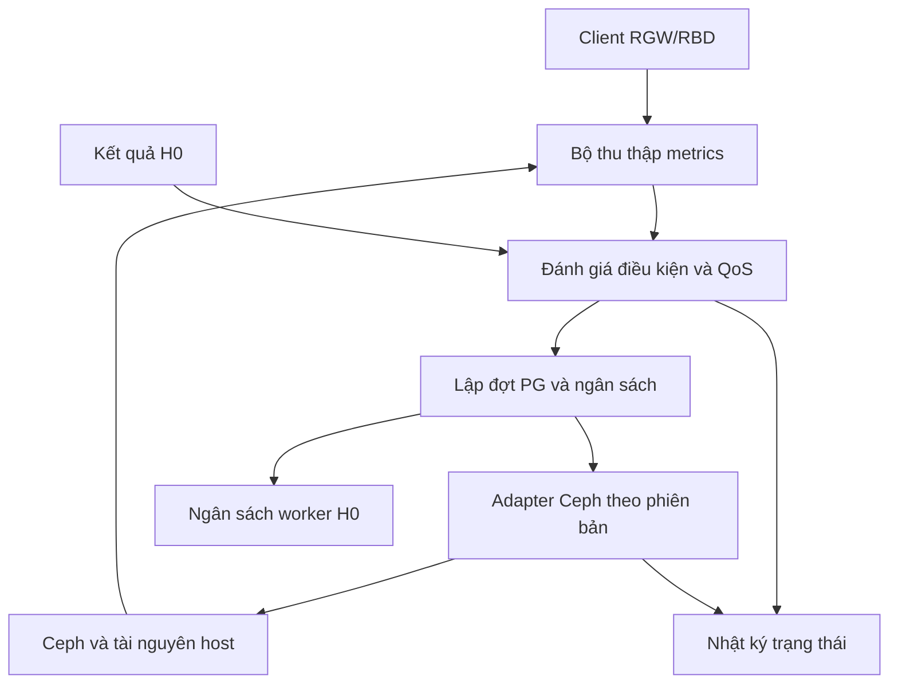

# V2 — Cải tiến 01: Bộ điều phối nâng cấp OSD theo QoS

**Dự án:** PRJ GD2 — Nâng cấp Ceph RGW/RBD  
**Phiên bản tài liệu:** V2 — 16/09/2026  
**Trạng thái:** thiết kế đề xuất để triển khai và kiểm thử; chưa phải phần mềm đã hoàn thành hoặc MOP production.  
**Phạm vi đầu tiên:** một OSD mục tiêu, replicated pool, nhóm PG nhỏ; tận dụng khoảng 10–20 OSD dự phòng đã có trong production. Các ngưỡng phải được xác lập bằng số đo.

## Mục lục

1. Mục tiêu và phạm vi
2. Cơ chế Ceph có sẵn và phần cần phát triển
3. Kiến trúc đề xuất
4. Dữ liệu đầu vào và chất lượng metrics
5. Chọn OSD, spare và lập kế hoạch PG
6. Quy trình và trạng thái công việc
7. Quy tắc điều khiển QoS
8. Ngân sách tài nguyên và tương thích phiên bản
9. Cấu hình và nhật ký đề xuất
10. Khởi động lại, xung đột và xử lý sự cố
11. Tích hợp kiểm chứng H0
12. Kế hoạch triển khai và bài thử
13. Tiêu chí nghiệm thu
14. Further work và nguồn tham khảo

## 1. Mục tiêu và phạm vi

Mục tiêu là điều chỉnh tiến độ di chuyển PG và mở rộng canary theo trải nghiệm RGW/RBD thực tế. Bộ điều phối chỉ cho phép thêm công việc khi cụm đủ điều kiện và các workload được bảo vệ còn trong SLO đã chốt.

Đầu ra cần chứng minh: p95/p99, tỷ lệ timeout/lỗi, throughput, thời gian nâng, lượng dữ liệu di chuyển và thời gian chờ vì thiếu điều kiện. Không dùng riêng IOPS tổng hoặc HEALTH_OK để kết luận đạt QoS.

MVP là một chương trình bên ngoài Ceph. Nó sử dụng API/lệnh quản trị đã hỗ trợ ở phiên bản cụ thể, không thay thuật toán replication, ACK, peering hoặc định dạng BlueStore. Python là lựa chọn triển khai phù hợp với công cụ thu thập, CLI và SDK; không bắt buộc dùng ngôn ngữ này.

Nhóm spare là OSD cùng FSID production. Cụm backup 100 TB độc lập dành cho dữ liệu ưu tiên và restore; không tham gia nhận PG bằng upmap. Ceph Assistant/model là nhánh riêng, không quyết định trực tiếp các hành động ghi của bộ điều phối MVP.

MVP không nâng đồng thời nhiều OSD; không dùng thử trực tiếp trên EC pool; không tự purge/zap/repair OSD; không tự đổi feature floor hoặc downgrade. Việc restart/nâng daemon nằm ở bước MOP có điều kiện, chỉ được nối tự động sau khi adapter cho đúng phiên bản đã được kiểm thử.

## 2. Cơ chế Ceph có sẵn và phần cần phát triển

| Thành phần | Cách sử dụng trong V2 |
| --- | --- |
| `pg-upmap` / `pg-upmap-items` | Dùng để chỉ định ngoại lệ placement của PG; bộ điều phối lập kế hoạch và kiểm tra kết quả. |
| Recovery/backfill | Ceph thực hiện sao chép và đồng bộ. Bộ điều phối quản lý lượng công việc được đưa vào và các cấu hình đã kiểm thử. |
| Scheduler WPQ/mClock | Dùng cơ chế có sẵn theo từng OSD/phiên bản; không viết lại scheduler trong MVP. |
| Điều kiện PG và khả năng dừng | Thu thập từ Ceph, đánh giá cùng kế hoạch. `ok-to-stop` không thay kiểm chứng dữ liệu hoặc kiểm tra an toàn xóa OSD. |
| Điều phối dựa trên QoS | Phần phát triển mới: vòng phản hồi dựa trên client metrics, chia đợt, điều kiện dừng/tiếp tục. |
| Nhật ký trạng thái và ownership | Phần phát triển mới: ghi trạng thái, chống thao tác lặp, xử lý restart và thay đổi ngoài kế hoạch. |
| Worker H0 | Phần phát triển riêng; nhận ngân sách đọc và trả kết quả kiểm chứng cho bộ điều phối. |

Upmap điều chỉnh nơi đặt PG, không cung cấp thêm dung lượng hoặc tự tạo giới hạn latency. Khả năng chọn PG và OSD đích được mô tả trong [Ceph pg-upmap](https://docs.ceph.com/en/reef/rados/operations/upmap/).

## 3. Kiến trúc đề xuất



Các module đề xuất: `collector`, `placement_planner`, `policy_engine`, `ceph_adapter`, `state_store`, `verification_bridge` và CLI báo cáo. Đây là tên module dự kiến, chưa phải API hoặc tính năng Ceph tồn tại sẵn.

Một tiến trình điều phối sở hữu một phiên nâng. MVP có thể dùng SQLite trên máy quản trị bền vững, ghi giao dịch cho mỗi chuyển trạng thái. Nếu triển khai nhiều instance ở giai đoạn sau, cần cơ chế leader/lease và fencing thật sự; một hàng khóa trong bộ nhớ không đủ.

## 4. Dữ liệu đầu vào và chất lượng metrics

| Nhóm | Dữ liệu tối thiểu | Mục đích |
| --- | --- | --- |
| Phiên bản | FSID; image/digest và version thực chạy; scheduler, cấu hình hiệu lực; phiên bản client | Chọn adapter và xác định khả năng tương thích. |
| Placement | PG, pool, up/acting set, primary thực tế, OSDMap epoch, mapping ngoại lệ đang có | Lập thay đổi và kiểm tra drift. |
| PG | Trạng thái; recovery/backfill; lỗi/inconsistent; số byte ước lượng | Chọn phạm vi, phát hiện chưa đồng bộ. |
| Dung lượng | Dùng/trống từng đích; ngưỡng full; dung lượng dự kiến sau nhận PG; dự phòng tăng trưởng | Loại đích thiếu chỗ, không suy từ free trung bình cả cụm. |
| Failure domain | Host/rack, CRUSH rule, device class, peer của từng PG | Kiểm tra spare hợp lệ cho từng mapping. |
| Client | p95/p99 theo loại thao tác và workload; timeout/lỗi; request count; throughput | Đo SLO thật sự chịu ảnh hưởng. |
| Tài nguyên | Disk latency/queue, CPU, network, recovery traffic ở nguồn, peer, spare, host dùng chung | Xác định điểm nghẽn ngoài dung lượng spare. |
| Kiểm chứng | Kết quả H0, phạm vi đã kiểm tra, backlog, tuổi mẫu, manifest ID | Quyết định có đủ bằng chứng để tiếp tục. |

Không suy p99 từ counter latency trung bình; không lấy trung bình các p99 để tạo p99 toàn hệ thống. Dùng histogram hoặc dữ liệu latency thô có cách tổng hợp phù hợp. Histogram phải đủ độ phân giải quanh SLO cần đánh giá.

Phải ghi freshness và số mẫu. Khi workload không có đủ yêu cầu để đánh giá latency, trả `INSUFFICIENT_DATA`; có thể dùng probe được kiểm soát nhưng phải báo tách khỏi traffic thật. Timestamp không đồng bộ hoặc collector lỗi cũng không được diễn giải là tải thấp.

Client metrics phải bao phủ nhóm khách hàng/workload đã cam kết. Nếu chỉ đo một client test, báo cáo chỉ kết luận cho phạm vi đó. Polling quản trị có chu kỳ và cache, tránh liên tục dump toàn bộ cụm lớn mỗi vài giây.

## 5. Chọn OSD, spare và lập kế hoạch PG

Thực hiện theo thứ tự:

1. Chốt OSD mục tiêu, pool được phép và danh sách đầy đủ PG liên quan ở một mốc quan sát.
2. Loại PG không đủ điều kiện khỏe hoặc có lỗi dữ liệu chưa xử lý. Kiểm tra khả năng dừng ngay trước bước dừng, không dùng kết quả cũ từ đầu phiên.
3. Với mỗi PG, chọn spare hợp lệ về CRUSH rule, class, failure domain, dung lượng và tải dự kiến. Spare khác ID nhưng cùng host có thể vẫn không hợp lệ.
4. Chia thành đợt theo số PG, số byte ước lượng và ngân sách nguồn/đích/host/mạng. PG lớn không được xem tương đương PG nhỏ chỉ vì cùng tính là một PG.
5. Ghi mapping hiện tại, mapping dự kiến và ownership; so sánh bản đồ dự kiến để tìm thay đổi ngoài phạm vi.
6. Trước mỗi đợt, đọc lại trạng thái. Nếu epoch thay đổi, kiểm tra lại các giả định liên quan; không thất bại chỉ vì epoch tăng, cũng không áp kế hoạch cũ một cách mù quáng.

Khi giữ `size=3`, ví dụ tập thành viên `{0,1,2}` chuyển sang `{9,1,2}`. Ký hiệu chỉ mô tả thành viên, không xác định primary và không có nghĩa dữ liệu đã đồng bộ ngay khi lệnh mapping thành công.

Khoảng 10–20 spare cung cấp nhiều lựa chọn đích, không bảo đảm mọi PG đều có đích phù hợp. Không có đích hợp lệ thì giữ nguyên placement và đánh giá lại phạm vi.

Tắt balancer không đóng băng placement: thêm OSD, đổi weight, OSD down/out hoặc PG split/merge vẫn có thể đổi mapping. Không giả định một OSD với weight bất kỳ sẽ vừa đứng ngoài CRUSH placement bình thường vừa nhận mọi upmap theo ý muốn; phải thử phương án đưa spare vào trên bản đồ đại diện.

Chuyển primary là thao tác riêng. `primary-affinity` có phạm vi ảnh hưởng rộng và không tương đương chọn chính xác từng PG. `pg-upmap-primary` phải kiểm tra khả năng client hỗ trợ, đặc biệt kernel RBD. Xem [read balancer](https://docs.ceph.com/en/reef/rados/operations/read-balancer/).

## 6. Quy trình và trạng thái công việc

| Trạng thái | Công việc | Điều kiện ra khỏi trạng thái |
| --- | --- | --- |
| `DRAFT` | Chọn phạm vi, thu thập baseline và ngân sách | Đủ cấu hình, dữ liệu và quyền theo phạm vi. |
| `VALIDATED` | Kiểm tra mapping, spare, PG và đường phiên bản | Bản kế hoạch còn phù hợp thực tế. |
| `DRAINING` | Cấp từng đợt PG, theo dõi lượng đang chuyển | Toàn bộ PG mục tiêu đã chuyển và đủ bản sao. |
| `DRAINED` | Xác nhận OSD nguồn không còn vai trò PG cần phục vụ; ghi bằng chứng | Điều kiện an toàn cho thao tác cụ thể đạt. |
| `UPGRADE_READY` | Bàn giao bước nâng daemon cho MOP/adapter đã thử | Ghi nhận đúng version/image sau nâng. |
| `REINTRODUCING` | Đưa một nhóm PG về, ưu tiên quan sát vai trò replica nếu kế hoạch cho phép | Đồng bộ và kiểm chứng nhóm đầu đạt. |
| `OBSERVING` | Đánh giá QoS, H0, PG và lỗi trong cửa sổ đã chốt | Đủ bằng chứng để mở rộng hoặc hoàn tất. |
| `PAUSED_QOS` | Ngừng cấp việc mới, giảm việc tùy chọn trong giới hạn đã thử | Metrics ổn định đủ lâu, còn đủ điều kiện dữ liệu. |
| `BLOCKED` | Thiếu metrics, drift, thiếu dung lượng hoặc thiếu bằng chứng | Nguyên nhân được giải quyết, kế hoạch được xác nhận lại. |
| `INCIDENT` | Có lỗi dữ liệu hoặc sự cố giảm dự phòng | Điều tra và xử lý theo MOP sự cố; không tự resume như pause QoS. |
| `COMPLETED` | Đối chiếu trạng thái cuối và xử lý thay đổi tạm thuộc phiên | Báo cáo và danh sách thay đổi còn lại đầy đủ. |

`PAUSED_QOS` không có nghĩa toàn bộ I/O đang chạy đã dừng. `COMPLETED` cũng không đồng nghĩa đã nâng xong cả hop hoặc toàn bộ daemon.

Drain OSD đến rỗng rồi đưa PG về chủ yếu thử đường backfill/hoạt động của bản mới. Phải có bài riêng nâng store có lịch sử để kiểm tra chuyển đổi metadata, snapshot và OMAP cũ; không gộp hai bài thành một kết luận.

## 7. Quy tắc điều khiển QoS

Các quy tắc dưới đây là thiết kế đề xuất, cần hiệu chỉnh trong lab.

| Ưu tiên | Điều kiện | Hành động |
| --- | --- | --- |
| 1 | Checksum mismatch đáng tin cậy, PG inconsistent hoặc sự cố giảm dự phòng | Dừng mở rộng; giữ bằng chứng; đi luồng sự cố. Không lấy QoS làm lý do ngăn recovery cần thiết. |
| 2 | Metrics thiếu/cũ, trạng thái không xác định, mapping ngoài kế hoạch | Chặn đợt mới; đọc lại và đối chiếu; không tự coi là đạt. |
| 3 | Vi phạm SLO qua cửa sổ đủ số mẫu, hoặc lỗi nghiêm trọng cần phản ứng ngay | Dừng cấp PG mới; giảm H0/backup tùy chọn; áp mức điều tiết Ceph đã kiểm thử. |
| 4 | QoS đạt nhưng ngân sách tài nguyên gần giới hạn | Giữ nguyên mức công việc; không tăng concurrency. |
| 5 | QoS đạt liên tục, ngân sách còn dư, PG và H0 đủ điều kiện | Tăng từng bước nhỏ hoặc cấp đợt tiếp theo. |

Có ngưỡng dừng và ngưỡng tiếp tục khác nhau, cửa sổ quan sát tối thiểu và cooldown để tránh liên tục tăng/giảm theo nhiễu. Thời gian và tỷ lệ cụ thể phải được chốt cho workload; tài liệu không mặc định một tỷ lệ suy giảm chung cho mọi khách hàng.

Pseudocode mô tả quyết định, không phải code có thể chạy:

```text
refresh and reconcile observed state
if confirmed integrity incident or unexpected loss of redundancy:
    stop admitting new migration work
    preserve evidence and enter INCIDENT
elif metrics/configuration/placement evidence is missing or stale:
    enter BLOCKED
elif a workload breaches its agreed QoS policy:
    stop admitting new PG batches
    reduce optional verification/backup work
    apply only tested version-specific throttling
    enter PAUSED_QOS
elif observation window is sufficient and all gates pass:
    grant the next bounded batch and verification budget
else:
    observe without increasing work
persist observation, reason and action outcome
```

Dừng cấp PG mới là hành động điều phối, không hủy backfill đang diễn ra. Không dùng `norecover`/`nobackfill` toàn cụm làm cơ chế pause mặc định. Tăng thread cũng không tự giảm latency khi disk/network đã bão hòa.

## 8. Ngân sách tài nguyên và tương thích phiên bản

Đặt riêng ngân sách cho backfill, backup và H0 nhưng xem tổng ảnh hưởng trên cùng disk/host/network. Bộ điều phối hạn chế cấp việc theo ước lượng và số đo; không quảng bá đó là hard cap MiB/s chính xác của backfill chỉ bằng một tham số concurrency.

Worker H0 và công cụ backup do dự án quản lý có thể thực thi giới hạn byte/s, request/s và concurrency ở client. Backfill dùng scheduler và giới hạn Ceph hỗ trợ; phải đo hiệu lực sau thay đổi.

Pacific mặc định WPQ. mClock có profile và quản lý một số tham số recovery/backfill; các tham số sleep không tiếp tục có cùng tác dụng khi mClock hoạt động. Adapter phải đọc cấu hình hiệu lực thay vì chỉ tin việc `config set` trả thành công. [Pacific OSD config](https://docs.ceph.com/en/pacific/rados/configuration/osd-config-ref/), [mClock config](https://docs.ceph.com/en/reef/rados/configuration/mclock-config-ref/).

Không chuyển nguyên cấu hình Pacific sang Quincy/Reef. Với mixed-version, lưu capability và cấu hình của từng OSD. Chỉ sửa cấu hình thuộc phạm vi công việc, ghi giá trị trước/sau và đối chiếu ownership trước hoàn nguyên.

Đường dự án đang nghiên cứu là 16.2.5 → 16.2.15 → 17.2.7 → 18.2.7; đây là mốc dự án, không xác nhận các patch đó phù hợp để triển khai ở mọi thời điểm. Nâng cephadm phải tuân thủ thứ tự daemon. Khả năng giới hạn đợt có từ 16.2.11/17.2.1; nguồn 16.2.5 cần bước chuẩn bị tương ứng trước khi dùng. [Cephadm upgrade](https://docs.ceph.com/en/reef/cephadm/upgrade/).

## 9. Cấu hình và nhật ký đề xuất

Đây là schema cấu hình của công cụ dự kiến, không phải cấu hình Ceph. `null` là chưa chốt; phiên chạy có thay đổi cụm phải từ chối bắt đầu khi còn thiếu trường bắt buộc.

```yaml
schema_version: 2
mode: observe_only
cluster_fsid: null
target_osd: null
allowed_spare_osds: []
allowed_pools: []
max_target_osds: 1
workloads: []
qos:
  latency_slo_by_workload: null
  error_rate_limit_by_workload: null
  minimum_throughput_if_applicable: null
  minimum_sample_count: null
  observation_window_seconds: null
  metrics_max_age_seconds: null
  resume_window_seconds: null
  cooldown_seconds: null
budgets:
  max_pg_per_batch: null
  max_estimated_bytes_per_batch: null
  capacity_headroom_by_destination: null
  verification_bytes_per_second: null
  verification_max_inflight: null
  verification_budget_ttl_seconds: null
  backup_budget: null
integrity:
  required_manifest_set: []
  coverage_policy: null
  verification_max_age_seconds: null
  verification_backlog_limit: null
  require_verified_evidence_before_next_osd: true
state_store: null
```

Nhật ký tối thiểu gồm `run_id`, FSID, source/target version, target OSD, PG batch, OSDMap epoch, mapping trước/dự kiến/thực tế, action ID, thời điểm, metrics và số mẫu, quyết định, lý do, trạng thái H0, cấu hình hiệu lực và kết quả thao tác.

Mỗi action được ghi ý định trước khi gửi và đối chiếu kết quả sau khi thực hiện. Hết thời gian chờ không chứng minh thao tác thất bại; phải đọc trạng thái thực trước retry. Không lưu secret, keyring hoặc payload khách hàng trong log thông thường.

## 10. Khởi động lại, xung đột và xử lý sự cố

| Tình huống | Xử lý thiết kế |
| --- | --- |
| Controller chết giữa một đợt | Ceph tiếp tục công việc đã cấp. Khi lên lại, đối chiếu journal với cluster trước mọi mutation. |
| Hai controller cùng nhắm một phạm vi | Chỉ một writer được sở hữu phạm vi; instance còn lại chỉ đọc hoặc từ chối thao tác. |
| Operator/balancer đổi mapping | Chặn batch tiếp theo và trình bày chênh lệch; không ghi đè hoặc tự xóa thay đổi đó. |
| Lệnh trả timeout | Đọc mapping/config thực tế; chỉ retry nếu xác định chưa áp dụng và điều kiện vẫn còn đúng. |
| Source/peer/spare down | Dừng kế hoạch nâng mới, đánh giá lại đủ bản sao; chuyển sang xử lý sự cố. |
| H0 backlog quá lớn | Giảm lượng việc tạo thêm backlog; chưa kết thúc gate kiểm chứng chỉ vì client latency đẹp. |
| H0 mismatch | Giữ manifest, hash, version và log; không auto-repair hoặc lấy primary làm nguồn đúng mặc định. |
| Hết cửa sổ bảo trì | Ngừng cấp thêm việc; bàn giao trạng thái đang chạy. Không giả định có thể đảo mapping tức thì. |
| Muốn kết thúc phiên sớm | Tạo kế hoạch kết thúc từ trạng thái hiện tại; có thể cần thêm di chuyển dữ liệu. |

Khi dọn mapping/config, chỉ sửa mục do phiên sở hữu nếu giá trị hiện tại còn đúng với giá trị phiên đã ghi. Nếu người khác đã thay đổi, trả conflict. Không phục hồi nguyên OSDMap cũ lên cụm đang hoạt động.

## 11. Tích hợp kiểm chứng H0

Controller gửi ngân sách có thời hạn cho worker: phạm vi workload, giới hạn đọc, số request đồng thời và thời gian hiệu lực. Worker hết hạn ngân sách thì dừng cấp lượt đọc mới và báo trạng thái; không tự tiếp tục vô hạn bằng giới hạn cũ.

Kết quả worker gồm `MATCH`, `MISMATCH`, `MISSING`, `VERSION_UNAVAILABLE`, `READ_ERROR`, `REFERENCE_ERROR` hoặc `INCONCLUSIVE`, kèm version/phạm vi byte đã kiểm tra. Controller phải phân biệt lỗi dữ liệu với thiếu bằng chứng và lỗi mạng.

Đọc H0 qua RGW/RBD là I/O client ở góc nhìn scheduler; giới hạn recovery không tự giới hạn các lượt đọc này. Vì vậy worker cần limiter riêng. [mClock client types](https://docs.ceph.com/en/reef/rados/configuration/mclock-config-ref/#mclock-client-types).

Giảm H0 để bảo vệ QoS phải có giới hạn backlog/tuổi kiểm chứng. Trước khi chuyển OSD tiếp theo hoặc nhận canary đạt, phải hoàn thành coverage policy đã chốt; không đánh đổi bằng cách âm thầm bỏ mẫu.

## 12. Kế hoạch triển khai và bài thử

| Giai đoạn | Đầu ra | Điều kiện hoàn thành |
| --- | --- | --- |
| 1. Chỉ đọc | Inventory, baseline, capability matrix, báo cáo thiếu dữ liệu | Không thay cụm; xác định được PG/OSD/workload cần bảo vệ. |
| 2. Planner và replay | Kế hoạch spare/PG cùng ước lượng; phát hiện xung đột bằng dữ liệu lưu | Từ chối mapping không hợp lệ và kế hoạch stale. |
| 3. Thực thi lab | Một writer, một OSD, batch nhỏ, journal và reconcile | Restart/timeout không gây áp dụng trùng hoặc xóa thay đổi ngoài phạm vi. |
| 4. Vòng phản hồi | Pause/resume và ngân sách worker H0 | Đạt bài tải tăng, metrics mất, backlog và mismatch. |
| 5. Đối chứng | Báo cáo rolling, drain cố định, drain thích nghi, drain + H0 | Cùng workload đại diện; có chi phí cả hai chiều và độ biến thiên. |

Các bài thử bắt buộc:

- Tải client tăng khi đang backfill: dừng cấp PG mới đúng chính sách, ghi thời gian phản ứng và phần việc còn đang chạy.
- Spike latency ngắn và dao động quanh ngưỡng: không tăng/giảm liên tục vì nhiễu; lỗi nghiêm trọng vẫn được xử lý kịp thời.
- Collector mất dữ liệu, timestamp sai hoặc request count thấp: trả thiếu bằng chứng, không tự resume.
- Spare gần đầy, cùng failure domain hoặc có mapping ngoài kế hoạch: planner từ chối hoặc lập lại kế hoạch.
- Controller restart/lệnh timeout: không nhân đôi hành động; tìm đúng trạng thái đã thực hiện.
- Peer down giữa phiên: recovery phục hồi dự phòng không bị chặn bởi chính sách tiết kiệm tải mặc định.
- H0 mismatch và backlog: phân loại chính xác, chặn gate liên quan, lưu đủ bằng chứng.
- Drain rỗng và nâng store có lịch sử: báo cáo tách riêng, không dùng một bài thay cho bài kia.

## 13. Tiêu chí nghiệm thu

- [ ] Mỗi workload có SLO, cách đo, số mẫu tối thiểu và giới hạn suy giảm đã thống nhất.
- [ ] Phát hiện được thiếu/cũ metrics, không coi đó là đạt.
- [ ] Chỉ thay mapping/config thuộc phạm vi và có journal đầy đủ.
- [ ] Mọi batch kiểm tra lại PG, spare, dung lượng và capability ngay trước thao tác.
- [ ] Pause/resume đạt thời gian phản ứng đã thống nhất; báo rõ giới hạn với I/O đang chạy.
- [ ] Controller restart và timeout không làm lặp mutation ngoài ý muốn.
- [ ] Không hoàn tất canary nếu coverage H0 bắt buộc chưa đạt.
- [ ] Báo cáo có latency client, lỗi, byte ra/về, thời gian drain, thời gian cả phiên và công việc nền còn tồn đọng.
- [ ] Có đối chứng cho thấy lợi ích và chi phí; nếu rolling thông thường tốt hơn trong một workload thì ghi đúng kết quả.

## 14. Further work và nguồn tham khảo

Further work: nhiều OSD không trùng failure domain; lập lịch theo topology mạng; phân biệt eviction bảo trì với recovery sự cố; coverage PG/workload tốt hơn; tích hợp adapter nâng daemon; quan sát bổ sung trong OSD nếu metrics có sẵn không đủ. Chỉ sửa core khi một yêu cầu cụ thể không thể đáp ứng qua giao diện hiện có và đã có bài đo chứng minh.

Nguồn kỹ thuật được dẫn tại các phần liên quan. Thiết kế module, schema, state machine và chính sách điều khiển trong tài liệu là đề xuất V2 của dự án, không phải tính năng có sẵn được Ceph cam kết. Nguồn dự án ban đầu: [PRJ GD2 — Tổng hợp kế hoạch nâng cấp Ceph](https://app.notion.com/p/3dcac177517c814cafc2d4db50e481b0).
