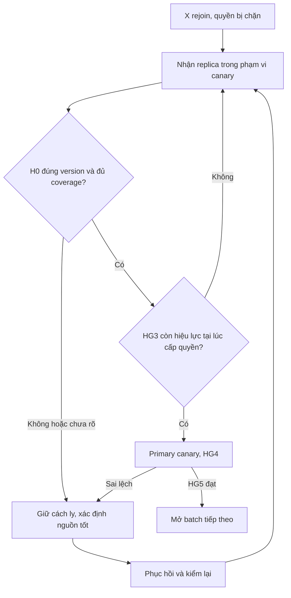

# Kế hoạch thử nghiệm hai phương án nâng cấp OSD và lựa chọn triển khai production

**Dự án:** PRJ GD2 — Nâng cấp Ceph cho RGW và RBD  
**Ngày lập / cập nhật:** 18/09/2026 — bổ sung H0 tại cửa đưa OSD trở lại  
**Trạng thái:** kế hoạch thiết kế và kiểm thử; chưa có kết quả chạy lab trong tài liệu này.  
**Đầu ra:** thử hai phương án trên cùng điều kiện, đánh giá bằng dữ liệu, chọn một phương án đạt yêu cầu để làm MOP và pilot production.

Bản gốc dẫn [trang tổng hợp dự án](https://app.notion.com/p/3dcac177517c814cafc2d4db50e481b0), [bản V2](https://app.notion.com/p/3ddac177517c81708502f5c76c17ac5d) và [note tiêu chí chọn OSD](https://app.notion.com/p/3d7ac177517c8086a3eed25414b34cb9). Bản cập nhật giữ **hai phương án nâng cấp PA1/PA2**, bổ sung H0 vào cả hai để thử khả năng kiểm soát OSD vừa nâng cấp trước khi giao lại dữ liệu và vai trò. Không mặc định phải dựng cụm 100 TB để bắt đầu lab; quyết định production phải giải quyết rõ yêu cầu phục hồi mà cấp phê duyệt đang đặt ra.

> **Phương án 1:** chuyển primary khỏi OSD nguồn, dùng upmap chuyển placement sang spare cùng cụm, thử giữ store cũ bằng cách dừng OSD nguồn trong khi các replica còn lại phục hồi sang spare; nâng OSD nguồn rồi trả PG về có kiểm soát. Thử `norebalance` để hạn chế backfill cân bằng, nhưng vẫn phải đo khả năng phục hồi PG degraded và việc Ceph dọn dữ liệu cũ khi nguồn chạy lại.
>
> **Phương án 2:** giữ OSD nguồn chạy để drain bằng weight về 0, đợi các PG đã chuyển xong rồi nâng cấp. Sau đó mở weight dương rất nhỏ đã kiểm tra mapping, dùng `pg-upmap-items` đưa 1–2 PG ít critical vào canary; dữ liệu và QoS đạt mới tăng weight từng nấc đến giá trị ban đầu.

> **Thay đổi về bảo vệ dữ liệu:** nhánh nghiên cứu chính là **PA1 + H0** và **PA2 + H0**, không dựng thêm cụm mirror/multisite 100 TB cho các bài lab này. H0 dùng để đối chiếu từng bản, chọn replica khớp tham chiếu làm nguồn cập nhật bản sai trên X, rồi kiểm lại trước khi cấp quyền; khả năng phục hồi vẫn dựa vào replica đã kiểm chứng hoặc bản dữ liệu độc lập còn giữ được. Nhánh cụm thứ hai 100 TB được giữ làm phương án đối chiếu về phục hồi và chi phí, không đổi tên thành PA1/PA2.
>
> **Giới hạn cần trình bày với cấp phê duyệt:** H0 không chứa payload để khôi phục khi mọi bản sao đã mất hoặc cùng sai. Chỉ bỏ yêu cầu cụm 100 TB ở production khi phạm vi rủi ro, nguồn phục hồi thay thế và bằng chứng thử nghiệm được chấp thuận. Hiện trạng vẫn là **thiết kế / HOLD production**, không phải kết luận H0 tương đương backup.

**Luồng H0 chọn nguồn và cập nhật bản sai:** xem [mục 8.7](#h0-repair), đặc biệt 8.7.5; checklist thực hiện là R3H trong file đi kèm.

Các lệnh dưới đây là mẫu để xây dựng runbook lab. ID, image, weight, mapping và ngân sách phải lấy từ cụm thực tế. Chưa có thao tác nào được thực hiện lên cụm của bạn khi tạo tài liệu này.

## Mục lục

1. [Mục tiêu và phạm vi](#muc-tieu)
2. [Quy ước và các cơ chế phải hiểu đúng](#co-che)
3. [Mô hình lab và bộ dữ liệu](#lab)
4. [Cách chọn OSD, spare và PG canary](#chon-osd)
5. [Chuẩn bị chung và các điều kiện chuyển bước](#chuan-bi)
6. [Phương án 1 — Primary affinity, upmap, spare và store cũ](#pa1)
7. [Phương án 2 — Drain weight về 0, canary rồi tăng weight](#pa2)
8. [Kiểm chứng dữ liệu và QoS](#kiem-chung)
9. [Ma trận thử nghiệm và xử lý sự cố](#ma-tran)
10. [So sánh và chọn phương án production](#lua-chon)
11. [Kế hoạch triển khai production](#production)
12. [Lộ trình, đầu ra và mẫu biên bản](#dau-ra)
13. [Nguồn và phạm vi xác minh](#nguon)

<a id="muc-tieu"></a>
## 1. Mục tiêu và phạm vi

### 1.1. Các câu hỏi lab phải trả lời

1. Có cô lập được OSD đang nâng khỏi **tập PG đang phục vụ thực tế**, kể cả vai trò replica, hay mới chỉ chuyển primary?
2. PA1 có giữ được store có dữ liệu đến thời điểm mở bằng phiên bản mới? Khi khởi động lại, dữ liệu nào bị dọn, dữ liệu nào được dùng lại và dữ liệu nào phải backfill?
3. PA2 có thực sự giới hạn giai đoạn đầu ở đúng 1–2 PG được chọn? Có PG ngoài danh sách tự đi vào do CRUSH, weight hoặc thay đổi khác không?
4. Hai phương án ảnh hưởng p95/p99, lỗi client, throughput, dự phòng dữ liệu và thời gian hoàn tất thế nào?
5. Khi QoS xấu, peer/spare hỏng, OSD mới crash hoặc checksum sai, có dừng mở rộng và phục hồi được bằng quy trình đã thử không?
6. Lợi ích so với rolling thông thường có đủ lớn để bù việc di chuyển dữ liệu, quản lý mapping và thời gian vận hành không?
7. H0 có kiểm chứng được **bản cục bộ trên X**, đúng version và toàn bộ phạm vi sắp được cấp quyền, trước khi X phục vụ đọc, làm primary hoặc làm nguồn recovery/backfill không?
8. Khi có ghi mới, đổi PG interval, X restart hoặc controller mất kết nối, kết quả cũ có bị vô hiệu hóa và quyền của X có bị chặn đúng lúc không?
9. Nếu không có cụm 100 TB, còn nguồn payload đúng nào để phục hồi từng phạm vi? Khi không còn nguồn đó, giới hạn phục hồi được báo cáo ra sao?

### 1.2. Phạm vi ban đầu

| Nội dung | Phạm vi MVP |
| --- | --- |
| Dịch vụ | RGW và RBD |
| Pool | Replicated pool; bài mẫu `size=3`, `min_size=2`, sau khi xác nhận cấu hình phù hợp |
| Đơn vị nâng | Một OSD mỗi lượt; chưa chạy nhiều OSD đồng thời |
| Canary sau nâng | 1–2 PG có dữ liệu thử và mức quan trọng thấp; kiểm tra toàn bộ PG thực sự vào OSD |
| Spare | OSD thông thường trong **cùng FSID**, hợp lệ với CRUSH rule/class/failure domain |
| Cụm thứ hai 100 TB | Không bắt buộc dựng trong lab H0; giữ làm phương án đối chiếu có retention/restore. Production theo quyết định rủi ro ở mục 1.3; không nhận PG native qua upmap |
| Kiểm chứng | Ceph native + H0 độc lập + bằng chứng bản cục bộ/version trên X; phân biệt prototype quan sát và cơ chế chặn thực sự ở mục 8.7 |
| Phần phát triển | Công cụ mapping/QoS; H0 verifier, journal, theo dõi ghi mới; nghiên cứu cơ chế chặn primary, replica-read và nguồn recovery theo PG/version |
| Ngoài MVP vận hành native | EC, nhiều OSD đồng thời, thay contract ACK, tự sửa dữ liệu không qua runbook. Cơ chế H0 chặn trong data path là nhánh phát triển riêng phải review/test, chưa có sẵn trong MVP native |

Nếu một OSD production đồng thời chứa PG replicated và EC, OSD đó **không thuộc phạm vi MVP chỉ replicated**. Không được bỏ qua các PG EC khi lập danh sách ảnh hưởng.

Đường phiên bản đang nghiên cứu là `16.2.5 → 16.2.15 → 17.2.7 → 18.2.7`. Mỗi mũi tên là một hop độc lập. Các mốc này lấy từ dự án, không phải xác nhận đây là patch nên chọn tại ngày triển khai. Trước mỗi hop phải chốt bản được tổ chức hỗ trợ, release note, image digest, feature floor và điều kiện client.

Với cephadm, phải hoàn thành phần MGR/MON và các bước trước OSD theo runbook của hop. Khả năng staggered upgrade xuất hiện từ `16.2.11` và `17.2.1`; xuất phát `16.2.5` cần quy trình chuẩn bị tương ứng. `--limit 1` không tự có nghĩa chọn đúng OSD đã xếp hạng. [Cephadm upgrade](https://docs.ceph.com/en/reef/cephadm/upgrade/).

### 1.3. Hai phương án nâng cấp và quyết định về cụm 100 TB

**PA1/PA2 mô tả cách di chuyển PG và nâng OSD.** Cách bảo vệ dữ liệu là lựa chọn chung áp dụng lên hai phương án đó:

| Lựa chọn bảo vệ | Dữ liệu giữ ở đâu? | Bằng chứng cần có | Trạng thái trong bản này |
| --- | --- | --- | --- |
| **H — H0 + replica đã kiểm chứng** | Payload nằm ở replica/spare cùng cụm; manifest/journal H0 nằm ngoài phạm vi thay đổi | Chặn sử dụng bản chưa verify, xác định nguồn đúng, phục hồi từ nguồn đó, đo ảnh hưởng SLO và trường hợp không còn nguồn | Hướng lab chính cho cả PA1 và PA2; chưa đủ bằng chứng để thay yêu cầu production |
| **B100 — Cụm thứ hai + điểm phục hồi được giữ** | Tập dữ liệu được chọn có bản độc lập, dung lượng usable và retention đã tính | Sync lag, version/snapshot được giữ, restore/failover, tính nhất quán ứng dụng và RPO/RTO | Phương án đối chiếu hoặc giữ lại nếu yêu cầu phục hồi độc lập vẫn bắt buộc |

RBD mirroring và RGW multisite thực hiện đồng bộ ở tầng dịch vụ; cần thiết kế retention/điểm khôi phục riêng để chịu được ghi sai hoặc xóa hợp lệ bị đồng bộ. Không mặc định mọi lỗi bit cục bộ đều lan sang site khác, cũng không mặc định mọi lỗi logic đều được site khác bảo vệ. Phải thử theo đường đồng bộ thực dùng. [RBD mirroring](https://docs.ceph.com/en/pacific/rbd/rbd-mirroring/), [RGW multisite](https://docs.ceph.com/en/pacific/radosgw/multisite/).

**Thí nghiệm chính chỉ có hai run family:** PA1-H và PA2-H với cùng workload, coverage và ngân sách. Nếu có điều kiện dựng lab thứ hai nhỏ, chạy thêm B100 ở quy mô lab để đối chiếu khả năng phục hồi; không cần cấp ngay 100 TB để học cơ chế, và kết quả lab nhỏ không chứng minh hiệu năng ở 100 TB. Ghi `NOT_RUN` nếu chưa thử, không tự đánh dấu N/A hoặc PASS cho khả năng phục hồi.

Trong nhánh H, vẫn giữ backup cấu hình/control plane, artifact và manifest cần thiết. Việc bỏ cụm payload 100 TB không đồng nghĩa bỏ mọi bản sao cấu hình hoặc nhật ký.

**Hồ sơ trình duyệt phải trả lời:** lãnh đạo cần bản phục hồi độc lập cho mất cả cụm, hay cần ngăn dữ liệu sai từ OSD vừa nâng làm hỏng các bản đang tốt? H0 có thể được đánh giá cho yêu cầu thứ hai trong fault model đã thử. Nếu yêu cầu thứ nhất vẫn giữ nguyên, nhánh H đơn lẻ không đáp ứng; phải có giải pháp lưu payload độc lập phù hợp hoặc chưa triển khai production. Đây là quyết định phạm vi dự án, không phải ô waiver để bỏ qua lỗi dữ liệu đã biết.

<a id="co-che"></a>
## 2. Quy ước và các cơ chế phải hiểu đúng

### 2.1. Ký hiệu

| Ký hiệu | Ý nghĩa |
| --- | --- |
| `X` | OSD nguồn cần nâng cấp |
| `S` | Spare nhận phần dữ liệu thay cho X; có thể cần nhiều spare cho các PG khác nhau |
| `Y`, `Z` | Các OSD còn lại giữ replica của một PG |
| `A`, `B` | Phiên bản nguồn và đích của hop đang thử |
| `P_X` | Hợp tất cả PG có X trong `up` hoặc `acting`, kèm thông tin primary |
| `C` | Danh sách 1–2 PG được phép làm canary |
| `W0` | CRUSH weight ban đầu đã lưu của X |
| `R0` | OSD override reweight ban đầu đã lưu của X |
| `A0` | Primary affinity ban đầu đã lưu của X |
| `H0` / `H0(v)` | Hash tham chiếu từ nguồn độc lập cho một identity và version/range cụ thể; với ghi mới phải có tham chiếu version mới |
| `V_X` | Bằng chứng verify bản cục bộ trên X, gắn PG interval, object version/checkpoint và incarnation của X |
| `HG0`–`HG5` | Gate H0 của dự án; khác hash H0 và khác gate G00–G16 trong checklist |

Ví dụ tập replica `{X,Y,Z} → {S,Y,Z}` chỉ mô tả **thành viên**, không chỉ ra primary. `pg-upmap-items` thay một thành viên; nó không tự tạo replica thứ tư hay một cơ chế “3.5 replica”.

### 2.2. Phân biệt weight để tránh thao tác nhầm

| Thông số | Lệnh | Ý nghĩa | Quy ước trong kế hoạch |
| --- | --- | --- | --- |
| CRUSH weight | `ceph osd crush reweight osd.X W` | Trọng số dung lượng trong cây CRUSH; thường tương ứng TiB | **PA2 dùng loại này làm biến điều khiển chính**; từ `W0` về 0 rồi tăng dần về `W0` |
| OSD reweight | `ceph osd reweight X R` | Hệ số override trong khoảng 0–1 | Giữ nguyên `R0 > 0` khi dùng PA2 theo CRUSH weight; không trộn hai loại giữa lượt thử |
| Primary affinity | `ceph osd primary-affinity X A` | Ảnh hưởng lựa chọn primary, trong khoảng 0–1 | Dùng giảm vai trò primary, xác nhận bằng primary thực tế |

Nếu chọn biến thể PA2 bằng **override reweight**, chuỗi sẽ là `R0 → 0 → Rε → … → R0`, còn CRUSH weight giữ nguyên. Ghi thành một cấu hình thử riêng; không ghi chung chung “rw=1”.

Ví dụ ổ có **CRUSH weight thực tế bằng 15**: tăng CRUSH weight lên 1 vẫn chỉ là một phần trọng số bình thường; còn `ceph osd reweight X 1` là hệ số override đầy đủ. Ổ 15 TB và 15 TiB cũng không giống nhau. Luôn phục hồi giá trị đã lưu, không mặc định mọi OSD phải có CRUSH weight bằng 1. [Control commands](https://docs.ceph.com/en/pacific/rados/operations/control/), [CRUSH weights](https://docs.ceph.com/en/pacific/rados/operations/crush-map/#adjust-osd-weight).

### 2.3. Primary affinity không cô lập OSD

`primary-affinity=0` là cách tránh lựa chọn X làm primary trong cấu hình phù hợp; phải kiểm tra `acting_primary` thực tế sau thay đổi. X vẫn có thể giữ replica, nhận ghi replication, tham gia ACK và xử lý recovery khi còn trong tập phục vụ. Vì vậy “đã chuyển primary” chưa đủ để nói X không ảnh hưởng dữ liệu.

Chỉ chuyển bước cô lập khi đã kiểm tra đầy đủ `up`, `acting`, primary và tiến trình recovery/backfill. Không dùng riêng thứ tự hiển thị của OSD trong một danh sách để suy ra trạng thái đã hội tụ. [Primary affinity](https://docs.ceph.com/en/pacific/rados/operations/crush-map/#primary-affinity).

### 2.4. “Tắt rebalance” phải tách thành những việc khác nhau

| Cơ chế | Tác dụng | Giới hạn trong hai phương án |
| --- | --- | --- |
| `ceph balancer off` | Dừng balancer tự tối ưu placement | Weight, CRUSH, down/out, PG split/merge và mapping thủ công vẫn có thể đổi placement |
| `ceph osd set norebalance` | Hoãn backfill cân bằng trong trường hợp PG không degraded | Không đóng băng OSDMap; không phải danh sách chỉ cho phép một vài PG; không bảo đảm dừng ngay I/O đã bắt đầu |
| `nobackfill` | Chặn backfill | Có thể chặn chính việc đồng bộ sang spare hoặc trả PG về |
| `norecover` | Chặn recovery | Không bật như một bước thường lệ của kế hoạch |
| `noout` cho X | Tránh X bị tự đánh dấu out khi đang dừng | Không giữ đủ replica, không ngăn cleanup và không biến X thành backup |

Đối chiếu `PrimaryLogPG::start_recovery_ops()` ở các tag `v16.2.5`, `v16.2.15`, `v17.2.7`, `v18.2.7` cho thấy nhánh `norebalance` hoãn backfill khi **PG không degraded**. Nhánh này không tự chặn backfill phục hồi PG degraded. Đây là cơ sở để thiết kế bài PA1; vẫn phải tái hiện với đúng image, trạng thái PG và scheduler, không suy rằng mọi PG mang nhãn degraded chắc chắn sẽ hoàn thành. [Mã nguồn Pacific](https://github.com/ceph/ceph/blob/v16.2.15/src/osd/PrimaryLogPG.cc), [OSDMap flags](https://docs.ceph.com/en/pacific/rados/operations/health-checks/#osdmap-flags).

**Cách dùng trong plan:** tắt balancer khi quản lý mapping thủ công; PA1 thử `norebalance` trong giai đoạn cô lập. PA2 phải cho phép backfill khi drain và khi đưa PG về. Không đồng thời bật `nobackfill`/`norecover` rồi chờ dữ liệu tự đồng bộ.

### 2.5. Weight nhỏ và upmap không tự tạo giới hạn cứng 1–2 PG

- Weight nhỏ là điều chỉnh phân bố, không phải quota PG hay giới hạn byte/giây.
- `pg-upmap-items` là ngoại lệ placement cho PG được chỉ định, không phải allowlist chặn tất cả PG khác vào X.
- Đích có override reweight bằng 0 bị bỏ qua trong đường áp dụng upmap. Kiểm tra/cleanup upmap cũng có thể loại mapping tới OSD có effective weight bằng 0, gồm trường hợp CRUSH weight bằng 0.
- Vì vậy phải chuyển X sang **weight dương nhỏ hợp lệ**, kiểm tra mọi PG tự đi vào theo map mới, rồi mới mở backfill cho canary.
- Khi weight đổi, một mapping cũ có thể thành no-op, không còn hợp lệ hoặc bị cleanup. Lệnh báo thành công chưa đủ; phải đọc lại map sau các epoch tiếp theo.

Các điểm về weight và cleanup đã đối chiếu tại `_apply_upmap()` và `check_pg_upmaps()` của [OSDMap.cc v16.2.15](https://github.com/ceph/ceph/blob/v16.2.15/src/osd/OSDMap.cc). Upmap còn yêu cầu client tương thích; phải inventory cả client tạm offline có thể quay lại. [Using pg-upmap](https://docs.ceph.com/en/pacific/rados/operations/upmap/).

### 2.6. Giữ dữ liệu trên ổ không đồng nghĩa giữ một bản backup hợp lệ

Nếu X còn chạy sau khi PG chuyển hẳn sang S, Ceph có thể xóa các PG stray không còn cần trên X. `norebalance` không phải cờ bảo vệ dữ liệu khỏi cleanup. Để thử mở store cũ, PA1 có một bước dừng X trước khi hoàn tất việc thế chỗ; bản trên X sẽ cũ dần so với ghi mới trên cụm.

Khi X chạy lại, nó phải tuân theo peering và lịch sử PG hiện tại. Không ép store cũ làm nguồn chuẩn, không coi việc đổi image về A hoặc phục hồi snapshot một OSD là rollback cả cụm. Luồng stray/deletion có trong [PeeringState.cc](https://github.com/ceph/ceph/blob/v16.2.15/src/osd/PeeringState.cc).

### 2.7. Primary, khả năng lan sai và vai trò của scrub

Vai trò primary thuộc **từng PG**. Đổi X thành primary không tự chép toàn bộ store trên X đè sang các replica. Phải tách các tình huống khi thử lỗi:

| Tình huống | Điều cần chứng minh |
| --- | --- |
| Một bản cục bộ sai, các bản khác còn đúng | BlueStore/deep-scrub có thể phát hiện tùy loại lỗi; H0 độc lập hỗ trợ xác định nội dung/version mong đợi |
| Ghi sai đi qua đường xử lý rồi được replication như một ghi hợp lệ | Các replica có thể cùng nhất quán nhưng sai so với nguồn ứng dụng; kiểm tra nội bộ không đủ thay nguồn tham chiếu độc lập |
| Recovery/backfill/repair sử dụng một bản đang sai | Phải chặn X làm nguồn chưa kiểm chứng, kể cả khi X không phải primary; xác minh nguồn phục hồi và version trước khi sửa |
| Mọi bản còn lại cùng sai hoặc không còn đọc được | H0 báo sai/thiếu dữ liệu; không tái tạo được payload chỉ từ hash |

Ceph mô tả đường replication và scrub trong [Architecture](https://docs.ceph.com/en/pacific/architecture/). Quy trình sửa phải chọn nguồn authoritative, không mặc định lấy đa số hoặc primary bất kể bằng chứng; xem [PG repair](https://docs.ceph.com/en/pacific/rados/operations/pg-repair/). Những kịch bản lan sai ở bảng trên là **fault model cần kiểm thử**, không phải khẳng định đã tìm thấy bug lan sai ở phiên bản đang nâng.

### 2.8. Cổng H0 phải có hiệu lực trước khi cấp quyền

`primary-affinity=0`, giảm weight và upmap chỉ hỗ trợ điều phối. Chúng không tự cung cấp giao thức “chỉ replica nhận dữ liệu, không được phục vụ đọc hoặc làm nguồn recovery cho đến khi H0 cho phép”. Một controller xem metrics định kỳ rồi ra lệnh dừng cũng có khoảng trễ, không phải hàng rào nguyên tử trước I/O.

Muốn tuyên bố chặn trước khi lan sai phải có enforcement đã chứng minh ở các đường liên quan, xử lý cả restart/peering/failover. Nếu triển khai đòi hỏi sửa OSD/peering/recovery, phải mở nhánh source build riêng với artifact, review và test tương thích; không ghi một lệnh native giả định để thay việc này. Khi chưa có enforcement, chỉ chạy prototype quan sát trên dữ liệu lab có thể tạo lại và ghi rõ mức bảo vệ thực đạt.

<a id="lab"></a>
## 3. Mô hình lab và bộ dữ liệu

### 3.1. Mô hình đề xuất

| Thành phần | Bố trí lab đề xuất | Mục đích |
| --- | --- | --- |
| MON/MGR | 3 MON, ít nhất 2 MGR | Quorum và thử quy trình nâng đúng thứ tự |
| OSD | Khoảng 6–8 OSD trên 4 host/failure domain phù hợp | Có lựa chọn X, peer và spare; đo thêm PG ngoài phạm vi |
| Spare | Ít nhất một spare đủ chỗ; thêm spare nếu rule yêu cầu | Thế chỗ hợp lệ, không dồn tất cả PG vào một đích không phù hợp |
| RGW client | Endpoint cố định cho mỗi run | Tránh đổi endpoint làm sai so sánh |
| RBD client | Image thử riêng, đường librbd/krbd xác định | Đo latency và verify byte/checkpoint |
| Monitoring | Client metrics, Ceph, host/disk/network; đồng hồ đồng bộ | So sánh đúng thời điểm và phân biệt nguyên nhân |
| Nơi lưu bằng chứng | Ngoài X, độc lập với phạm vi nâng; có bảo vệ toàn vẹn và phiên bản | Giữ journal/manifest H0, quyền theo PG và báo cáo khi X/controller lỗi |
| Verifier H0 | Tiến trình/build tách khỏi OSD ứng viên; đọc đúng nguồn và version | Đối chiếu nguồn tham chiếu, bản X và nguồn phục hồi; không tin một hash tự khai của X |
| Lab thứ hai tùy chọn | Quy mô nhỏ, FSID riêng, nếu thử B100 | Kiểm tra sync/retention/restore; không tính làm spare của PA1 |

Đây là bố trí đề xuất, không phải inventory xác nhận của lab hiện tại. Nếu lab vẫn chỉ có 3 host × 1 OSD và replica theo host, phải bổ sung khả năng thế chỗ trước khi thử drain toàn bộ một OSD mà vẫn giữ đủ 3 replica. Spare cùng host với X có thể hợp lệ cho một số bài khi X đã rút khỏi PG, nhưng không mô phỏng được mất cả host đó; ghi rõ giới hạn.

Spare mới phải được đưa vào topology có kiểm soát. Việc thêm spare với weight bình thường có thể tự gây remap trước khi đặt upmap. Ưu tiên chuẩn bị và ổn định spare trước baseline; nếu “thêm spare trong cửa sổ nâng” là một phần phương án production, phải đo riêng chính bước đó.

### 3.2. Bộ dữ liệu và workload chung

1. **Dữ liệu có lịch sử:** tạo object nhỏ/lớn, overwrite, delete, multipart, RGW index/OMAP; RBD snapshot và các thao tác image thực sự dùng. Lưu cấu hình và lịch sử tạo dữ liệu để kiểm thử mở store cũ.
2. **Dữ liệu canary:** immutable object/version hoặc RBD snapshot/range, có manifest hash độc lập. Chọn PG chứa tập dữ liệu được phép thử; bắt đầu bằng dữ liệu không critical.
3. **Tải ứng dụng:** RGW PUT/GET/LIST/multipart và RBD random/sequential read/write, bao gồm tải hỗn hợp. Sử dụng workload sát production sau bài kiểm tra cơ chế nhỏ.
4. **Tải nền:** PA1-H và PA2-H dùng cùng budget H0/scrub/recovery; đo riêng có/không H0. Nếu đối chiếu B100, tách lưu lượng mirror/multisite/retention khỏi lượt H và giữ offered load tương đương.

Với lab RGW đang dùng, benchmark chạy trên bucket riêng như `rgw-warp-bench`; dữ liệu ứng dụng/website ở `rgw-lab-data` không được dùng thay cho bucket benchmark. Chỉ chạy bài ghi RBD trên image test được chỉ định.

Baseline thực nghiệm đề xuất: warm-up 10–15 phút, đo ổn định 30–60 phút mỗi cấu hình, lặp ít nhất 3 lần nếu đủ tài nguyên. Đây là điểm khởi đầu để đo độ biến thiên, không thay cửa sổ đo production ở mục 4.2.

<a id="chon-osd"></a>
## 4. Cách chọn OSD, spare và PG canary

### 4.1. Áp dụng tiêu chí từ note

| Nhóm | Tiêu chí trong note | Cách áp dụng trong plan |
| --- | --- | --- |
| Điều kiện bắt buộc | PG đang khỏe | Tất cả PG liên quan `active+clean` trước khi bắt đầu; không lỗi dữ liệu, thiếu replica hoặc recovery/backfill chưa xử lý |
| Điều kiện bắt buộc | Dừng được mà vẫn phục vụ | `ceph osd ok-to-stop X` đạt ngay trước bước dừng; đánh giá lại khi trạng thái thay đổi |
| Ưu tiên cao | Tải trên PG thấp | Đo IOPS/throughput theo cửa sổ đại diện; tránh OSD chứa PG nóng, kể cả khi tổng PG ít |
| Ưu tiên cao | Peer còn dư tài nguyên | CPU, disk IOPS/latency và network của Y/Z/S đủ nhận thêm tải primary, replication và backfill |
| Ưu tiên | Ít primary PG | Đặc biệt ít primary của PG nhiều I/O hoặc dịch vụ nhạy latency |
| Ưu tiên | Tổng số PG ít | Tính cả primary và replica, ở mọi pool chứa trên X |
| Ưu tiên | Ít liên quan dịch vụ quan trọng | Xác minh mapping pool/workload; không biết criticality thì chưa được gắn nhãn ít critical |

Nguồn: [Tải PG nên đo trong một khoảng thời gian đại diện — Tiêu chí chọn OSD](https://app.notion.com/p/3d7ac177517c8086a3eed25414b34cb9).

Bổ sung điều kiện của hai phương án:

- Dung lượng đích đủ cho PG chuyển đến, tăng trưởng trong thời gian thử và biên dự phòng khi một thành phần khác lỗi.
- Spare đúng root/rule/device class/failure domain; không trùng với replica còn lại của cùng PG.
- Không có vấn đề phần cứng, DB/WAL, disk latency hoặc network chưa rõ nguyên nhân làm nhiễu thử nghiệm nâng cấp.
- MON/MGR, thời gian hệ thống và filesystem hệ điều hành khỏe. Xử lý clock skew hoặc thiếu chỗ MON trước lượt thử.
- Chưa có thay đổi topology, autoscaler, thay OSD hay tác vụ cân bằng khác xung đột với đợt.
- Có dữ liệu, quyền đọc và công cụ để verify tập bắt buộc; nhánh H phải có nguồn payload phục hồi đã kiểm chứng cùng version, còn B100 phải có điểm phục hồi/restore đã thử. Không có cả hai thì chưa đủ điều kiện nâng workload cần bảo vệ.

`ok-to-stop` là kiểm tra khả năng duy trì hoạt động theo trạng thái cụm; nó không chứng minh dữ liệu đúng, không cam kết SLO và không thay `safe-to-destroy` khi thực sự xóa/reprovision OSD.

### 4.2. Đo tải trong khoảng thời gian đại diện

**Production:** đề xuất tối thiểu 24–72 giờ bao gồm giờ cao điểm, batch/backup ban đêm và cửa sổ dự kiến nâng. Nếu tải có chu kỳ tuần, lấy khoảng 7 ngày hoặc cửa sổ đủ chứa chu kỳ đó. Không chọn OSD chỉ từ một lần `ceph -s` lúc rảnh.

**Lab:** chạy các profile tải thấp, tải thường và tải cao đã định nghĩa; lưu đồng thời số liệu trước/trong/sau. Hai phương án phải nhận cùng offered load, không chỉ so throughput thực đạt.

| Tầng đo | Dữ liệu cần thu | Cách sử dụng |
| --- | --- | --- |
| PG | `num_read`, `num_write`, `num_read_kb`, `num_write_kb` nếu bản đang dùng cung cấp; số object/byte; primary/up/acting | Tính rate từ chênh lệch counter; theo dõi PG nóng và dữ liệu cần di chuyển |
| OSD | Commit/apply latency, CPU, RAM, disk await/IOPS/throughput, DB/WAL, network | Xác định headroom của nguồn và peer; không chỉ nhìn % dung lượng |
| Client | p50/p95/p99, error/timeout, request count, throughput theo thao tác | Là dữ liệu quyết định QoS của RGW/RBD |
| Background | Recovery/backfill, deep-scrub, backup, H0 | Phân biệt chi phí của từng thành phần |

Ví dụ tính rate giữa hai mẫu cách nhau `Δt` giây:

```text
PG_IOPS = (Δnum_read + Δnum_write) / Δt
PG_MiB_s = (Δnum_read_kb + Δnum_write_kb) / (1024 × Δt)
```

Đây là proxy tải logic của PG, không phải disk IOPS vật lý của mỗi replica. Không cộng số liệu replica lặp lại thành tổng request client. Bỏ mẫu bị reset counter, đổi định danh hoặc thiếu timestamp; tính đến độ trễ cập nhật PG stats. Không lấy hiệu hai counter âm để kết luận tải thấp.

### 4.3. Quy trình xếp hạng OSD

1. **Loại ứng viên không đạt điều kiện an toàn.** Không dùng điểm tải thấp để bù cho thiếu replica, lỗi dữ liệu hoặc spare sai failure domain.
2. **Ưu tiên ít workload critical**, sau đó tải PG thấp trong cả cửa sổ bình thường và cao điểm.
3. **Kiểm tra tải sau chuyển primary:** Y/Z nào nhận thêm việc, còn bao nhiêu headroom? Chuyển primary khỏi X có thể làm một peer thành nút nghẽn.
4. **So phạm vi ảnh hưởng:** số PG, số primary PG, byte cần chuyển, số peer và host chịu tải.
5. **So thời gian và khả năng nhận dữ liệu:** spare hợp lệ, lượng trống sau chuyển, thời gian backfill dự kiến và ngân sách đêm.
6. Lấy danh sách ngắn 2–3 ứng viên, xuất lý do chọn/loại. Chọn lại nếu metrics cũ hoặc map đã thay đổi.

Không dùng công thức “ít PG nhất luôn tốt nhất”. OSD có 30 PG nóng của dịch vụ quan trọng có thể kém phù hợp hơn OSD có 60 PG ít tải.

Mẫu bảng lựa chọn:

| OSD | Host/class | PG/primary PG | Tải PG bình thường/cao điểm | Criticality | Byte dự kiến chuyển | Headroom peer/spare | ok-to-stop | Kết luận |
| --- | --- | --- | --- | --- | --- | --- | --- | --- |
| X1 | Điền số liệu | Điền số liệu | Điền số liệu | Đã biết/chưa biết | Điền số liệu | Đủ/thiếu | PASS/FAIL + giờ | Chọn/loại + lý do |
| X2 | Điền số liệu | Điền số liệu | Điền số liệu | Đã biết/chưa biết | Điền số liệu | Đủ/thiếu | PASS/FAIL + giờ | Chọn/loại + lý do |

### 4.4. Chọn spare cho từng PG

Với PG có tập `{X,Y,Z}`, chỉ chấp nhận S nếu:

- S thuộc cùng cụm, online, version phù hợp và có effective weight hợp lệ.
- S chưa là thành viên của PG và không vi phạm failure domain với Y/Z.
- S được phép bởi CRUSH rule và device class của pool.
- S đủ dung lượng sau tất cả PG dự kiến nhận, không chỉ PG đầu tiên.
- Host/network/DB/WAL của S không tạo nút nghẽn chung với peer.

Ước lượng theo từng đích: `free_after = free_before − incoming_physical_bytes − growth − reserve`. Byte logic của PG chỉ là đầu vào ước lượng; đối chiếu compression, metadata/OMAP và số liệu thực tế. Kiểm tra các ngưỡng full/backfillfull đang cấu hình, không nâng ngưỡng để ép bài thử hoàn thành.

### 4.5. Chọn đúng 1–2 PG canary

Chọn từ pool được phép thử, tải thấp, số byte/object đủ nhỏ, dữ liệu có tham chiếu kiểm chứng và peer khỏe. Tránh PG RGW index/metadata quan trọng trong lượt đầu; mở rộng sang loại dữ liệu này ở bài kiểm tra chức năng riêng.

Một PG có thể chứa dữ liệu của nhiều workload. Một object S3 multipart hoặc một RBD image có thể trải qua nhiều RADOS object/PG. Chỉ được gắn nhãn “ít critical” hoặc “đã verify toàn PG” khi đã có mapping/bộ dữ liệu chứng minh; nếu chưa có, dùng pool test có phạm vi rõ ràng.

<a id="chuan-bi"></a>
## 5. Chuẩn bị chung và các điều kiện chuyển bước

### 5.1. Thu thập trạng thái trước lượt thử

Chạy trong môi trường quản trị Ceph đúng version, ví dụ cephadm shell của lab. Lưu output và timestamp của mỗi giai đoạn; tránh lấy một dump cũ làm trạng thái hiện tại.

```bash
RUN_DIR="ceph-upgrade-evidence/$(date -u +%Y%m%dT%H%M%SZ)"
mkdir -p "$RUN_DIR"

ceph fsid > "$RUN_DIR/fsid.txt"
ceph versions -f json-pretty > "$RUN_DIR/versions.json"
ceph health detail > "$RUN_DIR/health.txt"
ceph osd dump -f json-pretty > "$RUN_DIR/osd-dump.json"
ceph osd tree -f json-pretty > "$RUN_DIR/osd-tree.json"
ceph osd df tree -f json-pretty > "$RUN_DIR/osd-df-tree.json"
ceph osd pool ls detail -f json-pretty > "$RUN_DIR/pools.json"
ceph osd crush rule dump -f json-pretty > "$RUN_DIR/crush-rules.json"
ceph pg dump pgs -f json-pretty > "$RUN_DIR/pgs.json"
ceph balancer status > "$RUN_DIR/balancer.txt"
ceph config dump -f json-pretty > "$RUN_DIR/config.json"
ceph osd getmap -o "$RUN_DIR/osdmap.before"
ceph osd getcrushmap -o "$RUN_DIR/crushmap.before"
ceph orch ps --format json > "$RUN_DIR/daemons.json"
```

Lưu thêm scheduler/config hiệu lực của X/Y/Z/S, image digest thực chạy, client versions, PG autoscale mode, weight sets nếu có, trạng thái NTP và các cờ đã tồn tại từ trước. Cấu hình trong config DB chưa chắc là mọi override hiệu lực của daemon.

Ví dụ kiểm tra ứng viên; thay ID mẫu bằng ID đã chọn:

```bash
OSD_ID=0
ceph pg ls-by-osd "$OSD_ID" -f json-pretty
ceph osd ok-to-stop "$OSD_ID"
ceph osd perf
```

Dùng toàn bộ PG dump để đối chiếu hợp `up ∪ acting`; không chỉ đếm các PG source đang làm primary. Schema JSON cần được kiểm tra với từng phiên bản trước khi viết parser.

### 5.2. Hồ sơ mapping và ownership

Mỗi PG có một record gồm: pool, PG ID, epoch, up/acting/primary trước, raw mapping nếu đã phân tích, toàn bộ upmap/upmap-items đang có, thay đổi dự kiến, spare, byte ước lượng, trạng thái thực tế và lệnh hoàn nguyên ở cấp cấu hình.

`pg-upmap-items PG FROM TO` đặt danh sách cặp thay thế của PG. Nếu PG đã có nhiều cặp, một lệnh chỉ chứa cặp mới có thể thay mất danh sách cũ. Phải đọc–hợp nhất–kiểm tra toàn bộ danh sách, không coi lệnh là append tự động. `FROM` cũng không mặc nhiên bằng một OSD đang thấy trong `acting` khi có mapping hoặc `pg_temp` trước đó.

Khi trả PG đã được chuyển bằng cặp `X → S` về X, thao tác có thể là **xóa/khôi phục ngoại lệ cũ** để quay lại raw mapping. Không mặc định thêm cặp ngược `S → X` sẽ có cùng tác dụng.

Tắt balancer trong lúc quản lý thủ công, lưu trạng thái ban đầu. Giữ ổn định PG count/topology trong cửa sổ thử; mọi thay đổi không do phiên sở hữu phải được phát hiện như drift. Không xóa toàn bộ upmap của cụm để “dọn cho sạch”.

### 5.3. Các gate chung

| Gate | Điều kiện PASS | Nếu không đạt |
| --- | --- | --- |
| U0 — Khởi đầu | Inventory, baseline, SLO, health/mapping; chọn H hoặc B100; nguồn phục hồi và HG0 rõ; production có quyết định phạm vi được duyệt | Chưa thay đổi placement |
| U1 — Trước chuyển/dừng | PG khỏe, đích hợp lệ, đủ headroom, ok-to-stop đúng thời điểm | Chọn lại hoặc hoãn |
| U2 — Đã thế chỗ/drain | X không còn trong up/acting của tập đã rút; PG đủ bản sao và hội tụ | Chưa mở bước nâng tiếp theo |
| U3 — Sau nâng | Image/version đúng, daemon ổn; HG1 hiệu lực trước khi nhận lại PG | Giữ cô lập, điều tra/fix-forward |
| U4 — Canary | Chỉ PG được phép vào X; HG2/HG3/HG4, dữ liệu và QoS đạt trên đúng phạm vi | Không tăng weight/không trả thêm PG; thu hồi quyền nếu token hết hiệu lực |
| U5 — Kết thúc OSD | HG5 đạt; coverage/nguồn phục hồi, quan sát, cấu hình/mapping được đối chiếu | Chưa chuyển OSD tiếp theo |

Các gate U0–U5 là gate placement của tài liệu này; đối chiếu G14–G16 trong checklist. HG0–HG5 ở mục 8.7 áp dụng thêm cho nhánh H, không được thay bằng một dấu `active+clean`.

PA1 có **ngoại lệ trình tự có chủ đích:** dừng X để giữ store trước khi U2 đạt, sau khi U1 đạt. Phải đo và chấp nhận cửa sổ giảm replica này trong lab; chỉ bắt đầu mở store bằng B sau khi spare đã đồng bộ và U2 đạt. PA2 giữ X chạy đến U2 rồi mới dừng.

<a id="pa1"></a>
## 6. Phương án 1 — Primary affinity, upmap, spare và store cũ

### 6.1. Mục tiêu và đánh đổi

Mục tiêu là chuyển workload sang tập replica thay thế, giữ store của X đến thời điểm thử nâng, rồi trả từng nhóm PG về. Không dùng weight về 0 làm cách drain chính của phương án này; giữ weight của X ổn định để quản lý ngoại lệ theo PG.

**Đánh đổi quan trọng:** muốn giữ dữ liệu trên X bằng cách dừng daemon trước cleanup, sẽ có giai đoạn các PG liên quan thiếu một replica hoạt động, trước khi S nhận đủ dữ liệu. Giới hạn canary 1–2 PG **sau nâng không giới hạn giai đoạn này**: khi dừng X, toàn bộ `P_X` đều cần được xét.

### 6.2. A0 — Chuẩn bị placement và cơ chế dừng

1. Chọn X/S theo mục 4, hoàn tất U0/U1; lập mapping cho toàn bộ `P_X`, gồm cả PG ở pool metadata/index nếu có.
2. Chuẩn bị spare với weight dương hợp lệ, kiểm tra mọi remap do việc đưa spare vào cụm.
3. Lưu weight, affinity, balancer, cờ, mapping và image cũ. Tắt balancer; kiểm soát các thay đổi autoscaler/topology trong bài thử.
4. Xác minh cơ chế stop/start đúng daemon trong cephadm; không dùng tên service kiểu package nếu cụm chạy container.
5. Hoàn tất HG0: manifest/checkpoint độc lập, nguồn phục hồi Y/Z/S và trạng thái quyền của X được ghi nhận.
6. Chốt timeout cho giai đoạn giảm replica. Nếu ước lượng sao chép toàn bộ phần dữ liệu của X vượt mức chấp nhận, không chọn biến thể giữ store này cho production.

### 6.3. A1 — Chuyển primary khỏi X

```bash
# OSD_ID phải là ứng viên đã vượt U1.
ceph osd primary-affinity "${OSD_ID:?set OSD_ID}" 0
```

Đợi các PG ổn định; xác nhận không còn primary trên X trong phạm vi cần rút, đồng thời p95/p99 của các peer nhận primary đạt yêu cầu. X vẫn đang làm replica và giữ dữ liệu cập nhật ở bước này.

Nếu spare cũng cần tránh làm primary ở lượt đầu, cấu hình và ghi journal tương ứng cho spare, bảo đảm mỗi PG vẫn có peer đủ điều kiện làm primary. Nếu primary không chuyển như dự kiến, dừng và tìm nguyên nhân thay vì tiếp tục dựa vào giá trị affinity.

### 6.4. A2 — Bật norebalance và dừng X để giữ store cũ

Chỉ thiết lập các cờ sau nếu chúng chưa có và đã được ghi nhận quyền sở hữu của phiên:

```bash
ceph osd set norebalance
ceph osd set-group noout "osd.${OSD_ID:?set OSD_ID}"
ceph osd ok-to-stop "$OSD_ID"
```

1. Xác nhận không có `nobackfill` hoặc `norecover` làm chặn bài thử. Nếu các cờ do công việc khác đặt, giải quyết xung đột trước khi tiếp tục.
2. Kiểm tra lại `ok-to-stop`; chỉ dừng đúng X nếu đạt.
3. Dừng X bằng quy trình cephadm đã thử. Ví dụ môi trường hỗ trợ:

```bash
ceph orch daemon stop "osd.${OSD_ID:?set OSD_ID}"
```

4. Ghi timestamp X dừng và thời điểm PG bắt đầu degraded. X phải thực sự ngừng chạy; cờ `noout` giữ X không tự bị đánh dấu out trong lúc áp mapping.
5. Bảo toàn block/DB/WAL. Nếu cần checkpoint phục vụ nghiên cứu lab, lấy bản nhất quán khi daemon đã dừng, bao gồm các thành phần liên quan; không cho bản clone có cùng danh tính OSD kết nối vào cụm đang chạy.

**Trạng thái mong đợi:** store cũ trên X còn tại thời điểm dừng; ứng dụng chuyển sang peer còn sống sau peering, nhưng có thể có độ trễ/gián đoạn ngắn. Không cam kết zero latency spike hoặc không có retry.

### 6.5. A3 — Upmap sang spare và phục hồi đủ replica

Áp nhanh danh sách mapping đã chuẩn bị cho toàn bộ `P_X`; theo dõi từng PG và trạng thái cụm. Không dừng thêm OSD khác trong lúc replica chưa đủ.

Ví dụ dưới đây chỉ áp dụng cho PG đã xác nhận chưa có ngoại lệ cần bảo tồn, `FROM` hợp lệ và S chưa thuộc tập replica:

```bash
ceph osd pg-upmap-items "${PG_ID:?set PG_ID}" \
  "${OSD_ID:?set OSD_ID}" "${SPARE_ID:?set SPARE_ID}"
ceph pg "$PG_ID" query
```

Nguồn dữ liệu đồng bộ sang S là các replica còn sống theo cơ chế recovery/backfill của Ceph; X đang dừng nên không truyền các ghi mới. Với nhánh đã đối chiếu trong source, `norebalance` không tự cản backfill khi PG degraded, còn các điều kiện như reservation, dung lượng và scheduler vẫn phải thỏa.

Theo dõi số PG giảm dự phòng, tốc độ tiến triển và thời gian cho đến khi `{S,Y,Z}` đã đủ dữ liệu. Việc lập batch mapping không loại bỏ thực tế rằng các PG chưa được thế chỗ cũng đang thiếu X; khi đã dừng X, khôi phục dự phòng phải được ưu tiên.

**Gate U2:** tất cả PG trong `P_X` đã hội tụ, đủ replica, không còn X trong up/acting; dữ liệu bắt buộc kiểm chứng qua dịch vụ đạt; không có remap ngoài kế hoạch chưa giải thích. Chỉ khi đó mới bắt đầu bước nâng/mở store bằng B.

Nếu PG không tiến triển:

- Kiểm tra degraded thực tế, flags, đích, full/backfillfull, reservation, peer và mapping.
- Nếu chính `norebalance` giữ PG không degraded ở trạng thái chờ, bài “giữ norebalance xuyên suốt” chưa đạt. Có thể thử nhánh mở cờ có kiểm soát sau khi kiểm tra toàn bộ remap chờ, nhưng phải ghi đây là thay đổi biến thể.
- Nếu không khôi phục đủ replica trong ngân sách, dừng thử nâng. Xem xét đưa X chạy lại **trên A khi chưa mở store bằng B**, đối chiếu mapping hiện tại và để Ceph phục hồi; không tự xóa mapping hàng loạt.

### 6.6. A4 — Nâng X khi workload đã ở spare/peer

1. Giữ mapping sang S và affinity của X bằng 0; bảo đảm không có automation đưa PG mới về X.
2. Nâng đúng daemon X theo MOP của hop, giữ nguyên store, không zap/recreate ở bài này. Một lệnh redeploy theo image chỉ được dùng khi bản cephadm hỗ trợ và các daemon prerequisite đã hoàn tất.
3. Khởi động X bằng B; xác nhận binary/image digest thực chạy, log BlueStore/BlueFS/RocksDB và trạng thái daemon.
4. HG1 phải chặn các quyền chưa được cấp ngay khi X khởi động, trước khi X tham gia data path. Kiểm tra toàn bộ PG vào X; chưa cho X làm primary, phục vụ replica-read hoặc làm nguồn recovery/backfill ngoài version/phạm vi đã verify. Nếu chỉ có prototype quan sát, ghi rõ chưa thực hiện được hàng rào này và giới hạn bài ở lab.
5. Ghi nhận local PG/byte còn lại, thời điểm cleanup, lỗi mở/replay store và chi phí khởi động. `ceph osd df` một mình không chứng minh toàn bộ dữ liệu cũ còn nguyên.

**Điểm cần kết luận sau lab:** B có mở store có lịch sử trước khi cleanup không? PG nào còn dữ liệu để tái sử dụng? Có phải copy đầy đủ khi đưa PG về không? Không ghi kết luận “PA1 giữ nguyên dữ liệu và chỉ đồng bộ delta” nếu chưa có bằng chứng.

Nếu X chạy lại và các PG cũ bị dọn, đó là hành vi phải đưa vào báo cáo. PA1 vẫn kiểm tra một đường mở store cũ, nhưng lợi ích giảm lưu lượng khi trả dữ liệu có thể không còn. Không sửa cơ chế cleanup hoặc replication trong MVP chỉ để giữ giả định này.

### 6.7. A5 — Trả 1–2 PG về làm canary

1. Chọn `C` theo mục 4.5. Giữ ngoại lệ sang S cho toàn bộ PG còn lại.
2. Xóa/khôi phục đúng ngoại lệ do phiên sở hữu của C để raw/effective mapping đưa chúng về X. Không mặc định dùng cặp ngược S → X.
3. Đọc toàn bộ mapping: chỉ C được phép có X trong up/acting; không có PG khác vào do drift.
4. Khi S/Y/Z đang đầy đủ, đưa PG về X thường là backfill cân bằng của PG không degraded; phải mở `norebalance` để tiến triển. Trước khi mở, kiểm tra tất cả remap đang chờ trên cụm.
5. Cho X nhận canary trong trạng thái `REPLICA_CANDIDATE` dưới HG1; theo dõi cả replica-read và nguồn recovery, không chỉ primary.
6. Đợi đồng bộ rồi đạt HG2: kiểm bản X đúng version/checkpoint, H0, deep-scrub và QoS; chưa suy từ GET qua primary Y rằng X đã đúng.
7. Đạt HG3 trước khi cho **từng PG canary** dùng X làm primary/nguồn dữ liệu: đóng tập ghi mới cần verify và đối chiếu PG interval hiện tại. HG4 kiểm đường primary sau khi cấp quyền, gồm read/write/restart/failover có kiểm soát.
8. Nếu mismatch/STALE/UNKNOWN thì giữ hoặc thu hồi quyền, cách ly X theo runbook đã thử; chỉ quay lại HG2 sau khi xác định nguồn đúng và phục hồi. Không tự repair theo đa số.

Ví dụ xóa ngoại lệ chỉ khi record xác nhận entry trước phiên không tồn tại và toàn bộ entry hiện tại là của phiên:

```bash
ceph osd rm-pg-upmap-items "${PG_ID:?set PG_ID}"
# Chỉ unset nếu phiên này đã đặt và hiện không có công việc khác phụ thuộc cờ.
ceph osd unset norebalance
```

Nếu entry trước phiên đã tồn tại, khôi phục danh sách đã đối chiếu thay vì dùng lệnh xóa trên.

### 6.8. A6 — Trả các PG còn lại và hoàn tất

Sau U4, trả từng nhóm PG theo budget byte/IOPS/QoS; không gỡ toàn bộ mapping một lần. Mỗi nhóm phải đồng bộ, vượt HG2–HG4 cho toàn bộ phạm vi mới và ổn định trước khi cấp nhóm sau. PASS của canary không cấp quyền cho PG khác hoặc version mới; thay affinity của cả OSD không được làm các PG chưa PASS thành primary. Không cần giữ `norebalance` giữa mọi nhóm nếu placement đã được kiểm soát và không có công việc ngoài kế hoạch.

Kết thúc khi X chạy B ổn định, đủ PG cần nhận lại, dữ liệu/QoS đạt U5, affinity về giá trị phù hợp đã chốt và các ngoại lệ tạm được xử lý. Spare có thể giữ lại làm năng lực dự phòng cho lượt sau; việc rút spare khỏi CRUSH là một thay đổi placement riêng cần đánh giá.

### 6.9. PA1 được coi là đạt khi

- Chuyển primary và cô lập source có bằng chứng về up/acting/primary.
- Backfill phục hồi sang S hoạt động trong chế độ cờ đã chọn; đo được thời gian giảm dự phòng trên toàn bộ `P_X`.
- Store có lịch sử được mở bằng B; báo rõ cleanup và mức dữ liệu còn dùng lại.
- Canary và trả PG theo batch không vượt phạm vi đã đặt.
- QoS, dữ liệu, xử lý lỗi và tổng thời gian đạt ngưỡng đã định nghĩa.
- Nhánh PA1-H có HG0–HG5 và bằng chứng chặn dùng X chưa verify; nếu mới có prototype quan sát, chỉ kết luận cơ chế PA1/lab đạt, chưa kết luận H thay được B100.

Nếu yêu cầu là **S phải đầy đủ trước khi dừng X, đồng thời X vẫn giữ nguyên mọi PG cũ sau chuyển**, các cơ chế native nêu trên không tự bảo đảm cả hai. Nhánh nguồn luôn online giúp giữ dự phòng trong lúc copy nhưng có thể cleanup X; phải ghi thành kết quả/biến thể khác, không gọi là đã đạt yêu cầu giữ store nguyên vẹn.

<a id="pa2"></a>
## 7. Phương án 2 — Drain weight về 0, canary rồi tăng weight

### 7.1. Mục tiêu và đánh đổi

Mục tiêu là rút hết PG đang phục vụ khỏi X khi daemon vẫn chạy, nâng X ở trạng thái đã drain, sau đó cho nhận dữ liệu trở lại có kiểm soát. So với PA1 giữ store bằng cách dừng sớm, PA2 thuận lợi hơn cho việc chờ đủ replica ở đích trước khi dừng X; đổi lại có thể phải di chuyển phần lớn dữ liệu ra rồi về và không giữ được payload/PG cũ để thử đầy đủ đường nâng store có lịch sử.

### 7.2. B0 — Chốt loại weight và ngân sách drain

1. Lưu `W0`, `R0`, `A0`; kế hoạch chính dùng **CRUSH weight**, giữ override reweight dương như ban đầu.
2. Chuẩn bị capacity/headroom trên tất cả đích CRUSH có thể chọn. Weight về 0 không có nghĩa dữ liệu chỉ sang một spare duy nhất.
3. Tắt balancer, ổn định topology và lập dự đoán mapping sau drain.
4. Xử lý các ngoại lệ upmap liên quan có thể hết hiệu lực khi X weight=0; ghi lại thay đổi và ownership.
5. Lưu và hạ primary affinity theo runbook đã thử; xác nhận primary thực tế rời X và peer chịu được tải. HG1 vẫn cần riêng để chặn nguồn recovery/replica-read khi X quay lại.
6. Hoàn tất HG0 và chuẩn bị enforcement HG1 cho lần start bằng B.
7. Xác nhận backfill/recovery được phép chạy. Không giữ `norebalance` để vừa chặn di chuyển vừa yêu cầu drain hoàn tất.

### 7.3. B1 — Đưa CRUSH weight về 0, giữ X chạy đến khi drain xong

```bash
ceph osd crush reweight "osd.${OSD_ID:?set OSD_ID}" 0
```

Ceph sẽ tính placement mới và di chuyển dữ liệu. X tiếp tục hoạt động trong giai đoạn cần thiết cho peering/replication/backfill. Một lần đổi về 0 có thể làm rất nhiều PG cùng chờ di chuyển; giới hạn recovery/backfill theo scheduler đã thử để bảo vệ client, nhưng không gọi đây là giới hạn chỉ 1–2 PG.

**Theo dõi:** up/acting từng PG liên quan, byte/object misplaced/degraded, nguồn/đích, disk/network, client latency và lỗi. Ghi riêng mức ảnh hưởng ngoài các PG vốn nằm trên X do thay trọng số của cây CRUSH.

**U2 trước khi dừng:** không còn PG phục vụ hoặc đang chuyển phụ thuộc X; các PG đã rời X đủ replica và hội tụ; cụm không có sự cố dữ liệu mới. Kiểm tra `ok-to-stop` tại thời điểm dừng. Không dùng việc đĩa đã “gần trống” thay cho các điều kiện này.

Nếu drain không tiến triển hoặc QoS vượt ngưỡng, dừng kế hoạch nâng tiếp và điều tiết/đánh giá lại. Đưa weight về giá trị cũ ngay lập tức cũng có thể gây thêm remap; phải lập lại phương án từ trạng thái hiện tại. [Theo dõi di chuyển khi rút OSD](https://docs.ceph.com/en/pacific/rados/operations/add-or-rm-osds/#observe-the-data-migration).

### 7.4. B2 — Nâng cấp khi X đã drain

1. Dừng X đúng quy trình cephadm.
2. Nâng sang B theo MOP của hop; không xóa/recreate store trừ khi đang chạy bài store sạch riêng.
3. Khởi động X, xác nhận đúng image và daemon ổn định; CRUSH weight vẫn bằng 0.
4. HG1 hiệu lực từ lúc X khởi động, primary affinity vẫn ở mức hạn chế đã thử. Kiểm tra không có PG mới vào X do cấu hình khác hoặc thay đổi tự động. Weight=0 không thay bằng chứng về quyền nguồn recovery hoặc dữ liệu cũ còn ở X.

Drain hết PG không có nghĩa mọi metadata BlueStore đều biến mất. Tuy nhiên bài này không thay hoàn toàn bài mở store chứa lịch sử object/OMAP/snapshot phong phú. Giữ thêm bài rolling/store có lịch sử trong ma trận để đánh giá rủi ro nâng phiên bản.

### 7.5. B3 — Mở weight rất nhỏ và thiết lập canary 1–2 PG

**Điều kiện trước bước này:** các PG đã drain đều khỏe, không có recovery/backfill bất thường, X chạy B và chưa nhận workload. `C` đã được chọn, có mapping và dữ liệu kiểm chứng; HG1 đã sẵn sàng trước khi mở weight dương. Với nhánh H enforce, X chỉ được nhận bản sao theo contract đã thử, chưa được làm nguồn/primary cho phạm vi chưa verify.

Thực hiện theo thứ tự:

1. Lấy OSDMap mới, mô phỏng một `Wε > 0` nhỏ với đúng tool version. Đếm tất cả PG dự kiến có X và tất cả thay đổi ngoài phạm vi. Nếu có weight sets, phải đưa chúng vào mô hình.
2. Chọn `Wε` sao cho tập PG tự vào X không vượt phạm vi canary; lý tưởng chưa có PG ngoài C. Weight quá nhỏ có thể bị làm tròn về 0, nên đọc lại giá trị hiệu lực.
3. Trong lab, có thể dùng `norebalance` ở cửa sổ ngắn để kiểm tra map trước khi thả backfill của PG không degraded. Chỉ làm khi không có I/O di chuyển đang chạy cần chặn và đã lưu trạng thái cờ.
4. Đặt `Wε`, đọc map mới; thêm các cặp `pg-upmap-items` hợp lệ để đưa C vào X. Bảo tồn toàn bộ ngoại lệ trước đó.
5. Nếu có PG ngoài C tự vào X, giảm/chọn lại `Wε` hoặc thiết kế ngoại lệ giữ PG đó ở đích cũ hợp lệ. Kiểm tra lại toàn bộ ảnh hưởng; không chấp nhận “chỉ 1–2 PG” khi thực tế nhiều hơn.
6. Kiểm tra qua nhiều epoch rằng mapping vẫn tồn tại, không bị cleanup, X chỉ xuất hiện ở tập được phép và có đủ peer để đồng bộ.
7. Mở `norebalance` do phiên sở hữu, cho backfill canary hoàn thành. Nếu không thiết lập được giới hạn này, dừng bài canary; chưa tăng weight tiếp.

Mẫu mô phỏng CRUSH weight trên **bản sao map cục bộ**; lệnh không thay đổi cụm:

```bash
ceph osd getmap -o "$RUN_DIR/osdmap.current"
cp "$RUN_DIR/osdmap.current" "$RUN_DIR/osdmap.preview"
osdmaptool "$RUN_DIR/osdmap.preview" \
  --adjust-crush-weight "${OSD_ID:?set OSD_ID}:${W_NEXT:?set W_NEXT}" \
  --test-map-pgs-dump-all > "$RUN_DIR/placement-preview.txt"
```

`osdmaptool` hỗ trợ mô phỏng mapping và chỉnh CRUSH weight; kiểm tra `--help` của đúng build. Bản preview là bằng chứng lập kế hoạch, không bảo đảm map online sẽ giữ nguyên nếu cụm có sự kiện khác. Không nhập lại toàn bộ OSDMap cũ vào production để hoàn nguyên. [osdmaptool](https://docs.ceph.com/en/pacific/man/8/osdmaptool/).

Ví dụ lệnh áp canary, chỉ sau khi đã hoàn tất các kiểm tra trên:

```bash
ceph osd crush reweight "osd.${OSD_ID:?set OSD_ID}" "${W_EPS:?set W_EPS}"
ceph osd pg-upmap-items "${CANARY_PG:?set CANARY_PG}" \
  "${FROM_OSD:?set FROM_OSD}" "$OSD_ID"
ceph pg "$CANARY_PG" query
```

Các lệnh đổi weight và upmap không tạo thành một transaction nguyên tử. Phải đo peering và trạng thái trung gian. Nếu có PG degraded ngoài kế hoạch, `norebalance` không phải hàng rào ngăn mọi di chuyển; chuyển sang xử lý sự cố, không tiếp tục phát lệnh để cố giữ danh sách canary.

### 7.6. B4 — Verify canary trước khi tăng weight

Giữ weight ở mức hiện tại; chưa cấp PG mới. Canary phải:

- Đồng bộ xong, active+clean, up/acting đúng và không có lỗi mới.
- Chứa dữ liệu đã biết, đọc/ghi theo workload thử và verify đúng version/snapshot/range.
- Vượt deep-scrub có ngân sách; xác nhận thời điểm hoàn thành mới, không chỉ lệnh được tiếp nhận.
- Đạt p95/p99, throughput và error budget ở tải thường lẫn tải cao đã chọn.
- Có bài restart X sau khi dữ liệu đã vào để kiểm tra mở lại/lưu bền trong phạm vi thử.
- Đạt HG2 bằng bằng chứng bản cục bộ của X; đóng tập ghi mới/checkpoint và HG3 trước khi X làm primary hoặc nguồn recovery.
- Có bài HG4 cho X làm primary của đúng PG được cấp quyền, kiểm cả ghi mới và đọc; thay affinity chỉ là đầu vào, không phải quyền theo từng PG.
- Thiếu/mismatch/stale evidence phải chặn bước mở rộng và thu hồi quyền liên quan theo contract; chờ source tốt và reverify trước khi thử lại.

Nếu chỉ kiểm tra X ở vai trò replica, ghi đúng kết luận đó; chưa kết luận đã kiểm thử toàn bộ đường xử lý của primary.

### 7.7. B5 — Tăng weight theo nấc và theo số PG thực tế

Sau U4, thực hiện vòng lặp:

```text
Đề xuất weight tiếp theo → dự đoán mọi PG thay đổi → kiểm tra ngân sách
→ áp một nấc → đối chiếu mapping thực tế → chờ hội tụ
→ HG2–HG4 cho PG/version mới + QoS → quyết định giữ/tăng/dừng.
```

Lịch weight dưới đây chỉ là **ví dụ thiết kế**; `Wε` và bước tăng phải điều chỉnh theo số PG/byte thực tế, không chạy tự động theo đồng hồ:

| Giai đoạn | CRUSH weight | Điều kiện chuyển tiếp |
| --- | --- | --- |
| Sau drain/nâng | `0` | X chạy B ổn, chưa nhận PG |
| Canary | `Wε > 0`, xác định từ map | Chỉ 1–2 PG được phép vào và U4 đạt |
| Mở nhỏ | Khoảng `0.5% → 1% → 2% → 5% × W0` | Từng nấc không vượt budget PG/byte/tài nguyên; có thể cần bước nhỏ hơn |
| Mở vừa | Khoảng `10% → 20% → 35% → 50% × W0` | Ổn định qua tải đại diện, coverage và backlog đạt |
| Hoàn tất | Khoảng `65% → 80% → 100% × W0` | Từng nấc hội tụ, cấu hình/ngoại lệ được đối chiếu |

Nếu `W0=15` thì 1% tương ứng CRUSH weight 0.15; **không có nghĩa đĩa chỉ được ghi tối đa 1% dung lượng hay chỉ nhận 1% số PG chính xác**. Hai PG lớn có thể mang nhiều dữ liệu hơn hàng chục PG nhỏ.

Tại mỗi nấc phải kiểm tra lại mapping canary cũ: nếu cặp `FROM → X` đã không còn cần thiết hoặc không còn hợp lệ, đối chiếu và xử lý nó theo journal. Dọn mapping cũng có thể gây di chuyển; tính cả chi phí này trong lượt thử.

### 7.8. B6 — Khôi phục mức vận hành bình thường

Khôi phục `W0` và các giá trị đã thống nhất của override/affinity chỉ khi HG5 xác nhận mọi PG sắp được cấp quyền đều đủ bằng chứng; hoàn tất kiểm chứng vai trò primary. Canary PASS không thay coverage toàn bộ PG thực nhận. Xử lý các entry tạm do phiên sở hữu, kiểm tra mọi PG hội tụ, đánh giá lại khi bật balancer theo trạng thái ban đầu. Bật balancer có thể khởi tạo một đợt cân bằng mới; theo dõi sau bật, không kết thúc báo cáo ngay trước bước này.

**PA2 đạt:** drain không phải dừng X sớm, canary được giới hạn đúng và không bỏ qua mapping ngoài phạm vi, từng nấc weight có bằng chứng dữ liệu/QoS, tổng thời gian và lưu lượng nằm trong ngân sách.

<a id="kiem-chung"></a>
## 8. Kiểm chứng dữ liệu và QoS

### 8.1. Ba lớp kiểm chứng bổ sung cho nhau

| Lớp | Cần kiểm tra | Không được suy rộng |
| --- | --- | --- |
| PG/replication | Active+clean, đủ replica, không inconsistent/unfound, mapping đúng | Active+clean không chứng minh byte đúng với dữ liệu gốc |
| BlueStore/deep-scrub | Lỗi checksum cục bộ, đối chiếu các replica của PG được kiểm tra | Không chứng minh nội dung ứng dụng vốn đúng nếu các bản cùng chứa sai nội dung |
| Client H0 | Hash nguồn/baseline độc lập so với byte đọc lại đúng phiên bản/phạm vi | Một GET thành công không chứng minh đã đọc mọi replica vật lý |

`deep-scrub` là tác vụ kiểm tra dữ liệu; scrub thường chủ yếu kiểm tra metadata/tính nhất quán tương ứng. Phải đưa chi phí scrub vào budget, không phát deep-scrub tất cả PG cùng lúc. [PG states](https://docs.ceph.com/en/pacific/rados/operations/pg-states/).

### 8.2. H0 cho RGW và RBD

**RGW:** dùng nguồn bất biến; tính SHA-256 trước PUT/multipart bằng streaming, lưu manifest độc lập gồm bucket/key/version hoặc immutable identity, size và hash. GET đúng version, nhận đủ byte rồi tính H1. ETag không thay SHA-256 của payload, nhất là multipart. Timeout PUT phải được phân giải để không so nhầm phiên ghi.

**RBD:** dùng image thử, writer kiểm soát và expected bytes theo offset/length. Flush/quiesce phù hợp trước checkpoint; ghim snapshot, đọc đúng range của snapshot đó. Với VM/database, thêm kiểm tra tính nhất quán ứng dụng; hash khớp không tự chứng minh database phục hồi đúng.

**Dữ liệu đã tồn tại:** hash trước nâng là `preupgrade_baseline`, chỉ chứng minh không đổi so với mốc đó. Không gọi nó là bằng chứng dữ liệu từ trước đến nay luôn đúng. Không thay manifest cũ bằng hash vừa tính từ bản đang bị nghi lỗi.

Thực hiện H0 tại các mốc: trước thay placement; sau S/đích drain đã đồng bộ; sau canary vào X; trước mở nấc tiếp theo với tập bắt buộc; sau restore. Báo cả số job chưa verify, backlog, byte coverage và các phần chỉ lấy mẫu. Bản gốc dẫn [thiết kế H0 phía client](https://app.notion.com/p/3ddac177517c81bb89ddef46bbf73ac9). Bản cập nhật giữ phân biệt ACK với verified: kiểm sau ACK có cửa sổ phát hiện trễ, không chứng minh chặn mọi ghi sai trước replication. Phần HG ở mục 8.7 là yêu cầu thiết kế bổ sung, chưa phải tính năng có sẵn của Ceph.

### 8.3. Kiểm tra deep-scrub theo PG

```bash
ceph pg "${PG_ID:?set PG_ID}" deep-scrub
ceph pg "$PG_ID" query
rados list-inconsistent-pg "${POOL_NAME:?set POOL_NAME}"
```

Lưu timestamp yêu cầu, đợi lần deep-scrub mới hoàn thành, kiểm tra trạng thái/error/log và tập PG liên quan. Đặt timeout theo kích thước PG và tải đã đo. Không tự `repair` khi mismatch chưa biết nguồn đúng; giữ bằng chứng trước hành động sửa dữ liệu.

### 8.4. Chỉ số bắt buộc

| Nhóm | Chỉ số |
| --- | --- |
| Client RGW/RBD | p50/p95/p99 từng loại thao tác và size/concurrency; throughput/IOPS; timeout/lỗi cuối cùng; retries |
| PG | Số PG affected, remapped, degraded, misplaced; thời gian không đủ replica; thời gian peering/inactive |
| Di chuyển | Byte ra/về, tốc độ, số PG đồng thời, thời gian chờ và thời gian backfill |
| OSD/host | CPU/RAM; disk await/IOPS/throughput; DB/WAL; network của X/S/peer |
| Verify | Coverage theo byte/object/metadata/PG và version; MATCH/MISMATCH/STALE/UNKNOWN; backlog/tuổi job, chi phí đọc/hash; thời gian phát hiện→chặn; số/byte chưa verify đã phục vụ hoặc dùng làm nguồn |
| Vận hành | Tổng thời gian, số mutation, số lần pause, remap ngoài kế hoạch, thời gian cờ toàn cụm tồn tại |

Không lấy trung bình các giá trị p99 của nhiều client làm p99 chung; tổng hợp histogram tương thích hoặc latency samples. Không có đủ request thì ghi chưa đủ bằng chứng, không auto-PASS.

### 8.5. Ngưỡng lab để khởi động việc đo

Ngưỡng production cần được chốt từ SLO dịch vụ. Có thể bắt đầu lab bằng chính sách minh họa dưới đây rồi hiệu chỉnh trước khi so sánh chính thức:

| Điều kiện | Chính sách thử ban đầu |
| --- | --- |
| Dữ liệu sai hoặc PG inconsistent/unfound mới | Dừng mở rộng ngay, giữ bằng chứng |
| Latency | Pause batch/nấc mới nếu p99 vượt SLO tuyệt đối hoặc tăng quá 20% baseline ở hai cửa sổ 1 phút liên tiếp |
| Throughput | Điều tra/pause nếu dưới 90% baseline với cùng offered load và chưa do thay đổi workload hợp lệ |
| Lỗi trong bài không fault injection | Mục tiêu không có lỗi I/O cuối cùng mới; retry/timeout vẫn phải được đo riêng |
| Resume | Ít nhất 5 cửa sổ 1 phút ổn định, p99 về gần baseline, ví dụ trong +10%, và các gate dữ liệu/PG vẫn đạt |
| Metrics thiếu/cũ | Không mở rộng; điều tra nguồn đo |
| Canary dwell | Giữ ít nhất một khoảng 30–60 phút có workload đủ đại diện, hoàn tất verify; tăng thời gian nếu chưa đủ mẫu |

Không dùng tỷ lệ tương đối nếu baseline quá nhỏ hoặc khác workload; luôn giữ SLO tuyệt đối. Spike peering cũng phải nằm trong báo cáo, không bỏ các phút xấu để làm kết quả đẹp hơn.

### 8.6. Điều tiết tải nền

Lấy scheduler hiệu lực từ từng OSD. Đánh giá các tham số recovery/backfill phù hợp bản Pacific/Quincy/Reef; không copy một bộ tuning qua tất cả các hop. Với mClock, profile và các giới hạn có tương tác riêng. [mClock configuration](https://docs.ceph.com/en/reef/rados/configuration/mclock-config-ref/).

Khi QoS xấu: ngừng phát batch/nấc mới, giảm việc H0/scrub tùy chọn hoặc sync ngoài cụm nếu có theo chính sách đã thử, rồi điều chỉnh ngân sách backfill phù hợp. Không tắt gate H0 bắt buộc để làm p99 đẹp hơn; nếu không đủ ngân sách verify thì giữ quyền bị chặn và dời thời điểm promote. Dừng cấp việc mới không dừng tức thì I/O đang chạy. Nếu đang thiếu replica, phải cân bằng thời gian khôi phục dự phòng với SLO, không đóng băng recovery kéo dài bằng cờ toàn cụm.

<a id="h0-repair"></a>
### 8.7. Thiết kế H0 khi đưa X trở lại — dùng chung cho PA1 và PA2

**Mục tiêu chính:** dùng checksum H0 để xác định replica chứa dữ liệu đúng, lấy payload của replica đó cập nhật bản sai trên X, kiểm lại sau sửa rồi mới cấp quyền sử dụng. H0 là tham chiếu lựa chọn nguồn; thao tác phục hồi phải thực sự truyền dữ liệu đúng, không chỉ thay checksum. Bắt đầu ở thời điểm X chuẩn bị nhận lại PG, kiểm lại trước primary/nguồn recovery, và theo dõi sau cấp quyền. “OSD đã vào cụm”, “replica đã đồng bộ” và “được phép làm primary” là các mốc khác nhau.

#### 8.7.1. Tách mức triển khai khỏi lời hứa bảo vệ

| Mức | Nội dung | Kết luận được phép |
| --- | --- | --- |
| **H-LAB — prototype quan sát** | Manifest client, checksum read-back, deep-scrub, mapping/affinity, journal và cảnh báo | Đo phát hiện, coverage, chi phí và cách phục hồi trên dữ liệu lab; chưa chứng minh chặn primary/source nguyên tử |
| **H-ENFORCE — cơ chế chặn** | Kiểm quyền gắn PG/version trong đường phục vụ thực tế, kiểm bản cục bộ X, thu hồi khi state đổi; xử lý restart và failover | Chỉ tuyên bố ngăn những đường lan sai đã được enforcement và fault test bao phủ |

H-ENFORCE là **yêu cầu phát triển**, không phải một script dùng vài cờ Ceph đã đủ đáp ứng. Cần khảo sát hook trong peering/activation, đường replica read, chọn/truyền nguồn recovery và lưu bền trạng thái gate trên đúng tag/build. Không coi kết quả của controller bên ngoài là đã được OSD tuân thủ. Thay đổi wire/protocol hoặc quy tắc phục vụ phải có negotiation và mixed-version tests; peer chưa hiểu contract thì giữ khả năng bị chặn, không tự mở quyền. Thử enforcement như một thay đổi riêng trước khi gộp với hop nâng binary.

#### 8.7.2. Nguồn H0, coverage và xác minh đúng bản

1. **Nguồn độc lập:** dữ liệu mới lấy hash trước đường có thể làm sai; dữ liệu sẵn có dùng checkpoint trước nâng đã đối chiếu theo mức tin cậy được công bố. Manifest có version, bảo vệ ghi sửa và lưu ngoài X; không “học lại H0” từ dữ liệu đang bị nghi ngờ. Nguồn baseline trước nâng không chứng minh dữ liệu lịch sử vốn đúng.
2. **Cùng tầng biểu diễn:** SHA-256 payload S3 không so trực tiếp với hash một RADOS head/tail; RBD image cũng trải nhiều object/range. Cần ánh xạ có kiểm chứng giữa identity ứng dụng và object/version/range ở RADOS. Xử lý mã hóa/nén, multipart, sparse/discard, snapshot và delete/recreate; chưa có bridge thì chỉ ghi coverage tầng ứng dụng.
3. **Đọc bản X:** GET/RBD read bình thường có thể được primary hoặc cache đáp ứng. Phải có bằng chứng đọc local đúng replica X qua instrumentation/read path đã review, hoặc fixture offline nhất quán trong lab. Không sửa trực tiếp live BlueStore. Hash do X tự khai chưa đủ nếu fault model bao gồm lỗi logic trong chính build X; cần verifier/đường kiểm độc lập phù hợp.
4. **Phạm vi bắt buộc:** manifest ghi object/range và metadata cần kiểm. OMAP, xattr, RGW index và RBD metadata phải có phép kiểm riêng; hash payload không phủ hết chúng. Muốn chứng nhận toàn PG phải có inventory đầy đủ cho tập định cấp quyền, gồm missing object và tombstone. Lấy mẫu chỉ cho mức tin cậy theo mẫu, không ghi “100% PG an toàn”.
5. **Ghi đồng thời:** với dữ liệu biến đổi, dùng `H0(v)` cho từng version/chunk hoặc checkpoint cùng nhật ký ghi mới đủ coverage. Đọc version trước/sau và loại kết quả nếu thay đổi; chỉ retry không chứng minh có thể hoàn thành dưới tải liên tục. Snapshot cũ khớp không cấp quyền cho head mới.
6. **Nguồn phục hồi:** ghi rõ Y/Z/S nào giữ payload đúng cùng version/checkpoint, bằng chứng ra sao và giữ đến khi nào. Old binary hoặc đa số đồng ý không tự thành nguồn đúng. Không nâng nốt các peer của cùng PG khi chưa đánh giá nguy cơ cùng lỗi; giữ ít nhất một nguồn tốt trong cửa sổ thử nhưng không coi đó là bản backup độc lập cho mất cả cụm.

Mẫu binding tối thiểu cho một kết quả: `FSID, pool/namespace, oid hoặc app identity, snap/version, offset/length, algorithm, manifest_id, PG ID/interval, OSD ID/incarnation, image_digest, dirty_sequence, verified_at, expiry`. Schema cụ thể phải được thiết kế theo API thực có; đây không phải output native Ceph. Token toàn PG cần bao phủ membership và mọi version được cấp quyền, không chỉ version của một object.

#### 8.7.3. Gate trước và sau khi cấp quyền

| Gate | Điều kiện cần chứng minh | Quyền sau PASS / nếu không PASS |
| --- | --- | --- |
| **HG0 — Tham chiếu và nguồn phục hồi** | Manifest hợp lệ; phạm vi dữ liệu/metadata rõ; nguồn payload tốt, budget và enforcement mode đã khai báo | Mới được bắt đầu lượt H; UNKNOWN thì chưa mở thay đổi liên quan |
| **HG1 — Cách ly khi rejoin** | Chặn X làm primary, replica-read và nguồn recovery/backfill cho phạm vi chưa verify trước khi mở data path; có contract khi peer/controller lỗi | Chỉ nhận dữ liệu trong PG được phép theo chế độ đã thử; chưa cấp quyền truyền/đọc ra từ bản chưa kiểm |
| **HG2 — Verify replica** | Đồng bộ xong; đọc đúng bản X; H0(v)/checkpoint khớp; metadata áp dụng và deep-scrub không còn lỗi chưa giải thích | `VERIFIED_REPLICA` cho phạm vi/version cụ thể; stale/missing/timeout không được coi PASS |
| **HG3 — Trước primary hoặc nguồn recovery** | Xác nhận lại PG interval/identity; đóng dirty set; kết quả còn hiệu lực tại chính điểm cấp quyền; peer tốt còn sẵn sàng | Cấp quyền đúng PG/phạm vi; không cấp quyền OSD-wide chỉ vì một PG PASS |
| **HG4 — Primary canary** | Chạy read/write/overwrite/delete/flush theo workload; ghi mới có expected version; thử failover/restart trong lab; không phục vụ hoặc truyền bản chưa đạt ngoài contract | Giữ canary tới đủ bằng chứng và soak; mismatch thì thu hồi quyền và xử lý sự cố |
| **HG5 — Mở rộng / hoàn tất** | Mọi PG/byte/metadata trong phạm vi mở rộng có evidence; không bỏ qua pending/stale; nguồn phục hồi và giám sát hậu kiểm còn theo kế hoạch | Trả batch/tăng weight tiếp hoặc đóng OSD; mỗi batch mới lặp HG1–HG4 |



**Không để khoảng hở giữa kiểm tra và cấp quyền:** thiết kế một barrier theo PG/checkpoint, hoàn tất các ghi đang xử lý, verify phần dirty, rồi kiểm token trong cùng cơ chế cấp quyền. Barrier có thể tạo độ trễ; phải đo. Nếu giữ ghi liên tục thì cần version tracking/enforcement tương đương, không dùng một kết quả quét cũ để cho phép mọi ghi mới. Kết quả hết hiệu lực khi nội dung, object incarnation, PG interval, X incarnation/build hoặc phạm vi thay đổi theo contract. OSDMap đổi không liên quan chỉ được giữ token sau reconcile đã định nghĩa.

**Restart/failover:** quyền phải được lưu/khôi phục theo cơ chế fail-closed, tức không xác minh được thì không tự cấp quyền mới. Primary cũ chết không được khiến X chưa đạt tự lên primary. Nếu không còn peer vừa đúng vừa đủ điều kiện, PG có thể phải chờ và I/O có thể bị gián đoạn; không hạ `min_size` hay bypass H0 để giữ số IOPS. Tính sẵn sàng và toàn vẹn phải được báo cùng nhau.

**Ghi mới sau khi đã promote:** một lần HG3 PASS không chứng minh build X không sinh lỗi ở request tiếp theo. Hậu kiểm bất đồng bộ chỉ phát hiện sau một khoảng trễ; nếu yêu cầu chặn mọi ghi sai trước khi replicate/ACK, cần xác minh độc lập ngay trong đường ghi và kiểm chứng contract/order mới. Điều đó nằm ngoài MVP không sửa ACK và có thể tăng latency. Báo rõ giới hạn này trong quyết định bỏ cụm 100 TB.

#### 8.7.4. Mismatch và cách phục hồi

- `MATCH`: chỉ đúng binding và coverage đã kiểm, có thời hạn theo contract.
- `MISMATCH`: lưu bytes/hash/version/log; thu hồi quyền liên quan và chặn batch mới. Giữ nguồn tốt khỏi bị ghi đè trong phạm vi incident; cách fence phải đã rehearsal, không phát lệnh dừng hàng loạt mù quáng.
- `STALE`: có ghi mới, restart hoặc thay interval làm evidence cũ; lập checkpoint/version mới và kiểm lại.
- `UNKNOWN`: thiếu manifest, không đọc được, thiếu coverage hoặc verifier lỗi; không đủ điều kiện cấp quyền.

Khi tìm được nguồn payload cùng version khớp H0(v), phục hồi qua quy trình Ceph đã review, giữ ordering/metadata/PG history rồi verify lại. Bộ điều phối H0 cần được phát triển để chọn nguồn khớp tham chiếu và yêu cầu recovery có ràng buộc nguồn/version; Ceph native không mặc nhiên nhận manifest H0 bên ngoài làm quyết định chọn nguồn. Không chép block device từ OSD này sang OSD khác đang chạy, không tự động `pg repair` chỉ vì có số đông đồng ý. Phân biệt khôi phục một replica ở current version với phục hồi ứng dụng về checkpoint cũ; trường hợp sau phải tính RPO và replay các ghi hợp lệ sau checkpoint.

Nếu không còn payload đúng: ghi **không phục hồi được bằng H0 trong phạm vi này**. B100 có điểm khôi phục còn tốt thì thực hiện restore; nhánh H chỉ có hash thì giữ bằng chứng và xử lý sự cố dữ liệu theo owner. Không điền “rollback thành công” chỉ vì đã loại X khỏi PG.

#### 8.7.5. H0 chọn bản đúng và điều khiển cập nhật bản sai

Đây là chức năng người dùng muốn bổ sung: **so H0 → chọn nguồn khớp → sao chép dữ liệu đúng → đọc lại kiểm chứng → mới cho X phục vụ**. Có thể tự động hóa trong fault model đã thử; khi nguồn/version không xác định thì chuyển sang xử lý sự cố, không đoán theo đa số.

Ví dụ một object/range cùng identity và version `v`:

| Bản | Hash đọc lại | Quyết định |
| --- | --- | --- |
| Tham chiếu độc lập | `H0(v) = a1...` | Chuẩn đối chiếu của version v |
| X — vừa nâng | `b7...` | Bản sai, chưa cấp quyền sử dụng |
| Y | `a1...` | Nguồn phục hồi hợp lệ sau khi kiểm đủ identity/version/metadata |
| Z | `a1...` | Nguồn thay thế hợp lệ; chọn theo tình trạng/tải sau khi đã đạt correctness |

Nếu X và Z cùng sai còn **chỉ Y khớp H0(v)**, Y vẫn là ứng viên đúng theo tham chiếu đã tin cậy; không để hai bản sai thắng theo đa số. Nếu Y khớp H0 của version cũ nhưng current version đã là `v+1`, Y chưa đủ điều kiện phục hồi head hiện tại. Khôi phục version cũ là quyết định recovery/RPO riêng.

Luồng đề xuất cho một job sửa:

1. **Giữ quyền X bị chặn** cho object/PG liên quan, ghi incident và không cho chính X làm nguồn sửa. Xác nhận tham chiếu H0(v) có nguồn gốc tin cậy.
2. **Lập danh sách bản đang có** trên X/Y/Z/S theo PG history hiện tại. Với mỗi ứng viên, đọc lại payload thật và tính hash cùng thuật toán, identity, version và range; không chỉ đọc checksum metadata đã lưu. Thu metadata liên quan theo contract.
3. **Chọn nguồn hợp lệ** có hash khớp H0(v), version/lịch sử tương thích và còn đọc được. Nếu nhiều nguồn đạt thì chọn nguồn ít tải; nếu không nguồn nào đạt thì `NO_VALID_SOURCE`, không tự ghi sửa và không thay H0 bằng hash đa số.
4. **Khóa điều kiện sửa:** trước khi apply phải kiểm lại version/PG interval và xử lý ghi đang chạy bằng cơ chế tuần tự hóa/barrier đã thiết kế. Ghim source version hoặc staging đã verify để byte truyền đúng version vừa kiểm; chưa publish bản sửa khi mới copy một phần. Có ghi mới hoặc remap thì hủy/retry bằng tham chiếu đúng version, không ghi đè một cập nhật hợp lệ bằng payload cũ.
5. **Truyền payload đúng tới X** qua recovery/rebuild có ràng buộc nguồn đã kiểm; giữ metadata, snapshot và PG history theo Ceph. Nếu chỉ sửa chunk/range thì phải có hash và mapping tương ứng, không suy từ hash toàn object để biết chunk nào sai. Không sửa checksum của dữ liệu sai cho nó trông như đã đúng.
6. **Hoàn tất theo durability contract của Ceph rồi đọc lại X**, kiểm `hash(payload_X,v) == H0(v)` cùng metadata. Đo cache path và thêm reopen/restart trên fixture để kiểm đường lưu bền; một read từ cache chưa chứng minh byte trên media đã được kiểm độc lập. Chạy kiểm nhất quán các replica theo phạm vi.
7. **HG2/HG3 đánh giá lại** trước khi mở quyền, rồi HG4 theo dõi primary canary. Nếu sửa thất bại/lặp lại, giữ cách ly, dừng retry sau budget và chuyển sang rebuild hoặc điều tra source/build.

Mã giả dưới đây là **contract thiết kế**, không phải API/lệnh Ceph hiện có:

```text
reference = trusted_H0(identity, version, range)
if reference is missing: HOLD_UNKNOWN
sources = replicas_whose_readback_matches(reference, identity, version, range)
if sources is empty: HOLD_NO_VALID_SOURCE
source = choose_healthy_source(sources)
if current_version_or_pg_interval_changed: RETRY_WITH_CURRENT_REFERENCE
recover_payload_to_X(source, expected_version, expected_pg_interval)
if readback_X_matches(reference) and metadata_checks_pass:
    REEVALUATE_HG2_HG3
else:
    KEEP_X_QUARANTINED
```

MVP chức năng nên bắt đầu bằng replicated pool, object bất biến hoặc checkpoint đã ghim, một X và một phạm vi sửa nhỏ. Sau khi chứng minh được chọn/sửa đúng nguồn, mới mở concurrent overwrite, delete/recreate, RBD live writes và RGW metadata. Cần hook/API recovery chấp nhận ràng buộc nguồn đã verify hoặc một quy trình rebuild chứng minh nguồn thực dùng; nếu chưa làm được thì công cụ H0 chỉ được xuất quyết định/đề xuất sửa để thử trên lab, chưa tự thực thi sửa live.

#### 8.7.6. Chi phí và phạm vi bảo đảm

Nhánh H nghiên cứu khả năng vận hành không có cụm payload 100 TB bổ sung trong phạm vi đã chấp thuận; vẫn cần dung lượng manifest/journal, spare/headroom và I/O đọc dữ liệu thật. Ước lượng `T_verify >= bytes_phai_doc / toc_do_doc_hieu_dung`; đo thêm hashing CPU, OMAP và tập dirty. Ví dụ minh họa: chỉ hash SHA-256 cho từng chunk 4 MiB của 100 TiB chiếm khoảng 800 MiB, **chưa** gồm identity/version/index, metadata, journal, replication và retention. Con số này không phải sizing của hệ thống.

Đo `detection_delay`, `fence_delay`, byte/version chưa verify đã phục vụ hoặc làm nguồn, false positive do version drift và thời gian chờ khi hết budget. Trong bài H-ENFORCE, quyền bị chặn phải ngăn việc sử dụng dữ liệu chưa được cấp phép trên những đường được tuyên bố bảo vệ. Hậu kiểm ghi mới vẫn có cửa sổ trễ nếu không đổi data path; không dùng kết quả này để tuyên bố zero data loss hay IOPS không bao giờ dừng.

<a id="ma-tran"></a>
## 9. Ma trận thử nghiệm và xử lý sự cố

### 9.1. Ma trận chạy so sánh

| Mã | Bài thử | Bằng chứng cần có |
| --- | --- | --- |
| T0 | Baseline, không upgrade/di chuyển bổ sung | Độ biến thiên QoS và headroom |
| T1 | Rolling một OSD không drain theo MOP | Chi phí restart/peering/recovery; đối chứng, không phải phương án thứ ba mặc định triển khai |
| T2 | PA1-H ở tải thường | Store giữ đến khi dừng, recovery sang S dưới chế độ cờ đã chọn, thời gian giảm replica, byte ra/về |
| T3 | PA1-H ở tải cao | Chi phí H0/gate, thời gian xác minh và khả năng hoàn thành trong budget |
| T4 | PA2-H drain và canary ở tải thường | Drain hoàn tất, đúng 1–2 PG đầu, từng nấc weight và cleanup ngoại lệ |
| T5 | PA2-H ở tải cao | Chi phí H0/gate, QoS, thời gian và giới hạn thay đổi ngoài phạm vi |
| T6 | Store có lịch sử so với store đã drain/sạch | Mở/replay, OMAP/snapshot, lỗi chuyển đổi và chức năng dịch vụ |
| T7 | HG1–HG5: replica, primary/source, restart/failover | Evidence cấp/thu hồi quyền, version/interval, dirty set và khả năng lưu bền; tách H-LAB khỏi H-ENFORCE |
| T8 | H0 chọn nguồn khớp, cập nhật bản sai trên X; chỉ một nguồn đúng và không nguồn đúng | Chọn theo H0 cùng version, truyền payload, durability/read-back/metadata PASS; không nguồn thì NO_VALID_SOURCE và không sửa |
| T9 | Đưa cấu hình về vận hành và bật balancer | Remap sau cleanup, trạng thái ổn định cuối cùng; không vô tình cấp quyền PG chưa verify |
| T10 | B100 đối chiếu trên lab nhỏ nếu có điều kiện | Sync/retention, restore/failover, ghi/xóa sai và RPO/RTO; chưa chạy thì NOT_RUN |
| T11 | Không H0, H-LAB và H-ENFORCE với cùng dữ liệu lab | Tách chi phí quan sát khỏi chi phí enforcement; không dùng run không H0 làm production acceptance |
| T12 | Nâng tuần tự peer của cùng PG qua nhiều lượt | Coverage/nguồn tốt không biến mất khi tới OSD kế tiếp; kiểm common-mode và thời điểm kết thúc bảo vệ |

Lặp lại trên cùng hop, hardware, topology, PG count, dataset, workload, ngân sách và coverage. Muốn chạy A → B nhiều lần, dựng lại baseline A hoặc khôi phục **toàn bộ lab cô lập nhất quán** theo quy trình thử; không downgrade store B để tạo giả một run A mới. Không nối bản lab clone cùng FSID/OSD identity vào cụm gốc đang hoạt động.

### 9.2. Bài lỗi có chủ đích trong lab

| Mã | Tình huống | Hành vi mong đợi |
| --- | --- | --- |
| F1 | Tải tăng vượt SLO | Ngừng cấp batch/nấc; giảm việc tùy chọn; lưu lượng đang chạy vẫn được ghi |
| F2 | Mất metrics/counter reset/mẫu quá ít | BLOCKED hoặc INCONCLUSIVE; không tự coi là tải thấp |
| F3 | Weight nhỏ nhưng có PG thứ ba ngoài canary | Phát hiện trước khi thả backfill nếu có thể; không vượt U4 |
| F4 | Upmap bị cleanup hoặc operator đổi mapping | Phát hiện drift; không ghi đè thay đổi ngoài ownership |
| F5 | Norebalance làm PG khỏe chờ backfill | Nhận diện đúng, không nhầm lệnh upmap thành công với dữ liệu đã chuyển |
| F6 | PG degraded khác xuất hiện khi norebalance đang bật | Không coi cờ là chặn mọi recovery; ưu tiên sự cố và kiểm tra toàn cụm |
| F7 | Spare/peer down khi đang thế chỗ | Dừng nâng mới, khôi phục dự phòng; đo ảnh hưởng availability |
| F8 | X mới crash khi chỉ có canary | Giữ phạm vi nhỏ, bảo toàn log, phục hồi từ replica tốt theo cơ chế Ceph |
| F9 | H0 mismatch hoặc manifest sai version | MISMATCH/STALE phân biệt đúng; chặn quyền và mở rộng, không ghi đè tham chiếu |
| F10 | Hết cửa sổ chạy hoặc controller restart | Reconcile từ map/journal hiện tại; thiếu evidence thì quyền chưa kiểm vẫn bị chặn |
| F11 | X sai dữ liệu khi còn replica; GET qua Y vẫn đúng | Verifier chỉ rõ bản X sai; GET qua Y không tạo false PASS cho X |
| F12 | Primary Y chết trước HG3; X có khả năng được chọn | X chưa đạt không được phục vụ primary ngoài contract; đo I/O chờ khi không còn peer hợp lệ |
| F13 | X chưa verify bị chọn làm nguồn recovery/replica-read | Chặn tại đường dùng dữ liệu; không dựa vào poll phát hiện sau khi đã truyền |
| F14 | Overwrite/delete/recreate hoặc remap giữa verify và promote | Token cũ bị vô hiệu hóa; không so nhầm version và không cấp quyền bằng kết quả stale |
| F15 | X sai payload nhưng checksum cục bộ phù hợp; hoặc các bản cùng sai logic | Tham chiếu độc lập phát hiện trên phạm vi có coverage; không giả định deep-scrub phải bắt được mọi lỗi logic |
| F16 | Manifest/journal mất, lỗi, rollback; verifier/network partition | UNKNOWN/STALE và fail-closed cho quyền chưa xác minh; không auto-resume |
| F17 | Chỉ Y khớp H0, X/Z cùng sai; rồi case không nguồn nào khớp | Chọn Y dù thiểu số, chép payload tới X và read-back khớp; case không nguồn trả NO_VALID_SOURCE, không ghi sửa |
| F18 | Bug chỉ xuất hiện ở ghi mới sau khi X thành primary | Đo cửa sổ sai trước phát hiện/chặn; không tính HG3 trước đó là bảo đảm cho ghi mới |
| F19 | PG thứ hai chưa đạt khi khôi phục affinity toàn OSD | PG chưa đạt vẫn bị chặn; không dùng PASS của C làm quyền toàn X |
| F20 | Payload đúng nhưng OMAP/xattr/index/metadata sai hoặc object thiếu | Phát hiện theo coverage metadata; nếu chưa phủ thì UNKNOWN, không ghi toàn PG PASS |

Thử mất thêm peer khi PA1 đã dừng X có thể làm PG không đủ `min_size`; chỉ thực hiện trên lab/data được phép thử mất khả dụng. Không hạ `min_size` để làm bài test “không gián đoạn”.

### 9.3. Nhánh xử lý khi không đạt

| Sự cố | Hành động đầu tiên | Hướng tiếp theo |
| --- | --- | --- |
| QoS xấu, dữ liệu còn tốt | Dừng mở rộng và giảm việc tùy chọn | Điều chỉnh budget; không cần restore chỉ vì latency cao |
| PG chưa đủ replica | Không dừng/nâng thêm OSD | Khôi phục dự phòng, sửa nguyên nhân backfill/recovery |
| Spare đầy/không hợp lệ | Không ép mapping | Chọn đích hợp lệ hoặc hoãn; đánh giá lại phương án |
| B không mở được store/crash | Giữ cô lập khi còn đủ replica; lưu log/store | Fix-forward hoặc thay OSD theo runbook; không mặc định chạy A trên store đã bị B sửa |
| Hash không khớp | Giữ manifest/version/range và log; hạn chế ghi phạm vi liên quan nếu cần | Kiểm tra nguồn tham chiếu, đối chiếu replica/backup, chọn nguồn đúng trước repair |
| Không còn bản dữ liệu tin cậy | Chặn quyền/mở rộng, xác định phạm vi khách hàng | Có payload độc lập còn tốt thì restore/đo RPO–RTO; chỉ có H0 thì không thể phục hồi, ghi incident đúng phạm vi |
| Hết giờ nhưng cluster còn khỏe | Giữ mức weight/mapping đã verify nếu chính sách cho phép | Kết thúc ca có journal và người tiếp nhận; không trả tất cả weight/PG vì muốn “về bình thường” ngay |

**Rollback phải phân biệt:** hoàn nguyên một thay đổi cấu hình/mapping sau đối chiếu không phải rollback dữ liệu hay downgrade Ceph. Tạo lại OSD sạch chạy A chỉ được xét nếu feature floor, mixed-version và cơ chế triển khai vẫn hỗ trợ và đã thử; không dùng làm đường cứu mặc định.

<a id="lua-chon"></a>
## 10. So sánh và chọn phương án production

### 10.1. Bảng đánh đổi cần xác nhận bằng lab

| Tiêu chí | PA1 — Upmap/spare, giữ store bằng dừng nguồn | PA2 — Drain weight=0, mở lại từng nấc |
| --- | --- | --- |
| Cách rút dữ liệu | Chỉ định PG sang spare hợp lệ | CRUSH phân bố lại theo weight; có thể bổ sung mapping mục tiêu |
| X trong lúc copy ra | Dừng để giữ store cũ ở biến thể chính | Tiếp tục chạy đến khi drain xong |
| Cửa sổ giảm dự phòng | Phải đo trên toàn bộ PG của X khi dừng sớm | Có thể chờ đủ replica ở đích trước khi dừng X; vẫn phải đo trạng thái chuyển tiếp |
| Dữ liệu cũ tại thời điểm nâng | Có tại thời điểm dừng; khi chạy lại có thể bị cleanup | Các PG cũ có thể đã bị dọn trong drain |
| Dữ liệu copy khi trả về | Có thể dùng lại một phần, không được giả định | Có khả năng cần backfill đáng kể sau drain |
| Kiểm soát PG vào sau nâng | Trả từng entry/batch đã quản lý | Weight nhỏ kết hợp upmap và kiểm tra toàn bộ mapping |
| Giới hạn cứng 1–2 PG | Phải kiểm tra mọi mapping/drift | Không được suy từ weight; phải chứng minh canary thực tế |
| Phạm vi cờ | Thử norebalance trong giai đoạn cô lập, noout cho X | Cho phép backfill khi drain/trả; có thể cần cửa sổ kiểm tra map ngắn |
| Độ phức tạp | Quản lý nhiều ngoại lệ, store cũ, cửa sổ thiếu replica | Quản lý các nấc weight, remap ngoài kế hoạch và hiệu lực upmap |
| Nguy cơ QoS | Primary chuyển tải, recovery khi nguồn dừng, trả PG | Di chuyển ra/về, CRUSH remap, backfill mỗi nấc |
| H0 khi nhận lại | HG1 trước A5; HG2/HG3 trước primary/source; HG4/HG5 cho từng batch | HG1 trước B3; HG2/HG3 ở B4; HG4/HG5 cho từng nấc B5 |
| Không có cụm 100 TB | Phục hồi từ replica/spare tốt đã kiểm, không dựa vào store X cũ hay chỉ hash | Phục hồi từ peer/đích drain tốt đã kiểm, không dựa vào chỉ hash |
| Quyết định triển khai | Phải đạt gate dữ liệu, nguồn phục hồi và sign-off cho nhánh H | Cùng tiêu chí; không được ưu tiên chỉ vì ít tốn dung lượng hơn |

Không mặc định PA1 giảm dữ liệu di chuyển hoặc PA2 luôn ít ảnh hưởng hơn. Cả hai phải báo các PG/host ngoài canary bị ảnh hưởng tài nguyên.

### 10.2. Kiểm tra ngân sách thời gian

Ước lượng thô cho một chiều:

```text
T_copy ≈ bytes_to_move / effective_backfill_bytes_per_second
T_total = T_prepare + T_out + T_upgrade + T_in + T_verify + T_wait
```

Ví dụ toán học: 10 TiB ở tốc độ hiệu dụng 100 MiB/s cần khoảng **29,1 giờ cho một chiều**; hai chiều copy đầy đủ khoảng 58,3 giờ, chưa cộng verify và chờ. Đây không phải benchmark của cụm.

Vì vậy nếu cửa sổ gián đoạn chấp nhận là 3 giờ ban đêm, phải tách rõ phần nào chạy trước/sau dưới SLO, phần nào nằm trong cửa sổ, và trạng thái an toàn khi kết thúc ca. Không hứa drain rồi trả lại OSD 10–12 TB trong 3 giờ nếu chưa đo được tốc độ và thời gian thực tế.

### 10.3. Điều kiện loại trước khi chấm ưu nhược

Loại phương án cho phạm vi production đang xét nếu có một trong các điểm sau:

- Dữ liệu mismatch/inconsistent chưa tìm được nguyên nhân và chưa có cách phục hồi đã thử.
- Không giới hạn được PG canary hoặc không phát hiện được mapping drift.
- Cửa sổ giảm replica, lỗi client hoặc vi phạm SLO vượt ngân sách.
- Không hoàn thành coverage bắt buộc; metrics thiếu nhưng vẫn cần tuyên bố PASS.
- Không có cách xử lý an toàn khi lỗi, hết cửa sổ hoặc controller/operator bị gián đoạn.
- Quản lý cờ/mapping không thể khép lại; phụ thuộc giữ cờ toàn cụm kéo dài ngoài mức vận hành chấp nhận.
- Chưa đạt bài store có lịch sử cần thiết cho hop, dù bài OSD đã drain chạy tốt.
- H-ENFORCE chưa chứng minh chặn primary/source/read trước khi dùng dữ liệu, có token stale vẫn được chấp nhận, hoặc lấy client GET làm chứng cứ bản X.
- Không còn nguồn phục hồi đúng cho phạm vi bắt buộc, hoặc yêu cầu payload độc lập của production chưa được đáp ứng/chấp thuận thay đổi.
- Chỉ kiểm canary/sampling nhưng cần tuyên bố toàn bộ OSD hoặc mọi ghi mới đều được bảo vệ.

Không dùng một con số điểm tổng cao để vượt qua lỗi an toàn dữ liệu.

### 10.4. Cách chọn một phương án

1. Loại phương án không đạt các gate bắt buộc.
2. Trong các phương án đạt, ưu tiên ít vi phạm SLO và ít thời gian giảm dự phòng hơn.
3. So tổng thời gian hoàn tất, byte ra/về, tài nguyên spare và coverage tương đương.
4. So khả năng thao tác lặp lại, phát hiện drift, điều kiện dừng và công sức vận hành.
5. Chọn **một phương án nâng cấp cho phạm vi đã thử** và ghi riêng quyết định H/B100, mức H-LAB/H-ENFORCE, coverage và nguồn phục hồi. Lập MOP/pilot sau khi yêu cầu production được phê duyệt; không dùng chi phí thấp để thay chứng cứ toàn vẹn.

Nếu cả hai đạt và lợi ích đo được tương đương, ưu tiên quy trình dễ lặp lại, ít trạng thái đặc biệt và không phải dừng nguồn sớm để giữ store. PA1 chỉ nên được ưu tiên khi lợi ích kiểm chứng store hoặc chi phí thực tế đủ rõ và cửa sổ giảm dự phòng được chấp nhận. Đây là tiêu chí quyết định đề xuất, chưa phải kết luận chọn PA2 trước lab.

Nếu cả hai không đạt, **hoãn triển khai hai phương án**, dùng kết quả rolling đối chứng để đánh giá lại mục tiêu hoặc thiết kế. Không buộc chọn một phương án không đạt chỉ vì đã lập kế hoạch thử hai phương án.

<a id="production"></a>
## 11. Kế hoạch triển khai production

### 11.1. Giai đoạn P0 — Chuẩn bị từ kết quả lab

- Chốt phương án thắng và phạm vi áp dụng; điền toàn bộ ngưỡng, timeout, weight/batch budget bằng số đo.
- Inventory lại cụm production: raw/usable của khoảng 24 PB, phân bố PG/byte/tải, phiên bản, device class, failure domain và spare thực tế. Không suy rằng 10–20 spare bất kỳ đều dùng được cho mọi OSD.
- Chốt hop/image digest, hỗ trợ phiên bản, thứ tự daemon, client và feature floor.
- Với hướng H: chốt danh sách PG/khách hàng được bảo vệ, HG0–HG5, nguồn payload tốt và thời gian giữ; nêu những sự cố không có khả năng restore. Cấp có thẩm quyền phải chấp thuận phạm vi thay thế yêu cầu cụm 100 TB trước pilot production.
- Nếu vẫn yêu cầu phục hồi độc lập hoặc H không đạt: giữ/thiết kế B100 hay giải pháp payload độc lập khác, tính raw/usable/retention và restore. Dung lượng site thứ hai không tính thành spare PG cùng cụm.
- Chuẩn bị MOP có owner, lệnh cụ thể, trạng thái mong đợi, timeout và nhánh xử lý; chạy lại trên map/topology đại diện.

### 11.2. Giai đoạn P1 — Pilot một OSD ít ảnh hưởng

1. Chọn X bằng dữ liệu 24–72 giờ hoặc chu kỳ dài hơn cần thiết; thẩm định lại ngay trước chạy.
2. Chuẩn bị đích/baseline/manifest và nguồn phục hồi theo H hoặc B100 đã duyệt, bắt đầu trong cửa sổ được phép.
3. Thực hiện đúng phương án đã chọn, một OSD, ghi đầy đủ journal.
4. Sau nâng, HG1 có hiệu lực trước khi nhận lại PG; chỉ mở 1–2 PG canary, đạt HG2/HG3 trước primary/source rồi HG4. Không hoàn nguyên affinity cả X khi còn PG chưa đủ điều kiện.
5. Mở rộng trong phạm vi một OSD theo gate, không dùng thành công ở lab để bỏ bước production canary.
6. Quan sát qua ít nhất một chu kỳ tải quan trọng theo chính sách đã chốt, rồi mới đánh giá pilot đạt.

### 11.3. Giai đoạn P2 — Staggered theo từng OSD

Sau pilot đạt, tiếp tục **một OSD mỗi đợt**. Mỗi đợt chọn lại ứng viên và peer/spare theo trạng thái mới; không dùng một thứ tự cố định cho toàn bộ vài trăm node nếu tải/topology thay đổi. Theo dõi các PG đã có peer cùng build B: nguồn còn lại chạy A cũng không tự là nguồn đúng, và khi mọi peer chạy B thì rủi ro chung phần mềm vẫn tồn tại. Chốt điểm kết thúc/thay thế bảo vệ H0, không âm thầm mất nguồn tốt khi nâng peer cuối.

Chưa chạy đồng thời các OSD cùng PG/failure domain hay dùng chung tài nguyên nghẽn. Nếu muốn mở rộng concurrency, đó là pha further work cần ma trận kiểm thử bổ sung, không tự suy từ thành công một OSD.

### 11.4. Giai đoạn P3 — Khép lại từng hop

- Hoàn tất các daemon còn lại theo thứ tự và MOP của hop, gồm RGW và rbd-mirror nếu có sử dụng.
- Xác nhận version thực chạy, health, coverage HG, khả năng phục hồi theo H/B100 và không còn thay đổi tạm bỏ quên; nêu thời hạn giám sát H0 còn tiếp tục.
- Chỉ nâng feature floor hoặc bật tính năng định dạng mới khi đúng điều kiện của release/MOP; không dùng mixed-version như trạng thái ổn định vô thời hạn.
- Tổng kết hop rồi mới bắt đầu hop tiếp theo. Nâng xong một OSD không có nghĩa nâng xong cụm.

### 11.5. Quy tắc dọn cấu hình cuối phiên

Với mỗi weight, affinity, flag, scheduler setting hoặc upmap entry:

1. Đọc trạng thái hiện tại, so với lần cuối phiên đã áp.
2. Nếu người khác đã thay đổi, đánh dấu conflict và đối chiếu, không ghi đè.
3. Khôi phục/xử lý đúng thay đổi của phiên, kiểm tra ảnh hưởng placement trước khi thực hiện.
4. Theo dõi sau khôi phục balancer/affinity và chỉ đóng phiên khi mọi chuyển tiếp cần thiết đã được giải thích.

Snapshot OSDMap/CRUSH trước phiên là bằng chứng so sánh; không phải gói rollback an toàn để nạp đè lên cụm đã phát sinh ghi và epoch mới.

<a id="dau-ra"></a>
## 12. Lộ trình, đầu ra và mẫu biên bản

### 12.1. Lộ trình theo đầu ra, chưa cam kết thời hạn H-ENFORCE

| Giai đoạn | Việc chính | Đầu ra |
| --- | --- | --- |
| Pha A | Inventory, topology/spare, dữ liệu có lịch sử, baseline và fault model H0 | Bảng chọn OSD, SLO, manifest, nguồn phục hồi và phạm vi H-LAB |
| Pha B | Thử PA1-H-LAB: affinity, norebalance, source stop, upmap/cleanup và verify | Bằng chứng cửa sổ giảm replica, store cũ, coverage và chi phí H0 |
| Pha C | Thử PA2-H-LAB: drain, weight nhỏ, canary, tăng từng nấc | Bảng weight–PG và so sánh cùng coverage với PA1 |
| Pha D | Thiết kế/review/triển khai H-ENFORCE; kiểm atomic gate, dirty tracking, restart/failover và mixed version | Artifact và fault tests HG; thời gian ước lượng sau khi biết phạm vi source change |
| Pha E | Chạy lại PA1/PA2 với enforcement, tải cao, lỗi F1–F20, phục hồi; B100 lab nếu có điều kiện | Báo cáo so sánh, khoảng trống bảo vệ, RPO/RTO và chi phí |
| Pha F | Chọn PA và mô hình bảo vệ, chốt MOP và quyết định về yêu cầu 100 TB | Sign-off dựa trên phạm vi đã chứng minh; chưa đạt thì HOLD |
| Pha G | Pilot một OSD rồi staggered nếu đủ gate | Biên bản pilot, aftercare H0 và quyết định từng lượt tiếp theo |

Bản cũ có lịch tham khảo 8 tuần; việc bổ sung enforcement là thay đổi phạm vi nên cần ước lượng lại. Tiến độ phụ thuộc phát triển/kiểm chứng gate, copy/verify, số OSD, SLO và cửa sổ vận hành. Các con số quy mô production trong bản gốc vẫn cần inventory xác nhận.

### 12.2. Mẫu biên bản một run

```yaml
run_id: <id>
method: <PA1_or_PA2>
protection_model: <H_or_B100>
h0_mode: <H_LAB_or_H_ENFORCE_or_not_applicable>
independent_payload_requirement_decision: <pending_or_approved_scope_and_id>
variant: <retained_store_or_other_explicit_variant>
fsid: <cluster_fsid>
source_osd: <X>
spares: []
hop: <A_to_B>
image_source_digest: <digest>
image_target_digest: <digest>
weight_control: <crush_or_override>
initial_crush_weight: null
initial_override_reweight: null
initial_primary_affinity: null
pgs_affected_initially: []
canary_pgs: []
workload_definition: <path_or_id>
baseline_window: <start_end>
slo_policy: <version>
mapping_journal: <path_or_id>
weight_or_batch_history: <path_or_id>
unexpected_mapping_changes: []
data_moved_out_bytes: null
data_moved_in_bytes: null
degraded_pg_seconds: null
max_simultaneously_degraded_pgs: null
client_unavailable_seconds: null
client_p99_by_phase: <path_or_id>
final_io_error_rate_by_phase: <path_or_id>
verification_manifest: <path_or_id>
verification_coverage: <mandatory_sampled_pending>
old_store_opened_by_target_version: <yes_no_unknown>
old_pg_cleanup_observed: <description>
h0_gate_results: <HG0_to_HG5_with_evidence>
verified_replica_and_version_binding: <path_or_id>
dirty_set_and_token_invalidation_evidence: <path_or_id>
source_fencing_and_failover_evidence: <path_or_id>
recovery_payload_sources: <identity_version_retention>
recovery_from_verified_peer_evidence: <path_or_id>
unrecoverable_cases_without_payload: <explicit_cases>
external_restore_evidence: <path_or_id_or_NOT_RUN_or_NA_with_reason>
post_promotion_detection_and_fence_delay: <measured_values>
unverified_bytes_served_or_used_as_source: null
temporary_config_remaining: []
result: <PASS_FAIL_INCONCLUSIVE>
reason: <evidence_based_reason>
```

`degraded_pg_seconds` là diện tích theo thời gian của số PG degraded, cần kèm số PG tối đa và thời gian kéo dài nhất; không dùng nó thay thông tin PG nào bị ảnh hưởng.

### 12.3. Checklist quyết định sau lab

- [ ] PA1 và PA2 được so ở cùng điều kiện, có baseline và rolling đối chứng.
- [ ] Đã đo tải PG trong cửa sổ đại diện; có lý do chọn X/S/C từ note tiêu chí.
- [ ] Đã phân biệt CRUSH weight, override reweight, primary affinity và cờ rebalance.
- [ ] PA1 có số đo thời gian giảm replica, hành vi giữ/cleanup store và byte copy trở lại.
- [ ] PA2 chứng minh đúng 1–2 PG trong canary; không suy giới hạn từ weight.
- [ ] Đã kiểm tra cả replica và primary trong phạm vi nhỏ, cùng bài mở store có lịch sử.
- [ ] Có coverage theo version của bản X, H0/deep-scrub và bài phục hồi từ nguồn payload đúng; không bỏ qua pending/stale.
- [ ] HG0–HG5 được kiểm; phân biệt prototype quan sát với enforcement trước I/O, cả primary/source/replica-read.
- [ ] Đã thử ghi mới, metadata, failover, restart, manifest lỗi và trường hợp mọi bản cùng sai; công bố cửa sổ phát hiện và giới hạn phục hồi.
- [ ] Quyết định không dùng cụm 100 TB trong production có phạm vi và người duyệt; yêu cầu độc lập còn nguyên thì H đơn lẻ chưa đạt.
- [ ] Kết quả B100 chưa chạy được ghi NOT_RUN; không tạo kết quả lab hay RPO/RTO giả định.
- [ ] Có ma trận sự cố và cách kết thúc khi hết giờ; không dựa vào downgrade store.
- [ ] Có kế hoạch dọn cấu hình/mapping theo ownership và quan sát sau bật balancer.
- [ ] Một phương án được chọn bằng kết quả, hoặc ghi rõ chưa phương án nào đủ điều kiện.

<a id="nguon"></a>
## 13. Nguồn và phạm vi xác minh

### 13.1. Nguồn dự án được bản gốc dẫn lại

- [PRJ GD2 — Tổng hợp kế hoạch nâng cấp Ceph](https://app.notion.com/p/3dcac177517c814cafc2d4db50e481b0).
- [V2 — Kế hoạch nâng cấp Ceph: spare, QoS và H0](https://app.notion.com/p/3ddac177517c81708502f5c76c17ac5d).
- [Tiêu chí chọn OSD — tải PG trong khoảng thời gian đại diện](https://app.notion.com/p/3d7ac177517c8086a3eed25414b34cb9).
- [01 — Phương án nâng cấp OSD](https://app.notion.com/p/3dcac177517c81799242f24aa4ca3dea).
- [08 — Note: quyết định và nội dung cần kiểm chứng](https://app.notion.com/p/3dcac177517c81949cf7eb78262d210d).
- [07 — Backup 100 TB và phương án phục hồi](https://app.notion.com/p/3dcac177517c818fa4eac8c10e509c79).
- [V2 — Checklist, ma trận lab và tiêu chí nghiệm thu](https://app.notion.com/p/3ddac177517c81fabd21e8739cdef5c2).
- [V2 — Kiểm chứng dữ liệu H0 tại client](https://app.notion.com/p/3ddac177517c81bb89ddef46bbf73ac9).

### 13.2. Tài liệu Ceph và mã nguồn đối chiếu

- [Pacific — Architecture](https://docs.ceph.com/en/pacific/architecture/): replication, vai trò PG và scrub; dùng để phân biệt đổi primary với các đường có thể lan sai.
- [Pacific — PG repair](https://docs.ceph.com/en/pacific/rados/operations/pg-repair/): chẩn đoán inconsistent và giới hạn chọn/sửa bản authoritative.
- [Pacific — RBD mirroring](https://docs.ceph.com/en/pacific/rbd/rbd-mirroring/), [RGW multisite](https://docs.ceph.com/en/pacific/radosgw/multisite/): cơ chế đồng bộ liên cụm/tầng dịch vụ của lựa chọn B100.
- [Pacific — Using pg-upmap](https://docs.ceph.com/en/pacific/rados/operations/upmap/): ngoại lệ placement, client compatibility và balancer.
- [Pacific — CRUSH Maps](https://docs.ceph.com/en/pacific/rados/operations/crush-map/): weight, topology, failure domain và primary affinity.
- [Pacific — Control commands](https://docs.ceph.com/en/pacific/rados/operations/control/): override reweight và truy vấn trạng thái.
- [Pacific — Health checks](https://docs.ceph.com/en/pacific/rados/operations/health-checks/): flags, nearfull/backfillfull và phạm vi OSD flags.
- [Pacific — PG states](https://docs.ceph.com/en/pacific/rados/operations/pg-states/): active/clean, peering, degraded, backfill và deep-scrub.
- [Pacific — Adding/removing OSDs](https://docs.ceph.com/en/pacific/rados/operations/add-or-rm-osds/): quan sát di chuyển, CRUSH weight=0 và phân biệt dừng/xóa.
- [Pacific — osdmaptool](https://docs.ceph.com/en/pacific/man/8/osdmaptool/): mô phỏng placement và CRUSH weight.
- [Reef — Cephadm upgrade](https://docs.ceph.com/en/reef/cephadm/upgrade/): thứ tự daemon và staggered upgrade.
- [Reef — mClock](https://docs.ceph.com/en/reef/rados/configuration/mclock-config-ref/): scheduler và điều tiết tác vụ nền.
- [PrimaryLogPG.cc v16.2.5](https://github.com/ceph/ceph/blob/v16.2.5/src/osd/PrimaryLogPG.cc), [v16.2.15](https://github.com/ceph/ceph/blob/v16.2.15/src/osd/PrimaryLogPG.cc), [v17.2.7](https://github.com/ceph/ceph/blob/v17.2.7/src/osd/PrimaryLogPG.cc), [v18.2.7](https://github.com/ceph/ceph/blob/v18.2.7/src/osd/PrimaryLogPG.cc): điều kiện `norebalance` với backfill của PG không degraded.
- [OSDMap.cc v16.2.15](https://github.com/ceph/ceph/blob/v16.2.15/src/osd/OSDMap.cc): áp dụng/kiểm tra/cleanup upmap theo weight và CRUSH.
- [OSDMonitor.cc v16.2.15](https://github.com/ceph/ceph/blob/v16.2.15/src/mon/OSDMonitor.cc): xử lý danh sách `pg-upmap-items`.
- [PeeringState.cc v16.2.15](https://github.com/ceph/ceph/blob/v16.2.15/src/osd/PeeringState.cc): stray, deletion và trạng thái PG.

**Phạm vi xác minh bản cập nhật 18/09/2026:** đã đọc hai file đính kèm và đối chiếu tài liệu Ceph chính thức về primary/replication, scrub/repair, affinity, RBD mirroring và RGW multisite. Liên kết Notion và kết luận source review từ bản gốc được giữ để truy vết, không phải xác nhận đã truy cập lại Notion hoặc tái kiểm toàn bộ source ở lần sửa này. HG0–HG5, enforcement, fault model và tiêu chí thay yêu cầu cụm 100 TB là thiết kế đề xuất. Chưa triển khai H0, chưa chạy Ceph/lab/fault injection hay benchmark, và chưa có bằng chứng chọn phương án thắng.

Checklist đi kèm giữ các finding của hop 16.2.5 → 16.2.15 và bổ sung G14–G16, T30–T38, R3A/R3B/R3H cho PA1/PA2 + H0. Các hop sau phải có checklist tương ứng, không tự kế thừa PASS từ hop này.
