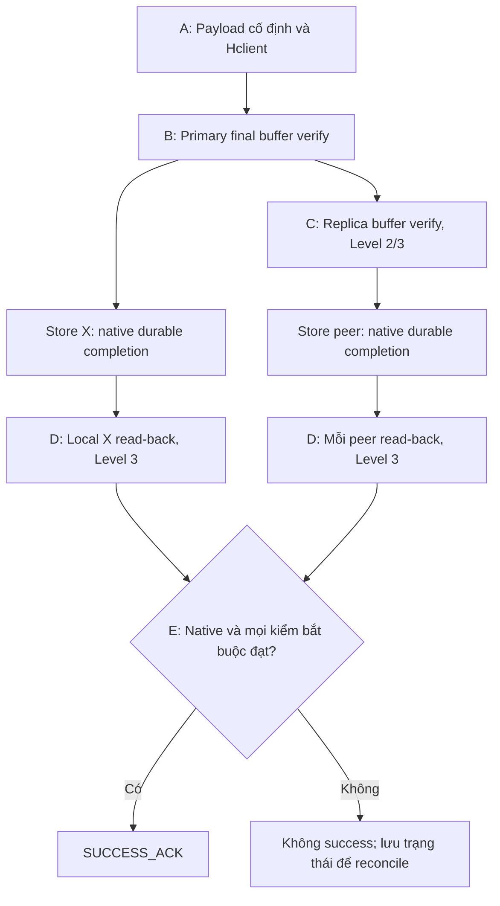

# PA1 + H0-R + H0-W Level 1, 2, 3

[Mục lục](00-README.md) · [Phase 2](04-PHASE-2-CANARY-VA-ROLLOUT.md) · [Test H0](15-TEST-H0-LEVEL-1-2-3.md)

**Nguồn chuẩn:** PA1 trong `plan(3) (1).md` và `H0_Feature_Ket_hop_PA1_va_Web_Canary (3).md` v2.1, repo main tại commit `c29c4272c2c3b69ceb1d68aac234731fe2f07f01`. Link cố định tại [S17–S18](13-NGUON-VA-DOI-CHIEU.md). H0 là thiết kế chưa triển khai; bài checksum cũ không được tính thành H0-R/H0-W PASS.

## 1. Phạm vi và thuật ngữ

| Ký hiệu | Ý nghĩa |
| --- | --- |
| X / S / Y,Z | OSD cần nâng / spare PA1 / các peer còn lại |
| P_X / B / C | Mọi PG có X trong up hoặc acting / batch PG di chuyển / tập PG primary canary ít I/O |
| M0, W0, R0, A0 | Placement baseline; CRUSH weight; override reweight; primary-affinity ban đầu |
| H0-static | Reference của corpus ổn định, gắn object/version/snapshot/range trước lượt chuyển |
| Hclient | Digest từ client/generator trước X cho từng write mới, không do X tái tạo từ buffer đang kiểm |
| SUCCESS_ACK | Kết quả ghi thành công với ngữ nghĩa durable completion đã chốt; không chỉ là tên event gửi reply |

PA1 quyết định chuyển dữ liệu và dừng/nâng X thế nào. H0-R kiểm dữ liệu nhận lại. H0-W kiểm write mới trước success. Không biến H0 thành công cụ tự sửa replica hoặc backup payload.

## 2. PA1 trước khi dừng X: bắt buộc giữ X online

| Bước | Hành động | Điều kiện qua bước |
| --- | --- | --- |
| A0 — Baseline | Lưu M0/P_X/W0/R0/A0, toàn entry upmap và QoS; kiểm soát placement automation | Không lỗi PG/quorum; biết tất cả PG và capacity từng đích |
| A1 — Spare S | Park S có kiểm soát; trước cho nhận dữ liệu, mô phỏng weight dương nhỏ và effective placement toàn cụm | Không PG ngoài kế hoạch vào S; rule/class/failure domain hợp lệ; weight nhỏ không là quota/allowlist |
| A2 — Primary | Nếu cần giảm client workload, hạ affinity X/S và kiểm actual primary | Peers còn SLO; thay vai trò không thay việc tạo replica trên S |
| A3 — PG X→S | X vẫn chạy; dùng upmap từng batch B, chờ copy hoàn tất | PG trong batch active+clean, up=acting, S là replica hợp lệ; membership ngoài scope không lệch |
| A4 — DR_READY | Đối chiếu toàn P_X, không chỉ batch cuối | X không còn trong up/acting; mọi P_X đủ replica trên S/peers; QoS đạt; `ok-to-stop X` tươi PASS |
| A5 — Nâng X | Giữ X in, CRUSH weight gốc, mapping giữ tải trên S; bảo vệ restart theo MOP | Target artifact/device đúng, store mở/replay sạch, không PG ngoài canary vào X |

Không đưa X về CRUSH weight 0 để thay cho luồng upmap này. Không có biến thể dừng X sớm để giữ store trong scope. X có thể cleanup PG đã rời; không coi store cũ trên X là backup current hoặc cam kết return chỉ copy delta.

Nếu PG đã có entry upmap, tính lại toàn entry đúng checkpoint; không append/xóa mù cặp mới và làm mất pin có trước. Hạ weight S chỉ giảm khả năng được chọn tự nhiên; phải kiểm map ở từng bước trung gian, nhất là khi topology/OSD state đổi.

Khi chuyển S từ weight 0 sang dương, so raw CRUSH và effective placement của **toàn bộ PG**, không chỉ PG đã thấy S. Nếu có raw-map thay đổi ngoài scope, chuẩn bị pin/entry đầy đủ theo baseline và xác minh chúng còn hợp lệ; không coi thao tác weight và upmap là một transaction nguyên tử. Không chứng minh được trạng thái trung gian an toàn thì HOLD, chọn lại S/weight/procedure. Balancer off không tự ngăn các thay đổi này.

Với replicated size=3/min_size=2 và failure domain phù hợp, mục tiêu trước stop là ba replica hợp lệ trên S/Y/Z. Khả năng chịu thêm một OSD failure phải được diễn tập đúng topology trong lab; không suy bảo đảm chịu host/rack failure hay mọi pool EC từ ví dụ đó. Không hạ min_size để vượt gate.

## 3. Return gate H0-R: chung cho cả ba level

1. Chốt C và corpus ổn định, H0-static đúng object/version/range, nguồn tham chiếu và writer được kiểm soát.
2. Trả C về X, chờ recovery/backfill hội tụ; xác nhận actual up/acting và đủ replica.
3. Yêu cầu **một lần deep-scrub mới sau recovery**, chờ kết quả hoàn tất của đúng lần đó; lưu epoch, thời điểm, participants và lỗi.
4. Local verifier đọc đúng bản trên X, đối chiếu H0-static cùng version/range; lưu byte coverage và đường đọc.
5. Chỉ cấp `RETURN_VERIFIED` cho scope C đã đủ bằng chứng. Thiếu local-X evidence, reference stale hoặc mismatch thì không mở primary workload.

C là scope H0 của run, không tự bằng toàn P_X. Sau C PASS, trả phần P_X còn lại theo batch và gate native; PG mới đưa vào H0 phải chuẩn bị corpus/capability rồi lặp return/write gates. Chỉ đóng X khi toàn P_X đạt mapping cuối dự kiến và state tạm có disposition. Báo cáo tách rõ PG/corpus có H0 evidence và phần chỉ có native tests.

`active+clean`, lệnh deep-scrub đã được nhận, hoặc GET đọc đúng qua peer/cache riêng lẻ đều không đủ. Deep-scrub theo PG có các peer tham gia, không phải phép quét riêng ổ X. H0-R local verifier vẫn cần được phát triển/nghiệm thu.

Nếu X trở thành primary sớm do map/failover, controller vẫn đóng workload harness. Affinity không phải fence cứng. Chặn writer ngoài harness cần admission gate trong OSD; prototype dùng pool/corpus kiểm soát được writer, không chặn nhầm peering/recovery.

## 4. H0-W: chọn đúng một level cho mỗi run

Hclient được tạo từ payload cố định trước X, gắn `run_id`, `policy_revision`, object/namespace, request/op/generation, offset/length và representation. Không dùng H0-static cũ cho mọi write mới; không lấy hash toàn S3 object để đối chiếu một RADOS tail/extent khác lớp byte.

Prototype dùng `Hclient = SHA256(payload)`; reference phải bất biến và có nguồn/kênh truyền đáng tin. Bytes được hash ở B/C phải chính là bytes sẽ submit; nếu còn copy/serialize/transform thì implementation phải giữ binding hoặc kiểm thêm tại ranh giới đó. H0 không bảo vệ lỗi làm sai cả payload, reference và verifier, cũng không biết ứng dụng đã tạo sai nội dung trước A.

| Thuộc tính | Level 1 | Level 2 | Level 3 |
| --- | --- | --- | --- |
| Policy | `L1_PRIMARY_BUFFER` | `L2_REPLICA_BUFFER` | `L3_PERSISTED_READBACK` |
| Điểm kiểm | Primary final logical buffer, trước submit local và replication | Level 1 + buffer từng replica trước submit store | Level 2 + local read-back sau durable commit tại X và mọi replica bắt buộc |
| Success gate | Native durable + primary verify | Native durable + primary + mọi replica verify bắt buộc | Native durable + toàn bộ buffer verify + mọi read-back bắt buộc |
| Thành phần | Generator/client + primary verifier + gate | Thêm reference/result protocol và verifier ở peer | Thêm reader/store integration, ordering và trạng thái sau commit |
| Chưa chứng minh | Replica buffer và bytes lưu sau điểm kiểm | Bytes trong store sau buffer check | Không hỏng sau ACK; nội dung ứng dụng đúng trước khi tạo Hclient |
| Chi phí cần đo | Hash primary, gate wait | Thêm hash/metadata/wait tại peer | Thêm read I/O/hash, in-flight memory, wait và reconcile sau commit |

Chi phí tương đối trên là kỳ vọng thiết kế, chưa là số đo. Level 2/3 yêu cầu các peer có build/protocol H0 phù hợp dù version nền Ceph của peer có thể còn cũ; nâng một mình X lên vanilla 16.2.15 không đủ.

## 5. Năm điểm H0 trên đường ghi

| Điểm | Vị trí và hành động | Level |
| --- | --- | --- |
| A — Reference | Generator cố định payload, tính Hclient trước X, gắn identity/policy | 1/2/3 |
| B — Primary | Sau xử lý cần bảo vệ, kiểm đúng final bytes sẽ submit local/fan-out | 1/2/3 |
| C — Replica | Từng peer kiểm buffer sắp ghi với Hclient **gốc** | 2/3 |
| D — Read-back | Sau durable completion, đọc local đúng version/range, kiểm đường store/cache | 3 |
| E — Success | Primary tổng hợp native completion + tất cả evidence mà level yêu cầu | 1/2/3 |

Mismatch tại B/C phải chặn nhánh chưa submit tương ứng; không chỉ log warning rồi tiếp tục. Nhánh khác có thể đã ghi, nhất là ở Level 2; phải lưu commit state thực.

Hình minh họa đường thành công Level 3; Level 1 không có C/D, Level 2 không có D. Mọi mức giữ native completion và E; các nhánh local/replica không bắt buộc commit theo thứ tự cố định.

## 6. Hợp đồng success và giới hạn Level 3

Với write w, R(w) là tập replica bắt buộc đã chốt cho run:

- **L1:** success ⇒ NativeDurableOK ∧ PrimaryBufferOK.
- **L2:** success ⇒ điều kiện L1 ∧ ReplicaBufferOK với mọi r thuộc R(w).
- **L3:** success ⇒ điều kiện L2 ∧ PersistedReadbackOK trên X và mọi r thuộc R(w).

Không dùng min_size làm số hash tối thiểu tùy tiện. Prototype dùng PG khỏe, đủ replicas và tập verifier đầy đủ. Peer thiếu capability thì báo lỗi, không âm thầm hạ level.

Level 3 cần reader chứng minh dữ liệu quan sát từ store sau commit, không chỉ trả lại buffer/cache cũ. `PUT` thành công rồi `GET` từ script không phải pre-success read-back. Chỉ đọc lại X cũng chưa đủ Level 3 đầy đủ.

Kết luận persisted-readback vẫn phụ thuộc semantics durable completion, cache/flush và phần cứng thực; nó không chứng minh mọi cell vật lý đã bền trước mất điện hoặc dữ liệu không thể hỏng về sau. Các giới hạn này phải đi cùng kết quả nghiệm thu reader.

Prototype ưu tiên object mới, một full-object write, không overwrite/delete trong cửa sổ verify; operation ngoài profile phải được báo không hỗ trợ. RBD/RGW adapter, EC, partial/append/multi-op cần contract riêng trước khi mở coverage.

## 7. Khi lỗi, timeout, retry hoặc đổi role

| Tình huống | Hành vi bắt buộc theo thiết kế |
| --- | --- |
| Thiếu/sai reference hoặc policy | Không bypass native-only cho write thuộc scope |
| Peer thiếu capability / read-back chưa chứng minh | `CAPABILITY_MISSING` / `READBACK_UNSUPPORTED`; không nhận run vượt năng lực |
| Mismatch | Không success; lưu stage, OSD, request, digest và commit status |
| Commit rồi verify chưa xong | `COMMITTED_UNVERIFIED`; chặn success không có nghĩa write chưa tồn tại hoặc đã rollback |
| Timeout/connection loss | Có thể client chỉ thấy timeout; reconcile trạng thái, không hứa luôn trả lỗi đầy đủ |
| Retry/duplicate | Không trả success chỉ vì PG log cho biết native đã commit; khôi phục/kiểm lại verification đúng policy |
| Primary/acting set/epoch đổi | Reconcile capability và evidence; không dùng kết quả peer/interval cũ cho bản mới |
| Đổi level | Đóng admission, xử lý write đang dở, tạo run/policy revision mới; không tự giảm vì chậm |

Gate success không tự chặn mọi read thấy dữ liệu đã commit nhưng chưa verified; muốn bảo đảm visibility cần thiết kế riêng. H0 không tự rollback write, chọn source repair hay khôi phục payload từ hash. Các nhãn trạng thái ở đây là schema thiết kế, không là errno Ceph có sẵn.

## 8. Liên kết ba phase và gate dự án

| Phase | Công việc PA1/H0 | Gate / test |
| --- | --- | --- |
| Trước | Chốt X/S/P_X/C; H0-static và Hclient; level; builds/capability từng OSD; test lỗi và recovery trên lab | G0–G3 + H0-G0; EXT-PA1, R01–R03/W01–W10 theo level |
| Đang nâng | X→S khi X online, DR_READY rồi nâng; C→X, scrub mới/local verify; arm level rồi primary workload | G5 thêm DR_READY; H0-GR; H0-GW; G6/G7 và P01 |
| Sau | Corpus đúng, không write committed-unverified chưa xử lý; state PA1 được hoàn nguyên đúng ownership; giữ evidence theo level | G8/G9 + H0-GC; các regression H0 cần chạy lại; P-06 |

Lặp return/capability/success gate cho PG/batch mới trong scope H0; không dùng PASS một C cho toàn X. Sau return không mặc định S còn giữ bản mới nhất. Khi lỗi, giữ workload ở serving set còn hợp lệ theo map và dữ liệu hiện tại, không rollback placement mù.

Web/controller chỉ chọn level, scope, budget, mở workload và thu bằng chứng. Việc chặn success nằm trong client/OSD protocol đã implement; đóng tab web không được làm write đã nhận bỏ gate. Nếu mới có UI thì ghi **chưa triển khai**, không ghi level đó PASS.
