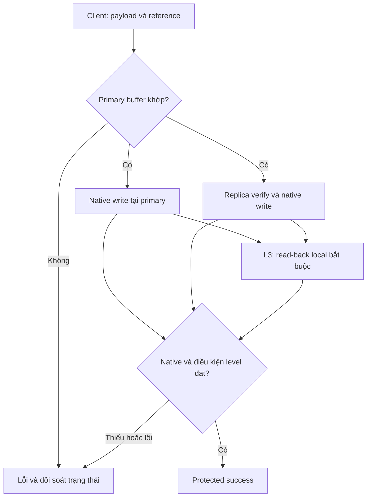
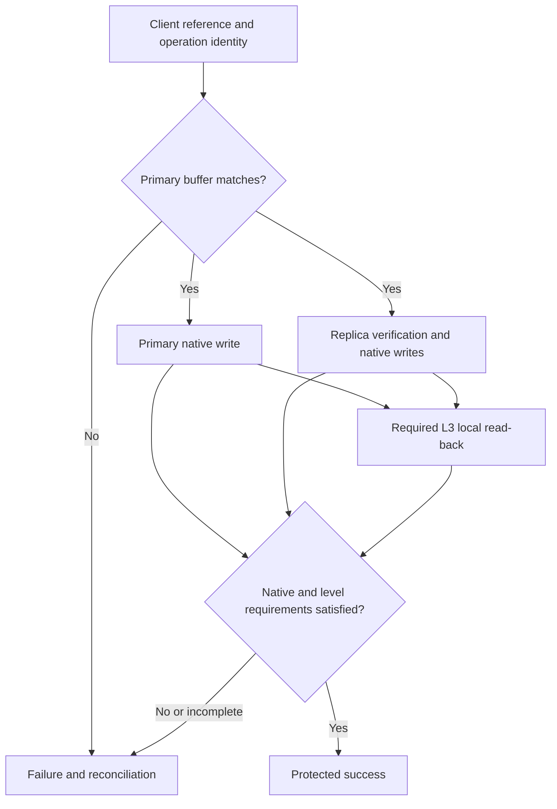
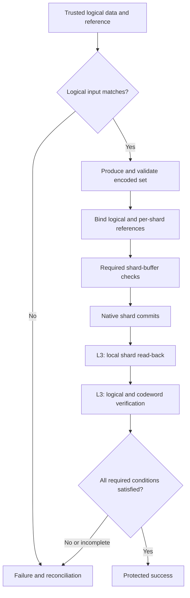

# H0 cho Ceph — Hiện trạng, cơ sở đề xuất và thiết kế kiểm chứng toàn vẹn dữ liệu

**Phiên bản tài liệu:** 3.0 — bản đề xuất bằng tiếng Việt**Ngày:** 02/10/2026**Trạng thái:** Thiết kế nghiên cứu; chưa triển khai và chưa nghiệm thu production**Phạm vi:** Ghi/đọc của client, replicated pool, erasure-coded pool, recovery/backfill, PA1, điều khiển chính sách và kiểm chứng giá trị của từng level.

> H0 là tên của feature đề xuất trong dự án. Các level, trạng thái, receipt và cấu hình H0 trong tài liệu này chưa phải tính năng hoặc API có sẵn của Ceph.

**Nguồn thiết kế nền:** tài liệu H0 v2.1 cùng tên trong repository của dự án. Phiên làm việc này không mở được bản đính kèm mới để xác nhận hai bản giống nhau hoàn toàn.

---

## 1. Câu hỏi cần trả lời trước khi xây dựng H0

H0 chỉ đáng phát triển khi giải quyết được một vấn đề có căn cứ.

Trình tự lập luận cần là:

1. Hệ thống và khách hàng đang có nhu cầu gì?
2. Ceph hiện tại đã đáp ứng nhu cầu đó đến đâu?
3. Vẫn còn khoảng trống nào về khả năng phát hiện, thời điểm phát hiện hoặc bằng chứng kiểm chứng?
4. Khoảng trống đó có ảnh hưởng đáng kể hay không?
5. Có thể giải quyết bằng cấu hình, công cụ hoặc cơ chế sẵn có không?
6. Nếu cần bổ sung, H0 giải quyết phần nào?
7. Lợi ích thu được có xứng đáng với chi phí và rủi ro phát sinh không?

Việc có thể thiết kế ba level không tự chứng minh rằng cả ba đều cần thiết.

Tương tự, việc tạo được một lỗi bằng fault injection chỉ chứng minh cơ chế kiểm có thể phát hiện lỗi đó trong điều kiện thử nghiệm. Nó chưa chứng minh lỗi thường xuyên xuất hiện ở khách hàng hoặc đủ quan trọng để triển khai rộng.

### 1.1. Không nhất thiết phải chờ xảy ra mất dữ liệu

Một feature phòng ngừa có thể có cơ sở trước khi hệ thống của mình gặp sự cố.

Cơ sở đó có thể đến từ:

- Sự cố đã quan sát trong chính hệ thống.
- Sự cố được công bố ở hệ thống tương tự, có cơ chế lỗi liên quan.
- Phân tích mã nguồn xác định được một đường lỗi và giới hạn của cơ chế hiện có.
- Yêu cầu cụ thể của khách hàng về thời điểm hoặc phạm vi kiểm chứng.
- Khó khăn vận hành có thể đo được, chẳng hạn thiếu bằng chứng xác định bản dữ liệu nào đã được kiểm.

Tuy nhiên, cần ghi rõ nguồn nào đang được sử dụng. Không được biến một nguy cơ có thể xảy ra thành sự cố đã xảy ra tại cụm.

### 1.2. Câu hỏi nghiên cứu của H0

> Đối với một số workload và mô hình lỗi xác định, việc mang một tham chiếu dữ liệu đáng tin từ phía trước đường xử lý vào các điểm kiểm của Ceph có cung cấp giá trị kiểm chứng bổ sung, với chi phí vận hành chấp nhận được hay không?

Đây là câu hỏi cần được kiểm chứng. Chưa phải kết luận rằng mọi workload cần H0.

---

## 2. Hiện trạng của dự án và mức độ bằng chứng

Thông tin dưới đây là bối cảnh đã được cung cấp trong dự án, không phải kết quả kiểm tra trực tiếp trạng thái cụm tại thời điểm viết tài liệu.

| Nội dung                         | Hiện trạng đã biết                                                                                                                           | Ý nghĩa đối với H0                                                    |
| --------------------------------- | ------------------------------------------------------------------------------------------------------------------------------------------------- | -------------------------------------------------------------------------- |
| Quy mô production mục tiêu     | Khoảng 1.600 OSD và 24 PB dữ liệu theo thông tin đã cung cấp                                                                              | Mọi chi phí bổ sung phải được đánh giá ở quy mô lớn           |
| Dịch vụ                         | RGW và RBD                                                                                                                                       | Cần hợp đồng dữ liệu khác nhau cho object và block                 |
| Dự án nâng cấp                | Có PA1, canary và các gate vận hành                                                                                                          | Có môi trường ban đầu để kiểm chứng H0 trong phạm vi nhỏ       |
| Kiểm thử checksum trước đây | Dùng để kiểm tra integrity của dữ liệu thử nghiệm                                                                                        | Không được coi là implementation của H0-W                            |
| H0                                | Đang ở mức ý tưởng/đặc tả                                                                                                                | Chưa có bằng chứng rằng H0 thực thi đúng tại các điểm kiểm    |
| Sự cố thuộc mô hình H0       | Chưa có bằng chứng được cung cấp trong trao đổi rằng cụm đã gặp đúng lỗi “payload sai nhưng checksum nội bộ vẫn hợp lệ” | Không được lấy đây làm sự cố thực tế của cụm                 |
| Chi phí L1/L2/L3                 | Chưa có số đo được cung cấp                                                                                                               | Chưa thể tuyên bố overhead thấp hoặc lợi ích luôn vượt chi phí |
| Nhu cầu khách hàng             | Đang được đề xuất và phân tích                                                                                                          | Cần xác định workload và yêu cầu kiểm chứng cụ thể              |

**Quy mô lớn làm tăng tầm quan trọng của việc đánh giá rủi ro và chi phí; bản thân quy mô không chứng minh H0 là cần thiết.**

### 2.1. Những bằng chứng còn thiếu

Trước khi kết luận nên đưa H0 vào production, cần bổ sung ít nhất:

- Một hoặc nhiều pain point cụ thể.
- Phạm vi cơ chế native hiện có trên đúng phiên bản và đường I/O.
- Bằng chứng H0 cung cấp thêm điều gì.
- Workload có nhu cầu sử dụng kết quả kiểm bổ sung.
- Hành vi đúng khi lỗi, retry và failover.
- Chi phí và giới hạn vận hành của từng level.

---

## 3. Ceph đã bảo vệ dữ liệu bằng những gì?

Ceph đã có nhiều lớp bảo vệ. H0 phải được đánh giá trên nền các lớp này.

BlueStore tạo checksum cho dữ liệu và metadata được lưu. Ceph còn có scrub/deep-scrub để kiểm tra tính nhất quán và dữ liệu trong PG. Vì vậy, không thể bắt đầu đề xuất bằng nhận định “Ceph chưa có checksum”. [S1][S2]

| Cơ chế                   | Vai trò hiện có                                        | Điều cần đối chiếu khi đánh giá H0                                           |
| -------------------------- | --------------------------------------------------------- | ------------------------------------------------------------------------------------- |
| Bảo vệ ở client/gateway | Phụ thuộc API, client và cách cấu hình              | Đã có expected checksum nào từ client và được kiểm ở đâu?                |
| Messenger                  | Bảo vệ dữ liệu truyền theo protocol/mode             | Phạm vi bảo vệ kết thúc ở ranh giới nào?                                      |
| PG log và ordering        | Theo dõi, sắp xếp và phục hồi lịch sử thao tác   | Không được tự thay thế bằng trạng thái H0 riêng                             |
| Replication                | Duy trì các bản dữ liệu theo cơ chế native         | So sánh bản sao có trả lời được câu hỏi về nội dung ban đầu hay không? |
| Erasure coding             | Tạo khả năng khôi phục từ các shard phù hợp      | Phải phân biệt đúng logical data và từng shard                                 |
| BlueStore checksum         | Kiểm tra nội dung theo đơn vị lưu trữ của backend | Expected checksum được tạo ở thời điểm nào so với lỗi?                     |
| Scrub/deep-scrub           | Kiểm tra tính nhất quán và nội dung                 | Phát hiện tại thời điểm nào; đã đáp ứng yêu cầu vận hành chưa?       |
| Recovery/repair            | Khôi phục trạng thái dữ liệu theo cơ chế Ceph     | H0 bổ sung bằng chứng gì cho nguồn và đích?                                   |

Messenger v2 có CRC mode và secure mode với đặc tính khác nhau. Cần xác nhận mode thực tế; bảo vệ transport không tự đồng nghĩa với một tham chiếu nội dung từ client được giữ xuyên suốt mọi bước xử lý sau đó. [S3]

### 3.1. Ba dạng giá trị có thể bổ sung

Một đề xuất H0 có thể có giá trị theo ba hướng:

1. **Mở rộng phạm vi phát hiện:** kiểm được một ranh giới mà phép kiểm hiện có chưa chứng minh bao phủ.
2. **Rút ngắn thời điểm phát hiện:** phát hiện trước khi xác nhận thành công thay vì tại một lần đọc hoặc scrub sau đó.
3. **Bổ sung bằng chứng:** xác định rõ dữ liệu nào, phiên bản nào và OSD nào đã được đối chiếu với tham chiếu nào.

Ba giá trị này phải được phân biệt trong báo cáo.

Nếu native đã phát hiện cùng lỗi tại cùng thời điểm và cùng phạm vi, không được tính toàn bộ kết quả đó thành lợi ích mới của H0.

---

## 4. Bằng chứng thực tế và giới hạn áp dụng

### 4.1. Silent data corruption đã được ghi nhận ở hạ tầng lớn

Meta công bố một trường hợp CPU tính sai trong quá trình xử lý dữ liệu, dẫn đến tính sai kích thước, bỏ qua giải nén và thiếu dữ liệu ở tầng ứng dụng. Việc điều tra phải thu hẹp từ workload phân tán xuống lỗi trên một core và một số đầu vào cụ thể. [S4]

Bằng chứng này cho thấy:

- Dữ liệu có thể sai trong quá trình xử lý.
- Không phải mọi sai lệch đều xuất phát từ bit rot trên ổ đĩa.
- Điều tra lỗi âm thầm có thể phức tạp.

**Giới hạn:** đây không phải bằng chứng rằng Ceph trong dự án đã gặp cùng lỗi. Nếu dữ liệu đã sai trước thời điểm tạo `Hclient`, H0 theo thiết kế hiện tại cũng có thể không phát hiện.

### 4.2. Ceph từng có lỗi gây hỏng dữ liệu trong một đường chuyển đổi cụ thể

Release notes Pacific ghi nhận lỗi chuyển đổi định dạng OMAP khi nâng từ phiên bản trước Pacific, có thể được kích hoạt qua chức năng repair/quick-fix. Tài liệu v16.2.7 ghi nhận lỗi này đã được sửa. [S5]

Bằng chứng này cho thấy thay đổi phần mềm và thao tác bảo trì cần được kiểm chứng kỹ.

**Giới hạn:** đây là lỗi liên quan đến metadata/đường chuyển đổi. Không thể tự kết luận H0-W kiểm payload của write mới sẽ phát hiện hoặc ngăn được lỗi đó.

### 4.3. Cách dùng bằng chứng đúng

Mỗi sự cố được dùng để biện minh cho H0 cần được đối chiếu theo bảng sau:

| Câu hỏi                                | Nội dung phải xác định                                          |
| ---------------------------------------- | -------------------------------------------------------------------- |
| Lỗi xảy ra ở đâu?                   | Client, gateway, primary, replica, store, metadata hay recovery      |
| Lỗi xảy ra trước hay sau reference?  | Quyết định H0 còn tham chiếu đúng để so hay không          |
| Native đã phát hiện chưa?           | Nếu có, phát hiện khi nào?                                      |
| H0 nào liên quan?                      | H0-R, L1, L2, L3 hoặc H0-READ                                       |
| H0 có thực sự bao phủ không?        | Phải dựa trên đường thực thi hoặc thử nghiệm               |
| Tác động với khách hàng là gì?   | Sai dữ liệu, phát hiện muộn, gián đoạn hoặc khó điều tra |
| Có giải pháp đơn giản hơn không? | Sửa bug, cấu hình, native checksum, scrub, kiểm phía ứng dụng |

Một lỗi có thật nhưng nằm ngoài phạm vi H0 không phải bằng chứng trực tiếp cho hiệu quả của H0.

---

## 5. Các pain point cần xác nhận

### 5.1. P1 — Thiếu bằng chứng đối chiếu với nội dung dự định ghi

**Nhu cầu giả định:** với một số write quan trọng, khách hàng muốn đối chiếu dữ liệu tại các ranh giới xử lý với tham chiếu được tạo từ đầu vào ban đầu.

**Câu hỏi hiện trạng:**

- Client hiện có gửi expected checksum không?
- Gateway hoặc OSD đã kiểm nó ở đâu?
- Tham chiếu có được giữ qua các bước xử lý tiếp theo không?
- Có thể truy vết đúng object/version/range không?

**H0 có thể đóng góp:** L1 và L2, nếu chứng minh được ranh giới kiểm bổ sung có ích.

**Điều chưa được phép kết luận:** mọi luồng RGW/RBD hiện tại đều thiếu bảo vệ tương đương.

### 5.2. P2 — Cần phát hiện trước khi hoàn tất một thao tác quan trọng

**Nhu cầu giả định:** một workload chỉ chấp nhận hoàn tất khi có thêm bằng chứng kiểm dữ liệu sau commit.

**H0 có thể đóng góp:** L3.

Đây là yêu cầu về **thời điểm và phạm vi kiểm chứng**. Nó không mặc định có nghĩa Ceph native báo durable completion sai.

Cần xác nhận khách hàng có thực sự cần thời điểm kiểm này và chấp nhận chi phí của nó hay không.

### 5.3. P3 — Cần bằng chứng về đúng bản dữ liệu sau di chuyển

**Nhu cầu gần với dự án PA1:** sau recovery/backfill, cần chứng minh bản local trên OSD đích đã được kiểm với đúng reference và generation.

**H0 có thể đóng góp:** H0-R.

Nếu nhu cầu chỉ là chủ động chạy deep-scrub sau recovery, có thể giải quyết bằng điều phối native. Phần H0 bổ sung chỉ có ý nghĩa khi cần tham chiếu và bằng chứng local cụ thể vượt quá việc lên lịch scrub.

### 5.4. P4 — Khó xác định dữ liệu bị sai ở giai đoạn nào

**Nhu cầu giả định:** khi có mismatch, đội vận hành cần biết:

- Expected digest đến từ đâu.
- Dữ liệu đã đi qua những điểm kiểm nào.
- Primary và các peer đã quan sát gì.
- Write đã commit hay chưa.
- Client đã nhận success hay chưa.

**H0 có thể đóng góp:** receipt và trạng thái kiểm chứng gắn với operation.

Cần đối chiếu với log, trace và công cụ hiện có trước khi quyết định tạo thêm hệ thống bằng chứng riêng.

### 5.5. P5 — Cần kiểm chứng EC theo logical data và shard

**Nhu cầu giả định:** workload muốn bằng chứng rằng các shard tương ứng với đúng logical generation, và dữ liệu tái tạo khớp tham chiếu.

**H0 có thể đóng góp:** hợp đồng EC riêng của L2/L3 và H0-READ.

Đây là phần phức tạp. Việc EC tồn tại không tự tạo ra nhu cầu cho H0; cần chứng minh khoảng trống cụ thể và lợi ích thực tế.

### 5.6. Điều kiện quyết định có nên tiếp tục

| Kết quả đánh giá                                                       | Quyết định hợp lý                                             |
| --------------------------------------------------------------------------- | ------------------------------------------------------------------ |
| Native đã đáp ứng yêu cầu bằng cấu hình phù hợp                 | Ưu tiên cấu hình và vận hành native                         |
| Thiếu khả năng tổng hợp bằng chứng nhưng chưa cần sửa write path | Ưu tiên công cụ kiểm chứng/quan sát                         |
| Có khoảng trống trước primary submit                                   | Nghiên cứu L1                                                    |
| Có nhu cầu kiểm tại từng participant                                   | Nghiên cứu L2                                                    |
| Có yêu cầu read-back trước protected success                           | Nghiên cứu L3                                                    |
| Chưa xác nhận nhu cầu hoặc đường lỗi                               | Giữ ở mức nghiên cứu, chưa biện minh triển khai production |

---

## 6. Mục tiêu và giới hạn của H0

### 6.1. Mục tiêu

H0 đề xuất bổ sung:

- Reference từ trước ranh giới cần bảo vệ.
- Kiểm chứng đúng nội dung, operation, version và range.
- Ba mức kiểm trên đường ghi.
- Điều kiện success kết hợp native completion với kết quả H0.
- Trạng thái có thể phục hồi khi retry, crash hoặc failover.
- Reference lưu lâu dài cho read/recovery nếu workload yêu cầu.
- Chính sách theo dữ liệu hoặc workload.

### 6.2. Những gì H0 không tự cung cấp

H0 không tự:

- Tạo thêm bản backup.
- Tăng số replica hoặc parity.
- Khôi phục payload từ checksum.
- Sửa mọi loại corruption.
- Biết ứng dụng đã tạo sai dữ liệu trước reference.
- Ngăn mọi lỗi phát sinh sau lần kiểm.
- Rollback một write đã commit.
- Bảo vệ metadata chưa được đưa vào phạm vi.
- Chống lại một hệ thống có thể giả mạo cả dữ liệu, reference và verifier.

Tắt H0 phải giữ nguyên các cam kết và bảo vệ native của dịch vụ thông thường.

---

## 7. Thuật ngữ và các thành phần kiểm chứng

| Thuật ngữ         | Ý nghĩa                                                            |
| ------------------- | -------------------------------------------------------------------- |
| `P`               | Primary hiện hành của PG                                          |
| `R(w)`            | Tập replica bắt buộc của replicated write`w`                   |
| `S(w)`            | Tập shard participant bắt buộc của EC write`w`                 |
| `Hclient`         | Digest của payload dự định ghi, được tạo trước primary     |
| `Hlogical`        | Digest của logical object/range/stripe generation                   |
| `Hshard[j]`       | Digest dự kiến của shard/range có chỉ số`j`                  |
| `H0-static`       | Reference của corpus hoặc generation ổn định trước di chuyển |
| `NativeDurableOK` | Điều kiện hoàn tất ghi bền native của operation đã đạt    |
| `SUCCESS_ACK`     | Thành công tại ranh giới API được công bố                   |
| `H0-W`            | Kiểm đường ghi theo L1/L2/L3                                     |
| `H0-R`            | Kiểm dữ liệu sau recovery/backfill                                |
| `H0-READ`         | Kiểm read thông thường với reference được lưu               |
| Manifest            | Metadata gắn dữ liệu, version, range và expected digest          |
| Receipt             | Bằng chứng kiểm của một operation/attempt                       |
| Publication         | Đưa một generation vào trạng thái được phép phục vụ read |

H0-R và H0-READ là các chức năng riêng, không phải level thứ tư hoặc thứ năm.

Khái niệm “H1 kiểm khi replicate” được gom vào **H0-W Level 2** để thống nhất thuật ngữ.

---

## 8. Reference và danh tính operation

### 8.1. Tạo reference

Ví dụ đơn giản:

```text
Hclient = SHA256(payload_dự_định_ghi)
```

Payload phải được cố định từ lúc tạo reference đến lúc gửi.

Primary không được lấy buffer đang cần kiểm rồi tự tính lại expected digest để làm kết quả khớp.

### 8.2. Các trường cần ràng buộc

| Nhóm            | Trường cần có                                                  |
| ---------------- | ------------------------------------------------------------------ |
| Chính sách     | Policy ID, revision, level, operation profile                      |
| Đích dữ liệu | Cluster, tenant, pool, namespace, object hoặc image               |
| Mutation         | Loại thao tác, offset, length, kích thước kết quả nếu cần |
| Version          | Generation trước/sau, snapshot context                           |
| Request          | Logical request ID, attempt ID, sub-op index                       |
| Representation   | Lớp byte được hash                                             |
| Reference        | Algorithm, expected digest, nguồn reference                       |
| Execution        | PG interval và participant thực tế                              |
| EC               | Profile, stripe, shard index, logical length, padding              |
| Completion       | Ranh giới success và chính sách visibility                     |

Một digest khớp nhưng gắn nhầm object hoặc generation không phải PASS.

### 8.3. Bảo vệ descriptor

Digest của payload không tự xác thực nguồn gửi.

Descriptor chứa target, operation, version và reference cần được bảo vệ tính toàn vẹn và được kiểm quyền.

Thiết kế cần phân biệt:

- Digest để phát hiện thay đổi.
- Xác thực nguồn reference.
- Quyền yêu cầu hoặc thay đổi policy.
- Bảo vệ chống thay thế toàn bộ descriptor.

### 8.4. Cùng representation mới được so trực tiếp

Không so trực tiếp:

- Hash toàn S3 object với hash một RADOS tail.
- Hash file trong máy ảo với hash một RBD extent.
- Hash logical stripe với hash một EC shard.
- Hash plaintext với hash bytes nén/mã hóa trên media.

Mỗi phép biến đổi phải có hợp đồng ánh xạ reference riêng.

### 8.5. Binding giữa buffer đã kiểm và buffer được submit

Implementation phải giải quyết:

- Buffer bị tái sử dụng.
- Client sửa buffer sau khi hash.
- Copy/serialize sau verifier.
- Merge/split request.
- Concurrent overwrite.
- Chuyển ownership của vùng nhớ.

Hash một bản sao đúng rồi ghi một bản sao khác bị sai không đáp ứng hợp đồng.

### 8.6. Thời gian lưu reference

| Mục đích                        | Thời gian lưu cần thiết                         |
| ---------------------------------- | --------------------------------------------------- |
| Hoàn tất write và xử lý retry | Đủ để giải quyết operation và retry hợp lệ |
| Kiểm read/recovery về sau        | Theo vòng đời version/range được bảo vệ     |
| Điều tra mismatch                | Theo chính sách giữ bằng chứng sự cố         |

Chỉ lưu reference trong request đang chạy thì chưa đủ để tuyên bố hỗ trợ H0-READ lâu dài.

### 8.7. Tính nhất quán giữa dữ liệu và reference

Nếu data và reference được cập nhật bằng hai thao tác không liên kết, có thể xuất hiện:

- Data mới đi cùng hash cũ.
- Hash mới xuất hiện trước data.
- Crash chỉ giữ lại một phần.
- Retry ghi đè reference của generation khác.

Trong phạm vi transaction được hỗ trợ, cần ràng buộc mutation với generation/reference.

Với nhiều RADOS object, cần một cơ chế publication có thể phục hồi. Không giả định có transaction nguyên tử tùy ý trên mọi object.

### 8.8. Dữ liệu cũ chưa có reference

Khi bật H0, dữ liệu có thể được phân loại:

- Có reference gốc và đã kiểm.
- Có baseline được tạo tại một thời điểm xác định.
- Chưa có reference.
- Đang kiểm.
- Đã phát hiện mismatch.

Baseline được tạo hôm nay chỉ chứng minh quan sát hôm nay. Nó không tự chứng minh dữ liệu luôn đúng từ lúc ghi ban đầu.

---

## 9. Ba level và điều kiện trả success

Đặt:

- `C(w)`: hợp đồng reference, identity, policy, capability và trạng thái phục hồi hợp lệ.
- `N(w)`: native durable completion.
- `B(w)`: primary buffer match.
- `V(r,w)`: replica buffer match.
- `D(o,w)`: read-back local hợp lệ và match.

Với replicated write:

```text
L1:
C(w) AND N(w) AND B(w)

L2:
C(w) AND N(w) AND B(w)
AND V(r,w) với mọi replica bắt buộc

L3:
C(w) AND N(w) AND B(w)
AND V(r,w) với mọi replica bắt buộc
AND D(o,w) tại primary và mọi replica bắt buộc
```

| Nội dung                            | L1         | L2         | L3         |
| ------------------------------------ | ---------- | ---------- | ---------- |
| Reference từ trước primary        | Có        | Có        | Có        |
| Kiểm final buffer primary           | Có        | Có        | Có        |
| Kiểm buffer các replica bắt buộc | Không     | Có        | Có        |
| Native durable completion            | Bắt buộc | Bắt buộc | Bắt buộc |
| Read-back local sau commit           | Không     | Không     | Có        |
| Xử lý retry/failover               | Bắt buộc | Bắt buộc | Bắt buộc |
| Bảo đảm không hỏng sau ACK      | Không     | Không     | Không     |

Các nhánh có thể tiến triển đồng thời. Không giả định primary luôn commit trước hoặc sau mọi replica.

---

## 10. Luồng ghi replicated từ client đến completion

### 10.1. Client hoặc adapter chuẩn bị

1. Xác định chính xác mutation.
2. Cố định payload.
3. Tạo hoặc xác minh reference.
4. Gắn object, generation, offset, length và request identity.
5. Gắn policy.
6. Gửi operation.

Nếu reference được tạo tại gateway, phải công bố rằng ranh giới bảo vệ bắt đầu tại đó.

### 10.2. Primary tiếp nhận

1. Kiểm quyền.
2. Kiểm descriptor và reference.
3. Kiểm operation profile có được hỗ trợ không.
4. Xác định ordering và generation.
5. Xác định participant bắt buộc.
6. Kiểm capability.
7. Tạo trạng thái operation có thể phục hồi.

Các cơ chế ordering và recovery native vẫn phải được giữ.

### 10.3. Primary kiểm final buffer

Primary hash đúng logical bytes thuộc operation và so với expected digest.

Nếu mismatch được phát hiện trước mọi mutation:

- Không submit mutation được bảo vệ.
- Lưu evidence.
- Trả lỗi theo hợp đồng API nếu kết nối còn hoạt động.

Nếu có xử lý/copy thêm sau verifier, phải xác định phần đó còn nằm trong hợp đồng hay không.

### 10.4. Ghi local và replication

Sau khi primary verification đạt:

- Submit native write tại primary.
- Gửi operation đến replica.
- Truyền reference gốc cùng identity tương ứng.
- Theo dõi native completion và H0 completion riêng.

Không lấy một digest mới từ payload primary sắp gửi rồi coi đó là reference gốc.

### 10.5. Replica kiểm ở L2/L3

Mỗi replica:

1. Kiểm identity và policy.
2. Xác định đúng generation/range.
3. Hash buffer sắp submit.
4. So với reference gốc.
5. Chặn submission của nhánh đó nếu mismatch.
6. Báo kết quả gắn với operation và participant.

Một nhánh khác có thể đã commit. Vì vậy lỗi tại một replica không đồng nghĩa toàn bộ write chưa xảy ra.

### 10.6. Native completion

Phải phân biệt:

- Nhận request.
- Apply.
- Commit local.
- Completion của participant.
- Native completion toàn operation.
- H0 verification.
- Success gửi client.

Không dùng một event log đơn lẻ để thay cho toàn bộ điều kiện hoàn tất.

### 10.7. L3 read-back

Primary và các replica bắt buộc thực hiện read-back đủ điều kiện.

Primary chỉ tổng hợp PASS khi có đầy đủ bằng chứng của đúng các bản cần kiểm.

### 10.8. Gate cuối

Chỉ trả protected success khi:

- Native completion đạt.
- Mọi check bắt buộc của level đạt.
- Evidence thuộc đúng operation/generation.
- Không còn mismatch hoặc xung đột policy chưa xử lý.
- Trạng thái cần thiết cho retry/failover được giữ bền.



L1 bỏ replica verifier. L1/L2 bỏ read-back. Mọi level giữ native completion.

---

## 11. Ý nghĩa cụ thể của từng level

### 11.1. L1 — Kiểm final buffer tại primary

**Mục tiêu:** phát hiện payload đổi sau khi tạo reference và trước điểm kiểm cuối tại primary.

Ví dụ giả định:

1. Client tạo reference cho `ABC`.
2. Xử lý tại primary làm buffer thành `AXC`.
3. L1 phát hiện mismatch.
4. Mutation được bảo vệ chưa được submit.

**Chưa chứng minh:**

- Buffer cuối tại replica.
- Nội dung sau bước kiểm primary.
- Nội dung thực tế store trả lại.
- Metadata ngoài scope.
- Toàn bộ object khi chỉ kiểm một partial write.

**Lợi ích cần chứng minh:** có thêm ranh giới kiểm có ích, với chi phí phù hợp cho workload.

### 11.2. L2 — Kiểm thêm tại các replica

**Mục tiêu:** phát hiện sai lệch trên buffer của từng replica bắt buộc trước submit store.

Ví dụ giả định:

1. Buffer primary đúng.
2. Transport hoàn tất.
3. Xử lý tại một replica làm buffer sai.
4. Replica so với reference gốc và phát hiện mismatch.
5. Không trả protected success.

**Chưa chứng minh:** dữ liệu trong store sau khi buffer đã được kiểm.

L2 cũng không tự bảo vệ một lỗi chỉ xảy ra ở local store của primary sau bước B.

**Lợi ích cần chứng minh:** thêm kiểm tại participant thực sự mang lại giá trị so với native và L1.

### 11.3. L3 — Kiểm read-back sau commit

**Mục tiêu:** kiểm nội dung quan sát được qua store sau native durable completion, trước protected success.

Ví dụ giả định:

1. Các buffer check đạt.
2. Store path làm nội dung lưu bị lệch.
3. Read-back đúng generation/range quan sát sai lệch.
4. L3 phát hiện và chặn protected success.

**Chi phí dự kiến:** thêm đọc, hash, thời gian chờ, memory giữ operation và độ phức tạp đối soát.

**Giới hạn:** kết quả chỉ có ý nghĩa dưới hợp đồng reader, cache, durability và phần cứng đã công bố.

---

## 12. Điều kiện để read-back được tính là L3

### 12.1. Các điều kiện bắt buộc

Reader phải chứng minh:

1. Operation tương ứng đã đạt native durable completion.
2. Đọc đúng object hoặc shard.
3. Đọc đúng generation.
4. Đọc đúng range.
5. So cùng representation với reference.
6. Đọc đúng participant đang được chứng nhận.
7. Không chỉ trả lại write buffer cũ.
8. Read error hoặc thiếu evidence không bị chuyển thành PASS.

Script PUT thành công rồi GET lại không phải gate L3 nằm trước success.

### 12.2. Cache và đường store

Cần xem xét:

- Client cache.
- Gateway buffer.
- BlueStore cache.
- Metadata/deferred-write path.
- Kernel/device path.
- Device cache.

Chỉ đặt một cờ “no-cache” chưa đủ chứng minh đã đi qua mọi lớp cần kiểm.

Read-back phải tích hợp đúng cơ chế transaction và đọc của backend; không được giản lược thành đọc trực tiếp một file object trên host. [S6]

### 12.3. Nội dung khẳng định được

Một kết luận L3 phù hợp là:

> Reader đã quan sát đúng logical bytes của generation được kiểm sau native durable completion, tại các participant bắt buộc, dưới các giả định cache và storage đã được nghiệm thu.

Không được suy thành bảo đảm dữ liệu không thể mất hoặc hỏng về sau.

### 12.4. Concurrent overwrite

Nếu write A commit rồi write B ghi đè trước khi A read-back, đọc B không xác minh được A.

Cần một cơ chế được hỗ trợ, chẳng hạn:

- Serialize các mutation xung đột qua cửa sổ verification.
- Giữ version để đọc.
- Dùng generation bất biến.
- Tạo đường đọc có khả năng pin đúng version.

Prototype object mới/full write giúp giảm vấn đề này. Mutable workload cần hợp đồng riêng.

---

## 13. Read thông thường và H0-READ

### 13.1. Không kế thừa vô hạn kết quả write

Write đã PASS không chứng minh read trong tương lai vẫn đúng.

H0-READ cần reference được giữ cho đúng version và range.

### 13.2. Luồng read đề xuất

1. Xác định version/generation được yêu cầu.
2. Lấy reference tương ứng.
3. Kiểm trạng thái publication nếu policy yêu cầu.
4. Đọc qua native path được hỗ trợ.
5. Giữ binding identity/version/range.
6. Hash logical bytes thực tế trả về.
7. So với reference.
8. Chỉ trả verified success khi hợp đồng read đạt.
9. Khi lỗi, giữ evidence và thực hiện quy trình xử lý.

Không lấy hash vừa tính từ dữ liệu đọc ra làm expected hash của chính lần đọc đó.

### 13.3. Kiểm full object và range

| Loại read              | Reference cần có                                                   |
| ----------------------- | -------------------------------------------------------------------- |
| Toàn object bất biến | Digest của đúng object version                                    |
| Một chunk cố định   | Digest gắn offset, length và generation                            |
| Range tùy ý           | Chunk manifest, proof phù hợp hoặc đọc đủ đơn vị reference |
| RBD extent              | Reference extent và ordering/version phù hợp                      |

Hash toàn object không tự đủ để kiểm một range nhỏ bất kỳ.

### 13.4. Streaming

Bytes đã giao cho ứng dụng không thể thu hồi chỉ bằng cách báo mismatch ở cuối.

Một hợp đồng strict cần:

- Kiểm toàn bộ trước khi giao kết quả; hoặc
- Client chưa cho ứng dụng chấp nhận dữ liệu trước khi kiểm xong; hoặc
- Chia thành các chunk kiểm độc lập với manifest đáng tin.

Phải phân biệt “chunk đã kiểm” với “toàn object đã kiểm”.

### 13.5. Cache

Read từ cache có thể được kiểm về logical content nếu reference và generation đúng.

Nó không chứng minh rằng một OSD cụ thể vừa được đọc từ backing store.

Vì vậy:

- H0-READ xác minh nội dung trả về.
- L3 xác minh quan sát sau commit tại participant.
- H0-R xác minh bản trên target recovery.

Ba loại bằng chứng không thay thế nhau.

---

## 14. Replication, recovery và lựa chọn bản đúng

### 14.1. Khi các replica không khớp

Quy trình cần:

1. Xác nhận reference đúng generation.
2. Xác định copy nào thực sự được đọc.
3. Xác định các copy hợp lệ theo lịch sử native.
4. So các ứng viên cùng generation với reference.
5. Chọn hướng xử lý bằng native recovery/repair phù hợp.
6. Kiểm lại target sau xử lý.

Không mặc định:

- Primary luôn có nội dung đúng.
- Đa số replica luôn phản ánh đúng ý định ban đầu.
- Một bản khớp hash cũ là bản mới nhất hợp lệ.

### 14.2. H0 không tự sửa dữ liệu

Hash không chứa đủ dữ liệu để khôi phục payload.

Nếu không còn nguồn đúng:

- Giữ evidence.
- Xác định khả năng phục hồi từ bản khác, snapshot hoặc backup.
- Báo phạm vi chưa phục hồi được.

Không thay expected digest bằng observed digest để xóa mismatch.

### 14.3. H0-R sau recovery/backfill

1. Chốt corpus/generation/reference.
2. Thực hiện native recovery/backfill.
3. Chờ mapping và trạng thái native phù hợp.
4. Thu bằng chứng integrity mới sau movement.
5. Kiểm local đúng target.
6. Đối chiếu reference.
7. Cấp `RETURN_VERIFIED` cho phạm vi thực sự đã kiểm.

`active+clean` không phải bằng chứng rằng verifier H0 đã đọc đúng target.

### 14.4. Dữ liệu đang thay đổi

Reference trước di chuyển sẽ stale nếu dữ liệu tiếp tục thay đổi.

Cần dùng:

- Immutable version.
- Snapshot phù hợp.
- Reference versioned nhất quán với write.
- Application checkpoint được kiểm soát.

Không gọi thay đổi hợp lệ của ứng dụng là corruption.

---

## 15. H0 với erasure coding

### 15.1. Khác biệt nền tảng

Trong EC, các OSD lưu các shard khác nhau.

Với ví dụ Reed–Solomon `k=4, m=2`:

- Có bốn data shard.
- Có hai coding/parity shard.
- Mỗi shard chứa phần dữ liệu khác nhau.
- Phải có đủ shard hợp lệ của đúng generation để tái tạo.

Ceph phân biệt chunk, stripe và shard trong mô hình EC. [S7][S8]

Vì vậy:

```text
hash(logical_data) != hash(một_shard)
```

và hash của hai shard khác nhau cũng không cần bằng nhau.

### 15.2. Hai lớp reference

| Lớp              | Vai trò                                                   |
| ----------------- | ---------------------------------------------------------- |
| Logical reference | Xác định nội dung logical object/range/stripe          |
| Shard reference   | Xác định bytes dự kiến của một shard/range cụ thể |

Binding cần có:

- Object.
- Generation.
- Stripe.
- Shard index.
- Coding profile.
- Logical length.
- Padding.
- Representation.
- Policy revision.

### 15.3. Vấn đề vòng tròn ở encoder

Nếu encoder tạo shard sai rồi tính checksum cho chính shard sai đó, checksum vẫn có thể khớp.

Do đó:

> Hash lấy từ output encoder chưa được kiểm chỉ chứng minh khả năng giữ nguyên output đó ở các bước tiếp theo; nó chưa chứng minh output mã hóa đúng logical input.

Đây là điểm phải giải quyết trước khi gọi EC L2/L3 là kiểm chứng mạnh về logical content.

### 15.4. Quy trình reference EC đề xuất

Đối với full stripe hoặc full object được hỗ trợ:

1. Có logical input đáng tin và reference của nó.
2. Cố định profile, layout và generation.
3. Tạo candidate codeword bằng native path.
4. Kiểm codeword tương ứng với đúng logical input.
5. Tạo expected reference của từng shard từ kết quả đã được xác minh.
6. Gắn shard references với logical reference.
7. Truyền reference tương ứng đến từng participant.

Một phương án là re-encode độc lập logical input rồi so tất cả shard.

Phương án khác có thể kết hợp reconstruction và kiểm toàn bộ codeword.

Mức độc lập, plugin được hỗ trợ và chi phí của phép kiểm này còn phải được chứng minh. Chạy lại cùng encoder lỗi trên cùng trạng thái lỗi không tự tạo ra kiểm chứng độc lập.

### 15.5. Phải kiểm cả parity

Một tập data shard decode ra đúng logical data không chứng minh mọi parity shard đều đúng.

Nếu tuyên bố kiểm toàn codeword, cần bằng chứng cho cả data và parity bắt buộc.

### 15.6. EC Level 1

EC L1 kiểm logical write input tại primary trước encoding và submission.

Nó chưa tự chứng minh:

- Encoder đúng.
- Parity đúng.
- Shard index đúng.
- Buffer cuối tại shard participant đúng.
- Dữ liệu shard trong store đúng.

Với partial write, phải tách mutation client gửi và logical stripe kết quả.

### 15.7. EC Level 2

EC L2 mạnh theo đề xuất gồm:

1. Logical input verification.
2. Kiểm quan hệ logical input–codeword.
3. Kiểm buffer ở mọi shard participant bắt buộc.
4. Kiểm shard identity/profile/generation.
5. Native durable completion.

```text
EC_L2_SUCCESS =
    CommonContractOK
    AND NativeDurableOK
    AND LogicalInputOK
    AND EncodedSetOK
    AND ShardBufferOK trên mọi shard bắt buộc
```

Primary cũng phải kiểm shard local của mình nếu nó lưu một shard.

Mỗi OSD so buffer với `Hshard` tương ứng, không so trực tiếp với `Hclient`.

Implementation chỉ hash output encoder chưa được xác minh phải công bố coverage hẹp hơn; không được nhận nhãn EC L2 mạnh này.

### 15.8. EC Level 3

EC L3 thêm:

1. Native commit.
2. Read-back local đúng shard/generation/range.
3. So với shard reference.
4. Dùng kết quả read-back thực tế để tái tạo logical data.
5. So logical data với logical reference.
6. Kiểm đầy đủ codeword/parity theo hợp đồng.
7. Chỉ trả protected success khi đủ các điều kiện.

```text
EC_L3_SUCCESS =
    các điều kiện EC_L2
    AND PersistedShardOK trên mọi shard bắt buộc
    AND ReconstructedLogicalOK
    AND PersistedCodewordOK
```

Không dùng pre-write buffer thay cho dữ liệu read-back để tuyên bố kiểm persisted state.

### 15.9. Partial write và read-modify-write

Native Ceph có hỗ trợ EC overwrites trong các điều kiện backend/pool cụ thể. H0 vẫn cần bổ sung hợp đồng reference cho phần dữ liệu cũ và phần mutation mới. [S8][S12]

Quy trình đề xuất:

1. Xác định previous stripe generation hợp lệ.
2. Đọc các range cũ cần giữ.
3. Kiểm các range đó với reference của generation cũ.
4. Kiểm mutation mới của client.
5. Ghép logical stripe mới theo đúng semantics.
6. Tạo reference của generation mới.
7. Encode và kiểm codeword.
8. Thực hiện level được chọn.
9. Cập nhật generation/reference/publication nhất quán.

Nếu không có trusted reference cho phần cũ, không được tuyên bố đã chứng minh phần đó đúng với ý định ban đầu.

### 15.10. Không ghép hash tùy ý

Không được giả định:

```text
SHA256(hash_cũ || hash_mới)
    == SHA256(toàn_bộ_stripe_kết_quả)
```

Muốn cập nhật theo chunk cần định nghĩa cụ thể manifest hoặc authenticated tree:

- Thứ tự chunk.
- Offset.
- Length.
- Object identity.
- Generation.
- Root version.

Đây là một thành phần cần nghiệm thu riêng.

### 15.11. Degraded read

1. Xác định generation cần đọc.
2. Thu thập shard phù hợp với coding plugin.
3. Kiểm identity và shard references.
4. Loại shard không hợp lệ.
5. Decode từ tập đủ điều kiện.
6. So reconstructed logical data với logical reference.
7. Trả verified success khi hợp đồng đạt.

Với mã MDS phù hợp, `k` shard hợp lệ và khác nhau có thể đủ để tái tạo. Không được suy rằng `k` phản hồi chưa kiểm bất kỳ luôn đủ.

### 15.12. Recovery shard

Nếu còn đủ shard hợp lệ:

1. Xác lập generation và authority.
2. Tái tạo.
3. Kiểm reconstructed content.
4. Ghi target qua native recovery.
5. Kiểm target.
6. Khôi phục eligibility theo policy.

Nếu không đủ dữ liệu hợp lệ, H0 phải báo giới hạn phục hồi.

Không:

- Majority-vote hash của các shard khác nhau.
- Trộn generation.
- Coi decoder trả bytes là mặc nhiên đúng.
- Khôi phục dữ liệu chỉ từ checksum.

### 15.13. Điều kiện hỗ trợ EC

Nghiệm thu riêng cho:

- Coding plugin/profile.
- Full write.
- Partial write.
- Append/truncate.
- Range read.
- Degraded read.
- Recovery.
- Primary/acting-set changes.
- Tính nhất quán reference và shard generation.

Kết quả replicated L3 không chứng nhận EC L3.

---

## 16. Tích hợp RGW và RBD

### 16.1. RGW

Một S3 object có thể trải trên nhiều RADOS object; metadata và bucket index có cấu trúc riêng. [S9]

Adapter cần:

1. Xác định nguồn reference.
2. Kiểm reference tại ingress phù hợp.
3. Ánh xạ S3 version sang các RADOS object/range.
4. Tạo hoặc kiểm reference theo đơn vị xử lý.
5. Tổng hợp kết quả các sub-operation.
6. Chốt ranh giới S3 success.
7. Xử lý publication và request dở.

Reference tạo tại RGW không tự chứng minh dữ liệu trước RGW ingress.

### 16.2. Multipart upload

Cần định nghĩa:

- Upload ID.
- Part number.
- Part replacement.
- Thứ tự và kích thước.
- Reference từng part.
- Reference final object.
- Complete multipart.
- Retry complete.
- Abort và orphaned parts.

Các part ghi thành công không tự chứng minh final object đã được kiểm đầy đủ.

### 16.3. Metadata RGW

Payload H0 không tự bao phủ:

- Bucket index.
- ACL.
- Owner.
- Version listing.
- Lifecycle.
- Chọn khóa mã hóa.

Nếu muốn đưa các nội dung này vào cam kết, phải có profile riêng.

### 16.4. RBD

RBD write có thể bị chia, gộp, cache và xử lý theo ordering của client.

Một số cache policy có thể trả write completion trước khi storage operation tương ứng hoàn tất. Vì vậy gate ở OSD không tự trở thành gate cho lần ACK sớm nhất mà ứng dụng nhìn thấy. [S10]

Adapter cần xác định:

- Client implementation được hỗ trợ.
- Nơi tạo reference.
- Extent/generation.
- Overlapping write.
- Coalescing.
- Flush/barrier/FUA nếu áp dụng.
- Snapshot/clone.
- Discard/zeroing.
- Ranh giới application-visible completion.

### 16.5. Hợp đồng completion RBD

Các khả năng cần nghiên cứu:

- Kiểm tại durable flush boundary.
- Đường write-through được tích hợp H0.
- API verified-write riêng.

Không gộp các hợp đồng khác nhau vào một nhãn mơ hồ “write đã được bảo vệ”.

Dữ liệu vẫn nằm trong cache ứng dụng và chưa gửi xuống không thuộc phạm vi kiểm của OSD.

---

## 17. Commit, verification, visibility và ACK

| Khái niệm  | Ý nghĩa                                     |
| ------------ | --------------------------------------------- |
| Commit       | Native storage completion đã xảy ra        |
| Verification | Các check H0 bắt buộc đã đạt           |
| Visibility   | Read khác có thể quan sát generation mới |
| ACK          | Client nhận kết quả operation              |

### 17.1. Gate success

H0-W ban đầu thêm điều kiện trước protected success.

Nó không tự ngăn read khác nhìn thấy dữ liệu đã commit nhưng chưa verified.

### 17.2. Verified publication

Nếu yêu cầu không phục vụ generation chưa verified, cần cơ chế riêng.

Đối với object bất biến:

1. Ghi generation chưa public.
2. Hoàn tất native durability.
3. Hoàn tất verification.
4. Lưu kết quả bền.
5. Publish version pointer có thể phục hồi.
6. Trả protected success.

Mọi đường read liên quan phải tôn trọng publication.

Một gateway pointer không bảo đảm điều này cho client có quyền đọc trực tiếp underlying RADOS object.

### 17.3. Mutable data

Với RBD hoặc ghi đè tại chỗ, cần xử lý:

- Read/write xung đột.
- Cache.
- Crash.
- Failover.
- Snapshot.
- Native ordering.

Chưa giải quyết được thì chỉ công bố hợp đồng success gate hẹp hơn.

Chọn L3 không tự bật verified publication.

---

## 18. Lỗi, timeout, retry và failover

### 18.1. Trạng thái nhiều chiều

| Chiều trạng thái | Ví dụ                                                                         |
| ------------------- | ------------------------------------------------------------------------------- |
| Mutation            | Chưa submit, đã submit, committed, chưa xác định                         |
| Integrity           | Pending, passed, mismatch, unavailable                                          |
| Visibility          | Unpublished, published, chưa xác định                                       |
| Client result       | Chưa gửi, success đã gửi, failure đã gửi, không biết đã nhận chưa |

Một operation committed nhưng chưa verified khác hoàn toàn với operation bị từ chối trước submit.

### 18.2. Phân loại lỗi đề xuất

| Nhãn                       | Ý nghĩa                                      |
| --------------------------- | ---------------------------------------------- |
| `REFERENCE_MISSING`       | Thiếu reference hợp lệ                      |
| `REFERENCE_CONFLICT`      | Sai identity/generation/descriptor             |
| `CAPABILITY_MISSING`      | Participant thiếu năng lực                  |
| `INTEGRITY_MISMATCH`      | Nội dung không khớp                         |
| `READBACK_UNSUPPORTED`    | Chưa có reader đủ điều kiện             |
| `VERIFY_TIMEOUT`          | Chưa đủ evidence trong budget               |
| `COMMITTED_UNVERIFIED`    | Đã commit, chưa kết luận verification     |
| `COMMITTED_MISMATCH`      | Đã commit và đã phát hiện mismatch      |
| `NATIVE_FAILURE`          | Native completion không đạt                 |
| `RECONCILIATION_REQUIRED` | Cần đối soát để xác định trạng thái |

Đây là schema đề xuất, không phải errno Ceph hiện có.

### 18.3. Khi lỗi trước submit

- Dừng mutation được bảo vệ.
- Giữ evidence.
- Chỉ báo “chưa ghi” khi có bằng chứng chưa submit.

### 18.4. Khi các nhánh đã tiến triển

- Lưu trạng thái từng participant.
- Giữ nhất quán native.
- Không trả protected success.
- Đối soát.

Không suy “không có dữ liệu nào được ghi” từ một mã lỗi.

### 18.5. Khi lỗi sau commit

- Giữ generation bị ảnh hưởng.
- Áp dụng visibility policy.
- Giữ reference gốc.
- Chọn nguồn xử lý theo evidence.
- Không tự tuyên bố rollback.

### 18.6. Retry/duplicate

Retry phải giữ logical identity và expected content.

Không được trả success chỉ vì native log cho biết request đã commit.

Mã primary của v16.2.15 có các đường duplicate và completion dựa trên trạng thái native; H0 phải tích hợp với các đường này, không chỉ chèn kiểm ở một callback trả reply thông thường. [S11]

Các hướng xử lý:

- Dùng receipt đã lưu bền và hợp lệ.
- Tiếp tục verification.
- Kiểm lại generation còn được giữ.
- Trả trạng thái chưa giải quyết được.
- Từ chối retry dùng cùng identity nhưng payload khác.

### 18.7. Failover

Primary mới cần phục hồi được:

- Policy đã nhận.
- Reference.
- Native mutation state.
- Required participant state.
- Verification state hoặc khả năng reverify.
- Publication state.

Evidence của participant cũ không tự chứng nhận participant mới.

### 18.8. Giới hạn tài nguyên

Cần có:

- Admission limit.
- Deadline.
- Maximum in-flight.
- Budget cho read-back.
- Quy tắc cancellation.
- Trạng thái phục hồi sau timeout.

Timeout không cho phép âm thầm hạ level để trả success.

### 18.9. Quarantine

Quarantine trong tài liệu nghĩa là hạn chế scope có vấn đề để điều tra.

Nó không tự mang nghĩa mark-out OSD, xóa object hoặc kích hoạt recovery diện rộng.

---

## 19. Chính sách bật/tắt và vận hành production

### 19.1. Chính sách theo dữ liệu

Scope production nên gắn với:

- Pool/namespace.
- Bucket/object class qua adapter.
- RBD image qua adapter.
- Workload được kiểm soát.

OSD X vẫn hữu ích trong canary, nhưng policy lâu dài phải theo dữ liệu khi primary thay đổi.

### 19.2. Admission

Trước khi nhận protected operation cần kiểm:

- Operation được hỗ trợ.
- Reference hợp lệ.
- Level có thể thực hiện.
- Participant có capability.
- Resource budget còn đủ.
- Ordering/version contract rõ ràng.

### 19.3. Thay đổi level

1. Tạo policy revision mới.
2. Kiểm soát admission theo revision.
3. Xác định operation đang dở.
4. Hoàn tất hoặc đối soát theo hợp đồng đã nhận.
5. Áp dụng revision mới cho operation tiếp theo.
6. Giữ evidence lịch sử.

Request đã nhận L3 không được tự thành L1 vì chậm.

### 19.4. Participant đầy đủ và degraded operation

Bản đầu nên dùng tập participant đầy đủ đã công bố.

`min_size` không phải số lượng hash tối thiểu tùy ý để tính H0 PASS.

Degraded-write support cần một hợp đồng riêng về coverage và khả năng phục hồi.

### 19.5. Capability

Ceph version không đồng nghĩa H0 capability.

L2/L3 cần các peer tương ứng có:

- Protocol phù hợp.
- Verifier.
- Operation profile.
- Reader nếu cần.
- Persistent-state compatibility.

Nâng một primary lên build H0 không làm các peer upstream tự có verifier.

---

## 20. Thành phần triển khai, PA1 và web

### 20.1. Trách nhiệm thành phần

| Thành phần         | Trách nhiệm                                 |
| -------------------- | --------------------------------------------- |
| Client/adapter       | Reference và application completion contract |
| Policy manager       | Scope, revision và quyền thay đổi         |
| Primary verifier     | Kiểm logical input, tổng hợp gate          |
| Replica verifier     | Kiểm buffer participant                      |
| EC verifier          | Logical-to-codeword và shard references      |
| Store reader         | Read-back local đủ điều kiện             |
| Manifest             | Reference theo version/range                  |
| Operation state      | Retry/crash/failover                          |
| Read integration     | H0-READ và visibility                        |
| Recovery integration | Kiểm target/reconstruction                   |
| Web/controller       | Cấu hình, capability, evidence và rollout  |

### 20.2. Các khu vực mã cần khảo sát

- Primary operation preparation.
- Duplicate handling.
- Commit aggregation.
- Replica transaction path.
- EC transaction generation.
- EC shard write/completion.
- Store read.
- Recovery/backfill.
- Client/gateway completion.

Trong v16.2.15, EC backend có theo dõi pending commit/application và tạo transaction theo shard. H0 phải bổ sung evidence mà vẫn giữ các điều kiện native. [S12]

Đây là điểm bắt đầu source review, không phải patch đã hoàn thành.

### 20.3. Kết hợp PA1

1. Chọn OSD và scope canary.
2. Đạt các gate native/PA1.
3. Di chuyển dữ liệu theo MOP.
4. Nâng target.
5. Return batch nhỏ.
6. Chạy H0-R.
7. Mở protected workload theo level.
8. Theo dõi.
9. Mở rộng khi đủ bằng chứng.

Primary affinity không phải admission fence của H0.

### 20.4. Sau nâng cấp

Policy H0 có thể tiếp tục tồn tại như feature production nếu đã được nghiệm thu.

Nó không phụ thuộc OSD vừa nâng còn giữ vai trò primary.

### 20.5. Web không thực thi thay data-path gate

Đóng tab hoặc mất web không được làm request đã nhận bỏ qua verification.

UI cần phân biệt:

- Chưa triển khai.
- Có capability.
- Đã cấu hình.
- Đang kiểm.
- PASS.
- Mismatch.
- Không đủ evidence.
- Chưa xử lý xong incident.

“Enabled” không đồng nghĩa toàn bộ dữ liệu cũ đã được kiểm.

---

## 21. Lợi ích theo level và giới hạn của từng tuyên bố

| Chức năng     | Lợi ích cần chứng minh                                         | Giới hạn                                             |
| --------------- | ------------------------------------------------------------------ | ------------------------------------------------------ |
| L1              | Kiểm thêm ranh giới primary bằng reference trước đó        | Không chứng nhận store/replica sau điểm kiểm     |
| L2              | Kiểm tại các participant bắt buộc                             | Chưa có persisted read-back                          |
| L3              | Phát hiện sai lệch quan sát được sau commit trước success | Tăng chi phí và phức tạp trạng thái sau commit  |
| H0-READ         | Kiểm nội dung lúc được tiêu thụ                            | Cần reference đúng generation                       |
| H0-R            | Bằng chứng về target sau movement                               | Cần chứng minh đọc đúng target                   |
| EC verification | Ràng buộc logical content và shards                             | Cần giải quyết encoder/reference và profile riêng |
| Receipt         | Hỗ trợ điều tra và kiểm toán kỹ thuật                     | Có chi phí lưu, truy vấn và quản lý metadata    |

### 21.1. Các workload có thể phù hợp

- Workload nhạy latency: cân nhắc L1 nếu có lợi ích bổ sung và cost phù hợp.
- Workload nhập dữ liệu quan trọng: cân nhắc L2/L3 nếu cần kiểm trước completion.
- Dữ liệu bất biến: có thể thuận lợi cho reference lâu dài và H0-READ.
- Thay OSD, recovery, nâng cấp: H0-R có thể bổ sung bằng chứng target.
- EC workload cần assurance cụ thể: nghiên cứu hợp đồng logical/shard.

Đây là các ứng viên, chưa phải kết quả khảo sát nhu cầu khách hàng.

### 21.2. Cách trình bày với khách hàng

Nên mô tả:

- Kiểm những bytes nào.
- Kiểm ở đâu.
- Kiểm trước completion nào.
- Phạm vi chưa được bảo vệ.
- Chi phí đã đo.
- Hành vi khi không kiểm được.

Có thể cung cấp feature kiểm chứng bổ sung mà vẫn giữ cam kết bình thường của dịch vụ.

S3 cũng cung cấp các chức năng checksum/integrity, cho thấy đây là một loại năng lực sản phẩm hợp lý. Tuy nhiên điều đó không chứng minh hiệu quả của H0 hoặc phản ứng của khách hàng cụ thể. [S13]

---

## 22. Mặt trái, rủi ro và điều kiện để lợi ích vượt chi phí

| Rủi ro/chi phí         | Hệ quả                               | Cách kiểm soát cần có            |
| ------------------------ | -------------------------------------- | ------------------------------------- |
| CPU và memory bandwidth | Giảm headroom                         | Đo theo workload và capacity        |
| Tail latency             | Chờ participant chậm                 | Admission và deadline rõ            |
| L3 read amplification    | Tranh tài nguyên với read/recovery  | Budget theo scope                     |
| Strict participants      | Có thể giảm availability            | Công bố failure policy              |
| Reference stale          | False mismatch                         | Generation binding                    |
| Reference unavailable    | Dependency mới                        | Kiến trúc lưu và xử lý lỗi rõ |
| Bug trong H0             | Có thể ảnh hưởng correctness      | Gate kiểm thử bắt buộc            |
| Retry ambiguity          | Commit nhưng chưa verified           | Persistent state/reconcile            |
| Visibility gap           | Read thấy dữ liệu chưa verified    | Publication contract                  |
| Cache false confidence   | PASS mà chưa kiểm store cần thiết | Qualify reader                        |
| EC reference vòng tròn | Hash khớp với codeword sai           | Kiểm logical-to-codeword             |
| Custom maintenance       | Khó nâng phiên bản                 | Compatibility và regression          |

### 22.1. Lập luận ủng hộ H0

H0 có cơ hội tạo giá trị khi:

- Pain point được xác nhận.
- Phạm vi kiểm bổ sung đúng vấn đề.
- Chi phí được giới hạn bằng level và workload scope.
- Không làm suy yếu native protection.
- Failure behavior được kiểm chứng.
- Khách hàng thực sự cần assurance đó.

### 22.2. Giới hạn của lập luận

Chưa có dữ liệu thì chưa thể viết:

> Nhược điểm của H0 luôn nhỏ hơn ưu điểm.

Kết luận có thể bảo vệ được sau thử nghiệm là:

> Với workload, cấu hình và mô hình lỗi đã kiểm chứng, level H0 được chọn bổ sung giá trị integrity trong khi vẫn đáp ứng các giới hạn dịch vụ và tài nguyên đã thống nhất.

Nếu H0 gây lỗi correctness mới hoặc giảm availability quá mức, đó có thể là lý do không triển khai level ấy cho workload đó.

---

## 23. Kiểm chứng tính đúng và giá trị bổ sung

### 23.1. Bốn câu hỏi độc lập

1. **Nhu cầu có thật không?**
2. **Implementation có thực hiện đúng hợp đồng không?**
3. **Có thêm giá trị so với native và level thấp hơn không?**
4. **Chi phí có phù hợp workload không?**

### 23.2. Nhóm đối chứng

So sánh:

- Upstream/native khi cần.
- Build có H0 nhưng H0 off.
- L1.
- L2.
- L3.

Giữ các bảo vệ native hoạt động.

### 23.3. Bộ tình huống chức năng

| ID  | Tình huống                        | Điều phải chứng minh                 |
| --- | ----------------------------------- | ---------------------------------------- |
| F01 | Write đúng                        | Chỉ success sau đủ điều kiện       |
| F02 | Sai trước primary verifier        | Phát hiện đúng ranh giới            |
| F03 | Sai replica buffer trước verifier | L2/L3 có coverage tương ứng          |
| F04 | Sai sau buffer checks               | L3 reader phát hiện đúng mô hình   |
| F05 | Native bắt lỗi trước            | Ghi đúng lớp phát hiện              |
| F06 | Cache che nội dung backing store   | Reader không được nghiệm thu        |
| F07 | Sai object/version/range            | Không false PASS                        |
| F08 | Peer thiếu capability              | Không silent downgrade                  |
| F09 | Native failure, hash vẫn match     | Không success                           |
| F10 | Crash trước commit                | Trạng thái được giải quyết đúng |
| F11 | Crash sau commit trước verify     | Không suy success từ native commit     |
| F12 | Verify xong nhưng mất reply       | Retry đúng                             |
| F13 | Retry cùng ID nhưng payload khác | Phát hiện xung đột                   |
| F14 | Primary/acting set đổi            | Reconcile evidence                       |
| F15 | Đổi policy giữa operation        | Giữ hợp đồng đã nhận              |
| F16 | Concurrent overwrite                | Không kiểm nhầm generation            |
| F17 | Read dữ liệu chưa verified       | Đúng visibility contract               |
| F18 | Mất reference service/metadata     | Hành vi lỗi rõ                        |
| F19 | Recovery target sai                 | Không cấp RETURN_VERIFIED              |
| F20 | Client đọc peer khác và match   | Không chứng nhận nhầm target         |

### 23.4. Bộ tình huống EC

| ID  | Tình huống                              | Điều phải chứng minh                  |
| --- | ----------------------------------------- | ----------------------------------------- |
| E01 | Full stripe đúng                        | Logical/codeword/shard binding đúng     |
| E02 | Sai data shard buffer                     | Verifier tương ứng phát hiện         |
| E03 | Sai parity shard                          | Parity có coverage                       |
| E04 | Encoder tạo shard sai và hash tự khớp | Strong codeword check phát hiện         |
| E05 | Bytes đúng nhưng shard index sai       | Identity check phát hiện                |
| E06 | Trộn generation                          | Không false certification                |
| E07 | Sai persisted shard                       | EC L3 phát hiện                         |
| E08 | Decode data đúng nhưng parity sai      | Không bỏ sót codeword coverage         |
| E09 | RMW dùng old data sai                    | Lộ lỗi hoặc giới hạn reference       |
| E10 | Đủ valid shards                         | Reconstruction được xác minh          |
| E11 | Không đủ valid shards                  | Không tuyên bố phục hồi thành công |
| E12 | Ghi replacement sai                       | Target verification phát hiện           |
| E13 | Profile/layout khác                      | Không tái dùng reference sai           |

### 23.5. Nguyên tắc fault injection

- Chỉ thực hiện trên môi trường/corpus phù hợp.
- Ghi rõ vị trí lỗi so với native checks và H0 checks.
- Không tắt native checks để làm nổi bật H0.
- Phân biệt native detection và H0 detection.
- Không dùng một write hợp lệ với reference mới để giả làm corruption sau reference.
- Giữ evidence lần mismatch đầu.

Zero false success trong bộ test chỉ là kết quả của bộ test đó, không phải chứng minh xác suất lỗi bằng không trong mọi điều kiện.

---

## 24. Đo QoS và khả năng vận hành

### 24.1. Chỉ số cần đo

| Nhóm             | Chỉ số                                            |
| ----------------- | --------------------------------------------------- |
| Latency           | p50, p95, p99; percentile cao hơn khi đủ mẫu    |
| Throughput        | IOPS/ops/s và bytes/s                              |
| Capacity          | Tải tối đa vẫn giữ được SLO                 |
| CPU               | Tổng CPU, chi phí verifier, headroom              |
| Memory            | Buffer, queue, in-flight state                      |
| Storage           | Read bytes/IOPS bổ sung                            |
| Network           | Reference/result/EC reconstruction traffic          |
| Availability      | Timeout, rejection, phục hồi sau verifier failure |
| Tác động chung | Workload khác, scrub, recovery                     |
| Backlog           | Committed-unverified và thời gian reconcile       |

### 24.2. Ma trận workload

Đo riêng:

- Replicated và EC.
- I/O nhỏ và lớn.
- Full write và partial write được hỗ trợ.
- Read-heavy và write-heavy.
- Tải thấp, thông thường, peak và gần bão hòa.
- Điều kiện cache liên quan.
- Healthy/degraded nếu profile hỗ trợ.
- Khi có scrub/recovery.
- RGW/RBD adapter thực tế.

### 24.3. So sánh công bằng

1. Cùng offered load và workload.
2. Ghi achieved throughput, error và retry.
3. Giữ topology/hardware/config phù hợp.
4. Lặp lại và thay đổi thứ tự chạy khi thích hợp.
5. Báo độ biến thiên.
6. Tách warm-up.
7. Không chỉ thống kê request hoàn thành để che overload.
8. Đo capacity bên cạnh latency.

Latency ít thay đổi ở tải thấp không có nghĩa không mất headroom.

### 24.4. Chốt ngưỡng trước khi đo

| Chỉ tiêu                         | Trạng thái                           |
| ---------------------------------- | -------------------------------------- |
| SLO latency                        | Cần xác định theo workload         |
| Regression budget                  | Cần thống nhất trước thử nghiệm |
| Sustainable throughput tối thiểu | Cần xác định                       |
| Capacity headroom                  | Cần xác định                       |
| Read-back budget                   | Cần đo                               |
| Timeout/admission budget           | Cần xác định                       |
| Reconciliation target              | Cần xác định                       |

Không đặt một tỷ lệ overhead tùy ý thành kết quả hoặc ngưỡng an toàn chung.

### 24.5. Tiêu chí thành công khác nhau theo level

- **L1:** thêm coverage có ích với cost phù hợp phạm vi sử dụng.
- **L2:** participant verification tạo giá trị đủ để trả chi phí điều phối và hash.
- **L3:** post-commit verification có ý nghĩa với workload chấp nhận chi phí đó.
- **EC:** logical/shard contract được chứng minh cho đúng profile và loại operation.

L3 không cần phù hợp mọi workload để trở thành feature có ích.

---

## 25. Bằng chứng, UI và điều kiện nghiệm thu

### 25.1. Receipt tối thiểu

- Policy/revision.
- Requested level và satisfied level.
- Nguồn reference.
- Request/attempt.
- Object/image.
- Generation/range.
- Algorithm/reference ID.
- Participant/role.
- PG interval.
- Native state.
- Verification stage/result.
- Reader qualification.
- EC profile/shard nếu có.
- Visibility/client result.
- Build/protocol.
- Timestamps và lịch sử reconcile.

Không cần đưa payload nghiệp vụ vào log thông thường.

### 25.2. Coverage

Báo cáo cần ghi:

- Số operation.
- Số byte.
- Version.
- Participant.
- Thời gian.
- Operation không hỗ trợ.
- Operation bị từ chối hoặc bỏ qua.
- Reference provenance.
- Level thực tế.

Sampling phải được ghi là sampling, không quảng bá thành kiểm mọi write.

### 25.3. Cấu hình minh họa

Đây là dữ liệu cấu hình thiết kế, không phải cấu hình Ceph có sẵn:

```yaml
h0_policy:
  id: protected-ingest
  revision: 1

  scope:
    kind: logical_workload
    identifier: immutable-object-workload

  write:
    level: L3
    operation_profile: NEW_OBJECT_FULL_WRITE
    reference_origin: CLIENT
    digest_algorithm: SHA256
    participant_policy: FULL_REQUIRED_SET
    allow_silent_downgrade: false

  read:
    require_retained_reference: true
    verification_unit: FULL_OBJECT_VERSION

  visibility:
    mode: VERIFIED_PUBLICATION

  compatibility:
    require_negotiated_capability: true

  limits:
    admission_budget: CHUA_DO
    verification_deadline: CAN_XAC_DINH
    maximum_in_flight: CHUA_DO

  evidence:
    retain_failed_attempts: true
    retain_reconciliation_state: true
```

EC cần thêm coding profile, phương pháp kiểm codeword, shard-reference schema và reconstruction contract.

### 25.4. Điều kiện hoàn thành một level

Một level chỉ là production candidate khi:

1. Pain point và workload được xác định.
2. Hợp đồng bảo vệ rõ ràng.
3. Reference có nguồn phù hợp mô hình lỗi.
4. Implementation thực hiện đúng các điểm kiểm.
5. Retry/crash/failover đúng.
6. Có bằng chứng về giá trị bổ sung.
7. Chi phí nằm trong budget.
8. Có khả năng hỗ trợ và bảo trì.
9. Giới hạn được công bố đầy đủ.

### 25.5. Trạng thái kết luận hiện tại

| Nhận định                                                 | Trạng thái                             |
| ------------------------------------------------------------ | ---------------------------------------- |
| Có cơ sở nghiên cứu lỗi âm thầm trong hạ tầng      | Có bằng chứng công khai              |
| Cụm trong dự án đã gặp đúng lỗi mục tiêu của H0  | Chưa có bằng chứng được cung cấp |
| Native chưa đáp ứng một yêu cầu khách hàng cụ thể | Cần xác minh                           |
| L1/L2/L3 thực thi đúng                                    | Chưa triển khai/nghiệm thu            |
| H0 có overhead nhỏ                                         | Chưa đo                                |
| Lợi ích vượt chi phí cho một workload                  | Cần chứng minh                         |
| H0 phù hợp triển khai rộng                               | Chưa đủ cơ sở kết luận            |

Tuyên bố mục tiêu của dự án là:

> H0 cung cấp các hợp đồng kiểm chứng toàn vẹn có thể lựa chọn cho những workload Ceph được hỗ trợ. Mỗi level phải có pain point rõ, coverage được kiểm chứng, hành vi lỗi đúng và chi phí phù hợp phạm vi triển khai.

---

## 26. Nguồn tham khảo

Các nguồn dưới đây hỗ trợ mô tả Ceph nền và các bằng chứng sự cố. Thiết kế H0, schema, trạng thái và các mở rộng EC là đề xuất của dự án.

- **[S1]** [BlueStore checksums — Ceph Pacific](https://docs.ceph.com/en/pacific/rados/configuration/bluestore-config-ref/#checksums)
- **[S2]** [Scrubbing — Ceph Pacific](https://docs.ceph.com/en/pacific/rados/configuration/osd-config-ref/#scrubbing)
- **[S3]** [Messenger v2 — Ceph Pacific](https://docs.ceph.com/en/pacific/rados/configuration/msgr2/)
- **[S4]** [Mitigating the effects of silent data corruption at scale — Meta, 23/02/2021](https://engineering.fb.com/2021/02/23/data-infrastructure/silent-data-corruption/)
- **[S5]** [Pacific release notes — lỗi OMAP và bản sửa v16.2.7](https://docs.ceph.com/en/latest/releases/pacific/)
- **[S6]** [BlueStore internals — Ceph Pacific](https://docs.ceph.com/en/pacific/dev/bluestore/)
- **[S7]** [Erasure-coded placement groups — Ceph Pacific](https://docs.ceph.com/en/pacific/dev/osd_internals/erasure_coding/)
- **[S8]** [Erasure coding, overwrites và recovery — Ceph Pacific](https://docs.ceph.com/en/pacific/rados/operations/erasure-code/)
- **[S9]** [RGW data layout — Ceph Pacific](https://docs.ceph.com/en/pacific/radosgw/layout/)
- **[S10]** [RBD configuration và cache — Ceph Pacific](https://docs.ceph.com/en/pacific/rbd/rbd-config-ref/)
- **[S11]** [PrimaryLogPG.cc — Ceph v16.2.15](https://github.com/ceph/ceph/blob/v16.2.15/src/osd/PrimaryLogPG.cc)
- **[S12]** [ECBackend.cc — Ceph v16.2.15](https://github.com/ceph/ceph/blob/v16.2.15/src/osd/ECBackend.cc)
- **[S13]** [Checking object integrity — Amazon S3](https://docs.aws.amazon.com/AmazonS3/latest/userguide/checking-object-integrity.html)
- **[S14]** [Repairing PG inconsistencies — Ceph Pacific](https://docs.ceph.com/en/pacific/rados/operations/pg-repair/)
- **[S15]** [Ceph architecture — Pacific](https://docs.ceph.com/en/pacific/architecture/)
- **[S16]** [Librados API — Pacific](https://docs.ceph.com/en/pacific/rados/api/librados/)
- **Tài liệu nền của dự án:** [H0 Feature v2.1](<https://github.com/dangtnh7904/VDT_CLOUD_2026/blob/c0830da8b2cfa750d2e6867e1a5899a538b56fa1/H0_Feature_Ket_hop_PA1_va_Web_Canary%20(3).md>)

Một số tài liệu developer của Ceph chứa phần mô tả lịch sử. Khi triển khai phải đối chiếu hành vi thực tế của đúng source tag, backend và loại operation; không lấy toàn bộ ghi chú thiết kế cũ làm mô tả chính xác cho mọi phiên bả

# H0 cho Ceph — Hiện trạng, cơ sở đề xuất và thiết kế kiểm chứng toàn vẹn dữ liệu

**Phiên bản tài liệu:** 3.0 — bản đề xuất bằng tiếng Việt**Ngày:** 02/10/2026**Trạng thái:** Thiết kế nghiên cứu; chưa triển khai và chưa nghiệm thu production**Phạm vi:** Ghi/đọc của client, replicated pool, erasure-coded pool, recovery/backfill, PA1, điều khiển chính sách và kiểm chứng giá trị của từng level.

> H0 là tên của feature đề xuất trong dự án. Các level, trạng thái, receipt và cấu hình H0 trong tài liệu này chưa phải tính năng hoặc API có sẵn của Ceph.

**Nguồn thiết kế nền:** tài liệu H0 v2.1 cùng tên trong repository của dự án. Phiên làm việc này không mở được bản đính kèm mới để xác nhận hai bản giống nhau hoàn toàn.

---

## 1. Câu hỏi cần trả lời trước khi xây dựng H0

H0 chỉ đáng phát triển khi giải quyết được một vấn đề có căn cứ.

Trình tự lập luận cần là:

1. Hệ thống và khách hàng đang có nhu cầu gì?
2. Ceph hiện tại đã đáp ứng nhu cầu đó đến đâu?
3. Vẫn còn khoảng trống nào về khả năng phát hiện, thời điểm phát hiện hoặc bằng chứng kiểm chứng?
4. Khoảng trống đó có ảnh hưởng đáng kể hay không?
5. Có thể giải quyết bằng cấu hình, công cụ hoặc cơ chế sẵn có không?
6. Nếu cần bổ sung, H0 giải quyết phần nào?
7. Lợi ích thu được có xứng đáng với chi phí và rủi ro phát sinh không?

Việc có thể thiết kế ba level không tự chứng minh rằng cả ba đều cần thiết.

Tương tự, việc tạo được một lỗi bằng fault injection chỉ chứng minh cơ chế kiểm có thể phát hiện lỗi đó trong điều kiện thử nghiệm. Nó chưa chứng minh lỗi thường xuyên xuất hiện ở khách hàng hoặc đủ quan trọng để triển khai rộng.

### 1.1. Không nhất thiết phải chờ xảy ra mất dữ liệu

Một feature phòng ngừa có thể có cơ sở trước khi hệ thống của mình gặp sự cố.

Cơ sở đó có thể đến từ:

- Sự cố đã quan sát trong chính hệ thống.
- Sự cố được công bố ở hệ thống tương tự, có cơ chế lỗi liên quan.
- Phân tích mã nguồn xác định được một đường lỗi và giới hạn của cơ chế hiện có.
- Yêu cầu cụ thể của khách hàng về thời điểm hoặc phạm vi kiểm chứng.
- Khó khăn vận hành có thể đo được, chẳng hạn thiếu bằng chứng xác định bản dữ liệu nào đã được kiểm.

Tuy nhiên, cần ghi rõ nguồn nào đang được sử dụng. Không được biến một nguy cơ có thể xảy ra thành sự cố đã xảy ra tại cụm.

### 1.2. Câu hỏi nghiên cứu của H0

> Đối với một số workload và mô hình lỗi xác định, việc mang một tham chiếu dữ liệu đáng tin từ phía trước đường xử lý vào các điểm kiểm của Ceph có cung cấp giá trị kiểm chứng bổ sung, với chi phí vận hành chấp nhận được hay không?

Đây là câu hỏi cần được kiểm chứng. Chưa phải kết luận rằng mọi workload cần H0.

---

## 2. Hiện trạng của dự án và mức độ bằng chứng

Thông tin dưới đây là bối cảnh đã được cung cấp trong dự án, không phải kết quả kiểm tra trực tiếp trạng thái cụm tại thời điểm viết tài liệu.

| Nội dung                         | Hiện trạng đã biết                                                                                                                           | Ý nghĩa đối với H0                                                    |
| --------------------------------- | ------------------------------------------------------------------------------------------------------------------------------------------------- | -------------------------------------------------------------------------- |
| Quy mô production mục tiêu     | Khoảng 1.600 OSD và 24 PB dữ liệu theo thông tin đã cung cấp                                                                              | Mọi chi phí bổ sung phải được đánh giá ở quy mô lớn           |
| Dịch vụ                         | RGW và RBD                                                                                                                                       | Cần hợp đồng dữ liệu khác nhau cho object và block                 |
| Dự án nâng cấp                | Có PA1, canary và các gate vận hành                                                                                                          | Có môi trường ban đầu để kiểm chứng H0 trong phạm vi nhỏ       |
| Kiểm thử checksum trước đây | Dùng để kiểm tra integrity của dữ liệu thử nghiệm                                                                                        | Không được coi là implementation của H0-W                            |
| H0                                | Đang ở mức ý tưởng/đặc tả                                                                                                                | Chưa có bằng chứng rằng H0 thực thi đúng tại các điểm kiểm    |
| Sự cố thuộc mô hình H0       | Chưa có bằng chứng được cung cấp trong trao đổi rằng cụm đã gặp đúng lỗi “payload sai nhưng checksum nội bộ vẫn hợp lệ” | Không được lấy đây làm sự cố thực tế của cụm                 |
| Chi phí L1/L2/L3                 | Chưa có số đo được cung cấp                                                                                                               | Chưa thể tuyên bố overhead thấp hoặc lợi ích luôn vượt chi phí |
| Nhu cầu khách hàng             | Đang được đề xuất và phân tích                                                                                                          | Cần xác định workload và yêu cầu kiểm chứng cụ thể              |

**Quy mô lớn làm tăng tầm quan trọng của việc đánh giá rủi ro và chi phí; bản thân quy mô không chứng minh H0 là cần thiết.**

### 2.1. Những bằng chứng còn thiếu

Trước khi kết luận nên đưa H0 vào production, cần bổ sung ít nhất:

- Một hoặc nhiều pain point cụ thể.
- Phạm vi cơ chế native hiện có trên đúng phiên bản và đường I/O.
- Bằng chứng H0 cung cấp thêm điều gì.
- Workload có nhu cầu sử dụng kết quả kiểm bổ sung.
- Hành vi đúng khi lỗi, retry và failover.
- Chi phí và giới hạn vận hành của từng level.

---

## 3. Ceph đã bảo vệ dữ liệu bằng những gì?

Ceph đã có nhiều lớp bảo vệ. H0 phải được đánh giá trên nền các lớp này.

BlueStore tạo checksum cho dữ liệu và metadata được lưu. Ceph còn có scrub/deep-scrub để kiểm tra tính nhất quán và dữ liệu trong PG. Vì vậy, không thể bắt đầu đề xuất bằng nhận định “Ceph chưa có checksum”. [S1][S2]

| Cơ chế                   | Vai trò hiện có                                        | Điều cần đối chiếu khi đánh giá H0                                           |
| -------------------------- | --------------------------------------------------------- | ------------------------------------------------------------------------------------- |
| Bảo vệ ở client/gateway | Phụ thuộc API, client và cách cấu hình              | Đã có expected checksum nào từ client và được kiểm ở đâu?                |
| Messenger                  | Bảo vệ dữ liệu truyền theo protocol/mode             | Phạm vi bảo vệ kết thúc ở ranh giới nào?                                      |
| PG log và ordering        | Theo dõi, sắp xếp và phục hồi lịch sử thao tác   | Không được tự thay thế bằng trạng thái H0 riêng                             |
| Replication                | Duy trì các bản dữ liệu theo cơ chế native         | So sánh bản sao có trả lời được câu hỏi về nội dung ban đầu hay không? |
| Erasure coding             | Tạo khả năng khôi phục từ các shard phù hợp      | Phải phân biệt đúng logical data và từng shard                                 |
| BlueStore checksum         | Kiểm tra nội dung theo đơn vị lưu trữ của backend | Expected checksum được tạo ở thời điểm nào so với lỗi?                     |
| Scrub/deep-scrub           | Kiểm tra tính nhất quán và nội dung                 | Phát hiện tại thời điểm nào; đã đáp ứng yêu cầu vận hành chưa?       |
| Recovery/repair            | Khôi phục trạng thái dữ liệu theo cơ chế Ceph     | H0 bổ sung bằng chứng gì cho nguồn và đích?                                   |

Messenger v2 có CRC mode và secure mode với đặc tính khác nhau. Cần xác nhận mode thực tế; bảo vệ transport không tự đồng nghĩa với một tham chiếu nội dung từ client được giữ xuyên suốt mọi bước xử lý sau đó. [S3]

### 3.1. Ba dạng giá trị có thể bổ sung

Một đề xuất H0 có thể có giá trị theo ba hướng:

1. **Mở rộng phạm vi phát hiện:** kiểm được một ranh giới mà phép kiểm hiện có chưa chứng minh bao phủ.
2. **Rút ngắn thời điểm phát hiện:** phát hiện trước khi xác nhận thành công thay vì tại một lần đọc hoặc scrub sau đó.
3. **Bổ sung bằng chứng:** xác định rõ dữ liệu nào, phiên bản nào và OSD nào đã được đối chiếu với tham chiếu nào.

Ba giá trị này phải được phân biệt trong báo cáo.

Nếu native đã phát hiện cùng lỗi tại cùng thời điểm và cùng phạm vi, không được tính toàn bộ kết quả đó thành lợi ích mới của H0.

---

## 4. Bằng chứng thực tế và giới hạn áp dụng

### 4.1. Silent data corruption đã được ghi nhận ở hạ tầng lớn

Meta công bố một trường hợp CPU tính sai trong quá trình xử lý dữ liệu, dẫn đến tính sai kích thước, bỏ qua giải nén và thiếu dữ liệu ở tầng ứng dụng. Việc điều tra phải thu hẹp từ workload phân tán xuống lỗi trên một core và một số đầu vào cụ thể. [S4]

Bằng chứng này cho thấy:

- Dữ liệu có thể sai trong quá trình xử lý.
- Không phải mọi sai lệch đều xuất phát từ bit rot trên ổ đĩa.
- Điều tra lỗi âm thầm có thể phức tạp.

**Giới hạn:** đây không phải bằng chứng rằng Ceph trong dự án đã gặp cùng lỗi. Nếu dữ liệu đã sai trước thời điểm tạo `Hclient`, H0 theo thiết kế hiện tại cũng có thể không phát hiện.

### 4.2. Ceph từng có lỗi gây hỏng dữ liệu trong một đường chuyển đổi cụ thể

Release notes Pacific ghi nhận lỗi chuyển đổi định dạng OMAP khi nâng từ phiên bản trước Pacific, có thể được kích hoạt qua chức năng repair/quick-fix. Tài liệu v16.2.7 ghi nhận lỗi này đã được sửa. [S5]

Bằng chứng này cho thấy thay đổi phần mềm và thao tác bảo trì cần được kiểm chứng kỹ.

**Giới hạn:** đây là lỗi liên quan đến metadata/đường chuyển đổi. Không thể tự kết luận H0-W kiểm payload của write mới sẽ phát hiện hoặc ngăn được lỗi đó.

### 4.3. Cách dùng bằng chứng đúng

Mỗi sự cố được dùng để biện minh cho H0 cần được đối chiếu theo bảng sau:

| Câu hỏi                                | Nội dung phải xác định                                          |
| ---------------------------------------- | -------------------------------------------------------------------- |
| Lỗi xảy ra ở đâu?                   | Client, gateway, primary, replica, store, metadata hay recovery      |
| Lỗi xảy ra trước hay sau reference?  | Quyết định H0 còn tham chiếu đúng để so hay không          |
| Native đã phát hiện chưa?           | Nếu có, phát hiện khi nào?                                      |
| H0 nào liên quan?                      | H0-R, L1, L2, L3 hoặc H0-READ                                       |
| H0 có thực sự bao phủ không?        | Phải dựa trên đường thực thi hoặc thử nghiệm               |
| Tác động với khách hàng là gì?   | Sai dữ liệu, phát hiện muộn, gián đoạn hoặc khó điều tra |
| Có giải pháp đơn giản hơn không? | Sửa bug, cấu hình, native checksum, scrub, kiểm phía ứng dụng |

Một lỗi có thật nhưng nằm ngoài phạm vi H0 không phải bằng chứng trực tiếp cho hiệu quả của H0.

---

## 5. Các pain point cần xác nhận

### 5.1. P1 — Thiếu bằng chứng đối chiếu với nội dung dự định ghi

**Nhu cầu giả định:** với một số write quan trọng, khách hàng muốn đối chiếu dữ liệu tại các ranh giới xử lý với tham chiếu được tạo từ đầu vào ban đầu.

**Câu hỏi hiện trạng:**

- Client hiện có gửi expected checksum không?
- Gateway hoặc OSD đã kiểm nó ở đâu?
- Tham chiếu có được giữ qua các bước xử lý tiếp theo không?
- Có thể truy vết đúng object/version/range không?

**H0 có thể đóng góp:** L1 và L2, nếu chứng minh được ranh giới kiểm bổ sung có ích.

**Điều chưa được phép kết luận:** mọi luồng RGW/RBD hiện tại đều thiếu bảo vệ tương đương.

### 5.2. P2 — Cần phát hiện trước khi hoàn tất một thao tác quan trọng

**Nhu cầu giả định:** một workload chỉ chấp nhận hoàn tất khi có thêm bằng chứng kiểm dữ liệu sau commit.

**H0 có thể đóng góp:** L3.

Đây là yêu cầu về **thời điểm và phạm vi kiểm chứng**. Nó không mặc định có nghĩa Ceph native báo durable completion sai.

Cần xác nhận khách hàng có thực sự cần thời điểm kiểm này và chấp nhận chi phí của nó hay không.

### 5.3. P3 — Cần bằng chứng về đúng bản dữ liệu sau di chuyển

**Nhu cầu gần với dự án PA1:** sau recovery/backfill, cần chứng minh bản local trên OSD đích đã được kiểm với đúng reference và generation.

**H0 có thể đóng góp:** H0-R.

Nếu nhu cầu chỉ là chủ động chạy deep-scrub sau recovery, có thể giải quyết bằng điều phối native. Phần H0 bổ sung chỉ có ý nghĩa khi cần tham chiếu và bằng chứng local cụ thể vượt quá việc lên lịch scrub.

### 5.4. P4 — Khó xác định dữ liệu bị sai ở giai đoạn nào

**Nhu cầu giả định:** khi có mismatch, đội vận hành cần biết:

- Expected digest đến từ đâu.
- Dữ liệu đã đi qua những điểm kiểm nào.
- Primary và các peer đã quan sát gì.
- Write đã commit hay chưa.
- Client đã nhận success hay chưa.

**H0 có thể đóng góp:** receipt và trạng thái kiểm chứng gắn với operation.

Cần đối chiếu với log, trace và công cụ hiện có trước khi quyết định tạo thêm hệ thống bằng chứng riêng.

### 5.5. P5 — Cần kiểm chứng EC theo logical data và shard

**Nhu cầu giả định:** workload muốn bằng chứng rằng các shard tương ứng với đúng logical generation, và dữ liệu tái tạo khớp tham chiếu.

**H0 có thể đóng góp:** hợp đồng EC riêng của L2/L3 và H0-READ.

Đây là phần phức tạp. Việc EC tồn tại không tự tạo ra nhu cầu cho H0; cần chứng minh khoảng trống cụ thể và lợi ích thực tế.

### 5.6. Điều kiện quyết định có nên tiếp tục

| Kết quả đánh giá                                                       | Quyết định hợp lý                                             |
| --------------------------------------------------------------------------- | ------------------------------------------------------------------ |
| Native đã đáp ứng yêu cầu bằng cấu hình phù hợp                 | Ưu tiên cấu hình và vận hành native                         |
| Thiếu khả năng tổng hợp bằng chứng nhưng chưa cần sửa write path | Ưu tiên công cụ kiểm chứng/quan sát                         |
| Có khoảng trống trước primary submit                                   | Nghiên cứu L1                                                    |
| Có nhu cầu kiểm tại từng participant                                   | Nghiên cứu L2                                                    |
| Có yêu cầu read-back trước protected success                           | Nghiên cứu L3                                                    |
| Chưa xác nhận nhu cầu hoặc đường lỗi                               | Giữ ở mức nghiên cứu, chưa biện minh triển khai production |

---

## 6. Mục tiêu và giới hạn của H0

### 6.1. Mục tiêu

H0 đề xuất bổ sung:

- Reference từ trước ranh giới cần bảo vệ.
- Kiểm chứng đúng nội dung, operation, version và range.
- Ba mức kiểm trên đường ghi.
- Điều kiện success kết hợp native completion với kết quả H0.
- Trạng thái có thể phục hồi khi retry, crash hoặc failover.
- Reference lưu lâu dài cho read/recovery nếu workload yêu cầu.
- Chính sách theo dữ liệu hoặc workload.

### 6.2. Những gì H0 không tự cung cấp

H0 không tự:

- Tạo thêm bản backup.
- Tăng số replica hoặc parity.
- Khôi phục payload từ checksum.
- Sửa mọi loại corruption.
- Biết ứng dụng đã tạo sai dữ liệu trước reference.
- Ngăn mọi lỗi phát sinh sau lần kiểm.
- Rollback một write đã commit.
- Bảo vệ metadata chưa được đưa vào phạm vi.
- Chống lại một hệ thống có thể giả mạo cả dữ liệu, reference và verifier.

Tắt H0 phải giữ nguyên các cam kết và bảo vệ native của dịch vụ thông thường.

---

## 7. Thuật ngữ và các thành phần kiểm chứng

| Thuật ngữ         | Ý nghĩa                                                            |
| ------------------- | -------------------------------------------------------------------- |
| `P`               | Primary hiện hành của PG                                          |
| `R(w)`            | Tập replica bắt buộc của replicated write`w`                   |
| `S(w)`            | Tập shard participant bắt buộc của EC write`w`                 |
| `Hclient`         | Digest của payload dự định ghi, được tạo trước primary     |
| `Hlogical`        | Digest của logical object/range/stripe generation                   |
| `Hshard[j]`       | Digest dự kiến của shard/range có chỉ số`j`                  |
| `H0-static`       | Reference của corpus hoặc generation ổn định trước di chuyển |
| `NativeDurableOK` | Điều kiện hoàn tất ghi bền native của operation đã đạt    |
| `SUCCESS_ACK`     | Thành công tại ranh giới API được công bố                   |
| `H0-W`            | Kiểm đường ghi theo L1/L2/L3                                     |
| `H0-R`            | Kiểm dữ liệu sau recovery/backfill                                |
| `H0-READ`         | Kiểm read thông thường với reference được lưu               |
| Manifest            | Metadata gắn dữ liệu, version, range và expected digest          |
| Receipt             | Bằng chứng kiểm của một operation/attempt                       |
| Publication         | Đưa một generation vào trạng thái được phép phục vụ read |

H0-R và H0-READ là các chức năng riêng, không phải level thứ tư hoặc thứ năm.

Khái niệm “H1 kiểm khi replicate” được gom vào **H0-W Level 2** để thống nhất thuật ngữ.

---

## 8. Reference và danh tính operation

### 8.1. Tạo reference

Ví dụ đơn giản:

```text
Hclient = SHA256(payload_dự_định_ghi)
```

Payload phải được cố định từ lúc tạo reference đến lúc gửi.

Primary không được lấy buffer đang cần kiểm rồi tự tính lại expected digest để làm kết quả khớp.

### 8.2. Các trường cần ràng buộc

| Nhóm            | Trường cần có                                                  |
| ---------------- | ------------------------------------------------------------------ |
| Chính sách     | Policy ID, revision, level, operation profile                      |
| Đích dữ liệu | Cluster, tenant, pool, namespace, object hoặc image               |
| Mutation         | Loại thao tác, offset, length, kích thước kết quả nếu cần |
| Version          | Generation trước/sau, snapshot context                           |
| Request          | Logical request ID, attempt ID, sub-op index                       |
| Representation   | Lớp byte được hash                                             |
| Reference        | Algorithm, expected digest, nguồn reference                       |
| Execution        | PG interval và participant thực tế                              |
| EC               | Profile, stripe, shard index, logical length, padding              |
| Completion       | Ranh giới success và chính sách visibility                     |

Một digest khớp nhưng gắn nhầm object hoặc generation không phải PASS.

### 8.3. Bảo vệ descriptor

Digest của payload không tự xác thực nguồn gửi.

Descriptor chứa target, operation, version và reference cần được bảo vệ tính toàn vẹn và được kiểm quyền.

Thiết kế cần phân biệt:

- Digest để phát hiện thay đổi.
- Xác thực nguồn reference.
- Quyền yêu cầu hoặc thay đổi policy.
- Bảo vệ chống thay thế toàn bộ descriptor.

### 8.4. Cùng representation mới được so trực tiếp

Không so trực tiếp:

- Hash toàn S3 object với hash một RADOS tail.
- Hash file trong máy ảo với hash một RBD extent.
- Hash logical stripe với hash một EC shard.
- Hash plaintext với hash bytes nén/mã hóa trên media.

Mỗi phép biến đổi phải có hợp đồng ánh xạ reference riêng.

### 8.5. Binding giữa buffer đã kiểm và buffer được submit

Implementation phải giải quyết:

- Buffer bị tái sử dụng.
- Client sửa buffer sau khi hash.
- Copy/serialize sau verifier.
- Merge/split request.
- Concurrent overwrite.
- Chuyển ownership của vùng nhớ.

Hash một bản sao đúng rồi ghi một bản sao khác bị sai không đáp ứng hợp đồng.

### 8.6. Thời gian lưu reference

| Mục đích                        | Thời gian lưu cần thiết                         |
| ---------------------------------- | --------------------------------------------------- |
| Hoàn tất write và xử lý retry | Đủ để giải quyết operation và retry hợp lệ |
| Kiểm read/recovery về sau        | Theo vòng đời version/range được bảo vệ     |
| Điều tra mismatch                | Theo chính sách giữ bằng chứng sự cố         |

Chỉ lưu reference trong request đang chạy thì chưa đủ để tuyên bố hỗ trợ H0-READ lâu dài.

### 8.7. Tính nhất quán giữa dữ liệu và reference

Nếu data và reference được cập nhật bằng hai thao tác không liên kết, có thể xuất hiện:

- Data mới đi cùng hash cũ.
- Hash mới xuất hiện trước data.
- Crash chỉ giữ lại một phần.
- Retry ghi đè reference của generation khác.

Trong phạm vi transaction được hỗ trợ, cần ràng buộc mutation với generation/reference.

Với nhiều RADOS object, cần một cơ chế publication có thể phục hồi. Không giả định có transaction nguyên tử tùy ý trên mọi object.

### 8.8. Dữ liệu cũ chưa có reference

Khi bật H0, dữ liệu có thể được phân loại:

- Có reference gốc và đã kiểm.
- Có baseline được tạo tại một thời điểm xác định.
- Chưa có reference.
- Đang kiểm.
- Đã phát hiện mismatch.

Baseline được tạo hôm nay chỉ chứng minh quan sát hôm nay. Nó không tự chứng minh dữ liệu luôn đúng từ lúc ghi ban đầu.

---

## 9. Ba level và điều kiện trả success

Đặt:

- `C(w)`: hợp đồng reference, identity, policy, capability và trạng thái phục hồi hợp lệ.
- `N(w)`: native durable completion.
- `B(w)`: primary buffer match.
- `V(r,w)`: replica buffer match.
- `D(o,w)`: read-back local hợp lệ và match.

Với replicated write:

```text
L1:
C(w) AND N(w) AND B(w)

L2:
C(w) AND N(w) AND B(w)
AND V(r,w) với mọi replica bắt buộc

L3:
C(w) AND N(w) AND B(w)
AND V(r,w) với mọi replica bắt buộc
AND D(o,w) tại primary và mọi replica bắt buộc
```

| Nội dung                            | L1         | L2         | L3         |
| ------------------------------------ | ---------- | ---------- | ---------- |
| Reference từ trước primary        | Có        | Có        | Có        |
| Kiểm final buffer primary           | Có        | Có        | Có        |
| Kiểm buffer các replica bắt buộc | Không     | Có        | Có        |
| Native durable completion            | Bắt buộc | Bắt buộc | Bắt buộc |
| Read-back local sau commit           | Không     | Không     | Có        |
| Xử lý retry/failover               | Bắt buộc | Bắt buộc | Bắt buộc |
| Bảo đảm không hỏng sau ACK      | Không     | Không     | Không     |

Các nhánh có thể tiến triển đồng thời. Không giả định primary luôn commit trước hoặc sau mọi replica.

---

## 10. Luồng ghi replicated từ client đến completion

### 10.1. Client hoặc adapter chuẩn bị

1. Xác định chính xác mutation.
2. Cố định payload.
3. Tạo hoặc xác minh reference.
4. Gắn object, generation, offset, length và request identity.
5. Gắn policy.
6. Gửi operation.

Nếu reference được tạo tại gateway, phải công bố rằng ranh giới bảo vệ bắt đầu tại đó.

### 10.2. Primary tiếp nhận

1. Kiểm quyền.
2. Kiểm descriptor và reference.
3. Kiểm operation profile có được hỗ trợ không.
4. Xác định ordering và generation.
5. Xác định participant bắt buộc.
6. Kiểm capability.
7. Tạo trạng thái operation có thể phục hồi.

Các cơ chế ordering và recovery native vẫn phải được giữ.

### 10.3. Primary kiểm final buffer

Primary hash đúng logical bytes thuộc operation và so với expected digest.

Nếu mismatch được phát hiện trước mọi mutation:

- Không submit mutation được bảo vệ.
- Lưu evidence.
- Trả lỗi theo hợp đồng API nếu kết nối còn hoạt động.

Nếu có xử lý/copy thêm sau verifier, phải xác định phần đó còn nằm trong hợp đồng hay không.

### 10.4. Ghi local và replication

Sau khi primary verification đạt:

- Submit native write tại primary.
- Gửi operation đến replica.
- Truyền reference gốc cùng identity tương ứng.
- Theo dõi native completion và H0 completion riêng.

Không lấy một digest mới từ payload primary sắp gửi rồi coi đó là reference gốc.

### 10.5. Replica kiểm ở L2/L3

Mỗi replica:

1. Kiểm identity và policy.
2. Xác định đúng generation/range.
3. Hash buffer sắp submit.
4. So với reference gốc.
5. Chặn submission của nhánh đó nếu mismatch.
6. Báo kết quả gắn với operation và participant.

Một nhánh khác có thể đã commit. Vì vậy lỗi tại một replica không đồng nghĩa toàn bộ write chưa xảy ra.

### 10.6. Native completion

Phải phân biệt:

- Nhận request.
- Apply.
- Commit local.
- Completion của participant.
- Native completion toàn operation.
- H0 verification.
- Success gửi client.

Không dùng một event log đơn lẻ để thay cho toàn bộ điều kiện hoàn tất.

### 10.7. L3 read-back

Primary và các replica bắt buộc thực hiện read-back đủ điều kiện.

Primary chỉ tổng hợp PASS khi có đầy đủ bằng chứng của đúng các bản cần kiểm.

### 10.8. Gate cuối

Chỉ trả protected success khi:

- Native completion đạt.
- Mọi check bắt buộc của level đạt.
- Evidence thuộc đúng operation/generation.
- Không còn mismatch hoặc xung đột policy chưa xử lý.
- Trạng thái cần thiết cho retry/failover được giữ bền.


L1 bỏ replica verifier. L1/L2 bỏ read-back. Mọi level giữ native completion.

---

## 11. Ý nghĩa cụ thể của từng level

### 11.1. L1 — Kiểm final buffer tại primary

**Mục tiêu:** phát hiện payload đổi sau khi tạo reference và trước điểm kiểm cuối tại primary.

Ví dụ giả định:

1. Client tạo reference cho `ABC`.
2. Xử lý tại primary làm buffer thành `AXC`.
3. L1 phát hiện mismatch.
4. Mutation được bảo vệ chưa được submit.

**Chưa chứng minh:**

- Buffer cuối tại replica.
- Nội dung sau bước kiểm primary.
- Nội dung thực tế store trả lại.
- Metadata ngoài scope.
- Toàn bộ object khi chỉ kiểm một partial write.

**Lợi ích cần chứng minh:** có thêm ranh giới kiểm có ích, với chi phí phù hợp cho workload.

### 11.2. L2 — Kiểm thêm tại các replica

**Mục tiêu:** phát hiện sai lệch trên buffer của từng replica bắt buộc trước submit store.

Ví dụ giả định:

1. Buffer primary đúng.
2. Transport hoàn tất.
3. Xử lý tại một replica làm buffer sai.
4. Replica so với reference gốc và phát hiện mismatch.
5. Không trả protected success.

**Chưa chứng minh:** dữ liệu trong store sau khi buffer đã được kiểm.

L2 cũng không tự bảo vệ một lỗi chỉ xảy ra ở local store của primary sau bước B.

**Lợi ích cần chứng minh:** thêm kiểm tại participant thực sự mang lại giá trị so với native và L1.

### 11.3. L3 — Kiểm read-back sau commit

**Mục tiêu:** kiểm nội dung quan sát được qua store sau native durable completion, trước protected success.

Ví dụ giả định:

1. Các buffer check đạt.
2. Store path làm nội dung lưu bị lệch.
3. Read-back đúng generation/range quan sát sai lệch.
4. L3 phát hiện và chặn protected success.

**Chi phí dự kiến:** thêm đọc, hash, thời gian chờ, memory giữ operation và độ phức tạp đối soát.

**Giới hạn:** kết quả chỉ có ý nghĩa dưới hợp đồng reader, cache, durability và phần cứng đã công bố.

---

## 12. Điều kiện để read-back được tính là L3

### 12.1. Các điều kiện bắt buộc

Reader phải chứng minh:

1. Operation tương ứng đã đạt native durable completion.
2. Đọc đúng object hoặc shard.
3. Đọc đúng generation.
4. Đọc đúng range.
5. So cùng representation với reference.
6. Đọc đúng participant đang được chứng nhận.
7. Không chỉ trả lại write buffer cũ.
8. Read error hoặc thiếu evidence không bị chuyển thành PASS.

Script PUT thành công rồi GET lại không phải gate L3 nằm trước success.

### 12.2. Cache và đường store

Cần xem xét:

- Client cache.
- Gateway buffer.
- BlueStore cache.
- Metadata/deferred-write path.
- Kernel/device path.
- Device cache.

Chỉ đặt một cờ “no-cache” chưa đủ chứng minh đã đi qua mọi lớp cần kiểm.

Read-back phải tích hợp đúng cơ chế transaction và đọc của backend; không được giản lược thành đọc trực tiếp một file object trên host. [S6]

### 12.3. Nội dung khẳng định được

Một kết luận L3 phù hợp là:

> Reader đã quan sát đúng logical bytes của generation được kiểm sau native durable completion, tại các participant bắt buộc, dưới các giả định cache và storage đã được nghiệm thu.

Không được suy thành bảo đảm dữ liệu không thể mất hoặc hỏng về sau.

### 12.4. Concurrent overwrite

Nếu write A commit rồi write B ghi đè trước khi A read-back, đọc B không xác minh được A.

Cần một cơ chế được hỗ trợ, chẳng hạn:

- Serialize các mutation xung đột qua cửa sổ verification.
- Giữ version để đọc.
- Dùng generation bất biến.
- Tạo đường đọc có khả năng pin đúng version.

Prototype object mới/full write giúp giảm vấn đề này. Mutable workload cần hợp đồng riêng.

---

## 13. Read thông thường và H0-READ

### 13.1. Không kế thừa vô hạn kết quả write

Write đã PASS không chứng minh read trong tương lai vẫn đúng.

H0-READ cần reference được giữ cho đúng version và range.

### 13.2. Luồng read đề xuất

1. Xác định version/generation được yêu cầu.
2. Lấy reference tương ứng.
3. Kiểm trạng thái publication nếu policy yêu cầu.
4. Đọc qua native path được hỗ trợ.
5. Giữ binding identity/version/range.
6. Hash logical bytes thực tế trả về.
7. So với reference.
8. Chỉ trả verified success khi hợp đồng read đạt.
9. Khi lỗi, giữ evidence và thực hiện quy trình xử lý.

Không lấy hash vừa tính từ dữ liệu đọc ra làm expected hash của chính lần đọc đó.

### 13.3. Kiểm full object và range

| Loại read              | Reference cần có                                                   |
| ----------------------- | -------------------------------------------------------------------- |
| Toàn object bất biến | Digest của đúng object version                                    |
| Một chunk cố định   | Digest gắn offset, length và generation                            |
| Range tùy ý           | Chunk manifest, proof phù hợp hoặc đọc đủ đơn vị reference |
| RBD extent              | Reference extent và ordering/version phù hợp                      |

Hash toàn object không tự đủ để kiểm một range nhỏ bất kỳ.

### 13.4. Streaming

Bytes đã giao cho ứng dụng không thể thu hồi chỉ bằng cách báo mismatch ở cuối.

Một hợp đồng strict cần:

- Kiểm toàn bộ trước khi giao kết quả; hoặc
- Client chưa cho ứng dụng chấp nhận dữ liệu trước khi kiểm xong; hoặc
- Chia thành các chunk kiểm độc lập với manifest đáng tin.

Phải phân biệt “chunk đã kiểm” với “toàn object đã kiểm”.

### 13.5. Cache

Read từ cache có thể được kiểm về logical content nếu reference và generation đúng.

Nó không chứng minh rằng một OSD cụ thể vừa được đọc từ backing store.

Vì vậy:

- H0-READ xác minh nội dung trả về.
- L3 xác minh quan sát sau commit tại participant.
- H0-R xác minh bản trên target recovery.

Ba loại bằng chứng không thay thế nhau.

---

## 14. Replication, recovery và lựa chọn bản đúng

### 14.1. Khi các replica không khớp

Quy trình cần:

1. Xác nhận reference đúng generation.
2. Xác định copy nào thực sự được đọc.
3. Xác định các copy hợp lệ theo lịch sử native.
4. So các ứng viên cùng generation với reference.
5. Chọn hướng xử lý bằng native recovery/repair phù hợp.
6. Kiểm lại target sau xử lý.

Không mặc định:

- Primary luôn có nội dung đúng.
- Đa số replica luôn phản ánh đúng ý định ban đầu.
- Một bản khớp hash cũ là bản mới nhất hợp lệ.

### 14.2. H0 không tự sửa dữ liệu

Hash không chứa đủ dữ liệu để khôi phục payload.

Nếu không còn nguồn đúng:

- Giữ evidence.
- Xác định khả năng phục hồi từ bản khác, snapshot hoặc backup.
- Báo phạm vi chưa phục hồi được.

Không thay expected digest bằng observed digest để xóa mismatch.

### 14.3. H0-R sau recovery/backfill

1. Chốt corpus/generation/reference.
2. Thực hiện native recovery/backfill.
3. Chờ mapping và trạng thái native phù hợp.
4. Thu bằng chứng integrity mới sau movement.
5. Kiểm local đúng target.
6. Đối chiếu reference.
7. Cấp `RETURN_VERIFIED` cho phạm vi thực sự đã kiểm.

`active+clean` không phải bằng chứng rằng verifier H0 đã đọc đúng target.

### 14.4. Dữ liệu đang thay đổi

Reference trước di chuyển sẽ stale nếu dữ liệu tiếp tục thay đổi.

Cần dùng:

- Immutable version.
- Snapshot phù hợp.
- Reference versioned nhất quán với write.
- Application checkpoint được kiểm soát.

Không gọi thay đổi hợp lệ của ứng dụng là corruption.

---

## 15. H0 với erasure coding

### 15.1. Khác biệt nền tảng

Trong EC, các OSD lưu các shard khác nhau.

Với ví dụ Reed–Solomon `k=4, m=2`:

- Có bốn data shard.
- Có hai coding/parity shard.
- Mỗi shard chứa phần dữ liệu khác nhau.
- Phải có đủ shard hợp lệ của đúng generation để tái tạo.

Ceph phân biệt chunk, stripe và shard trong mô hình EC. [S7][S8]

Vì vậy:

```text
hash(logical_data) != hash(một_shard)
```

và hash của hai shard khác nhau cũng không cần bằng nhau.

### 15.2. Hai lớp reference

| Lớp              | Vai trò                                                   |
| ----------------- | ---------------------------------------------------------- |
| Logical reference | Xác định nội dung logical object/range/stripe          |
| Shard reference   | Xác định bytes dự kiến của một shard/range cụ thể |

Binding cần có:

- Object.
- Generation.
- Stripe.
- Shard index.
- Coding profile.
- Logical length.
- Padding.
- Representation.
- Policy revision.

### 15.3. Vấn đề vòng tròn ở encoder

Nếu encoder tạo shard sai rồi tính checksum cho chính shard sai đó, checksum vẫn có thể khớp.

Do đó:

> Hash lấy từ output encoder chưa được kiểm chỉ chứng minh khả năng giữ nguyên output đó ở các bước tiếp theo; nó chưa chứng minh output mã hóa đúng logical input.

Đây là điểm phải giải quyết trước khi gọi EC L2/L3 là kiểm chứng mạnh về logical content.

### 15.4. Quy trình reference EC đề xuất

Đối với full stripe hoặc full object được hỗ trợ:

1. Có logical input đáng tin và reference của nó.
2. Cố định profile, layout và generation.
3. Tạo candidate codeword bằng native path.
4. Kiểm codeword tương ứng với đúng logical input.
5. Tạo expected reference của từng shard từ kết quả đã được xác minh.
6. Gắn shard references với logical reference.
7. Truyền reference tương ứng đến từng participant.

Một phương án là re-encode độc lập logical input rồi so tất cả shard.

Phương án khác có thể kết hợp reconstruction và kiểm toàn bộ codeword.

Mức độc lập, plugin được hỗ trợ và chi phí của phép kiểm này còn phải được chứng minh. Chạy lại cùng encoder lỗi trên cùng trạng thái lỗi không tự tạo ra kiểm chứng độc lập.

### 15.5. Phải kiểm cả parity

Một tập data shard decode ra đúng logical data không chứng minh mọi parity shard đều đúng.

Nếu tuyên bố kiểm toàn codeword, cần bằng chứng cho cả data và parity bắt buộc.

### 15.6. EC Level 1

EC L1 kiểm logical write input tại primary trước encoding và submission.

Nó chưa tự chứng minh:

- Encoder đúng.
- Parity đúng.
- Shard index đúng.
- Buffer cuối tại shard participant đúng.
- Dữ liệu shard trong store đúng.

Với partial write, phải tách mutation client gửi và logical stripe kết quả.

### 15.7. EC Level 2

EC L2 mạnh theo đề xuất gồm:

1. Logical input verification.
2. Kiểm quan hệ logical input–codeword.
3. Kiểm buffer ở mọi shard participant bắt buộc.
4. Kiểm shard identity/profile/generation.
5. Native durable completion.

```text
EC_L2_SUCCESS =
    CommonContractOK
    AND NativeDurableOK
    AND LogicalInputOK
    AND EncodedSetOK
    AND ShardBufferOK trên mọi shard bắt buộc
```

Primary cũng phải kiểm shard local của mình nếu nó lưu một shard.

Mỗi OSD so buffer với `Hshard` tương ứng, không so trực tiếp với `Hclient`.

Implementation chỉ hash output encoder chưa được xác minh phải công bố coverage hẹp hơn; không được nhận nhãn EC L2 mạnh này.

### 15.8. EC Level 3

EC L3 thêm:

1. Native commit.
2. Read-back local đúng shard/generation/range.
3. So với shard reference.
4. Dùng kết quả read-back thực tế để tái tạo logical data.
5. So logical data với logical reference.
6. Kiểm đầy đủ codeword/parity theo hợp đồng.
7. Chỉ trả protected success khi đủ các điều kiện.

```text
EC_L3_SUCCESS =
    các điều kiện EC_L2
    AND PersistedShardOK trên mọi shard bắt buộc
    AND ReconstructedLogicalOK
    AND PersistedCodewordOK
```

Không dùng pre-write buffer thay cho dữ liệu read-back để tuyên bố kiểm persisted state.

### 15.9. Partial write và read-modify-write

Native Ceph có hỗ trợ EC overwrites trong các điều kiện backend/pool cụ thể. H0 vẫn cần bổ sung hợp đồng reference cho phần dữ liệu cũ và phần mutation mới. [S8][S12]

Quy trình đề xuất:

1. Xác định previous stripe generation hợp lệ.
2. Đọc các range cũ cần giữ.
3. Kiểm các range đó với reference của generation cũ.
4. Kiểm mutation mới của client.
5. Ghép logical stripe mới theo đúng semantics.
6. Tạo reference của generation mới.
7. Encode và kiểm codeword.
8. Thực hiện level được chọn.
9. Cập nhật generation/reference/publication nhất quán.

Nếu không có trusted reference cho phần cũ, không được tuyên bố đã chứng minh phần đó đúng với ý định ban đầu.

### 15.10. Không ghép hash tùy ý

Không được giả định:

```text
SHA256(hash_cũ || hash_mới)
    == SHA256(toàn_bộ_stripe_kết_quả)
```

Muốn cập nhật theo chunk cần định nghĩa cụ thể manifest hoặc authenticated tree:

- Thứ tự chunk.
- Offset.
- Length.
- Object identity.
- Generation.
- Root version.

Đây là một thành phần cần nghiệm thu riêng.

### 15.11. Degraded read

1. Xác định generation cần đọc.
2. Thu thập shard phù hợp với coding plugin.
3. Kiểm identity và shard references.
4. Loại shard không hợp lệ.
5. Decode từ tập đủ điều kiện.
6. So reconstructed logical data với logical reference.
7. Trả verified success khi hợp đồng đạt.

Với mã MDS phù hợp, `k` shard hợp lệ và khác nhau có thể đủ để tái tạo. Không được suy rằng `k` phản hồi chưa kiểm bất kỳ luôn đủ.

### 15.12. Recovery shard

Nếu còn đủ shard hợp lệ:

1. Xác lập generation và authority.
2. Tái tạo.
3. Kiểm reconstructed content.
4. Ghi target qua native recovery.
5. Kiểm target.
6. Khôi phục eligibility theo policy.

Nếu không đủ dữ liệu hợp lệ, H0 phải báo giới hạn phục hồi.

Không:

- Majority-vote hash của các shard khác nhau.
- Trộn generation.
- Coi decoder trả bytes là mặc nhiên đúng.
- Khôi phục dữ liệu chỉ từ checksum.

### 15.13. Điều kiện hỗ trợ EC

Nghiệm thu riêng cho:

- Coding plugin/profile.
- Full write.
- Partial write.
- Append/truncate.
- Range read.
- Degraded read.
- Recovery.
- Primary/acting-set changes.
- Tính nhất quán reference và shard generation.

Kết quả replicated L3 không chứng nhận EC L3.

---

## 16. Tích hợp RGW và RBD

### 16.1. RGW

Một S3 object có thể trải trên nhiều RADOS object; metadata và bucket index có cấu trúc riêng. [S9]

Adapter cần:

1. Xác định nguồn reference.
2. Kiểm reference tại ingress phù hợp.
3. Ánh xạ S3 version sang các RADOS object/range.
4. Tạo hoặc kiểm reference theo đơn vị xử lý.
5. Tổng hợp kết quả các sub-operation.
6. Chốt ranh giới S3 success.
7. Xử lý publication và request dở.

Reference tạo tại RGW không tự chứng minh dữ liệu trước RGW ingress.

### 16.2. Multipart upload

Cần định nghĩa:

- Upload ID.
- Part number.
- Part replacement.
- Thứ tự và kích thước.
- Reference từng part.
- Reference final object.
- Complete multipart.
- Retry complete.
- Abort và orphaned parts.

Các part ghi thành công không tự chứng minh final object đã được kiểm đầy đủ.

### 16.3. Metadata RGW

Payload H0 không tự bao phủ:

- Bucket index.
- ACL.
- Owner.
- Version listing.
- Lifecycle.
- Chọn khóa mã hóa.

Nếu muốn đưa các nội dung này vào cam kết, phải có profile riêng.

### 16.4. RBD

RBD write có thể bị chia, gộp, cache và xử lý theo ordering của client.

Một số cache policy có thể trả write completion trước khi storage operation tương ứng hoàn tất. Vì vậy gate ở OSD không tự trở thành gate cho lần ACK sớm nhất mà ứng dụng nhìn thấy. [S10]

Adapter cần xác định:

- Client implementation được hỗ trợ.
- Nơi tạo reference.
- Extent/generation.
- Overlapping write.
- Coalescing.
- Flush/barrier/FUA nếu áp dụng.
- Snapshot/clone.
- Discard/zeroing.
- Ranh giới application-visible completion.

### 16.5. Hợp đồng completion RBD

Các khả năng cần nghiên cứu:

- Kiểm tại durable flush boundary.
- Đường write-through được tích hợp H0.
- API verified-write riêng.

Không gộp các hợp đồng khác nhau vào một nhãn mơ hồ “write đã được bảo vệ”.

Dữ liệu vẫn nằm trong cache ứng dụng và chưa gửi xuống không thuộc phạm vi kiểm của OSD.

---

## 17. Commit, verification, visibility và ACK

| Khái niệm  | Ý nghĩa                                     |
| ------------ | --------------------------------------------- |
| Commit       | Native storage completion đã xảy ra        |
| Verification | Các check H0 bắt buộc đã đạt           |
| Visibility   | Read khác có thể quan sát generation mới |
| ACK          | Client nhận kết quả operation              |

### 17.1. Gate success

H0-W ban đầu thêm điều kiện trước protected success.

Nó không tự ngăn read khác nhìn thấy dữ liệu đã commit nhưng chưa verified.

### 17.2. Verified publication

Nếu yêu cầu không phục vụ generation chưa verified, cần cơ chế riêng.

Đối với object bất biến:

1. Ghi generation chưa public.
2. Hoàn tất native durability.
3. Hoàn tất verification.
4. Lưu kết quả bền.
5. Publish version pointer có thể phục hồi.
6. Trả protected success.

Mọi đường read liên quan phải tôn trọng publication.

Một gateway pointer không bảo đảm điều này cho client có quyền đọc trực tiếp underlying RADOS object.

### 17.3. Mutable data

Với RBD hoặc ghi đè tại chỗ, cần xử lý:

- Read/write xung đột.
- Cache.
- Crash.
- Failover.
- Snapshot.
- Native ordering.

Chưa giải quyết được thì chỉ công bố hợp đồng success gate hẹp hơn.

Chọn L3 không tự bật verified publication.

---

## 18. Lỗi, timeout, retry và failover

### 18.1. Trạng thái nhiều chiều

| Chiều trạng thái | Ví dụ                                                                         |
| ------------------- | ------------------------------------------------------------------------------- |
| Mutation            | Chưa submit, đã submit, committed, chưa xác định                         |
| Integrity           | Pending, passed, mismatch, unavailable                                          |
| Visibility          | Unpublished, published, chưa xác định                                       |
| Client result       | Chưa gửi, success đã gửi, failure đã gửi, không biết đã nhận chưa |

Một operation committed nhưng chưa verified khác hoàn toàn với operation bị từ chối trước submit.

### 18.2. Phân loại lỗi đề xuất

| Nhãn                       | Ý nghĩa                                      |
| --------------------------- | ---------------------------------------------- |
| `REFERENCE_MISSING`       | Thiếu reference hợp lệ                      |
| `REFERENCE_CONFLICT`      | Sai identity/generation/descriptor             |
| `CAPABILITY_MISSING`      | Participant thiếu năng lực                  |
| `INTEGRITY_MISMATCH`      | Nội dung không khớp                         |
| `READBACK_UNSUPPORTED`    | Chưa có reader đủ điều kiện             |
| `VERIFY_TIMEOUT`          | Chưa đủ evidence trong budget               |
| `COMMITTED_UNVERIFIED`    | Đã commit, chưa kết luận verification     |
| `COMMITTED_MISMATCH`      | Đã commit và đã phát hiện mismatch      |
| `NATIVE_FAILURE`          | Native completion không đạt                 |
| `RECONCILIATION_REQUIRED` | Cần đối soát để xác định trạng thái |

Đây là schema đề xuất, không phải errno Ceph hiện có.

### 18.3. Khi lỗi trước submit

- Dừng mutation được bảo vệ.
- Giữ evidence.
- Chỉ báo “chưa ghi” khi có bằng chứng chưa submit.

### 18.4. Khi các nhánh đã tiến triển

- Lưu trạng thái từng participant.
- Giữ nhất quán native.
- Không trả protected success.
- Đối soát.

Không suy “không có dữ liệu nào được ghi” từ một mã lỗi.

### 18.5. Khi lỗi sau commit

- Giữ generation bị ảnh hưởng.
- Áp dụng visibility policy.
- Giữ reference gốc.
- Chọn nguồn xử lý theo evidence.
- Không tự tuyên bố rollback.

### 18.6. Retry/duplicate

Retry phải giữ logical identity và expected content.

Không được trả success chỉ vì native log cho biết request đã commit.

Mã primary của v16.2.15 có các đường duplicate và completion dựa trên trạng thái native; H0 phải tích hợp với các đường này, không chỉ chèn kiểm ở một callback trả reply thông thường. [S11]

Các hướng xử lý:

- Dùng receipt đã lưu bền và hợp lệ.
- Tiếp tục verification.
- Kiểm lại generation còn được giữ.
- Trả trạng thái chưa giải quyết được.
- Từ chối retry dùng cùng identity nhưng payload khác.

### 18.7. Failover

Primary mới cần phục hồi được:

- Policy đã nhận.
- Reference.
- Native mutation state.
- Required participant state.
- Verification state hoặc khả năng reverify.
- Publication state.

Evidence của participant cũ không tự chứng nhận participant mới.

### 18.8. Giới hạn tài nguyên

Cần có:

- Admission limit.
- Deadline.
- Maximum in-flight.
- Budget cho read-back.
- Quy tắc cancellation.
- Trạng thái phục hồi sau timeout.

Timeout không cho phép âm thầm hạ level để trả success.

### 18.9. Quarantine

Quarantine trong tài liệu nghĩa là hạn chế scope có vấn đề để điều tra.

Nó không tự mang nghĩa mark-out OSD, xóa object hoặc kích hoạt recovery diện rộng.

---

## 19. Chính sách bật/tắt và vận hành production

### 19.1. Chính sách theo dữ liệu

Scope production nên gắn với:

- Pool/namespace.
- Bucket/object class qua adapter.
- RBD image qua adapter.
- Workload được kiểm soát.

OSD X vẫn hữu ích trong canary, nhưng policy lâu dài phải theo dữ liệu khi primary thay đổi.

### 19.2. Admission

Trước khi nhận protected operation cần kiểm:

- Operation được hỗ trợ.
- Reference hợp lệ.
- Level có thể thực hiện.
- Participant có capability.
- Resource budget còn đủ.
- Ordering/version contract rõ ràng.

### 19.3. Thay đổi level

1. Tạo policy revision mới.
2. Kiểm soát admission theo revision.
3. Xác định operation đang dở.
4. Hoàn tất hoặc đối soát theo hợp đồng đã nhận.
5. Áp dụng revision mới cho operation tiếp theo.
6. Giữ evidence lịch sử.

Request đã nhận L3 không được tự thành L1 vì chậm.

### 19.4. Participant đầy đủ và degraded operation

Bản đầu nên dùng tập participant đầy đủ đã công bố.

`min_size` không phải số lượng hash tối thiểu tùy ý để tính H0 PASS.

Degraded-write support cần một hợp đồng riêng về coverage và khả năng phục hồi.

### 19.5. Capability

Ceph version không đồng nghĩa H0 capability.

L2/L3 cần các peer tương ứng có:

- Protocol phù hợp.
- Verifier.
- Operation profile.
- Reader nếu cần.
- Persistent-state compatibility.

Nâng một primary lên build H0 không làm các peer upstream tự có verifier.

---

## 20. Thành phần triển khai, PA1 và web

### 20.1. Trách nhiệm thành phần

| Thành phần         | Trách nhiệm                                 |
| -------------------- | --------------------------------------------- |
| Client/adapter       | Reference và application completion contract |
| Policy manager       | Scope, revision và quyền thay đổi         |
| Primary verifier     | Kiểm logical input, tổng hợp gate          |
| Replica verifier     | Kiểm buffer participant                      |
| EC verifier          | Logical-to-codeword và shard references      |
| Store reader         | Read-back local đủ điều kiện             |
| Manifest             | Reference theo version/range                  |
| Operation state      | Retry/crash/failover                          |
| Read integration     | H0-READ và visibility                        |
| Recovery integration | Kiểm target/reconstruction                   |
| Web/controller       | Cấu hình, capability, evidence và rollout  |

### 20.2. Các khu vực mã cần khảo sát

- Primary operation preparation.
- Duplicate handling.
- Commit aggregation.
- Replica transaction path.
- EC transaction generation.
- EC shard write/completion.
- Store read.
- Recovery/backfill.
- Client/gateway completion.

Trong v16.2.15, EC backend có theo dõi pending commit/application và tạo transaction theo shard. H0 phải bổ sung evidence mà vẫn giữ các điều kiện native. [S12]

Đây là điểm bắt đầu source review, không phải patch đã hoàn thành.

### 20.3. Kết hợp PA1

1. Chọn OSD và scope canary.
2. Đạt các gate native/PA1.
3. Di chuyển dữ liệu theo MOP.
4. Nâng target.
5. Return batch nhỏ.
6. Chạy H0-R.
7. Mở protected workload theo level.
8. Theo dõi.
9. Mở rộng khi đủ bằng chứng.

Primary affinity không phải admission fence của H0.

### 20.4. Sau nâng cấp

Policy H0 có thể tiếp tục tồn tại như feature production nếu đã được nghiệm thu.

Nó không phụ thuộc OSD vừa nâng còn giữ vai trò primary.

### 20.5. Web không thực thi thay data-path gate

Đóng tab hoặc mất web không được làm request đã nhận bỏ qua verification.

UI cần phân biệt:

- Chưa triển khai.
- Có capability.
- Đã cấu hình.
- Đang kiểm.
- PASS.
- Mismatch.
- Không đủ evidence.
- Chưa xử lý xong incident.

“Enabled” không đồng nghĩa toàn bộ dữ liệu cũ đã được kiểm.

---

## 21. Lợi ích theo level và giới hạn của từng tuyên bố

| Chức năng     | Lợi ích cần chứng minh                                         | Giới hạn                                             |
| --------------- | ------------------------------------------------------------------ | ------------------------------------------------------ |
| L1              | Kiểm thêm ranh giới primary bằng reference trước đó        | Không chứng nhận store/replica sau điểm kiểm     |
| L2              | Kiểm tại các participant bắt buộc                             | Chưa có persisted read-back                          |
| L3              | Phát hiện sai lệch quan sát được sau commit trước success | Tăng chi phí và phức tạp trạng thái sau commit  |
| H0-READ         | Kiểm nội dung lúc được tiêu thụ                            | Cần reference đúng generation                       |
| H0-R            | Bằng chứng về target sau movement                               | Cần chứng minh đọc đúng target                   |
| EC verification | Ràng buộc logical content và shards                             | Cần giải quyết encoder/reference và profile riêng |
| Receipt         | Hỗ trợ điều tra và kiểm toán kỹ thuật                     | Có chi phí lưu, truy vấn và quản lý metadata    |

### 21.1. Các workload có thể phù hợp

- Workload nhạy latency: cân nhắc L1 nếu có lợi ích bổ sung và cost phù hợp.
- Workload nhập dữ liệu quan trọng: cân nhắc L2/L3 nếu cần kiểm trước completion.
- Dữ liệu bất biến: có thể thuận lợi cho reference lâu dài và H0-READ.
- Thay OSD, recovery, nâng cấp: H0-R có thể bổ sung bằng chứng target.
- EC workload cần assurance cụ thể: nghiên cứu hợp đồng logical/shard.

Đây là các ứng viên, chưa phải kết quả khảo sát nhu cầu khách hàng.

### 21.2. Cách trình bày với khách hàng

Nên mô tả:

- Kiểm những bytes nào.
- Kiểm ở đâu.
- Kiểm trước completion nào.
- Phạm vi chưa được bảo vệ.
- Chi phí đã đo.
- Hành vi khi không kiểm được.

Có thể cung cấp feature kiểm chứng bổ sung mà vẫn giữ cam kết bình thường của dịch vụ.

S3 cũng cung cấp các chức năng checksum/integrity, cho thấy đây là một loại năng lực sản phẩm hợp lý. Tuy nhiên điều đó không chứng minh hiệu quả của H0 hoặc phản ứng của khách hàng cụ thể. [S13]

---

## 22. Mặt trái, rủi ro và điều kiện để lợi ích vượt chi phí

| Rủi ro/chi phí         | Hệ quả                               | Cách kiểm soát cần có            |
| ------------------------ | -------------------------------------- | ------------------------------------- |
| CPU và memory bandwidth | Giảm headroom                         | Đo theo workload và capacity        |
| Tail latency             | Chờ participant chậm                 | Admission và deadline rõ            |
| L3 read amplification    | Tranh tài nguyên với read/recovery  | Budget theo scope                     |
| Strict participants      | Có thể giảm availability            | Công bố failure policy              |
| Reference stale          | False mismatch                         | Generation binding                    |
| Reference unavailable    | Dependency mới                        | Kiến trúc lưu và xử lý lỗi rõ |
| Bug trong H0             | Có thể ảnh hưởng correctness      | Gate kiểm thử bắt buộc            |
| Retry ambiguity          | Commit nhưng chưa verified           | Persistent state/reconcile            |
| Visibility gap           | Read thấy dữ liệu chưa verified    | Publication contract                  |
| Cache false confidence   | PASS mà chưa kiểm store cần thiết | Qualify reader                        |
| EC reference vòng tròn | Hash khớp với codeword sai           | Kiểm logical-to-codeword             |
| Custom maintenance       | Khó nâng phiên bản                 | Compatibility và regression          |

### 22.1. Lập luận ủng hộ H0

H0 có cơ hội tạo giá trị khi:

- Pain point được xác nhận.
- Phạm vi kiểm bổ sung đúng vấn đề.
- Chi phí được giới hạn bằng level và workload scope.
- Không làm suy yếu native protection.
- Failure behavior được kiểm chứng.
- Khách hàng thực sự cần assurance đó.

### 22.2. Giới hạn của lập luận

Chưa có dữ liệu thì chưa thể viết:

> Nhược điểm của H0 luôn nhỏ hơn ưu điểm.

Kết luận có thể bảo vệ được sau thử nghiệm là:

> Với workload, cấu hình và mô hình lỗi đã kiểm chứng, level H0 được chọn bổ sung giá trị integrity trong khi vẫn đáp ứng các giới hạn dịch vụ và tài nguyên đã thống nhất.

Nếu H0 gây lỗi correctness mới hoặc giảm availability quá mức, đó có thể là lý do không triển khai level ấy cho workload đó.

---

## 23. Kiểm chứng tính đúng và giá trị bổ sung

### 23.1. Bốn câu hỏi độc lập

1. **Nhu cầu có thật không?**
2. **Implementation có thực hiện đúng hợp đồng không?**
3. **Có thêm giá trị so với native và level thấp hơn không?**
4. **Chi phí có phù hợp workload không?**

### 23.2. Nhóm đối chứng

So sánh:

- Upstream/native khi cần.
- Build có H0 nhưng H0 off.
- L1.
- L2.
- L3.

Giữ các bảo vệ native hoạt động.

### 23.3. Bộ tình huống chức năng

| ID  | Tình huống                        | Điều phải chứng minh                 |
| --- | ----------------------------------- | ---------------------------------------- |
| F01 | Write đúng                        | Chỉ success sau đủ điều kiện       |
| F02 | Sai trước primary verifier        | Phát hiện đúng ranh giới            |
| F03 | Sai replica buffer trước verifier | L2/L3 có coverage tương ứng          |
| F04 | Sai sau buffer checks               | L3 reader phát hiện đúng mô hình   |
| F05 | Native bắt lỗi trước            | Ghi đúng lớp phát hiện              |
| F06 | Cache che nội dung backing store   | Reader không được nghiệm thu        |
| F07 | Sai object/version/range            | Không false PASS                        |
| F08 | Peer thiếu capability              | Không silent downgrade                  |
| F09 | Native failure, hash vẫn match     | Không success                           |
| F10 | Crash trước commit                | Trạng thái được giải quyết đúng |
| F11 | Crash sau commit trước verify     | Không suy success từ native commit     |
| F12 | Verify xong nhưng mất reply       | Retry đúng                             |
| F13 | Retry cùng ID nhưng payload khác | Phát hiện xung đột                   |
| F14 | Primary/acting set đổi            | Reconcile evidence                       |
| F15 | Đổi policy giữa operation        | Giữ hợp đồng đã nhận              |
| F16 | Concurrent overwrite                | Không kiểm nhầm generation            |
| F17 | Read dữ liệu chưa verified       | Đúng visibility contract               |
| F18 | Mất reference service/metadata     | Hành vi lỗi rõ                        |
| F19 | Recovery target sai                 | Không cấp RETURN_VERIFIED              |
| F20 | Client đọc peer khác và match   | Không chứng nhận nhầm target         |

### 23.4. Bộ tình huống EC

| ID  | Tình huống                              | Điều phải chứng minh                  |
| --- | ----------------------------------------- | ----------------------------------------- |
| E01 | Full stripe đúng                        | Logical/codeword/shard binding đúng     |
| E02 | Sai data shard buffer                     | Verifier tương ứng phát hiện         |
| E03 | Sai parity shard                          | Parity có coverage                       |
| E04 | Encoder tạo shard sai và hash tự khớp | Strong codeword check phát hiện         |
| E05 | Bytes đúng nhưng shard index sai       | Identity check phát hiện                |
| E06 | Trộn generation                          | Không false certification                |
| E07 | Sai persisted shard                       | EC L3 phát hiện                         |
| E08 | Decode data đúng nhưng parity sai      | Không bỏ sót codeword coverage         |
| E09 | RMW dùng old data sai                    | Lộ lỗi hoặc giới hạn reference       |
| E10 | Đủ valid shards                         | Reconstruction được xác minh          |
| E11 | Không đủ valid shards                  | Không tuyên bố phục hồi thành công |
| E12 | Ghi replacement sai                       | Target verification phát hiện           |
| E13 | Profile/layout khác                      | Không tái dùng reference sai           |

### 23.5. Nguyên tắc fault injection

- Chỉ thực hiện trên môi trường/corpus phù hợp.
- Ghi rõ vị trí lỗi so với native checks và H0 checks.
- Không tắt native checks để làm nổi bật H0.
- Phân biệt native detection và H0 detection.
- Không dùng một write hợp lệ với reference mới để giả làm corruption sau reference.
- Giữ evidence lần mismatch đầu.

Zero false success trong bộ test chỉ là kết quả của bộ test đó, không phải chứng minh xác suất lỗi bằng không trong mọi điều kiện.

---

## 24. Đo QoS và khả năng vận hành

### 24.1. Chỉ số cần đo

| Nhóm             | Chỉ số                                            |
| ----------------- | --------------------------------------------------- |
| Latency           | p50, p95, p99; percentile cao hơn khi đủ mẫu    |
| Throughput        | IOPS/ops/s và bytes/s                              |
| Capacity          | Tải tối đa vẫn giữ được SLO                 |
| CPU               | Tổng CPU, chi phí verifier, headroom              |
| Memory            | Buffer, queue, in-flight state                      |
| Storage           | Read bytes/IOPS bổ sung                            |
| Network           | Reference/result/EC reconstruction traffic          |
| Availability      | Timeout, rejection, phục hồi sau verifier failure |
| Tác động chung | Workload khác, scrub, recovery                     |
| Backlog           | Committed-unverified và thời gian reconcile       |

### 24.2. Ma trận workload

Đo riêng:

- Replicated và EC.
- I/O nhỏ và lớn.
- Full write và partial write được hỗ trợ.
- Read-heavy và write-heavy.
- Tải thấp, thông thường, peak và gần bão hòa.
- Điều kiện cache liên quan.
- Healthy/degraded nếu profile hỗ trợ.
- Khi có scrub/recovery.
- RGW/RBD adapter thực tế.

### 24.3. So sánh công bằng

1. Cùng offered load và workload.
2. Ghi achieved throughput, error và retry.
3. Giữ topology/hardware/config phù hợp.
4. Lặp lại và thay đổi thứ tự chạy khi thích hợp.
5. Báo độ biến thiên.
6. Tách warm-up.
7. Không chỉ thống kê request hoàn thành để che overload.
8. Đo capacity bên cạnh latency.

Latency ít thay đổi ở tải thấp không có nghĩa không mất headroom.

### 24.4. Chốt ngưỡng trước khi đo

| Chỉ tiêu                         | Trạng thái                           |
| ---------------------------------- | -------------------------------------- |
| SLO latency                        | Cần xác định theo workload         |
| Regression budget                  | Cần thống nhất trước thử nghiệm |
| Sustainable throughput tối thiểu | Cần xác định                       |
| Capacity headroom                  | Cần xác định                       |
| Read-back budget                   | Cần đo                               |
| Timeout/admission budget           | Cần xác định                       |
| Reconciliation target              | Cần xác định                       |

Không đặt một tỷ lệ overhead tùy ý thành kết quả hoặc ngưỡng an toàn chung.

### 24.5. Tiêu chí thành công khác nhau theo level

- **L1:** thêm coverage có ích với cost phù hợp phạm vi sử dụng.
- **L2:** participant verification tạo giá trị đủ để trả chi phí điều phối và hash.
- **L3:** post-commit verification có ý nghĩa với workload chấp nhận chi phí đó.
- **EC:** logical/shard contract được chứng minh cho đúng profile và loại operation.

L3 không cần phù hợp mọi workload để trở thành feature có ích.

---

## 25. Bằng chứng, UI và điều kiện nghiệm thu

### 25.1. Receipt tối thiểu

- Policy/revision.
- Requested level và satisfied level.
- Nguồn reference.
- Request/attempt.
- Object/image.
- Generation/range.
- Algorithm/reference ID.
- Participant/role.
- PG interval.
- Native state.
- Verification stage/result.
- Reader qualification.
- EC profile/shard nếu có.
- Visibility/client result.
- Build/protocol.
- Timestamps và lịch sử reconcile.

Không cần đưa payload nghiệp vụ vào log thông thường.

### 25.2. Coverage

Báo cáo cần ghi:

- Số operation.
- Số byte.
- Version.
- Participant.
- Thời gian.
- Operation không hỗ trợ.
- Operation bị từ chối hoặc bỏ qua.
- Reference provenance.
- Level thực tế.

Sampling phải được ghi là sampling, không quảng bá thành kiểm mọi write.

### 25.3. Cấu hình minh họa

Đây là dữ liệu cấu hình thiết kế, không phải cấu hình Ceph có sẵn:

```yaml
h0_policy:
  id: protected-ingest
  revision: 1

  scope:
    kind: logical_workload
    identifier: immutable-object-workload

  write:
    level: L3
    operation_profile: NEW_OBJECT_FULL_WRITE
    reference_origin: CLIENT
    digest_algorithm: SHA256
    participant_policy: FULL_REQUIRED_SET
    allow_silent_downgrade: false

  read:
    require_retained_reference: true
    verification_unit: FULL_OBJECT_VERSION

  visibility:
    mode: VERIFIED_PUBLICATION

  compatibility:
    require_negotiated_capability: true

  limits:
    admission_budget: CHUA_DO
    verification_deadline: CAN_XAC_DINH
    maximum_in_flight: CHUA_DO

  evidence:
    retain_failed_attempts: true
    retain_reconciliation_state: true
```

EC cần thêm coding profile, phương pháp kiểm codeword, shard-reference schema và reconstruction contract.

### 25.4. Điều kiện hoàn thành một level

Một level chỉ là production candidate khi:

1. Pain point và workload được xác định.
2. Hợp đồng bảo vệ rõ ràng.
3. Reference có nguồn phù hợp mô hình lỗi.
4. Implementation thực hiện đúng các điểm kiểm.
5. Retry/crash/failover đúng.
6. Có bằng chứng về giá trị bổ sung.
7. Chi phí nằm trong budget.
8. Có khả năng hỗ trợ và bảo trì.
9. Giới hạn được công bố đầy đủ.

### 25.5. Trạng thái kết luận hiện tại

| Nhận định                                                 | Trạng thái                             |
| ------------------------------------------------------------ | ---------------------------------------- |
| Có cơ sở nghiên cứu lỗi âm thầm trong hạ tầng      | Có bằng chứng công khai              |
| Cụm trong dự án đã gặp đúng lỗi mục tiêu của H0  | Chưa có bằng chứng được cung cấp |
| Native chưa đáp ứng một yêu cầu khách hàng cụ thể | Cần xác minh                           |
| L1/L2/L3 thực thi đúng                                    | Chưa triển khai/nghiệm thu            |
| H0 có overhead nhỏ                                         | Chưa đo                                |
| Lợi ích vượt chi phí cho một workload                  | Cần chứng minh                         |
| H0 phù hợp triển khai rộng                               | Chưa đủ cơ sở kết luận            |

Tuyên bố mục tiêu của dự án là:

> H0 cung cấp các hợp đồng kiểm chứng toàn vẹn có thể lựa chọn cho những workload Ceph được hỗ trợ. Mỗi level phải có pain point rõ, coverage được kiểm chứng, hành vi lỗi đúng và chi phí phù hợp phạm vi triển khai.

---

## 26. Nguồn tham khảo

Các nguồn dưới đây hỗ trợ mô tả Ceph nền và các bằng chứng sự cố. Thiết kế H0, schema, trạng thái và các mở rộng EC là đề xuất của dự án.

- **[S1]** [BlueStore checksums — Ceph Pacific](https://docs.ceph.com/en/pacific/rados/configuration/bluestore-config-ref/#checksums)
- **[S2]** [Scrubbing — Ceph Pacific](https://docs.ceph.com/en/pacific/rados/configuration/osd-config-ref/#scrubbing)
- **[S3]** [Messenger v2 — Ceph Pacific](https://docs.ceph.com/en/pacific/rados/configuration/msgr2/)
- **[S4]** [Mitigating the effects of silent data corruption at scale — Meta, 23/02/2021](https://engineering.fb.com/2021/02/23/data-infrastructure/silent-data-corruption/)
- **[S5]** [Pacific release notes — lỗi OMAP và bản sửa v16.2.7](https://docs.ceph.com/en/latest/releases/pacific/)
- **[S6]** [BlueStore internals — Ceph Pacific](https://docs.ceph.com/en/pacific/dev/bluestore/)
- **[S7]** [Erasure-coded placement groups — Ceph Pacific](https://docs.ceph.com/en/pacific/dev/osd_internals/erasure_coding/)
- **[S8]** [Erasure coding, overwrites và recovery — Ceph Pacific](https://docs.ceph.com/en/pacific/rados/operations/erasure-code/)
- **[S9]** [RGW data layout — Ceph Pacific](https://docs.ceph.com/en/pacific/radosgw/layout/)
- **[S10]** [RBD configuration và cache — Ceph Pacific](https://docs.ceph.com/en/pacific/rbd/rbd-config-ref/)
- **[S11]** [PrimaryLogPG.cc — Ceph v16.2.15](https://github.com/ceph/ceph/blob/v16.2.15/src/osd/PrimaryLogPG.cc)
- **[S12]** [ECBackend.cc — Ceph v16.2.15](https://github.com/ceph/ceph/blob/v16.2.15/src/osd/ECBackend.cc)
- **[S13]** [Checking object integrity — Amazon S3](https://docs.aws.amazon.com/AmazonS3/latest/userguide/checking-object-integrity.html)
- **[S14]** [Repairing PG inconsistencies — Ceph Pacific](https://docs.ceph.com/en/pacific/rados/operations/pg-repair/)
- **[S15]** [Ceph architecture — Pacific](https://docs.ceph.com/en/pacific/architecture/)
- **[S16]** [Librados API — Pacific](https://docs.ceph.com/en/pacific/rados/api/librados/)
- **Tài liệu nền của dự án:** [H0 Feature v2.1](<https://github.com/dangtnh7904/VDT_CLOUD_2026/blob/c0830da8b2cfa750d2e6867e1a5899a538b56fa1/H0_Feature_Ket_hop_PA1_va_Web_Canary%20(3).md>)

Một số tài liệu developer của Ceph chứa phần mô tả lịch sử. Khi triển khai phải đối chiếu hành vi thực tế của đúng source tag, backend và loại operation; không lấy toàn bộ ghi chú thiết kế cũ làm mô tả chính xác cho mọi phiên bả

# H0 cho Ceph — Hiện trạng, cơ sở đề xuất và thiết kế kiểm chứng toàn vẹn dữ liệu

**Phiên bản tài liệu:** 3.0 — bản đề xuất bằng tiếng Việt**Ngày:** 02/10/2026**Trạng thái:** Thiết kế nghiên cứu; chưa triển khai và chưa nghiệm thu production**Phạm vi:** Ghi/đọc của client, replicated pool, erasure-coded pool, recovery/backfill, PA1, điều khiển chính sách và kiểm chứng giá trị của từng level.

> H0 là tên của feature đề xuất trong dự án. Các level, trạng thái, receipt và cấu hình H0 trong tài liệu này chưa phải tính năng hoặc API có sẵn của Ceph.

**Nguồn thiết kế nền:** tài liệu H0 v2.1 cùng tên trong repository của dự án. Phiên làm việc này không mở được bản đính kèm mới để xác nhận hai bản giống nhau hoàn toàn.

---

## 1. Câu hỏi cần trả lời trước khi xây dựng H0

H0 chỉ đáng phát triển khi giải quyết được một vấn đề có căn cứ.

Trình tự lập luận cần là:

1. Hệ thống và khách hàng đang có nhu cầu gì?
2. Ceph hiện tại đã đáp ứng nhu cầu đó đến đâu?
3. Vẫn còn khoảng trống nào về khả năng phát hiện, thời điểm phát hiện hoặc bằng chứng kiểm chứng?
4. Khoảng trống đó có ảnh hưởng đáng kể hay không?
5. Có thể giải quyết bằng cấu hình, công cụ hoặc cơ chế sẵn có không?
6. Nếu cần bổ sung, H0 giải quyết phần nào?
7. Lợi ích thu được có xứng đáng với chi phí và rủi ro phát sinh không?

Việc có thể thiết kế ba level không tự chứng minh rằng cả ba đều cần thiết.

Tương tự, việc tạo được một lỗi bằng fault injection chỉ chứng minh cơ chế kiểm có thể phát hiện lỗi đó trong điều kiện thử nghiệm. Nó chưa chứng minh lỗi thường xuyên xuất hiện ở khách hàng hoặc đủ quan trọng để triển khai rộng.

### 1.1. Không nhất thiết phải chờ xảy ra mất dữ liệu

Một feature phòng ngừa có thể có cơ sở trước khi hệ thống của mình gặp sự cố.

Cơ sở đó có thể đến từ:

- Sự cố đã quan sát trong chính hệ thống.
- Sự cố được công bố ở hệ thống tương tự, có cơ chế lỗi liên quan.
- Phân tích mã nguồn xác định được một đường lỗi và giới hạn của cơ chế hiện có.
- Yêu cầu cụ thể của khách hàng về thời điểm hoặc phạm vi kiểm chứng.
- Khó khăn vận hành có thể đo được, chẳng hạn thiếu bằng chứng xác định bản dữ liệu nào đã được kiểm.

Tuy nhiên, cần ghi rõ nguồn nào đang được sử dụng. Không được biến một nguy cơ có thể xảy ra thành sự cố đã xảy ra tại cụm.

### 1.2. Câu hỏi nghiên cứu của H0

> Đối với một số workload và mô hình lỗi xác định, việc mang một tham chiếu dữ liệu đáng tin từ phía trước đường xử lý vào các điểm kiểm của Ceph có cung cấp giá trị kiểm chứng bổ sung, với chi phí vận hành chấp nhận được hay không?

Đây là câu hỏi cần được kiểm chứng. Chưa phải kết luận rằng mọi workload cần H0.

---

## 2. Hiện trạng của dự án và mức độ bằng chứng

Thông tin dưới đây là bối cảnh đã được cung cấp trong dự án, không phải kết quả kiểm tra trực tiếp trạng thái cụm tại thời điểm viết tài liệu.

| Nội dung                         | Hiện trạng đã biết                                                                                                                           | Ý nghĩa đối với H0                                                    |
| --------------------------------- | ------------------------------------------------------------------------------------------------------------------------------------------------- | -------------------------------------------------------------------------- |
| Quy mô production mục tiêu     | Khoảng 1.600 OSD và 24 PB dữ liệu theo thông tin đã cung cấp                                                                              | Mọi chi phí bổ sung phải được đánh giá ở quy mô lớn           |
| Dịch vụ                         | RGW và RBD                                                                                                                                       | Cần hợp đồng dữ liệu khác nhau cho object và block                 |
| Dự án nâng cấp                | Có PA1, canary và các gate vận hành                                                                                                          | Có môi trường ban đầu để kiểm chứng H0 trong phạm vi nhỏ       |
| Kiểm thử checksum trước đây | Dùng để kiểm tra integrity của dữ liệu thử nghiệm                                                                                        | Không được coi là implementation của H0-W                            |
| H0                                | Đang ở mức ý tưởng/đặc tả                                                                                                                | Chưa có bằng chứng rằng H0 thực thi đúng tại các điểm kiểm    |
| Sự cố thuộc mô hình H0       | Chưa có bằng chứng được cung cấp trong trao đổi rằng cụm đã gặp đúng lỗi “payload sai nhưng checksum nội bộ vẫn hợp lệ” | Không được lấy đây làm sự cố thực tế của cụm                 |
| Chi phí L1/L2/L3                 | Chưa có số đo được cung cấp                                                                                                               | Chưa thể tuyên bố overhead thấp hoặc lợi ích luôn vượt chi phí |
| Nhu cầu khách hàng             | Đang được đề xuất và phân tích                                                                                                          | Cần xác định workload và yêu cầu kiểm chứng cụ thể              |

**Quy mô lớn làm tăng tầm quan trọng của việc đánh giá rủi ro và chi phí; bản thân quy mô không chứng minh H0 là cần thiết.**

### 2.1. Những bằng chứng còn thiếu

Trước khi kết luận nên đưa H0 vào production, cần bổ sung ít nhất:

- Một hoặc nhiều pain point cụ thể.
- Phạm vi cơ chế native hiện có trên đúng phiên bản và đường I/O.
- Bằng chứng H0 cung cấp thêm điều gì.
- Workload có nhu cầu sử dụng kết quả kiểm bổ sung.
- Hành vi đúng khi lỗi, retry và failover.
- Chi phí và giới hạn vận hành của từng level.

---

## 3. Ceph đã bảo vệ dữ liệu bằng những gì?

Ceph đã có nhiều lớp bảo vệ. H0 phải được đánh giá trên nền các lớp này.

BlueStore tạo checksum cho dữ liệu và metadata được lưu. Ceph còn có scrub/deep-scrub để kiểm tra tính nhất quán và dữ liệu trong PG. Vì vậy, không thể bắt đầu đề xuất bằng nhận định “Ceph chưa có checksum”. [S1][S2]

| Cơ chế                   | Vai trò hiện có                                        | Điều cần đối chiếu khi đánh giá H0                                           |
| -------------------------- | --------------------------------------------------------- | ------------------------------------------------------------------------------------- |
| Bảo vệ ở client/gateway | Phụ thuộc API, client và cách cấu hình              | Đã có expected checksum nào từ client và được kiểm ở đâu?                |
| Messenger                  | Bảo vệ dữ liệu truyền theo protocol/mode             | Phạm vi bảo vệ kết thúc ở ranh giới nào?                                      |
| PG log và ordering        | Theo dõi, sắp xếp và phục hồi lịch sử thao tác   | Không được tự thay thế bằng trạng thái H0 riêng                             |
| Replication                | Duy trì các bản dữ liệu theo cơ chế native         | So sánh bản sao có trả lời được câu hỏi về nội dung ban đầu hay không? |
| Erasure coding             | Tạo khả năng khôi phục từ các shard phù hợp      | Phải phân biệt đúng logical data và từng shard                                 |
| BlueStore checksum         | Kiểm tra nội dung theo đơn vị lưu trữ của backend | Expected checksum được tạo ở thời điểm nào so với lỗi?                     |
| Scrub/deep-scrub           | Kiểm tra tính nhất quán và nội dung                 | Phát hiện tại thời điểm nào; đã đáp ứng yêu cầu vận hành chưa?       |
| Recovery/repair            | Khôi phục trạng thái dữ liệu theo cơ chế Ceph     | H0 bổ sung bằng chứng gì cho nguồn và đích?                                   |

Messenger v2 có CRC mode và secure mode với đặc tính khác nhau. Cần xác nhận mode thực tế; bảo vệ transport không tự đồng nghĩa với một tham chiếu nội dung từ client được giữ xuyên suốt mọi bước xử lý sau đó. [S3]

### 3.1. Ba dạng giá trị có thể bổ sung

Một đề xuất H0 có thể có giá trị theo ba hướng:

1. **Mở rộng phạm vi phát hiện:** kiểm được một ranh giới mà phép kiểm hiện có chưa chứng minh bao phủ.
2. **Rút ngắn thời điểm phát hiện:** phát hiện trước khi xác nhận thành công thay vì tại một lần đọc hoặc scrub sau đó.
3. **Bổ sung bằng chứng:** xác định rõ dữ liệu nào, phiên bản nào và OSD nào đã được đối chiếu với tham chiếu nào.

Ba giá trị này phải được phân biệt trong báo cáo.

Nếu native đã phát hiện cùng lỗi tại cùng thời điểm và cùng phạm vi, không được tính toàn bộ kết quả đó thành lợi ích mới của H0.

---

## 4. Bằng chứng thực tế và giới hạn áp dụng

### 4.1. Silent data corruption đã được ghi nhận ở hạ tầng lớn

Meta công bố một trường hợp CPU tính sai trong quá trình xử lý dữ liệu, dẫn đến tính sai kích thước, bỏ qua giải nén và thiếu dữ liệu ở tầng ứng dụng. Việc điều tra phải thu hẹp từ workload phân tán xuống lỗi trên một core và một số đầu vào cụ thể. [S4]

Bằng chứng này cho thấy:

- Dữ liệu có thể sai trong quá trình xử lý.
- Không phải mọi sai lệch đều xuất phát từ bit rot trên ổ đĩa.
- Điều tra lỗi âm thầm có thể phức tạp.

**Giới hạn:** đây không phải bằng chứng rằng Ceph trong dự án đã gặp cùng lỗi. Nếu dữ liệu đã sai trước thời điểm tạo `Hclient`, H0 theo thiết kế hiện tại cũng có thể không phát hiện.

### 4.2. Ceph từng có lỗi gây hỏng dữ liệu trong một đường chuyển đổi cụ thể

Release notes Pacific ghi nhận lỗi chuyển đổi định dạng OMAP khi nâng từ phiên bản trước Pacific, có thể được kích hoạt qua chức năng repair/quick-fix. Tài liệu v16.2.7 ghi nhận lỗi này đã được sửa. [S5]

Bằng chứng này cho thấy thay đổi phần mềm và thao tác bảo trì cần được kiểm chứng kỹ.

**Giới hạn:** đây là lỗi liên quan đến metadata/đường chuyển đổi. Không thể tự kết luận H0-W kiểm payload của write mới sẽ phát hiện hoặc ngăn được lỗi đó.

### 4.3. Cách dùng bằng chứng đúng

Mỗi sự cố được dùng để biện minh cho H0 cần được đối chiếu theo bảng sau:

| Câu hỏi                                | Nội dung phải xác định                                          |
| ---------------------------------------- | -------------------------------------------------------------------- |
| Lỗi xảy ra ở đâu?                   | Client, gateway, primary, replica, store, metadata hay recovery      |
| Lỗi xảy ra trước hay sau reference?  | Quyết định H0 còn tham chiếu đúng để so hay không          |
| Native đã phát hiện chưa?           | Nếu có, phát hiện khi nào?                                      |
| H0 nào liên quan?                      | H0-R, L1, L2, L3 hoặc H0-READ                                       |
| H0 có thực sự bao phủ không?        | Phải dựa trên đường thực thi hoặc thử nghiệm               |
| Tác động với khách hàng là gì?   | Sai dữ liệu, phát hiện muộn, gián đoạn hoặc khó điều tra |
| Có giải pháp đơn giản hơn không? | Sửa bug, cấu hình, native checksum, scrub, kiểm phía ứng dụng |

Một lỗi có thật nhưng nằm ngoài phạm vi H0 không phải bằng chứng trực tiếp cho hiệu quả của H0.

---

## 5. Các pain point cần xác nhận

### 5.1. P1 — Thiếu bằng chứng đối chiếu với nội dung dự định ghi

**Nhu cầu giả định:** với một số write quan trọng, khách hàng muốn đối chiếu dữ liệu tại các ranh giới xử lý với tham chiếu được tạo từ đầu vào ban đầu.

**Câu hỏi hiện trạng:**

- Client hiện có gửi expected checksum không?
- Gateway hoặc OSD đã kiểm nó ở đâu?
- Tham chiếu có được giữ qua các bước xử lý tiếp theo không?
- Có thể truy vết đúng object/version/range không?

**H0 có thể đóng góp:** L1 và L2, nếu chứng minh được ranh giới kiểm bổ sung có ích.

**Điều chưa được phép kết luận:** mọi luồng RGW/RBD hiện tại đều thiếu bảo vệ tương đương.

### 5.2. P2 — Cần phát hiện trước khi hoàn tất một thao tác quan trọng

**Nhu cầu giả định:** một workload chỉ chấp nhận hoàn tất khi có thêm bằng chứng kiểm dữ liệu sau commit.

**H0 có thể đóng góp:** L3.

Đây là yêu cầu về **thời điểm và phạm vi kiểm chứng**. Nó không mặc định có nghĩa Ceph native báo durable completion sai.

Cần xác nhận khách hàng có thực sự cần thời điểm kiểm này và chấp nhận chi phí của nó hay không.

### 5.3. P3 — Cần bằng chứng về đúng bản dữ liệu sau di chuyển

**Nhu cầu gần với dự án PA1:** sau recovery/backfill, cần chứng minh bản local trên OSD đích đã được kiểm với đúng reference và generation.

**H0 có thể đóng góp:** H0-R.

Nếu nhu cầu chỉ là chủ động chạy deep-scrub sau recovery, có thể giải quyết bằng điều phối native. Phần H0 bổ sung chỉ có ý nghĩa khi cần tham chiếu và bằng chứng local cụ thể vượt quá việc lên lịch scrub.

### 5.4. P4 — Khó xác định dữ liệu bị sai ở giai đoạn nào

**Nhu cầu giả định:** khi có mismatch, đội vận hành cần biết:

- Expected digest đến từ đâu.
- Dữ liệu đã đi qua những điểm kiểm nào.
- Primary và các peer đã quan sát gì.
- Write đã commit hay chưa.
- Client đã nhận success hay chưa.

**H0 có thể đóng góp:** receipt và trạng thái kiểm chứng gắn với operation.

Cần đối chiếu với log, trace và công cụ hiện có trước khi quyết định tạo thêm hệ thống bằng chứng riêng.

### 5.5. P5 — Cần kiểm chứng EC theo logical data và shard

**Nhu cầu giả định:** workload muốn bằng chứng rằng các shard tương ứng với đúng logical generation, và dữ liệu tái tạo khớp tham chiếu.

**H0 có thể đóng góp:** hợp đồng EC riêng của L2/L3 và H0-READ.

Đây là phần phức tạp. Việc EC tồn tại không tự tạo ra nhu cầu cho H0; cần chứng minh khoảng trống cụ thể và lợi ích thực tế.

### 5.6. Điều kiện quyết định có nên tiếp tục

| Kết quả đánh giá                                                       | Quyết định hợp lý                                             |
| --------------------------------------------------------------------------- | ------------------------------------------------------------------ |
| Native đã đáp ứng yêu cầu bằng cấu hình phù hợp                 | Ưu tiên cấu hình và vận hành native                         |
| Thiếu khả năng tổng hợp bằng chứng nhưng chưa cần sửa write path | Ưu tiên công cụ kiểm chứng/quan sát                         |
| Có khoảng trống trước primary submit                                   | Nghiên cứu L1                                                    |
| Có nhu cầu kiểm tại từng participant                                   | Nghiên cứu L2                                                    |
| Có yêu cầu read-back trước protected success                           | Nghiên cứu L3                                                    |
| Chưa xác nhận nhu cầu hoặc đường lỗi                               | Giữ ở mức nghiên cứu, chưa biện minh triển khai production |

---

## 6. Mục tiêu và giới hạn của H0

### 6.1. Mục tiêu

H0 đề xuất bổ sung:

- Reference từ trước ranh giới cần bảo vệ.
- Kiểm chứng đúng nội dung, operation, version và range.
- Ba mức kiểm trên đường ghi.
- Điều kiện success kết hợp native completion với kết quả H0.
- Trạng thái có thể phục hồi khi retry, crash hoặc failover.
- Reference lưu lâu dài cho read/recovery nếu workload yêu cầu.
- Chính sách theo dữ liệu hoặc workload.

### 6.2. Những gì H0 không tự cung cấp

H0 không tự:

- Tạo thêm bản backup.
- Tăng số replica hoặc parity.
- Khôi phục payload từ checksum.
- Sửa mọi loại corruption.
- Biết ứng dụng đã tạo sai dữ liệu trước reference.
- Ngăn mọi lỗi phát sinh sau lần kiểm.
- Rollback một write đã commit.
- Bảo vệ metadata chưa được đưa vào phạm vi.
- Chống lại một hệ thống có thể giả mạo cả dữ liệu, reference và verifier.

Tắt H0 phải giữ nguyên các cam kết và bảo vệ native của dịch vụ thông thường.

---

## 7. Thuật ngữ và các thành phần kiểm chứng

| Thuật ngữ         | Ý nghĩa                                                            |
| ------------------- | -------------------------------------------------------------------- |
| `P`               | Primary hiện hành của PG                                          |
| `R(w)`            | Tập replica bắt buộc của replicated write`w`                   |
| `S(w)`            | Tập shard participant bắt buộc của EC write`w`                 |
| `Hclient`         | Digest của payload dự định ghi, được tạo trước primary     |
| `Hlogical`        | Digest của logical object/range/stripe generation                   |
| `Hshard[j]`       | Digest dự kiến của shard/range có chỉ số`j`                  |
| `H0-static`       | Reference của corpus hoặc generation ổn định trước di chuyển |
| `NativeDurableOK` | Điều kiện hoàn tất ghi bền native của operation đã đạt    |
| `SUCCESS_ACK`     | Thành công tại ranh giới API được công bố                   |
| `H0-W`            | Kiểm đường ghi theo L1/L2/L3                                     |
| `H0-R`            | Kiểm dữ liệu sau recovery/backfill                                |
| `H0-READ`         | Kiểm read thông thường với reference được lưu               |
| Manifest            | Metadata gắn dữ liệu, version, range và expected digest          |
| Receipt             | Bằng chứng kiểm của một operation/attempt                       |
| Publication         | Đưa một generation vào trạng thái được phép phục vụ read |

H0-R và H0-READ là các chức năng riêng, không phải level thứ tư hoặc thứ năm.

Khái niệm “H1 kiểm khi replicate” được gom vào **H0-W Level 2** để thống nhất thuật ngữ.

---

## 8. Reference và danh tính operation

### 8.1. Tạo reference

Ví dụ đơn giản:

```text
Hclient = SHA256(payload_dự_định_ghi)
```

Payload phải được cố định từ lúc tạo reference đến lúc gửi.

Primary không được lấy buffer đang cần kiểm rồi tự tính lại expected digest để làm kết quả khớp.

### 8.2. Các trường cần ràng buộc

| Nhóm            | Trường cần có                                                  |
| ---------------- | ------------------------------------------------------------------ |
| Chính sách     | Policy ID, revision, level, operation profile                      |
| Đích dữ liệu | Cluster, tenant, pool, namespace, object hoặc image               |
| Mutation         | Loại thao tác, offset, length, kích thước kết quả nếu cần |
| Version          | Generation trước/sau, snapshot context                           |
| Request          | Logical request ID, attempt ID, sub-op index                       |
| Representation   | Lớp byte được hash                                             |
| Reference        | Algorithm, expected digest, nguồn reference                       |
| Execution        | PG interval và participant thực tế                              |
| EC               | Profile, stripe, shard index, logical length, padding              |
| Completion       | Ranh giới success và chính sách visibility                     |

Một digest khớp nhưng gắn nhầm object hoặc generation không phải PASS.

### 8.3. Bảo vệ descriptor

Digest của payload không tự xác thực nguồn gửi.

Descriptor chứa target, operation, version và reference cần được bảo vệ tính toàn vẹn và được kiểm quyền.

Thiết kế cần phân biệt:

- Digest để phát hiện thay đổi.
- Xác thực nguồn reference.
- Quyền yêu cầu hoặc thay đổi policy.
- Bảo vệ chống thay thế toàn bộ descriptor.

### 8.4. Cùng representation mới được so trực tiếp

Không so trực tiếp:

- Hash toàn S3 object với hash một RADOS tail.
- Hash file trong máy ảo với hash một RBD extent.
- Hash logical stripe với hash một EC shard.
- Hash plaintext với hash bytes nén/mã hóa trên media.

Mỗi phép biến đổi phải có hợp đồng ánh xạ reference riêng.

### 8.5. Binding giữa buffer đã kiểm và buffer được submit

Implementation phải giải quyết:

- Buffer bị tái sử dụng.
- Client sửa buffer sau khi hash.
- Copy/serialize sau verifier.
- Merge/split request.
- Concurrent overwrite.
- Chuyển ownership của vùng nhớ.

Hash một bản sao đúng rồi ghi một bản sao khác bị sai không đáp ứng hợp đồng.

### 8.6. Thời gian lưu reference

| Mục đích                        | Thời gian lưu cần thiết                         |
| ---------------------------------- | --------------------------------------------------- |
| Hoàn tất write và xử lý retry | Đủ để giải quyết operation và retry hợp lệ |
| Kiểm read/recovery về sau        | Theo vòng đời version/range được bảo vệ     |
| Điều tra mismatch                | Theo chính sách giữ bằng chứng sự cố         |

Chỉ lưu reference trong request đang chạy thì chưa đủ để tuyên bố hỗ trợ H0-READ lâu dài.

### 8.7. Tính nhất quán giữa dữ liệu và reference

Nếu data và reference được cập nhật bằng hai thao tác không liên kết, có thể xuất hiện:

- Data mới đi cùng hash cũ.
- Hash mới xuất hiện trước data.
- Crash chỉ giữ lại một phần.
- Retry ghi đè reference của generation khác.

Trong phạm vi transaction được hỗ trợ, cần ràng buộc mutation với generation/reference.

Với nhiều RADOS object, cần một cơ chế publication có thể phục hồi. Không giả định có transaction nguyên tử tùy ý trên mọi object.

### 8.8. Dữ liệu cũ chưa có reference

Khi bật H0, dữ liệu có thể được phân loại:

- Có reference gốc và đã kiểm.
- Có baseline được tạo tại một thời điểm xác định.
- Chưa có reference.
- Đang kiểm.
- Đã phát hiện mismatch.

Baseline được tạo hôm nay chỉ chứng minh quan sát hôm nay. Nó không tự chứng minh dữ liệu luôn đúng từ lúc ghi ban đầu.

---

## 9. Ba level và điều kiện trả success

Đặt:

- `C(w)`: hợp đồng reference, identity, policy, capability và trạng thái phục hồi hợp lệ.
- `N(w)`: native durable completion.
- `B(w)`: primary buffer match.
- `V(r,w)`: replica buffer match.
- `D(o,w)`: read-back local hợp lệ và match.

Với replicated write:

```text
L1:
C(w) AND N(w) AND B(w)

L2:
C(w) AND N(w) AND B(w)
AND V(r,w) với mọi replica bắt buộc

L3:
C(w) AND N(w) AND B(w)
AND V(r,w) với mọi replica bắt buộc
AND D(o,w) tại primary và mọi replica bắt buộc
```

| Nội dung                            | L1         | L2         | L3         |
| ------------------------------------ | ---------- | ---------- | ---------- |
| Reference từ trước primary        | Có        | Có        | Có        |
| Kiểm final buffer primary           | Có        | Có        | Có        |
| Kiểm buffer các replica bắt buộc | Không     | Có        | Có        |
| Native durable completion            | Bắt buộc | Bắt buộc | Bắt buộc |
| Read-back local sau commit           | Không     | Không     | Có        |
| Xử lý retry/failover               | Bắt buộc | Bắt buộc | Bắt buộc |
| Bảo đảm không hỏng sau ACK      | Không     | Không     | Không     |

Các nhánh có thể tiến triển đồng thời. Không giả định primary luôn commit trước hoặc sau mọi replica.

---

## 10. Luồng ghi replicated từ client đến completion

### 10.1. Client hoặc adapter chuẩn bị

1. Xác định chính xác mutation.
2. Cố định payload.
3. Tạo hoặc xác minh reference.
4. Gắn object, generation, offset, length và request identity.
5. Gắn policy.
6. Gửi operation.

Nếu reference được tạo tại gateway, phải công bố rằng ranh giới bảo vệ bắt đầu tại đó.

### 10.2. Primary tiếp nhận

1. Kiểm quyền.
2. Kiểm descriptor và reference.
3. Kiểm operation profile có được hỗ trợ không.
4. Xác định ordering và generation.
5. Xác định participant bắt buộc.
6. Kiểm capability.
7. Tạo trạng thái operation có thể phục hồi.

Các cơ chế ordering và recovery native vẫn phải được giữ.

### 10.3. Primary kiểm final buffer

Primary hash đúng logical bytes thuộc operation và so với expected digest.

Nếu mismatch được phát hiện trước mọi mutation:

- Không submit mutation được bảo vệ.
- Lưu evidence.
- Trả lỗi theo hợp đồng API nếu kết nối còn hoạt động.

Nếu có xử lý/copy thêm sau verifier, phải xác định phần đó còn nằm trong hợp đồng hay không.

### 10.4. Ghi local và replication

Sau khi primary verification đạt:

- Submit native write tại primary.
- Gửi operation đến replica.
- Truyền reference gốc cùng identity tương ứng.
- Theo dõi native completion và H0 completion riêng.

Không lấy một digest mới từ payload primary sắp gửi rồi coi đó là reference gốc.

### 10.5. Replica kiểm ở L2/L3

Mỗi replica:

1. Kiểm identity và policy.
2. Xác định đúng generation/range.
3. Hash buffer sắp submit.
4. So với reference gốc.
5. Chặn submission của nhánh đó nếu mismatch.
6. Báo kết quả gắn với operation và participant.

Một nhánh khác có thể đã commit. Vì vậy lỗi tại một replica không đồng nghĩa toàn bộ write chưa xảy ra.

### 10.6. Native completion

Phải phân biệt:

- Nhận request.
- Apply.
- Commit local.
- Completion của participant.
- Native completion toàn operation.
- H0 verification.
- Success gửi client.

Không dùng một event log đơn lẻ để thay cho toàn bộ điều kiện hoàn tất.

### 10.7. L3 read-back

Primary và các replica bắt buộc thực hiện read-back đủ điều kiện.

Primary chỉ tổng hợp PASS khi có đầy đủ bằng chứng của đúng các bản cần kiểm.

### 10.8. Gate cuối

Chỉ trả protected success khi:

- Native completion đạt.
- Mọi check bắt buộc của level đạt.
- Evidence thuộc đúng operation/generation.
- Không còn mismatch hoặc xung đột policy chưa xử lý.
- Trạng thái cần thiết cho retry/failover được giữ bền.


L1 bỏ replica verifier. L1/L2 bỏ read-back. Mọi level giữ native completion.

---

## 11. Ý nghĩa cụ thể của từng level

### 11.1. L1 — Kiểm final buffer tại primary

**Mục tiêu:** phát hiện payload đổi sau khi tạo reference và trước điểm kiểm cuối tại primary.

Ví dụ giả định:

1. Client tạo reference cho `ABC`.
2. Xử lý tại primary làm buffer thành `AXC`.
3. L1 phát hiện mismatch.
4. Mutation được bảo vệ chưa được submit.

**Chưa chứng minh:**

- Buffer cuối tại replica.
- Nội dung sau bước kiểm primary.
- Nội dung thực tế store trả lại.
- Metadata ngoài scope.
- Toàn bộ object khi chỉ kiểm một partial write.

**Lợi ích cần chứng minh:** có thêm ranh giới kiểm có ích, với chi phí phù hợp cho workload.

### 11.2. L2 — Kiểm thêm tại các replica

**Mục tiêu:** phát hiện sai lệch trên buffer của từng replica bắt buộc trước submit store.

Ví dụ giả định:

1. Buffer primary đúng.
2. Transport hoàn tất.
3. Xử lý tại một replica làm buffer sai.
4. Replica so với reference gốc và phát hiện mismatch.
5. Không trả protected success.

**Chưa chứng minh:** dữ liệu trong store sau khi buffer đã được kiểm.

L2 cũng không tự bảo vệ một lỗi chỉ xảy ra ở local store của primary sau bước B.

**Lợi ích cần chứng minh:** thêm kiểm tại participant thực sự mang lại giá trị so với native và L1.

### 11.3. L3 — Kiểm read-back sau commit

**Mục tiêu:** kiểm nội dung quan sát được qua store sau native durable completion, trước protected success.

Ví dụ giả định:

1. Các buffer check đạt.
2. Store path làm nội dung lưu bị lệch.
3. Read-back đúng generation/range quan sát sai lệch.
4. L3 phát hiện và chặn protected success.

**Chi phí dự kiến:** thêm đọc, hash, thời gian chờ, memory giữ operation và độ phức tạp đối soát.

**Giới hạn:** kết quả chỉ có ý nghĩa dưới hợp đồng reader, cache, durability và phần cứng đã công bố.

---

## 12. Điều kiện để read-back được tính là L3

### 12.1. Các điều kiện bắt buộc

Reader phải chứng minh:

1. Operation tương ứng đã đạt native durable completion.
2. Đọc đúng object hoặc shard.
3. Đọc đúng generation.
4. Đọc đúng range.
5. So cùng representation với reference.
6. Đọc đúng participant đang được chứng nhận.
7. Không chỉ trả lại write buffer cũ.
8. Read error hoặc thiếu evidence không bị chuyển thành PASS.

Script PUT thành công rồi GET lại không phải gate L3 nằm trước success.

### 12.2. Cache và đường store

Cần xem xét:

- Client cache.
- Gateway buffer.
- BlueStore cache.
- Metadata/deferred-write path.
- Kernel/device path.
- Device cache.

Chỉ đặt một cờ “no-cache” chưa đủ chứng minh đã đi qua mọi lớp cần kiểm.

Read-back phải tích hợp đúng cơ chế transaction và đọc của backend; không được giản lược thành đọc trực tiếp một file object trên host. [S6]

### 12.3. Nội dung khẳng định được

Một kết luận L3 phù hợp là:

> Reader đã quan sát đúng logical bytes của generation được kiểm sau native durable completion, tại các participant bắt buộc, dưới các giả định cache và storage đã được nghiệm thu.

Không được suy thành bảo đảm dữ liệu không thể mất hoặc hỏng về sau.

### 12.4. Concurrent overwrite

Nếu write A commit rồi write B ghi đè trước khi A read-back, đọc B không xác minh được A.

Cần một cơ chế được hỗ trợ, chẳng hạn:

- Serialize các mutation xung đột qua cửa sổ verification.
- Giữ version để đọc.
- Dùng generation bất biến.
- Tạo đường đọc có khả năng pin đúng version.

Prototype object mới/full write giúp giảm vấn đề này. Mutable workload cần hợp đồng riêng.

---

## 13. Read thông thường và H0-READ

### 13.1. Không kế thừa vô hạn kết quả write

Write đã PASS không chứng minh read trong tương lai vẫn đúng.

H0-READ cần reference được giữ cho đúng version và range.

### 13.2. Luồng read đề xuất

1. Xác định version/generation được yêu cầu.
2. Lấy reference tương ứng.
3. Kiểm trạng thái publication nếu policy yêu cầu.
4. Đọc qua native path được hỗ trợ.
5. Giữ binding identity/version/range.
6. Hash logical bytes thực tế trả về.
7. So với reference.
8. Chỉ trả verified success khi hợp đồng read đạt.
9. Khi lỗi, giữ evidence và thực hiện quy trình xử lý.

Không lấy hash vừa tính từ dữ liệu đọc ra làm expected hash của chính lần đọc đó.

### 13.3. Kiểm full object và range

| Loại read              | Reference cần có                                                   |
| ----------------------- | -------------------------------------------------------------------- |
| Toàn object bất biến | Digest của đúng object version                                    |
| Một chunk cố định   | Digest gắn offset, length và generation                            |
| Range tùy ý           | Chunk manifest, proof phù hợp hoặc đọc đủ đơn vị reference |
| RBD extent              | Reference extent và ordering/version phù hợp                      |

Hash toàn object không tự đủ để kiểm một range nhỏ bất kỳ.

### 13.4. Streaming

Bytes đã giao cho ứng dụng không thể thu hồi chỉ bằng cách báo mismatch ở cuối.

Một hợp đồng strict cần:

- Kiểm toàn bộ trước khi giao kết quả; hoặc
- Client chưa cho ứng dụng chấp nhận dữ liệu trước khi kiểm xong; hoặc
- Chia thành các chunk kiểm độc lập với manifest đáng tin.

Phải phân biệt “chunk đã kiểm” với “toàn object đã kiểm”.

### 13.5. Cache

Read từ cache có thể được kiểm về logical content nếu reference và generation đúng.

Nó không chứng minh rằng một OSD cụ thể vừa được đọc từ backing store.

Vì vậy:

- H0-READ xác minh nội dung trả về.
- L3 xác minh quan sát sau commit tại participant.
- H0-R xác minh bản trên target recovery.

Ba loại bằng chứng không thay thế nhau.

---

## 14. Replication, recovery và lựa chọn bản đúng

### 14.1. Khi các replica không khớp

Quy trình cần:

1. Xác nhận reference đúng generation.
2. Xác định copy nào thực sự được đọc.
3. Xác định các copy hợp lệ theo lịch sử native.
4. So các ứng viên cùng generation với reference.
5. Chọn hướng xử lý bằng native recovery/repair phù hợp.
6. Kiểm lại target sau xử lý.

Không mặc định:

- Primary luôn có nội dung đúng.
- Đa số replica luôn phản ánh đúng ý định ban đầu.
- Một bản khớp hash cũ là bản mới nhất hợp lệ.

### 14.2. H0 không tự sửa dữ liệu

Hash không chứa đủ dữ liệu để khôi phục payload.

Nếu không còn nguồn đúng:

- Giữ evidence.
- Xác định khả năng phục hồi từ bản khác, snapshot hoặc backup.
- Báo phạm vi chưa phục hồi được.

Không thay expected digest bằng observed digest để xóa mismatch.

### 14.3. H0-R sau recovery/backfill

1. Chốt corpus/generation/reference.
2. Thực hiện native recovery/backfill.
3. Chờ mapping và trạng thái native phù hợp.
4. Thu bằng chứng integrity mới sau movement.
5. Kiểm local đúng target.
6. Đối chiếu reference.
7. Cấp `RETURN_VERIFIED` cho phạm vi thực sự đã kiểm.

`active+clean` không phải bằng chứng rằng verifier H0 đã đọc đúng target.

### 14.4. Dữ liệu đang thay đổi

Reference trước di chuyển sẽ stale nếu dữ liệu tiếp tục thay đổi.

Cần dùng:

- Immutable version.
- Snapshot phù hợp.
- Reference versioned nhất quán với write.
- Application checkpoint được kiểm soát.

Không gọi thay đổi hợp lệ của ứng dụng là corruption.

---

## 15. H0 với erasure coding

### 15.1. Khác biệt nền tảng

Trong EC, các OSD lưu các shard khác nhau.

Với ví dụ Reed–Solomon `k=4, m=2`:

- Có bốn data shard.
- Có hai coding/parity shard.
- Mỗi shard chứa phần dữ liệu khác nhau.
- Phải có đủ shard hợp lệ của đúng generation để tái tạo.

Ceph phân biệt chunk, stripe và shard trong mô hình EC. [S7][S8]

Vì vậy:

```text
hash(logical_data) != hash(một_shard)
```

và hash của hai shard khác nhau cũng không cần bằng nhau.

### 15.2. Hai lớp reference

| Lớp              | Vai trò                                                   |
| ----------------- | ---------------------------------------------------------- |
| Logical reference | Xác định nội dung logical object/range/stripe          |
| Shard reference   | Xác định bytes dự kiến của một shard/range cụ thể |

Binding cần có:

- Object.
- Generation.
- Stripe.
- Shard index.
- Coding profile.
- Logical length.
- Padding.
- Representation.
- Policy revision.

### 15.3. Vấn đề vòng tròn ở encoder

Nếu encoder tạo shard sai rồi tính checksum cho chính shard sai đó, checksum vẫn có thể khớp.

Do đó:

> Hash lấy từ output encoder chưa được kiểm chỉ chứng minh khả năng giữ nguyên output đó ở các bước tiếp theo; nó chưa chứng minh output mã hóa đúng logical input.

Đây là điểm phải giải quyết trước khi gọi EC L2/L3 là kiểm chứng mạnh về logical content.

### 15.4. Quy trình reference EC đề xuất

Đối với full stripe hoặc full object được hỗ trợ:

1. Có logical input đáng tin và reference của nó.
2. Cố định profile, layout và generation.
3. Tạo candidate codeword bằng native path.
4. Kiểm codeword tương ứng với đúng logical input.
5. Tạo expected reference của từng shard từ kết quả đã được xác minh.
6. Gắn shard references với logical reference.
7. Truyền reference tương ứng đến từng participant.

Một phương án là re-encode độc lập logical input rồi so tất cả shard.

Phương án khác có thể kết hợp reconstruction và kiểm toàn bộ codeword.

Mức độc lập, plugin được hỗ trợ và chi phí của phép kiểm này còn phải được chứng minh. Chạy lại cùng encoder lỗi trên cùng trạng thái lỗi không tự tạo ra kiểm chứng độc lập.

### 15.5. Phải kiểm cả parity

Một tập data shard decode ra đúng logical data không chứng minh mọi parity shard đều đúng.

Nếu tuyên bố kiểm toàn codeword, cần bằng chứng cho cả data và parity bắt buộc.

### 15.6. EC Level 1

EC L1 kiểm logical write input tại primary trước encoding và submission.

Nó chưa tự chứng minh:

- Encoder đúng.
- Parity đúng.
- Shard index đúng.
- Buffer cuối tại shard participant đúng.
- Dữ liệu shard trong store đúng.

Với partial write, phải tách mutation client gửi và logical stripe kết quả.

### 15.7. EC Level 2

EC L2 mạnh theo đề xuất gồm:

1. Logical input verification.
2. Kiểm quan hệ logical input–codeword.
3. Kiểm buffer ở mọi shard participant bắt buộc.
4. Kiểm shard identity/profile/generation.
5. Native durable completion.

```text
EC_L2_SUCCESS =
    CommonContractOK
    AND NativeDurableOK
    AND LogicalInputOK
    AND EncodedSetOK
    AND ShardBufferOK trên mọi shard bắt buộc
```

Primary cũng phải kiểm shard local của mình nếu nó lưu một shard.

Mỗi OSD so buffer với `Hshard` tương ứng, không so trực tiếp với `Hclient`.

Implementation chỉ hash output encoder chưa được xác minh phải công bố coverage hẹp hơn; không được nhận nhãn EC L2 mạnh này.

### 15.8. EC Level 3

EC L3 thêm:

1. Native commit.
2. Read-back local đúng shard/generation/range.
3. So với shard reference.
4. Dùng kết quả read-back thực tế để tái tạo logical data.
5. So logical data với logical reference.
6. Kiểm đầy đủ codeword/parity theo hợp đồng.
7. Chỉ trả protected success khi đủ các điều kiện.

```text
EC_L3_SUCCESS =
    các điều kiện EC_L2
    AND PersistedShardOK trên mọi shard bắt buộc
    AND ReconstructedLogicalOK
    AND PersistedCodewordOK
```

Không dùng pre-write buffer thay cho dữ liệu read-back để tuyên bố kiểm persisted state.

### 15.9. Partial write và read-modify-write

Native Ceph có hỗ trợ EC overwrites trong các điều kiện backend/pool cụ thể. H0 vẫn cần bổ sung hợp đồng reference cho phần dữ liệu cũ và phần mutation mới. [S8][S12]

Quy trình đề xuất:

1. Xác định previous stripe generation hợp lệ.
2. Đọc các range cũ cần giữ.
3. Kiểm các range đó với reference của generation cũ.
4. Kiểm mutation mới của client.
5. Ghép logical stripe mới theo đúng semantics.
6. Tạo reference của generation mới.
7. Encode và kiểm codeword.
8. Thực hiện level được chọn.
9. Cập nhật generation/reference/publication nhất quán.

Nếu không có trusted reference cho phần cũ, không được tuyên bố đã chứng minh phần đó đúng với ý định ban đầu.

### 15.10. Không ghép hash tùy ý

Không được giả định:

```text
SHA256(hash_cũ || hash_mới)
    == SHA256(toàn_bộ_stripe_kết_quả)
```

Muốn cập nhật theo chunk cần định nghĩa cụ thể manifest hoặc authenticated tree:

- Thứ tự chunk.
- Offset.
- Length.
- Object identity.
- Generation.
- Root version.

Đây là một thành phần cần nghiệm thu riêng.

### 15.11. Degraded read

1. Xác định generation cần đọc.
2. Thu thập shard phù hợp với coding plugin.
3. Kiểm identity và shard references.
4. Loại shard không hợp lệ.
5. Decode từ tập đủ điều kiện.
6. So reconstructed logical data với logical reference.
7. Trả verified success khi hợp đồng đạt.

Với mã MDS phù hợp, `k` shard hợp lệ và khác nhau có thể đủ để tái tạo. Không được suy rằng `k` phản hồi chưa kiểm bất kỳ luôn đủ.

### 15.12. Recovery shard

Nếu còn đủ shard hợp lệ:

1. Xác lập generation và authority.
2. Tái tạo.
3. Kiểm reconstructed content.
4. Ghi target qua native recovery.
5. Kiểm target.
6. Khôi phục eligibility theo policy.

Nếu không đủ dữ liệu hợp lệ, H0 phải báo giới hạn phục hồi.

Không:

- Majority-vote hash của các shard khác nhau.
- Trộn generation.
- Coi decoder trả bytes là mặc nhiên đúng.
- Khôi phục dữ liệu chỉ từ checksum.

### 15.13. Điều kiện hỗ trợ EC

Nghiệm thu riêng cho:

- Coding plugin/profile.
- Full write.
- Partial write.
- Append/truncate.
- Range read.
- Degraded read.
- Recovery.
- Primary/acting-set changes.
- Tính nhất quán reference và shard generation.

Kết quả replicated L3 không chứng nhận EC L3.

---

## 16. Tích hợp RGW và RBD

### 16.1. RGW

Một S3 object có thể trải trên nhiều RADOS object; metadata và bucket index có cấu trúc riêng. [S9]

Adapter cần:

1. Xác định nguồn reference.
2. Kiểm reference tại ingress phù hợp.
3. Ánh xạ S3 version sang các RADOS object/range.
4. Tạo hoặc kiểm reference theo đơn vị xử lý.
5. Tổng hợp kết quả các sub-operation.
6. Chốt ranh giới S3 success.
7. Xử lý publication và request dở.

Reference tạo tại RGW không tự chứng minh dữ liệu trước RGW ingress.

### 16.2. Multipart upload

Cần định nghĩa:

- Upload ID.
- Part number.
- Part replacement.
- Thứ tự và kích thước.
- Reference từng part.
- Reference final object.
- Complete multipart.
- Retry complete.
- Abort và orphaned parts.

Các part ghi thành công không tự chứng minh final object đã được kiểm đầy đủ.

### 16.3. Metadata RGW

Payload H0 không tự bao phủ:

- Bucket index.
- ACL.
- Owner.
- Version listing.
- Lifecycle.
- Chọn khóa mã hóa.

Nếu muốn đưa các nội dung này vào cam kết, phải có profile riêng.

### 16.4. RBD

RBD write có thể bị chia, gộp, cache và xử lý theo ordering của client.

Một số cache policy có thể trả write completion trước khi storage operation tương ứng hoàn tất. Vì vậy gate ở OSD không tự trở thành gate cho lần ACK sớm nhất mà ứng dụng nhìn thấy. [S10]

Adapter cần xác định:

- Client implementation được hỗ trợ.
- Nơi tạo reference.
- Extent/generation.
- Overlapping write.
- Coalescing.
- Flush/barrier/FUA nếu áp dụng.
- Snapshot/clone.
- Discard/zeroing.
- Ranh giới application-visible completion.

### 16.5. Hợp đồng completion RBD

Các khả năng cần nghiên cứu:

- Kiểm tại durable flush boundary.
- Đường write-through được tích hợp H0.
- API verified-write riêng.

Không gộp các hợp đồng khác nhau vào một nhãn mơ hồ “write đã được bảo vệ”.

Dữ liệu vẫn nằm trong cache ứng dụng và chưa gửi xuống không thuộc phạm vi kiểm của OSD.

---

## 17. Commit, verification, visibility và ACK

| Khái niệm  | Ý nghĩa                                     |
| ------------ | --------------------------------------------- |
| Commit       | Native storage completion đã xảy ra        |
| Verification | Các check H0 bắt buộc đã đạt           |
| Visibility   | Read khác có thể quan sát generation mới |
| ACK          | Client nhận kết quả operation              |

### 17.1. Gate success

H0-W ban đầu thêm điều kiện trước protected success.

Nó không tự ngăn read khác nhìn thấy dữ liệu đã commit nhưng chưa verified.

### 17.2. Verified publication

Nếu yêu cầu không phục vụ generation chưa verified, cần cơ chế riêng.

Đối với object bất biến:

1. Ghi generation chưa public.
2. Hoàn tất native durability.
3. Hoàn tất verification.
4. Lưu kết quả bền.
5. Publish version pointer có thể phục hồi.
6. Trả protected success.

Mọi đường read liên quan phải tôn trọng publication.

Một gateway pointer không bảo đảm điều này cho client có quyền đọc trực tiếp underlying RADOS object.

### 17.3. Mutable data

Với RBD hoặc ghi đè tại chỗ, cần xử lý:

- Read/write xung đột.
- Cache.
- Crash.
- Failover.
- Snapshot.
- Native ordering.

Chưa giải quyết được thì chỉ công bố hợp đồng success gate hẹp hơn.

Chọn L3 không tự bật verified publication.

---

## 18. Lỗi, timeout, retry và failover

### 18.1. Trạng thái nhiều chiều

| Chiều trạng thái | Ví dụ                                                                         |
| ------------------- | ------------------------------------------------------------------------------- |
| Mutation            | Chưa submit, đã submit, committed, chưa xác định                         |
| Integrity           | Pending, passed, mismatch, unavailable                                          |
| Visibility          | Unpublished, published, chưa xác định                                       |
| Client result       | Chưa gửi, success đã gửi, failure đã gửi, không biết đã nhận chưa |

Một operation committed nhưng chưa verified khác hoàn toàn với operation bị từ chối trước submit.

### 18.2. Phân loại lỗi đề xuất

| Nhãn                       | Ý nghĩa                                      |
| --------------------------- | ---------------------------------------------- |
| `REFERENCE_MISSING`       | Thiếu reference hợp lệ                      |
| `REFERENCE_CONFLICT`      | Sai identity/generation/descriptor             |
| `CAPABILITY_MISSING`      | Participant thiếu năng lực                  |
| `INTEGRITY_MISMATCH`      | Nội dung không khớp                         |
| `READBACK_UNSUPPORTED`    | Chưa có reader đủ điều kiện             |
| `VERIFY_TIMEOUT`          | Chưa đủ evidence trong budget               |
| `COMMITTED_UNVERIFIED`    | Đã commit, chưa kết luận verification     |
| `COMMITTED_MISMATCH`      | Đã commit và đã phát hiện mismatch      |
| `NATIVE_FAILURE`          | Native completion không đạt                 |
| `RECONCILIATION_REQUIRED` | Cần đối soát để xác định trạng thái |

Đây là schema đề xuất, không phải errno Ceph hiện có.

### 18.3. Khi lỗi trước submit

- Dừng mutation được bảo vệ.
- Giữ evidence.
- Chỉ báo “chưa ghi” khi có bằng chứng chưa submit.

### 18.4. Khi các nhánh đã tiến triển

- Lưu trạng thái từng participant.
- Giữ nhất quán native.
- Không trả protected success.
- Đối soát.

Không suy “không có dữ liệu nào được ghi” từ một mã lỗi.

### 18.5. Khi lỗi sau commit

- Giữ generation bị ảnh hưởng.
- Áp dụng visibility policy.
- Giữ reference gốc.
- Chọn nguồn xử lý theo evidence.
- Không tự tuyên bố rollback.

### 18.6. Retry/duplicate

Retry phải giữ logical identity và expected content.

Không được trả success chỉ vì native log cho biết request đã commit.

Mã primary của v16.2.15 có các đường duplicate và completion dựa trên trạng thái native; H0 phải tích hợp với các đường này, không chỉ chèn kiểm ở một callback trả reply thông thường. [S11]

Các hướng xử lý:

- Dùng receipt đã lưu bền và hợp lệ.
- Tiếp tục verification.
- Kiểm lại generation còn được giữ.
- Trả trạng thái chưa giải quyết được.
- Từ chối retry dùng cùng identity nhưng payload khác.

### 18.7. Failover

Primary mới cần phục hồi được:

- Policy đã nhận.
- Reference.
- Native mutation state.
- Required participant state.
- Verification state hoặc khả năng reverify.
- Publication state.

Evidence của participant cũ không tự chứng nhận participant mới.

### 18.8. Giới hạn tài nguyên

Cần có:

- Admission limit.
- Deadline.
- Maximum in-flight.
- Budget cho read-back.
- Quy tắc cancellation.
- Trạng thái phục hồi sau timeout.

Timeout không cho phép âm thầm hạ level để trả success.

### 18.9. Quarantine

Quarantine trong tài liệu nghĩa là hạn chế scope có vấn đề để điều tra.

Nó không tự mang nghĩa mark-out OSD, xóa object hoặc kích hoạt recovery diện rộng.

---

## 19. Chính sách bật/tắt và vận hành production

### 19.1. Chính sách theo dữ liệu

Scope production nên gắn với:

- Pool/namespace.
- Bucket/object class qua adapter.
- RBD image qua adapter.
- Workload được kiểm soát.

OSD X vẫn hữu ích trong canary, nhưng policy lâu dài phải theo dữ liệu khi primary thay đổi.

### 19.2. Admission

Trước khi nhận protected operation cần kiểm:

- Operation được hỗ trợ.
- Reference hợp lệ.
- Level có thể thực hiện.
- Participant có capability.
- Resource budget còn đủ.
- Ordering/version contract rõ ràng.

### 19.3. Thay đổi level

1. Tạo policy revision mới.
2. Kiểm soát admission theo revision.
3. Xác định operation đang dở.
4. Hoàn tất hoặc đối soát theo hợp đồng đã nhận.
5. Áp dụng revision mới cho operation tiếp theo.
6. Giữ evidence lịch sử.

Request đã nhận L3 không được tự thành L1 vì chậm.

### 19.4. Participant đầy đủ và degraded operation

Bản đầu nên dùng tập participant đầy đủ đã công bố.

`min_size` không phải số lượng hash tối thiểu tùy ý để tính H0 PASS.

Degraded-write support cần một hợp đồng riêng về coverage và khả năng phục hồi.

### 19.5. Capability

Ceph version không đồng nghĩa H0 capability.

L2/L3 cần các peer tương ứng có:

- Protocol phù hợp.
- Verifier.
- Operation profile.
- Reader nếu cần.
- Persistent-state compatibility.

Nâng một primary lên build H0 không làm các peer upstream tự có verifier.

---

## 20. Thành phần triển khai, PA1 và web

### 20.1. Trách nhiệm thành phần

| Thành phần         | Trách nhiệm                                 |
| -------------------- | --------------------------------------------- |
| Client/adapter       | Reference và application completion contract |
| Policy manager       | Scope, revision và quyền thay đổi         |
| Primary verifier     | Kiểm logical input, tổng hợp gate          |
| Replica verifier     | Kiểm buffer participant                      |
| EC verifier          | Logical-to-codeword và shard references      |
| Store reader         | Read-back local đủ điều kiện             |
| Manifest             | Reference theo version/range                  |
| Operation state      | Retry/crash/failover                          |
| Read integration     | H0-READ và visibility                        |
| Recovery integration | Kiểm target/reconstruction                   |
| Web/controller       | Cấu hình, capability, evidence và rollout  |

### 20.2. Các khu vực mã cần khảo sát

- Primary operation preparation.
- Duplicate handling.
- Commit aggregation.
- Replica transaction path.
- EC transaction generation.
- EC shard write/completion.
- Store read.
- Recovery/backfill.
- Client/gateway completion.

Trong v16.2.15, EC backend có theo dõi pending commit/application và tạo transaction theo shard. H0 phải bổ sung evidence mà vẫn giữ các điều kiện native. [S12]

Đây là điểm bắt đầu source review, không phải patch đã hoàn thành.

### 20.3. Kết hợp PA1

1. Chọn OSD và scope canary.
2. Đạt các gate native/PA1.
3. Di chuyển dữ liệu theo MOP.
4. Nâng target.
5. Return batch nhỏ.
6. Chạy H0-R.
7. Mở protected workload theo level.
8. Theo dõi.
9. Mở rộng khi đủ bằng chứng.

Primary affinity không phải admission fence của H0.

### 20.4. Sau nâng cấp

Policy H0 có thể tiếp tục tồn tại như feature production nếu đã được nghiệm thu.

Nó không phụ thuộc OSD vừa nâng còn giữ vai trò primary.

### 20.5. Web không thực thi thay data-path gate

Đóng tab hoặc mất web không được làm request đã nhận bỏ qua verification.

UI cần phân biệt:

- Chưa triển khai.
- Có capability.
- Đã cấu hình.
- Đang kiểm.
- PASS.
- Mismatch.
- Không đủ evidence.
- Chưa xử lý xong incident.

“Enabled” không đồng nghĩa toàn bộ dữ liệu cũ đã được kiểm.

---

## 21. Lợi ích theo level và giới hạn của từng tuyên bố

| Chức năng     | Lợi ích cần chứng minh                                         | Giới hạn                                             |
| --------------- | ------------------------------------------------------------------ | ------------------------------------------------------ |
| L1              | Kiểm thêm ranh giới primary bằng reference trước đó        | Không chứng nhận store/replica sau điểm kiểm     |
| L2              | Kiểm tại các participant bắt buộc                             | Chưa có persisted read-back                          |
| L3              | Phát hiện sai lệch quan sát được sau commit trước success | Tăng chi phí và phức tạp trạng thái sau commit  |
| H0-READ         | Kiểm nội dung lúc được tiêu thụ                            | Cần reference đúng generation                       |
| H0-R            | Bằng chứng về target sau movement                               | Cần chứng minh đọc đúng target                   |
| EC verification | Ràng buộc logical content và shards                             | Cần giải quyết encoder/reference và profile riêng |
| Receipt         | Hỗ trợ điều tra và kiểm toán kỹ thuật                     | Có chi phí lưu, truy vấn và quản lý metadata    |

### 21.1. Các workload có thể phù hợp

- Workload nhạy latency: cân nhắc L1 nếu có lợi ích bổ sung và cost phù hợp.
- Workload nhập dữ liệu quan trọng: cân nhắc L2/L3 nếu cần kiểm trước completion.
- Dữ liệu bất biến: có thể thuận lợi cho reference lâu dài và H0-READ.
- Thay OSD, recovery, nâng cấp: H0-R có thể bổ sung bằng chứng target.
- EC workload cần assurance cụ thể: nghiên cứu hợp đồng logical/shard.

Đây là các ứng viên, chưa phải kết quả khảo sát nhu cầu khách hàng.

### 21.2. Cách trình bày với khách hàng

Nên mô tả:

- Kiểm những bytes nào.
- Kiểm ở đâu.
- Kiểm trước completion nào.
- Phạm vi chưa được bảo vệ.
- Chi phí đã đo.
- Hành vi khi không kiểm được.

Có thể cung cấp feature kiểm chứng bổ sung mà vẫn giữ cam kết bình thường của dịch vụ.

S3 cũng cung cấp các chức năng checksum/integrity, cho thấy đây là một loại năng lực sản phẩm hợp lý. Tuy nhiên điều đó không chứng minh hiệu quả của H0 hoặc phản ứng của khách hàng cụ thể. [S13]

---

## 22. Mặt trái, rủi ro và điều kiện để lợi ích vượt chi phí

| Rủi ro/chi phí         | Hệ quả                               | Cách kiểm soát cần có            |
| ------------------------ | -------------------------------------- | ------------------------------------- |
| CPU và memory bandwidth | Giảm headroom                         | Đo theo workload và capacity        |
| Tail latency             | Chờ participant chậm                 | Admission và deadline rõ            |
| L3 read amplification    | Tranh tài nguyên với read/recovery  | Budget theo scope                     |
| Strict participants      | Có thể giảm availability            | Công bố failure policy              |
| Reference stale          | False mismatch                         | Generation binding                    |
| Reference unavailable    | Dependency mới                        | Kiến trúc lưu và xử lý lỗi rõ |
| Bug trong H0             | Có thể ảnh hưởng correctness      | Gate kiểm thử bắt buộc            |
| Retry ambiguity          | Commit nhưng chưa verified           | Persistent state/reconcile            |
| Visibility gap           | Read thấy dữ liệu chưa verified    | Publication contract                  |
| Cache false confidence   | PASS mà chưa kiểm store cần thiết | Qualify reader                        |
| EC reference vòng tròn | Hash khớp với codeword sai           | Kiểm logical-to-codeword             |
| Custom maintenance       | Khó nâng phiên bản                 | Compatibility và regression          |

### 22.1. Lập luận ủng hộ H0

H0 có cơ hội tạo giá trị khi:

- Pain point được xác nhận.
- Phạm vi kiểm bổ sung đúng vấn đề.
- Chi phí được giới hạn bằng level và workload scope.
- Không làm suy yếu native protection.
- Failure behavior được kiểm chứng.
- Khách hàng thực sự cần assurance đó.

### 22.2. Giới hạn của lập luận

Chưa có dữ liệu thì chưa thể viết:

> Nhược điểm của H0 luôn nhỏ hơn ưu điểm.

Kết luận có thể bảo vệ được sau thử nghiệm là:

> Với workload, cấu hình và mô hình lỗi đã kiểm chứng, level H0 được chọn bổ sung giá trị integrity trong khi vẫn đáp ứng các giới hạn dịch vụ và tài nguyên đã thống nhất.

Nếu H0 gây lỗi correctness mới hoặc giảm availability quá mức, đó có thể là lý do không triển khai level ấy cho workload đó.

---

## 23. Kiểm chứng tính đúng và giá trị bổ sung

### 23.1. Bốn câu hỏi độc lập

1. **Nhu cầu có thật không?**
2. **Implementation có thực hiện đúng hợp đồng không?**
3. **Có thêm giá trị so với native và level thấp hơn không?**
4. **Chi phí có phù hợp workload không?**

### 23.2. Nhóm đối chứng

So sánh:

- Upstream/native khi cần.
- Build có H0 nhưng H0 off.
- L1.
- L2.
- L3.

Giữ các bảo vệ native hoạt động.

### 23.3. Bộ tình huống chức năng

| ID  | Tình huống                        | Điều phải chứng minh                 |
| --- | ----------------------------------- | ---------------------------------------- |
| F01 | Write đúng                        | Chỉ success sau đủ điều kiện       |
| F02 | Sai trước primary verifier        | Phát hiện đúng ranh giới            |
| F03 | Sai replica buffer trước verifier | L2/L3 có coverage tương ứng          |
| F04 | Sai sau buffer checks               | L3 reader phát hiện đúng mô hình   |
| F05 | Native bắt lỗi trước            | Ghi đúng lớp phát hiện              |
| F06 | Cache che nội dung backing store   | Reader không được nghiệm thu        |
| F07 | Sai object/version/range            | Không false PASS                        |
| F08 | Peer thiếu capability              | Không silent downgrade                  |
| F09 | Native failure, hash vẫn match     | Không success                           |
| F10 | Crash trước commit                | Trạng thái được giải quyết đúng |
| F11 | Crash sau commit trước verify     | Không suy success từ native commit     |
| F12 | Verify xong nhưng mất reply       | Retry đúng                             |
| F13 | Retry cùng ID nhưng payload khác | Phát hiện xung đột                   |
| F14 | Primary/acting set đổi            | Reconcile evidence                       |
| F15 | Đổi policy giữa operation        | Giữ hợp đồng đã nhận              |
| F16 | Concurrent overwrite                | Không kiểm nhầm generation            |
| F17 | Read dữ liệu chưa verified       | Đúng visibility contract               |
| F18 | Mất reference service/metadata     | Hành vi lỗi rõ                        |
| F19 | Recovery target sai                 | Không cấp RETURN_VERIFIED              |
| F20 | Client đọc peer khác và match   | Không chứng nhận nhầm target         |

### 23.4. Bộ tình huống EC

| ID  | Tình huống                              | Điều phải chứng minh                  |
| --- | ----------------------------------------- | ----------------------------------------- |
| E01 | Full stripe đúng                        | Logical/codeword/shard binding đúng     |
| E02 | Sai data shard buffer                     | Verifier tương ứng phát hiện         |
| E03 | Sai parity shard                          | Parity có coverage                       |
| E04 | Encoder tạo shard sai và hash tự khớp | Strong codeword check phát hiện         |
| E05 | Bytes đúng nhưng shard index sai       | Identity check phát hiện                |
| E06 | Trộn generation                          | Không false certification                |
| E07 | Sai persisted shard                       | EC L3 phát hiện                         |
| E08 | Decode data đúng nhưng parity sai      | Không bỏ sót codeword coverage         |
| E09 | RMW dùng old data sai                    | Lộ lỗi hoặc giới hạn reference       |
| E10 | Đủ valid shards                         | Reconstruction được xác minh          |
| E11 | Không đủ valid shards                  | Không tuyên bố phục hồi thành công |
| E12 | Ghi replacement sai                       | Target verification phát hiện           |
| E13 | Profile/layout khác                      | Không tái dùng reference sai           |

### 23.5. Nguyên tắc fault injection

- Chỉ thực hiện trên môi trường/corpus phù hợp.
- Ghi rõ vị trí lỗi so với native checks và H0 checks.
- Không tắt native checks để làm nổi bật H0.
- Phân biệt native detection và H0 detection.
- Không dùng một write hợp lệ với reference mới để giả làm corruption sau reference.
- Giữ evidence lần mismatch đầu.

Zero false success trong bộ test chỉ là kết quả của bộ test đó, không phải chứng minh xác suất lỗi bằng không trong mọi điều kiện.

---

## 24. Đo QoS và khả năng vận hành

### 24.1. Chỉ số cần đo

| Nhóm             | Chỉ số                                            |
| ----------------- | --------------------------------------------------- |
| Latency           | p50, p95, p99; percentile cao hơn khi đủ mẫu    |
| Throughput        | IOPS/ops/s và bytes/s                              |
| Capacity          | Tải tối đa vẫn giữ được SLO                 |
| CPU               | Tổng CPU, chi phí verifier, headroom              |
| Memory            | Buffer, queue, in-flight state                      |
| Storage           | Read bytes/IOPS bổ sung                            |
| Network           | Reference/result/EC reconstruction traffic          |
| Availability      | Timeout, rejection, phục hồi sau verifier failure |
| Tác động chung | Workload khác, scrub, recovery                     |
| Backlog           | Committed-unverified và thời gian reconcile       |

### 24.2. Ma trận workload

Đo riêng:

- Replicated và EC.
- I/O nhỏ và lớn.
- Full write và partial write được hỗ trợ.
- Read-heavy và write-heavy.
- Tải thấp, thông thường, peak và gần bão hòa.
- Điều kiện cache liên quan.
- Healthy/degraded nếu profile hỗ trợ.
- Khi có scrub/recovery.
- RGW/RBD adapter thực tế.

### 24.3. So sánh công bằng

1. Cùng offered load và workload.
2. Ghi achieved throughput, error và retry.
3. Giữ topology/hardware/config phù hợp.
4. Lặp lại và thay đổi thứ tự chạy khi thích hợp.
5. Báo độ biến thiên.
6. Tách warm-up.
7. Không chỉ thống kê request hoàn thành để che overload.
8. Đo capacity bên cạnh latency.

Latency ít thay đổi ở tải thấp không có nghĩa không mất headroom.

### 24.4. Chốt ngưỡng trước khi đo

| Chỉ tiêu                         | Trạng thái                           |
| ---------------------------------- | -------------------------------------- |
| SLO latency                        | Cần xác định theo workload         |
| Regression budget                  | Cần thống nhất trước thử nghiệm |
| Sustainable throughput tối thiểu | Cần xác định                       |
| Capacity headroom                  | Cần xác định                       |
| Read-back budget                   | Cần đo                               |
| Timeout/admission budget           | Cần xác định                       |
| Reconciliation target              | Cần xác định                       |

Không đặt một tỷ lệ overhead tùy ý thành kết quả hoặc ngưỡng an toàn chung.

### 24.5. Tiêu chí thành công khác nhau theo level

- **L1:** thêm coverage có ích với cost phù hợp phạm vi sử dụng.
- **L2:** participant verification tạo giá trị đủ để trả chi phí điều phối và hash.
- **L3:** post-commit verification có ý nghĩa với workload chấp nhận chi phí đó.
- **EC:** logical/shard contract được chứng minh cho đúng profile và loại operation.

L3 không cần phù hợp mọi workload để trở thành feature có ích.

---

## 25. Bằng chứng, UI và điều kiện nghiệm thu

### 25.1. Receipt tối thiểu

- Policy/revision.
- Requested level và satisfied level.
- Nguồn reference.
- Request/attempt.
- Object/image.
- Generation/range.
- Algorithm/reference ID.
- Participant/role.
- PG interval.
- Native state.
- Verification stage/result.
- Reader qualification.
- EC profile/shard nếu có.
- Visibility/client result.
- Build/protocol.
- Timestamps và lịch sử reconcile.

Không cần đưa payload nghiệp vụ vào log thông thường.

### 25.2. Coverage

Báo cáo cần ghi:

- Số operation.
- Số byte.
- Version.
- Participant.
- Thời gian.
- Operation không hỗ trợ.
- Operation bị từ chối hoặc bỏ qua.
- Reference provenance.
- Level thực tế.

Sampling phải được ghi là sampling, không quảng bá thành kiểm mọi write.

### 25.3. Cấu hình minh họa

Đây là dữ liệu cấu hình thiết kế, không phải cấu hình Ceph có sẵn:

```yaml
h0_policy:
  id: protected-ingest
  revision: 1

  scope:
    kind: logical_workload
    identifier: immutable-object-workload

  write:
    level: L3
    operation_profile: NEW_OBJECT_FULL_WRITE
    reference_origin: CLIENT
    digest_algorithm: SHA256
    participant_policy: FULL_REQUIRED_SET
    allow_silent_downgrade: false

  read:
    require_retained_reference: true
    verification_unit: FULL_OBJECT_VERSION

  visibility:
    mode: VERIFIED_PUBLICATION

  compatibility:
    require_negotiated_capability: true

  limits:
    admission_budget: CHUA_DO
    verification_deadline: CAN_XAC_DINH
    maximum_in_flight: CHUA_DO

  evidence:
    retain_failed_attempts: true
    retain_reconciliation_state: true
```

EC cần thêm coding profile, phương pháp kiểm codeword, shard-reference schema và reconstruction contract.

### 25.4. Điều kiện hoàn thành một level

Một level chỉ là production candidate khi:

1. Pain point và workload được xác định.
2. Hợp đồng bảo vệ rõ ràng.
3. Reference có nguồn phù hợp mô hình lỗi.
4. Implementation thực hiện đúng các điểm kiểm.
5. Retry/crash/failover đúng.
6. Có bằng chứng về giá trị bổ sung.
7. Chi phí nằm trong budget.
8. Có khả năng hỗ trợ và bảo trì.
9. Giới hạn được công bố đầy đủ.

### 25.5. Trạng thái kết luận hiện tại

| Nhận định                                                 | Trạng thái                             |
| ------------------------------------------------------------ | ---------------------------------------- |
| Có cơ sở nghiên cứu lỗi âm thầm trong hạ tầng      | Có bằng chứng công khai              |
| Cụm trong dự án đã gặp đúng lỗi mục tiêu của H0  | Chưa có bằng chứng được cung cấp |
| Native chưa đáp ứng một yêu cầu khách hàng cụ thể | Cần xác minh                           |
| L1/L2/L3 thực thi đúng                                    | Chưa triển khai/nghiệm thu            |
| H0 có overhead nhỏ                                         | Chưa đo                                |
| Lợi ích vượt chi phí cho một workload                  | Cần chứng minh                         |
| H0 phù hợp triển khai rộng                               | Chưa đủ cơ sở kết luận            |

Tuyên bố mục tiêu của dự án là:

> H0 cung cấp các hợp đồng kiểm chứng toàn vẹn có thể lựa chọn cho những workload Ceph được hỗ trợ. Mỗi level phải có pain point rõ, coverage được kiểm chứng, hành vi lỗi đúng và chi phí phù hợp phạm vi triển khai.

---

## 26. Nguồn tham khảo

Các nguồn dưới đây hỗ trợ mô tả Ceph nền và các bằng chứng sự cố. Thiết kế H0, schema, trạng thái và các mở rộng EC là đề xuất của dự án.

- **[S1]** [BlueStore checksums — Ceph Pacific](https://docs.ceph.com/en/pacific/rados/configuration/bluestore-config-ref/#checksums)
- **[S2]** [Scrubbing — Ceph Pacific](https://docs.ceph.com/en/pacific/rados/configuration/osd-config-ref/#scrubbing)
- **[S3]** [Messenger v2 — Ceph Pacific](https://docs.ceph.com/en/pacific/rados/configuration/msgr2/)
- **[S4]** [Mitigating the effects of silent data corruption at scale — Meta, 23/02/2021](https://engineering.fb.com/2021/02/23/data-infrastructure/silent-data-corruption/)
- **[S5]** [Pacific release notes — lỗi OMAP và bản sửa v16.2.7](https://docs.ceph.com/en/latest/releases/pacific/)
- **[S6]** [BlueStore internals — Ceph Pacific](https://docs.ceph.com/en/pacific/dev/bluestore/)
- **[S7]** [Erasure-coded placement groups — Ceph Pacific](https://docs.ceph.com/en/pacific/dev/osd_internals/erasure_coding/)
- **[S8]** [Erasure coding, overwrites và recovery — Ceph Pacific](https://docs.ceph.com/en/pacific/rados/operations/erasure-code/)
- **[S9]** [RGW data layout — Ceph Pacific](https://docs.ceph.com/en/pacific/radosgw/layout/)
- **[S10]** [RBD configuration và cache — Ceph Pacific](https://docs.ceph.com/en/pacific/rbd/rbd-config-ref/)
- **[S11]** [PrimaryLogPG.cc — Ceph v16.2.15](https://github.com/ceph/ceph/blob/v16.2.15/src/osd/PrimaryLogPG.cc)
- **[S12]** [ECBackend.cc — Ceph v16.2.15](https://github.com/ceph/ceph/blob/v16.2.15/src/osd/ECBackend.cc)
- **[S13]** [Checking object integrity — Amazon S3](https://docs.aws.amazon.com/AmazonS3/latest/userguide/checking-object-integrity.html)
- **[S14]** [Repairing PG inconsistencies — Ceph Pacific](https://docs.ceph.com/en/pacific/rados/operations/pg-repair/)
- **[S15]** [Ceph architecture — Pacific](https://docs.ceph.com/en/pacific/architecture/)
- **[S16]** [Librados API — Pacific](https://docs.ceph.com/en/pacific/rados/api/librados/)
- **Tài liệu nền của dự án:** [H0 Feature v2.1](<https://github.com/dangtnh7904/VDT_CLOUD_2026/blob/c0830da8b2cfa750d2e6867e1a5899a538b56fa1/H0_Feature_Ket_hop_PA1_va_Web_Canary%20(3).md>)

Một số tài liệu developer của Ceph chứa phần mô tả lịch sử. Khi triển khai phải đối chiếu hành vi thực tế của đúng source tag, backend và loại operation; không lấy toàn bộ ghi chú thiết kế cũ làm mô tả chính xác cho mọi phiên bả

# H0 — Production Integrity Verification for Ceph

**Document version:** 3.0 — design proposal
**Date:** 2 October 2026
**Status:** Not implemented or production validated
**Scope:** Client writes and reads, replicated pools, erasure-coded pools, recovery, PA1 integration, and evidence required to justify production adoption.

---

## 1. Purpose and design position

H0 is a proposed integrity-verification feature that carries a trusted reference for intended data into selected stages of Ceph’s data path.

Its purpose is to answer a more specific question than whether storage operations completed:

> Did the data observed at the required verification points match the intended bytes for this exact operation, object, version, and range?

H0 is intended to support ongoing production workloads. Upgrades, canary OSDs, and PA1 are important use cases, but they do not define the full lifetime of the feature.

The feature offers three write-verification levels:

- **Level 1:** Verify the primary’s final logical write buffer.
- **Level 2:** Add verification at the required replica or EC-shard participants.
- **Level 3:** Add verification through read-back after durable commit, before reporting protected write success.

These levels express different verification boundaries. They are not three guarantees that data can never be lost.

The central product hypothesis is:

> For a defined workload and fault model, an appropriate H0 level can provide useful additional integrity assurance at an acceptable performance, availability, and operational cost.

This document describes how that hypothesis could become a concrete feature. It does not assert that the costs are already known to be smaller than the benefits.

### 1.1. Relationship to the earlier H0 specification

The H0 v2.1 guideline concentrated on replicated canary PGs during PA1:

- H0-R verified data returned to an upgraded OSD.
- H0-W added integrity conditions before write success.
- L1/L2/L3 defined progressively broader verification.
- The initial operation profile was a new RADOS object with one full-object write.
- EC, general RBD/RGW integration, and arbitrary partial writes were outside the initial prototype.

This proposal preserves those contracts and expands the design.

| Area              | Retained from v2.1                                | Production extension                                                       |
| ----------------- | ------------------------------------------------- | -------------------------------------------------------------------------- |
| Trusted reference | Created before the primary boundary being checked | Explicit reference provenance, persistence, versioning, and lifecycle      |
| Write levels      | L1, L2, and L3 gate protected success             | Policies attached to workloads and data, surviving OSD role changes        |
| Recovery          | H0-R with target-local evidence                   | Continued use during replacement, backfill, and reconstruction             |
| Reads             | Read-back for L3 and local verification for H0-R  | Separate ordinary client-read verification contract                        |
| EC                | Outside initial prototype                         | Proposed logical-data and shard-verification contracts                     |
| Failure handling  | No success from incomplete verification           | Durable operation state, retry reconciliation, and visibility rules        |
| Web interface     | Select canary scope and collect evidence          | Manage production policy and capability, without owning the data-path gate |
| Evaluation        | Correctness and overhead tests                    | Evidence of customer value, alternatives, and workload suitability         |

**Provenance limitation:** the reference read for this draft was the same-named v2.1 document in the project repository. The newly attached local file could not be opened in this session.

### 1.2. Reading conventions

Throughout this document:

- **Native behavior** describes existing Ceph mechanisms.
- **Proposed requirement** describes behavior H0 would need to implement.
- **Hypothesis** describes a benefit or cost that needs evidence.
- **Open engineering decision** identifies a detail that must be resolved before supporting the corresponding workload.

All H0 policy names, states, receipts, and configuration examples are proposed interfaces. They are not existing Ceph commands or capabilities.

---

## 2. Product goals and boundaries

### 2.1. Goals

H0 should provide:

1. A reference for intended bytes originating before the processing boundary being checked.
2. Explicit verification coverage for each write level.
3. A success decision that preserves native durable completion and adds the selected integrity conditions.
4. Evidence identifying the operation, version, byte range, participants, and verification result.
5. Continued enforcement when primaries or acting sets change.
6. Clearly defined behavior for mismatch, missing evidence, timeout, retry, and crash.
7. Optional verification of subsequent reads and recovery using retained references.
8. Workload-specific deployment instead of requiring the heaviest level everywhere.

### 2.2. Existing service protections remain essential

Turning H0 off must preserve the ordinary service’s configured native protections and commitments.

BlueStore already maintains checksums for stored data and metadata. Ceph’s scrub and deep-scrub mechanisms provide additional consistency checks. H0 must retain these mechanisms. [S1][S2]

A defect that violates the normal service contract must be fixed for all affected customers. Optional H0 protection must not become a condition for receiving the service’s existing reliability promise.

### 2.3. Boundaries of the proposal

H0 does not, by itself:

- Reconstruct original content from a checksum.
- Provide a backup copy.
- Increase the number of replicas or EC parity shards.
- Replace native ordering, peering, recovery, or durability.
- Detect an application mistake made before the trusted reference was created.
- Guarantee protection against a malicious system that can falsify payload, reference, and verification results.
- Prove that data cannot change after a successful check.
- Automatically reverse a write when verification fails.
- Establish that all untested RADOS operations or higher-level metadata are covered.

A verification certificate describes evidence about a defined operation and observation. It is not a permanent certificate of correctness for every future copy of that data.

---

## 3. Terminology and trust boundaries

| Term                     | Meaning                                                                                                      |
| ------------------------ | ------------------------------------------------------------------------------------------------------------ |
| `P`                    | Current primary for the PG containing the protected operation                                                |
| `R(w)`                 | Required replica participants for replicated write`w`                                                      |
| `S(w)`                 | Required shard participants for EC write`w`, including the primary’s shard where applicable               |
| `Hclient`              | Digest created from the intended logical payload before the protected primary-processing boundary            |
| `Hlogical`             | Digest of a defined logical object, range, or stripe generation                                              |
| `Hshard[j]`            | Expected digest of a specific encoded shard range, with shard identity and generation                        |
| `H0-static`            | Reference established for a stable corpus, snapshot, or generation before migration or recovery verification |
| `NativeDurableOK`      | Native Ceph completion conditions for the supported operation have been satisfied                            |
| `SUCCESS_ACK`          | Protected operation success at the explicitly documented API boundary                                        |
| `H0-W`                 | Write verification, using L1/L2/L3                                                                           |
| `H0-R`                 | Recovery or return verification                                                                              |
| `H0-READ`              | Proposed ordinary read verification against a retained reference                                             |
| `Verified publication` | Making a new version visible only after its required verification succeeds                                   |
| `Reference manifest`   | Versioned metadata identifying the protected bytes and their expected digests                                |
| `Verification receipt` | Durable evidence of what was checked for a particular operation and attempt                                  |

**H0-R and H0-READ are separate functions, not additional write levels.**

The earlier term “H1” for checking replication is consolidated here into **H0-W Level 2**, so that the product has one consistent level model.

### 3.1. What makes a reference trustworthy?

A reference must be trustworthy relative to the fault being investigated.

For example:

- A digest created by the client before a primary-processing fault can help detect that fault.
- A digest newly calculated by the primary after the same fault cannot establish the client’s original intended bytes.
- A digest created at RGW ingress protects the path after that point. Its presence alone does not establish integrity before RGW ingress.
- A baseline created by reading existing data establishes an observation at that time. It does not prove that the existing data was historically correct.

Independence is a relationship between the reference and the suspected failure. Storing a digest in a different field is not sufficient if the same faulty operation can regenerate both payload and reference.

---

## 4. Existing Ceph mechanisms and H0’s proposed contribution

### 4.1. Native layers

| Layer                    | Existing role                                                   | H0’s proposed additional question                                              |
| ------------------------ | --------------------------------------------------------------- | ------------------------------------------------------------------------------- |
| Client and gateway       | Translate application operations into storage operations        | Which intended bytes and operation identity are being protected?                |
| Messenger                | Protect communication according to negotiated protocol and mode | Does the payload still match an earlier reference after endpoint processing?    |
| Primary and PG           | Coordinate ordering and backend operations                      | Did the primary’s final protected buffer match the reference?                  |
| Replica or shard backend | Apply the operation at participating OSDs                       | Did each required participant receive and submit the expected bytes?            |
| BlueStore                | Store data with native checksumming and durability mechanisms   | Does later observed logical content match the earlier reference?                |
| Scrub and recovery       | Detect inconsistencies and restore storage state                | Does the selected generation also match an independently established reference? |

Messenger v2 distinguishes CRC and secure modes. The actual negotiated mode matters; transport protection must not be described as a persistent client-content reference through all subsequent processing. [S3]

### 4.2. Candidate fault model

Consider this hypothetical sequence:

1. The client intends to store `ABC`.
2. A trusted reference records the digest of `ABC`.
3. A later fault changes the payload to `AXC`.
4. A downstream layer calculates its own checksum from `AXC`.
5. That checksum correctly describes the wrong payload.

H0 could detect disagreement with the earlier reference if the reference, identity binding, and verifier remain correct.

This is a design and fault-injection scenario. It is not a claim that this failure has occurred in the lab or that ordinary Ceph writes routinely suffer from it.

### 4.3. Three types of added value

H0 must distinguish:

- **Additional coverage:** detecting a fault outside the demonstrated coverage of the existing checks.
- **Earlier detection:** detecting a fault before protected success, even if a later native read or scrub would detect it.
- **Better evidence:** identifying the expected bytes, version, stage, and participant involved.

These are different benefits. Tests and reports must state which one has been demonstrated.

---

## 5. The reference and operation contract

### 5.1. Required operation identity

A digest without operation identity is insufficient.

Each protected operation should carry a canonical descriptor containing at least:

| Field group      | Required information                                                            |
| ---------------- | ------------------------------------------------------------------------------- |
| Policy           | Policy ID, revision, selected level, supported operation profile                |
| Data identity    | Cluster, tenant, pool, namespace, object or volume identity                     |
| Logical mutation | Operation type, offset, length, expected object length where relevant           |
| Versioning       | Previous generation where required, new generation, snapshot context            |
| Request identity | Logical request ID, attempt ID, sub-operation index                             |
| Representation   | Exact byte representation being hashed                                          |
| Digest           | Algorithm, expected value, reference origin                                     |
| Placement        | Current PG interval and required participants, maintained as execution evidence |
| EC context       | Coding profile, stripe identity, shard index, padding and logical length        |
| Completion       | Required success boundary and visibility policy                                 |

Immutable request identity and changing execution placement should remain distinguishable. Moving an operation to another primary must not change its intended payload or silently create a new policy.

### 5.2. Payload digest and authenticated descriptor

A simple payload reference is:

```text
Hclient = SHA256(intended_payload_bytes)
```

The descriptor that binds that digest to the target, generation, operation, and range must also have integrity protection.

Conceptually:

```text
ProtectedRequest =
    authenticated(
        canonical_descriptor,
        Hclient
    )
```

The exact authentication mechanism is an engineering decision. An unkeyed digest alone does not authenticate the sender or prevent deliberate substitution of the entire request and reference.

### 5.3. Representation must be explicit

The following are different byte sequences:

- An application file.
- An S3 object.
- An RGW RADOS tail object.
- An RBD extent.
- An EC stripe.
- An EC shard.
- Compressed or encrypted storage bytes.

Their digests cannot be compared directly merely because they ultimately represent related data.

Each transformation needs a defined relationship between its input reference and output references.

### 5.4. Buffer binding

The buffer checked by a verifier must correspond to the bytes submitted by the protected operation.

The implementation must address:

- Application mutation after hashing.
- Buffer reuse.
- Shared-memory ownership.
- Copy-on-write.
- Serialization.
- Compression and encryption boundaries.
- Coalescing or splitting operations.
- Concurrent overwrites.

Hashing a correct copy and writing a different copy does not satisfy the contract.

This requirement prevents ordinary software races from invalidating the check. It does not imply that a buffer becomes physically immune to all later faults.

### 5.5. Reference lifetime

Two reference lifetimes are needed:

| Reference purpose                         | Required lifetime                                                                 |
| ----------------------------------------- | --------------------------------------------------------------------------------- |
| Write completion and retry reconciliation | Until the operation and its possible retries can be resolved safely               |
| Subsequent reads, recovery, and audit     | For the lifetime of the protected version or range, according to retention policy |

A write-only implementation cannot automatically claim later read verification if its original reference has been discarded.

### 5.6. Reference storage

A production design needs durable, versioned reference metadata.

Requirements include:

1. A reference cannot be silently replaced with the observed value after a mismatch.
2. References must be protected against accidental modification and unauthorized updates.
3. A new payload generation must not become associated with an old reference.
4. Reference deletion must follow version and snapshot retention.
5. Missing or unreadable reference metadata must be distinguishable from an integrity mismatch.
6. Reference storage failures must have explicit admission and recovery behavior.
7. Reference durability must not depend solely on the volatile memory of the current primary.

A separate reference service is one possible architecture, but it could introduce an availability dependency. A replicated manifest with an independently retained root is another possibility.

Neither arrangement should be called independent protection without analyzing its shared failure paths.

### 5.7. Atomicity of data and reference

Writing payload and digest in unrelated requests creates a race:

- New data might be paired with an old digest.
- A digest might become visible before its data.
- A crash might leave only one component updated.

For operations within a supported transactional boundary, H0 should bind generation and reference metadata to that boundary.

For objects spanning multiple RADOS objects, the design needs a recoverable publication protocol. This document does not assume that Ceph provides arbitrary cross-object atomic transactions.

Internal H0 bookkeeping must also avoid recursive verification dependencies. Its namespace, native durability requirements, and exemption from recursive H0 checks must be explicit and narrowly scoped.

---

## 6. Policy model and on/off behavior

### 6.1. Production scope follows data

A production policy should attach to a supported logical scope such as:

- A pool or namespace.
- A bucket or object class through an RGW adapter.
- An RBD image through an RBD adapter.
- A controlled application workload.

An OSD target remains useful for testing, but an OSD number cannot be the sole identity of a permanent protection policy.

The policy must survive:

- Primary changes.
- Acting-set changes.
- Recovery and backfill.
- OSD replacement.
- Supported daemon upgrades.

### 6.2. Policy modes

| Mode   | Meaning                                                                                     |
| ------ | ------------------------------------------------------------------------------------------- |
| H0 off | New operations use the normal service contract without an additional H0 write-level promise |
| H0 L1  | New protected writes require primary verification                                           |
| H0 L2  | New protected writes require primary and participant verification                           |
| H0 L3  | New protected writes additionally require post-commit read-back verification                |

Off is a policy state, not a fourth integrity level.

Existing integrity incidents and historical verification records must not disappear when the feature is turned off.

### 6.3. Admission checks

Before accepting a protected operation, H0 must establish:

- The operation belongs to a supported profile.
- Its reference and descriptor are valid.
- The required verifiers are available.
- The selected level can be honored.
- Resource budgets permit bounded processing.
- The participant and version rules are known.

A required participant lacking H0 capability must not be treated as if it had passed.

### 6.4. Changing a policy

Changing level or disabling the feature should follow this logical process:

1. Create a new policy revision.
2. Stop admitting new operations under the revision being retired where necessary.
3. Identify outstanding operations.
4. Complete or reconcile those operations under their accepted contract.
5. Activate the new revision for subsequent operations.
6. Preserve the earlier policy and evidence on existing versions.

A request already accepted under L3 must not become an L1 success merely because verification is slow.

### 6.5. Existing data when H0 is enabled

Enabling H0 today cannot retroactively prove the original intended contents of every existing object.

Existing data should have a declared status:

- Original reference available and verified.
- Baseline established from a documented observation.
- Reference unavailable.
- Verification pending.
- Verification failed.

These states must not be collapsed into a single “protected” label.

### 6.6. Strict participant policy

The initial production candidate should use healthy, complete participant sets:

- All required replicas for replicated protection.
- All required shards for the declared EC profile.

Native `min_size` is not a count of H0 verification results.

A future degraded-write policy would need its own precise assurance contract. It must not silently inherit the claim that every configured copy or shard was verified.

---

## 7. Three write levels and their success conditions

Let:

- `C(w)` mean that reference, identity, capability, policy, participant, and recoverable operation-state requirements are satisfied.
- `N(w)` mean native durable completion.
- `B(w)` mean primary-buffer verification.
- `V(r,w)` mean replica-buffer verification.
- `D(o,w)` mean valid post-commit local read-back verification.

For replicated writes:

```text
L1 success:
    C(w) AND N(w) AND B(w)

L2 success:
    C(w) AND N(w) AND B(w)
    AND V(r,w) for every required replica r

L3 success:
    C(w) AND N(w) AND B(w)
    AND V(r,w) for every required replica r
    AND D(o,w) for the primary and every required replica
```

These are necessary success conditions within the supported profile.

| Property                                      | L1              | L2              | L3              |
| --------------------------------------------- | --------------- | --------------- | --------------- |
| Trusted reference before primary processing   | Required        | Required        | Required        |
| Primary logical-buffer check                  | Required        | Required        | Required        |
| Required replica-buffer checks                | —              | Required        | Required        |
| Native durable completion                     | Required        | Required        | Required        |
| Primary and replica read-back                 | —              | —              | Required        |
| Retry and failover reconciliation             | Required        | Required        | Required        |
| Permanent protection against later corruption | Not established | Not established | Not established |

The checks may run concurrently where ordering permits. The formulas do not impose an artificial sequence in which the primary always commits before or after every replica.

EC uses related but different predicates, defined in Section 13.

---

## 8. Replicated client-write procedure

The following describes the proposed logical flow for a supported replicated operation.

### 8.1. Stage A — Capture the intended operation

The client or approved adapter:

1. Identifies the exact logical mutation.
2. Fixes the payload bytes.
3. Creates the trusted digest.
4. Binds the digest to the target, range, generation, and request identity.
5. Selects or inherits the required policy.
6. Submits the protected request.

If an adapter originates the reference, its boundary must be disclosed. Protection cannot be claimed for processing that happened before that reference existed.

### 8.2. Stage B — Admit and order the operation

The primary:

1. Validates authorization and the H0 descriptor.
2. Checks the operation profile and policy revision.
3. Establishes the operation’s relationship to object ordering and generation.
4. Determines the required participants.
5. Checks their capabilities.
6. Creates recoverable operation state.

Normal Ceph ordering remains authoritative for native storage behavior. H0 must integrate with it rather than introduce a competing order.

### 8.3. Stage C — Verify the primary buffer

The primary computes a digest over the final logical bytes covered by the operation.

It compares:

```text
observed_primary_digest == expected_digest
```

The comparison is meaningful only if identity, generation, range, and representation also match.

If verification fails before any mutation has been submitted:

- Reject the protected operation.
- Do not begin the protected data mutation.
- Record the mismatch.
- Return a defined failure when the connection permits.

### 8.4. Stage D — Submit local and replication work

After primary verification succeeds:

- The primary’s native local write may proceed.
- Replication operations are sent to required peers.
- The original protected reference accompanies the corresponding operation identity.
- Native commit progress and H0 verification progress are tracked separately.

The primary must not replace the original reference with a new digest calculated from whatever bytes it is about to send.

### 8.5. Stage E — Verify replica buffers for L2/L3

Each required replica:

1. Checks the descriptor and capability.
2. Confirms the exact object, generation, and byte range.
3. Hashes the logical buffer it will submit.
4. Compares it with the original expected reference.
5. Rejects its protected submission on mismatch.
6. Returns a result bound to the operation and participant identity.

Other branches may already have progressed. A replica mismatch therefore does not prove that no mutation exists elsewhere.

### 8.6. Stage F — Native durable completion

Each participant follows the native backend’s write and completion rules.

H0 records the required completion evidence without equating:

- Request received.
- Data applied.
- Local commit.
- All required native completion.
- H0 verification.
- Client success.

The exact callback and API interpretation must be checked against the target Ceph build.

### 8.7. Stage G — Read-back for L3

Each required participant performs the qualified read-back described in Section 11.

The primary waits for all required results.

### 8.8. Stage H — Final success decision

The primary may report protected success only when:

- Native durable completion succeeded.
- All checks required by the accepted level succeeded.
- The evidence belongs to the correct operation and generation.
- No unresolved mismatch or policy conflict exists.
- The required operation state can survive the relevant failure and retry cases.



For L1, replica verification is omitted. For L1/L2, the L3 read-back branch is omitted. Native completion remains required in every case.

---

## 9. Level 1 — Primary-buffer verification

### 9.1. Intended benefit

L1 attempts to detect disagreement introduced after reference creation and before the primary’s final protected buffer check.

A candidate example is:

- Client reference describes `ABC`.
- Primary processing produces `AXC`.
- L1 detects the mismatch before the protected write is submitted.

### 9.2. Why placement of the check matters

Checking only the network receive buffer may leave later processing outside coverage.

The supported operation profile must identify:

- Which transformations happen before the check.
- Which bytes are checked.
- Which subsequent operations can change them.
- How buffer ownership and submission are linked.

The final integration point may differ across operation types and Ceph versions.

### 9.3. Limits

L1 does not independently prove:

- Every replica’s final buffer.
- The contents stored after the primary check.
- The correctness of unrelated object metadata.
- The correctness of untouched ranges.
- The data returned by a future read.

For partial writes, checking the incoming mutation verifies that mutation’s bytes. It does not automatically verify the entire resulting object.

### 9.4. Production value hypothesis

L1 could be appropriate for workloads where its additional boundary coverage is useful and its resource cost is modest.

It becomes a candidate for broader or default-on use only after correctness, compatibility, and operating-cost evidence supports that decision.

---

## 10. Level 2 — Participant-buffer verification

### 10.1. Intended benefit

L2 adds verification where each required replica prepares its own write.

A candidate fault is:

- The primary’s buffer is correct.
- A replica’s processing changes its buffer after ordinary transport validation.
- The replica compares that buffer with the original reference.
- The protected operation does not receive success.

Fault injection must establish the actual location relative to native checks. An error caught by Messenger before H0 runs is evidence of native protection, not additional H0 coverage.

### 10.2. Replica verification result

A result should identify:

- Logical request and attempt.
- Object and generation.
- Range and representation.
- Policy revision.
- OSD and role.
- Relevant PG interval.
- Expected and observed digest.
- Verification stage.
- Submission and native commit state.
- Verifier build and capability.

A bare Boolean “replica verified” is inadequate for failover or audit.

### 10.3. Important limitation

L2 checks the replica buffer before storage submission.

A fault occurring later in that replica’s store path is outside the additional read-back guarantee because L2 does not include that guarantee.

Similarly, a fault confined to the primary’s local store after its buffer check need not be detected by correct replica-buffer checks.

### 10.4. Availability implications

Requiring evidence from every declared participant can affect availability:

- A slow verifier can delay success.
- A missing verifier can prevent protected admission.
- A participant failure can require reconciliation.

This is a real trade-off. It must be expressed as part of the selected policy and included in validation.

### 10.5. Production value hypothesis

L2 is potentially useful when customers value verification at multiple write participants before completion.

Its value must be established by comparing its demonstrated coverage and costs with both native Ceph and L1.

---

## 11. Level 3 — Post-commit read-back verification

### 11.1. Intended benefit

L3 attempts to verify the content observed through a qualified store read after durable completion.

It adds a check beyond what was in memory immediately before submission.

A candidate scenario is:

- Primary and replica buffers pass.
- A later write-path fault leaves stored content inconsistent with the trusted reference.
- Read-back observes that disagreement.
- Protected success is withheld.

Native checks may also detect some such faults. The evaluation must distinguish additional coverage from earlier detection.

### 11.2. Required read-back properties

A qualifying reader must establish:

1. The corresponding native commit completed.
2. The read addresses the correct object or shard.
3. The read observes the intended generation.
4. The byte range and representation match the reference.
5. The read is local to the participant being certified.
6. The result is not merely the original write buffer returned from a cache.
7. The result is tied to the operation’s required participants.
8. Read errors and unsupported paths cannot become a match.

An ordinary client GET after a successful PUT does not establish a pre-success L3 gate.

### 11.3. Cache and durability semantics

Read-back needs a documented storage observation contract.

Potential layers include:

- Client caches.
- Gateway buffers.
- BlueStore data caches.
- Store metadata and deferred-write mechanisms.
- Kernel and device paths.
- Device caches and firmware.

A “no-cache” flag does not prove that every cache was bypassed.

The design should specify which layers were bypassed, which remained trusted, and what durable completion meant for the tested backend.

BlueStore’s internal write path involves more than a simple application-file write; the read-back integration must respect its storage and transaction model. [S4]

A qualified L3 statement is:

> The required store readers returned matching logical data after the operation’s documented durable completion, under the tested storage and cache assumptions.

It is not a claim that every physical cell has been independently inspected or that the device cannot fail after acknowledgement.

### 11.4. Concurrent writes

Suppose write A commits, then write B overwrites the same range before A’s read-back.

Reading B’s bytes cannot verify A.

The implementation therefore needs a supported method such as:

- Serializing conflicting operations through verification.
- Reading a retained version.
- Using an immutable object generation.
- Providing a specifically designed version-pinned read path.

Which method is appropriate depends on the workload and backend.

The initial new-object full-write profile avoids many of these races. General mutable workloads require explicit additional work.

### 11.5. Failure after commit

A read-back failure can occur after data has been committed.

The feature must distinguish:

- Committed and verified.
- Committed but verification incomplete.
- Committed with a detected mismatch.
- Commit status unknown.

Withholding success does not remove the data.

### 11.6. Production value hypothesis

L3 may be valuable for selected workloads that place high value on checking stored-state observations before completion.

Its extra reads, waiting, memory retention, and reconciliation complexity make universal low-cost deployment an unproven proposition.

---

## 12. Ordinary client reads and continued integrity

### 12.1. Write verification and read verification are separate

A successful L1/L2/L3 write describes checks performed for that write.

It does not establish that a read months later returns the same bytes.

The proposed H0-READ function compares the actual read result with a retained reference for the requested generation and range.

### 12.2. Replicated read procedure

For a supported protected read:

1. Resolve the requested object or volume generation.
2. Load the corresponding trusted reference.
3. Check whether that version is eligible to be read under its publication policy.
4. Obtain the data through the supported native read path.
5. Preserve the object, version, and range binding.
6. Hash the returned logical bytes.
7. Compare with the expected reference.
8. Return verified success only if the required comparison succeeds.
9. On mismatch, preserve evidence and invoke the defined incident workflow.

A newly calculated digest of the returned data is not an independent expected reference.

### 12.3. Full reads and range reads

| Read type                 | Required reference                                                                          |
| ------------------------- | ------------------------------------------------------------------------------------------- |
| Complete immutable object | Digest of that exact object version                                                         |
| Fixed protected chunk     | Digest bound to chunk position, length, and generation                                      |
| Arbitrary range           | A suitable chunk manifest, authenticated range proof, or a read covering the reference unit |
| Mutable RBD range         | Version-consistent extent references and defined ordering                                   |

A whole-object SHA-256 value alone cannot validate an arbitrary small range without additional information or reading the necessary larger unit.

### 12.4. Streaming responses

A server cannot retract bytes that have already been delivered to the application.

A strict whole-object verified-read contract therefore needs one of the following:

- Complete verification before exposing the result.
- A client that withholds application acceptance until final verification.
- Independently verifiable chunks with a trusted manifest.

For chunked delivery, the interface must distinguish:

- A verified chunk.
- A partially delivered object.
- A fully verified object.

An HTTP status code sent before completion is not, by itself, proof that the entire body has been verified.

### 12.5. Cache results

A cache hit can be checked for logical-content integrity if the returned bytes and reference are correctly bound.

It cannot be used as evidence that a specific replica’s backing store was read.

This distinction separates:

- H0-READ content verification.
- L3 local persisted read-back.
- H0-R target-local recovery verification.

### 12.6. Read mismatch handling

For replicated data:

1. Confirm the expected reference and generation.
2. Identify which copy was actually observed.
3. Check eligible copies of the same authoritative generation.
4. Validate candidates against the trusted reference.
5. Use the supported native recovery or repair workflow after authority is established.
6. Verify the repaired target again.

A checksum match is useful evidence about content, but native history and version authority remain necessary.

A stale copy must not become authoritative merely because it matches an old reference.

---

## 13. Erasure coding: a separate integrity contract

### 13.1. Why replica comparisons do not apply directly

An EC pool stores different pieces of a codeword on different OSDs.

For an illustrative Reed–Solomon profile with `k=4` and `m=2`:

- Four shards carry the data components.
- Two shards carry coding information.
- Individual shards contain different bytes.
- Recoverability depends on enough valid, correctly identified shards of the same generation.

Ceph’s EC documentation distinguishes data chunks, coding chunks, stripes, and shards. [S5][S6]

Consequently:

```text
digest(full logical payload)
```

cannot be compared directly with:

```text
digest(one EC shard)
```

Nor should the hashes of different shards be expected to match one another.

### 13.2. Two reference layers

EC requires at least two related reference layers.

| Reference         | Purpose                                                           |
| ----------------- | ----------------------------------------------------------------- |
| Logical reference | Establish the intended logical data or stripe generation          |
| Shard reference   | Establish the expected bytes for a particular encoded shard range |

The binding must include:

- Object identity.
- Generation.
- Stripe identity.
- Shard index.
- Coding profile and relevant parameters.
- Logical length and padding.
- Representation.
- Policy revision.

Confusing shard identities or mixing generations invalidates verification even if individual hashes match some stored values.

### 13.3. The encoding-reference problem

Suppose an encoder produces the wrong shard and then computes a checksum of that wrong shard.

The checksum may match perfectly.

Therefore:

> Computing shard digests from an unchecked encoder output demonstrates subsequent preservation of those outputs, but does not establish that they correctly encode the intended logical data.

A strong EC design must state how it validates the relationship:

```text
trusted logical data
    → intended codeword
    → expected shard references
```

### 13.4. Proposed strong EC reference procedure

For a full-stripe or supported full-object operation:

1. Establish the trusted logical input and its digest.
2. Freeze the exact coding profile, layout, and generation.
3. Produce the candidate encoded shards through the native path.
4. Validate that candidate codeword against the intended logical input.
5. Establish expected shard references from the validated result.
6. Bind those references to the original logical reference and immutable descriptor.
7. Carry the relevant reference to each shard participant.

A possible validation method is independent re-encoding of the trusted logical input followed by comparison of every required candidate shard.

Another method combines logical reconstruction with validation of the complete codeword, including parity.

These are proposed engineering approaches. Their independence, supported coding plugins, deterministic representation, and cost require validation.

Repeating the same faulty encoder with the same faulty state is not demonstrated independence.

**Parity must be included.** Successfully decoding one set of data shards does not prove that every parity shard is correct.

### 13.5. EC Level 1

EC L1 verifies the logical write input at the primary before encoding and submission.

It can establish that the protected logical input matches its reference at that point.

It does not, by itself, establish:

- Correct encoding.
- Correct parity.
- Correct shard placement.
- Correct shard buffers at remote OSDs.
- Persisted shard contents.

For a partial write, the incoming mutation and the entire resulting stripe are different integrity units. This distinction must remain visible in the evidence.

### 13.6. EC Level 2

EC L2 adds:

1. The logical input check.
2. The declared codeword-validation procedure.
3. Verification of the expected buffer at every required shard participant.
4. Verification of shard identity, range, profile, and generation.
5. Native durable completion.

This includes the primary’s own local shard if it stores one.

Conceptually:

```text
EC_L2_SUCCESS(w) requires:

    CommonContractOK(w)
    AND NativeDurableOK(w)
    AND LogicalInputOK(w)
    AND EncodedSetOK(w)
    AND ShardBufferOK(s,w) for every required shard s
```

A participant compares its buffer with its own expected shard reference, not with `Hclient` directly.

An implementation that only hashes unvalidated native encoder output should be described as having narrower coverage. It must not receive the full strong EC L2 label defined here.

### 13.7. EC Level 3

EC L3 adds post-commit read-back at every required shard participant.

The proposed procedure is:

1. Complete the required native write.
2. Read back each required shard’s exact generation and range through a qualified local path.
3. Compare each read-back result with its expected shard reference.
4. Reconstruct the logical data from a valid decoding set of the actual read-back results.
5. Compare reconstructed logical data with the trusted logical reference.
6. Validate complete codeword consistency, including required parity.
7. Return protected success only after the full declared policy succeeds.

Conceptually:

```text
EC_L3_SUCCESS(w) requires:

    EC_L2_SUCCESS_conditions(w)
    AND PersistedShardOK(s,w) for every required shard s
    AND ReconstructedLogicalOK(w)
    AND PersistedCodewordOK(w)
```

The reconstruction input must come from the qualified read-back results. Reconstructing from the original pre-write buffers does not establish persisted-state verification.

### 13.8. EC write flow



The diagram shows the stronger EC L3 path. EC L1 and L2 omit the stages outside their declared contracts.

### 13.9. Partial writes and read-modify-write

A partial EC update may require old data to construct the resulting stripe.

Ceph supports EC overwrites under specific pool/backend conditions, and its EC backend includes read-modify-write handling. That existing support does not automatically provide an H0 reference contract. [S6][S10]

The proposed H0 procedure is:

1. Identify the authoritative previous stripe generation.
2. Obtain the required old logical ranges.
3. Verify those old ranges against trusted references for that generation.
4. Verify the client’s new mutation against its own reference.
5. Construct the new logical stripe with explicit overwrite, append, truncate, and zero-fill semantics.
6. Establish the expected reference for the new stripe generation.
7. Validate and distribute the new codeword.
8. Apply the selected participant and read-back checks.
9. Publish the new reference and generation consistently.

If old ranges lack a trustworthy reference, H0 cannot claim that it preserved the historically intended content of those ranges.

It must either reject the stronger profile, use an explicitly documented narrower contract, or first establish an accepted baseline.

It must not silently relabel a reference generated from possibly wrong old data as an original client reference.

### 13.10. Hash composition

This is generally invalid:

```text
SHA256(old_digest || new_digest)
    == SHA256(resulting_stripe_bytes)
```

A design that needs efficient partial updates should define a specific chunk-manifest or authenticated-tree construction.

That construction must bind:

- Chunk order.
- Chunk length.
- Offset.
- Generation.
- Object identity.
- Root version.

The construction is a new part of the feature and requires its own correctness tests.

### 13.11. Degraded EC reads

For a degraded protected read:

1. Determine the requested authoritative generation.
2. Gather the shards required by the coding plugin.
3. Validate available shard identities and references.
4. Exclude shards that fail verification.
5. Decode only from a valid set for that profile.
6. Compare the reconstructed logical content with its logical reference.
7. Return verified success only if the read contract is satisfied.

For a suitable MDS code, `k` valid distinct shards can reconstruct the logical data. This must not be generalized into a claim that any `k` unverified responses are sufficient.

### 13.12. EC recovery and repair

A checksum does not recreate a missing shard.

If enough valid shards remain:

1. Establish generation and shard authority.
2. Reconstruct the intended logical content or missing shard through the supported code.
3. Check the reconstruction against the available trusted references.
4. Write the replacement through the native recovery path.
5. Verify the replacement target.
6. Restore eligibility according to the recovery policy.

If the remaining shards cannot establish a valid reconstruction, H0 should report that condition and preserve evidence.

It must not:

- Majority-vote hashes of different shards.
- Mix old and new stripe generations.
- Try arbitrary combinations indefinitely without a bounded recovery policy.
- Claim recovery merely because the decoder returned bytes.
- Invent the original data from its digest.

### 13.13. EC production status

EC support is a substantial extension to the earlier replicated-only prototype.

It needs separate acceptance for:

- Each supported coding plugin and profile.
- Full writes.
- Partial writes.
- Appends and truncation.
- Reads and range reads.
- Degraded reads.
- Recovery.
- Role changes.
- Reference and shard generation consistency.

A replicated L3 result does not certify EC L3.

---

## 14. RGW and RBD integration

### 14.1. RGW and S3

An S3 object can map to more than one RADOS object. RGW also maintains metadata and bucket-index structures separately. [S7]

Therefore a full S3-object digest cannot be directly applied to every RADOS tail object.

A production adapter needs:

1. A defined reference origin: client, SDK, or gateway.
2. Validation of that reference at the appropriate ingress boundary.
3. A manifest relating the S3 version to its RADOS objects and ranges.
4. Per-unit references suitable for the lower-level operations.
5. Aggregation of required lower-level outcomes.
6. A defined S3 completion and publication boundary.
7. Recovery of incomplete multipart or multi-object operations.

For client-to-storage assurance, the reference must originate at a suitable client boundary. A gateway-originated digest provides a narrower starting point.

### 14.2. Multipart upload

Multipart support needs explicit rules for:

- Upload ID and part number.
- Part replacement.
- Part size and ordering.
- Per-part references.
- Final object identity and version.
- The relationship between part references and the final logical reference.
- Aborted or orphaned parts.
- Completion retries.

The adapter must define when the final object becomes visible and when the client is told that final protected completion has succeeded.

Successful individual part writes do not alone establish successful final-object verification.

### 14.3. RGW metadata scope

Payload verification does not automatically verify:

- Correct bucket-index entries.
- Object ownership.
- ACLs.
- Version-list correctness.
- Encryption-key selection.
- Lifecycle state.

These need separate coverage if included in the product promise.

### 14.4. RBD

RBD operates on block ranges whose writes may be split, merged, cached, and reordered subject to its API and ordering rules.

RBD cache policies can acknowledge writes before the corresponding storage work completes, while flush behavior establishes a different completion boundary. An OSD-level H0 gate therefore does not automatically gate the application’s earliest write acknowledgement. [S8]

A protected RBD contract must define:

- Which client implementations are supported.
- Where the reference originates.
- Extent and generation mapping.
- How coalesced and overlapping writes retain their references.
- Flush, barrier, and FUA behavior where applicable.
- The application-visible boundary to which verification applies.
- Cache behavior on reads.
- Snapshot, clone, discard, and zeroing semantics.

### 14.5. RBD success semantics

Possible contracts include:

- Verification at an explicitly durable flush boundary.
- A supported write-through path whose completion is tied to the required H0 evidence.
- A new explicit verified-write API.

These alternatives must not be mixed under one ambiguous “write protected” label.

A guest application can also cache its own data. H0 cannot force an application to submit or flush bytes it has never sent.

### 14.6. Initial support boundary

| Workload                                                | Design status                                                |
| ------------------------------------------------------- | ------------------------------------------------------------ |
| New immutable RADOS object, full write, replicated pool | Initial prototype candidate                                  |
| Repeated reads of retained immutable versions           | Requires persistent reference and read integration           |
| RGW simple object upload                                | Requires adapter and object-manifest contract                |
| RGW multipart upload                                    | Requires multipart completion and publication contract       |
| RBD mutable extents                                     | Requires extent versioning and client completion integration |
| EC full-stripe or full-object writes                    | Requires validated codeword and shard references             |
| EC partial writes                                       | Requires old-state references and generation-consistent RMW  |
| Arbitrary object-class operations                       | Unsupported until specifically analyzed                      |

Unsupported operations within a mandatory protected scope must receive an explicit response. They must not silently bypass the requested level.

---

## 15. Commit, verification, visibility, and acknowledgement

These are four separate events:

| Event           | Meaning                                        |
| --------------- | ---------------------------------------------- |
| Commit          | Native storage completion has occurred         |
| Verification    | Required H0 checks have completed successfully |
| Visibility      | Another reader can observe the new version     |
| Acknowledgement | The client receives the operation’s result    |

Their relationship must be specified rather than assumed.

### 15.1. Success-only gate

The original H0-W contract prevents protected write success before the required checks pass.

It does not automatically prevent another reader from observing committed but unverified data.

This remains a valid, narrower contract if disclosed.

### 15.2. Verified publication

For a service promise that unverified new content cannot be read, H0 needs an additional publication mechanism.

For supported immutable objects, a candidate procedure is:

1. Write a new unpublished generation.
2. Complete native durability.
3. Complete the selected H0 checks.
4. Durably record the verification outcome.
5. Publish a version pointer through a recoverable operation.
6. Return protected success.

Every relevant read path must honor the publication state.

A gateway-only pointer cannot guarantee invisibility to a client with direct access to the underlying RADOS object.

### 15.3. Mutable-data visibility

General RBD and in-place object updates make publication more difficult.

The implementation must resolve:

- Conflicting reads and writes.
- Crash recovery of publication state.
- Failover.
- Client cache interactions.
- Native ordering and snapshots.

Until those mechanisms are implemented and verified, the feature must retain the narrower success-only claim for that operation profile.

Verified publication is an independent policy dimension; it is not automatically supplied by selecting L3.

---

## 16. Error, retry, and failover behavior

### 16.1. State must have multiple dimensions

One Boolean cannot describe all relevant outcomes.

| Dimension       | Example states                                         |
| --------------- | ------------------------------------------------------ |
| Native mutation | Not submitted, submitted, committed, unknown           |
| Integrity       | Pending, passed, mismatch, unavailable                 |
| Visibility      | Unpublished, published, unknown                        |
| Client result   | Not sent, success sent, failure sent, delivery unknown |

For example, an operation can be:

```text
native = committed
integrity = pending
visibility = unpublished
client_result = delivery unknown
```

That is materially different from an operation rejected before submission.

### 16.2. Proposed failure classifications

| State                       | Required interpretation                                      |
| --------------------------- | ------------------------------------------------------------ |
| `REFERENCE_MISSING`       | No valid reference for the protected operation               |
| `REFERENCE_CONFLICT`      | Reference identity, generation, or descriptor disagrees      |
| `CAPABILITY_MISSING`      | A required participant cannot honor the selected contract    |
| `INTEGRITY_MISMATCH`      | Observed content disagrees with the trusted reference        |
| `READBACK_UNSUPPORTED`    | Reader cannot establish the required L3 observation          |
| `VERIFY_TIMEOUT`          | Required evidence did not arrive within the declared budget  |
| `COMMITTED_UNVERIFIED`    | Native commit exists, verification is incomplete             |
| `COMMITTED_MISMATCH`      | Native commit exists and a required check failed             |
| `NATIVE_FAILURE`          | Native operation did not satisfy its completion requirements |
| `RECONCILIATION_REQUIRED` | State cannot yet be resolved safely                          |

These are proposed classifications, not existing Ceph errno names.

### 16.3. Before submission

If verification fails before any mutation:

- Reject the operation.
- Preserve the reference and observed mismatch evidence.
- Report that no protected mutation was submitted, if established.

### 16.4. After partial progress

If some branches have already submitted or committed:

- Record each participant’s known state.
- Preserve native consistency and recovery behavior.
- Withhold protected success.
- Reconcile the operation.
- Avoid reporting that the write “did not happen.”

### 16.5. After commit

If verification fails after commit:

- Keep the incident and affected generation identifiable.
- Apply the chosen visibility policy.
- Preserve evidence needed to select a correct recovery source.
- Do not claim automatic rollback.
- Do not erase or rebaseline the reference.

### 16.6. Retry and duplicate requests

A retry must preserve logical identity and expected content.

The duplicate path must not return success merely because the native write has committed.

The v16.2.15 primary code contains duplicate handling and commit-based completion paths that would need to participate in an H0 design. A change limited to one normal reply callback would be insufficient. [S9]

Possible outcomes include:

- Reuse an already durable, valid verification receipt.
- Resume incomplete verification.
- Reverify a retained generation through a qualified path.
- Return an unresolved or failed state.
- Reject a conflicting retry carrying different content under the same logical identity.

A new successful attempt after an incident must not erase the failed attempt’s evidence.

### 16.7. Primary failover

The new primary must recover:

- Accepted policy revision.
- Reference identity.
- Native operation state.
- Required participant information.
- Verification status or sufficient information to reverify.
- Publication state where relevant.

Old evidence cannot certify a new participant that has just received data.

Some evidence may remain valid across a role change, but that validity must be established from identity, generation, and participant continuity.

### 16.8. Bounded resource use

A verification operation must not wait forever while retaining unbounded memory or locks.

The design needs:

- Admission limits.
- Verification deadlines.
- Bounded in-flight operations.
- Resource reservation for required internal work.
- Cancellation rules.
- A recoverable state after timeout.

Deadlines control availability and resource use; they do not authorize silently returning weaker success.

### 16.9. Quarantine

Within this proposal, quarantine means restricting the affected scope while it is investigated.

It does not automatically mean:

- Marking out an entire OSD.
- Deleting an object.
- Triggering widespread recovery.
- Replacing content from an arbitrary peer.

The response must be proportionate to the evidence and respect native data authority.

---

## 17. Recovery, backfill, replacement, and PA1

### 17.1. H0-R for replicated data

The earlier H0-R contract remains useful:

1. Identify a stable corpus and trusted reference.
2. Bind it to object generation and range.
3. Complete the planned native recovery or backfill.
4. Confirm the intended mapping and required replicas.
5. Obtain fresh native integrity evidence after the movement.
6. Read and verify the specific target’s local data.
7. Grant `RETURN_VERIFIED` only for the checked scope.

A clean PG state is useful native state evidence; it is not proof that the H0 corpus was read from the intended target.

### 17.2. Continuous production data

A fixed pre-migration reference becomes stale if the data changes.

Production recovery therefore needs one of:

- An immutable object version.
- A snapshot or supported stable generation.
- Versioned references updated consistently with writes.
- A controlled application checkpoint.

The system must not compare the latest data with an old digest and call normal change corruption.

### 17.3. EC recovery

For EC, H0-R must validate the target’s specific shard and its relationship to the logical generation.

It cannot compare the target shard’s hash with a different shard’s hash.

Where the policy requires logical reconstruction evidence, the correct decoding and reference checks must also complete.

### 17.4. Relationship to PA1

PA1 manages placement and upgrade scope. H0 manages the additional integrity evidence.

A representative sequence is:

1. Select an OSD and controlled canary scope.
2. Confirm native health and the existing PA1 gates.
3. Move the selected data using the approved PA1 procedure.
4. Upgrade the target according to the daemon MOP.
5. Return a controlled batch.
6. Complete H0-R for that batch.
7. Admit protected writes under the selected level.
8. Observe correctness and service behavior.
9. Expand only after the applicable gates pass.

H0 does not turn primary affinity into a hard admission fence. Enforcing protected-write eligibility requires an actual data-path mechanism.

### 17.5. Continued operation after the upgrade

After the upgrade, an accepted production H0 policy can continue serving the same logical workload.

Its enforcement must follow the data and active participants. It must not depend on the upgraded OSD remaining primary.

---

## 18. Components and integration responsibilities

| Component               | Responsibility                                                                        |
| ----------------------- | ------------------------------------------------------------------------------------- |
| Client or adapter       | Create or validate the intended reference and define application completion semantics |
| Policy manager          | Maintain scoped policy revisions and authorization                                    |
| Primary verifier        | Validate protected input and coordinate integrity completion                          |
| Replica verifier        | Check expected replica buffers for L2/L3                                              |
| EC verifier             | Validate logical-to-codeword relationships and shard references                       |
| Store reader            | Provide qualified local post-commit observations                                      |
| Reference manifest      | Retain expected content identity for supported future checks                          |
| Operation-state storage | Support crash, retry, and failover reconciliation                                     |
| Read integration        | Enforce the selected read and visibility contract                                     |
| Recovery integration    | Verify reconstructed or moved target data                                             |
| Controller/web          | Configure scope, display capability, collect evidence, and coordinate rollout         |

### 18.1. Ceph source integration

Source review of v16.2.15 identifies several areas requiring design work:

- Primary operation preparation and duplicate handling.
- Primary commit aggregation and success callbacks.
- Replica transaction preparation and completion.
- EC transaction generation and shard-write handling.
- EC commit aggregation.
- Qualified store reads.
- Recovery and backfill.
- Client/gateway completion propagation.

The reviewed EC backend tracks pending shard commit/application results and transaction generation. H0 would need to add integrity evidence without replacing those native conditions. [S10]

These are investigation points, not a claim that adding a single conditional would implement the feature.

### 18.2. Mixed versions and capabilities

An upstream Ceph version number is not an H0 capability declaration.

For example, upgrading only the primary to an H0 build does not provide L2/L3 verifiers on unmodified peers.

Capability negotiation should identify:

- Protocol revision.
- Supported levels.
- Operation profiles.
- Digest and descriptor formats.
- Read-back qualification.
- EC profiles.
- Persistent-state compatibility.

Every release hop requires compatibility review. Evidence from a v16.2.15 prototype cannot automatically certify a later implementation.

### 18.3. Web/controller independence

Closing the web interface must not disable an accepted operation’s checks.

Existing operations should depend on durable policy and data-path state, not on a browser session.

Loss of policy-management services may prevent new policy changes or new admissions under a documented rule. It must not silently weaken outstanding promises.

---

## 19. Customer benefits and suitable circumstances

The following are candidate benefits, subject to validation.

| Level or function      | Potential circumstance                                                                      | Benefit to demonstrate                                            |
| ---------------------- | ------------------------------------------------------------------------------------------- | ----------------------------------------------------------------- |
| L1                     | Payload changes during processing before the final primary check                            | Earlier disagreement detection against the original reference     |
| L2                     | A required replica’s buffer changes during its own processing                              | Verification at additional write participants                     |
| L3                     | Stored-state observations differ after buffer checks passed                                 | Detection before protected write success                          |
| H0-READ                | A later read returns content inconsistent with the retained reference                       | Verification at the moment data is consumed                       |
| H0-R                   | Data moves to a replacement or upgraded OSD                                                 | Evidence about the actual destination copy                        |
| Strong EC verification | Encoding, shard identity, or persisted shard content disagrees with the intended generation | Explicit validation of logical content and encoded representation |
| Verification receipts  | An incident requires investigation                                                          | Better attribution of what was checked, where, and when           |

### 19.1. Examples of potential workload fit

- A latency-sensitive workload may prefer L1 if its incremental benefit is demonstrated at low cost.
- A selected critical ingestion workload may justify L2 or L3 before accepting completion.
- An immutable data repository may benefit from persistent references and later read verification.
- An upgrade or hardware-replacement operation may use H0-R to verify its target scope.
- An EC workload may need explicit evidence that reconstructed content matches the intended logical version.

These are proposed use cases, not claims that particular customers require them or that their performance budgets have been measured.

### 19.2. Integrity, durability, and availability remain distinct

H0 principally adds verification and evidence.

It may help detect a problem early enough to avoid accepting or propagating it, but:

- It does not create extra redundant copies.
- It may withhold success when evidence is missing.
- It may increase latency.
- It may reduce admission capacity.

A level can still be valuable when those costs are acceptable for the workload.

### 19.3. Customer trust

The feature should be explained through specific outcomes:

- Which bytes are verified.
- At which stages.
- Before which completion boundary.
- With what exclusions.
- At what measured operating cost.

The normal service remains responsible for its existing commitments.

The availability of selectable integrity checks is a familiar storage-product concept; Amazon S3 also exposes checksum validation and integrity operations. That precedent supports the legitimacy of the concept but does not establish H0’s effectiveness or predict customer reactions. [S11]

---

## 20. Costs, risks, and how the design should constrain them

| Cost or risk                           | Why it matters                                                   | Required design response                                |
| -------------------------------------- | ---------------------------------------------------------------- | ------------------------------------------------------- |
| Hashing CPU and memory bandwidth       | Can consume capacity even when latency initially looks unchanged | Measure per workload and retain headroom                |
| Tail latency                           | Slow participants or reads can delay completion                  | Bound admission and observe high percentiles            |
| L3 read amplification                  | Competes with client reads, recovery, and scrub                  | Restrict scope and measure actual I/O                   |
| Strict participant availability        | Missing evidence can block protected writes                      | Publish an explicit participant and failure policy      |
| Reference mismatch from stale metadata | Can create false integrity incidents                             | Bind references to exact generations                    |
| Reference service failure              | Can become a new availability dependency                         | Use a defined durable architecture and failure contract |
| New code defects                       | Verification logic can damage correctness if integrated poorly   | Treat correctness and failure testing as release gates  |
| Retry ambiguity                        | A committed write may lack completed verification                | Persist and reconcile operation state                   |
| Visibility gaps                        | Readers may observe data before verification                     | Define and implement the selected publication contract  |
| Cache false confidence                 | Read-back may return the original buffer                         | Qualify the actual reader                               |
| EC reference circularity               | A faulty encoder can generate matching faulty hashes             | Validate the logical-to-codeword relationship           |
| Maintenance burden                     | Custom protocol and backend work must survive upgrades           | Maintain compatibility and regression evidence          |

### 20.1. Why benefits could outweigh these costs

The design can limit recurring costs by:

- Selecting an appropriate level per workload.
- Restricting expensive checks to data with a clear need.
- Using explicit resource budgets.
- Preserving native protections.
- Keeping control-plane operations outside accepted write completion where possible.
- Rejecting unsupported contracts before partial execution where feasible.

For a workload where undetected corruption has a high impact, a measured and bounded verification cost may be justified.

However, new correctness defects or severe availability regressions cannot be dismissed as minor overhead.

### 20.2. What may be claimed

Before measurements:

> H0 is designed to make additional verification selectable and to bound its operating cost.

After successful validation:

> For the tested workload and fault model, the selected H0 level demonstrated additional verification value while meeting the agreed service and resource limits.

An unconditional claim that disadvantages can never outweigh advantages is not supported. The purpose of the validation plan is to establish the conditions under which adoption is justified.

---

## 21. Evidence needed to establish correctness and usefulness

### 21.1. Four separate questions

The evaluation must answer:

1. **Is the contract meaningful?**Does it identify a credible fault or customer need?
2. **Does the implementation honor it?**Do required checks and failure behavior actually occur?
3. **Does it add value?**What does it add beyond native Ceph and the lower level?
4. **Is it operationally worthwhile?**
   Are performance, availability, capacity, and maintenance costs acceptable?

Passing one question does not answer the others.

### 21.2. Control configurations

Use comparable configurations:

- Upstream/native baseline where relevant.
- The H0-capable build with H0 off.
- L1.
- L2.
- L3.

This distinguishes the cost of carrying the modified build from the incremental cost of enabling each level.

Keep native integrity checks enabled.

### 21.3. Functional and fault tests

| ID  | Scenario                                      | Evidence required                                             |
| --- | --------------------------------------------- | ------------------------------------------------------------- |
| F01 | Correct protected write                       | Success occurs only after the selected conditions             |
| F02 | Payload changes before primary verification   | Required mismatch detected; no false protected success        |
| F03 | Replica buffer changes before its verifier    | L2/L3 behavior demonstrated independently of native detection |
| F04 | Store content changes after buffer checks     | Qualified L3 read-back behavior demonstrated                  |
| F05 | Native checksum detects corruption first      | Correctly attributed to native protection                     |
| F06 | Read-back returns a misleading cache result   | Reader fails qualification                                    |
| F07 | Wrong object, generation, or range reference  | Operation rejected or classified correctly                    |
| F08 | Missing participant capability                | No silent level reduction                                     |
| F09 | Native write failure despite matching digests | No protected success                                          |
| F10 | Crash before commit                           | Recoverable and correctly reported state                      |
| F11 | Crash after commit before verification        | No success based solely on native completion                  |
| F12 | Verification passes but reply is lost         | Retry resolves correctly                                      |
| F13 | Conflicting retry payload                     | Identity conflict detected                                    |
| F14 | Primary or acting set changes                 | Required capability and evidence reconciled                   |
| F15 | Policy changes during an operation            | Accepted contract preserved or explicitly resolved            |
| F16 | Concurrent overwrite during read-back         | Correct generation verified or operation rejected             |
| F17 | Read of unverified committed data             | Behavior matches the declared visibility contract             |
| F18 | Reference metadata becomes unavailable        | Defined failure behavior                                      |
| F19 | Recovery target differs from reference        | H0-R does not certify the target                              |
| F20 | Client read succeeds from another copy        | Does not falsely certify the recovery target                  |

All fault injection belongs in an appropriate isolated test environment or disposable corpus. Production usefulness can be evaluated without deliberately corrupting customer data.

### 21.4. EC-specific tests

| ID  | Scenario                                                          | Evidence required                                              |
| --- | ----------------------------------------------------------------- | -------------------------------------------------------------- |
| E01 | Correct full-stripe write                                         | Logical, codeword, and shard bindings hold                     |
| E02 | Data-shard buffer changes                                         | Required shard verifier detects disagreement                   |
| E03 | Parity-shard buffer changes                                       | Parity receives explicit coverage                              |
| E04 | Encoder produces an incorrect but self-checksummed shard          | Strong codeword validation detects it                          |
| E05 | Correct shard bytes with wrong shard index                        | Identity mismatch detected                                     |
| E06 | Shards from different generations                                 | No invalid mixed-generation certification                      |
| E07 | Stored shard changes after buffer checks                          | EC L3 reader and logical verification behave correctly         |
| E08 | One valid decoding set reconstructs correctly but parity is wrong | Full codeword checks prevent an incomplete assurance claim     |
| E09 | Partial write uses wrong old data                                 | Old-generation verification or reference limitation is exposed |
| E10 | Enough valid shards remain for the profile                        | Verified reconstruction succeeds                               |
| E11 | Insufficient valid shards remain                                  | No false recovery claim                                        |
| E12 | Reconstructed target is written incorrectly                       | Target verification detects disagreement                       |
| E13 | Coding profile or stripe layout changes                           | References cannot be reused under an incompatible layout       |

### 21.5. Interpreting results

A test should record:

- Where the fault was introduced.
- Which native checks ran.
- Which H0 verifier ran.
- Which mechanism detected the fault first.
- Whether mutation or commit had occurred.
- What the client observed.
- Whether the affected version became visible.
- How the operation was reconciled.

Zero incorrect successes in a test campaign is useful evidence within that campaign. It is not proof of a universal zero-failure probability.

A fault-injection demonstration also does not estimate how often the fault occurs in real customer workloads.

---

## 22. QoS and capacity validation

The design is the main subject of this document. Measurement remains necessary to justify its production use.

### 22.1. Metrics

| Dimension     | Measurements                                                          |
| ------------- | --------------------------------------------------------------------- |
| Latency       | p50, p95, p99, and higher percentiles where sample size supports them |
| Throughput    | Operations per second and bytes per second                            |
| Capacity      | Maximum sustainable offered load while meeting the SLO                |
| CPU           | Total consumption, verifier cost, and remaining headroom              |
| Memory        | In-flight buffers, reference state, queues, and cache impact          |
| Storage I/O   | Extra read bytes and operations, especially for L3                    |
| Network       | Reference, result, reconstruction, and verification traffic           |
| Availability  | Timeouts, admission rejection, and recovery after verifier failure    |
| Shared impact | Effects on unprotected workloads, scrub, and recovery                 |
| State backlog | Outstanding committed-unverified operations and reconciliation time   |

### 22.2. Workload matrix

Measure separately for:

- Replicated and EC pools.
- Small and large I/O.
- Full-object and supported partial writes.
- Read-heavy and write-heavy mixes.
- Low, normal, peak, and near-saturation load.
- Relevant cache conditions.
- Supported healthy and degraded states.
- Recovery or scrub activity.
- Representative RGW and RBD adapters.

One low-load sequential benchmark cannot establish general low overhead.

### 22.3. Fair comparison

For each comparison:

1. Fix the workload and offered load.
2. Record actual achieved work, errors, and retries.
3. Keep topology, hardware, data size, and relevant settings comparable.
4. Repeat runs and vary their order where practical.
5. Report variability and uncertainty.
6. Separate warm-up from measurement.
7. Avoid hiding overload by measuring only completed requests.
8. Compare capacity as well as latency.

A flat latency curve at low load may coexist with reduced spare capacity.

### 22.4. Acceptance budgets

Set budgets before evaluating the results.

| Requirement                          | Value                          |
| ------------------------------------ | ------------------------------ |
| Client latency SLO                   | To be defined for the workload |
| Permitted latency regression         | To be agreed before testing    |
| Minimum sustainable throughput       | To be defined                  |
| Minimum capacity headroom            | To be defined                  |
| Read-back resource budget            | To be defined                  |
| Timeout and admission budget         | To be defined                  |
| Maximum unresolved operation backlog | To be defined                  |
| Failover and reconciliation targets  | To be defined                  |

No measured value or universal safe percentage is asserted in this proposal.

### 22.5. Different success criteria by level

- **L1:** Demonstrated additional boundary coverage with a sufficiently small operating cost for its intended scope.
- **L2:** Demonstrated participant-level value that justifies the extra verification and coordination.
- **L3:** Demonstrated post-commit observation value for workloads willing to accept its measured cost.
- **EC:** Demonstrated logical and shard correctness under the exact supported coding contract.

L3 does not need to be suitable for every workload to be a worthwhile feature.

### 22.6. Alternatives

The evaluation should compare H0 with relevant simpler approaches, such as:

- Existing ingress checksum validation.
- Client-side verification.
- Scheduled read verification.
- Native scrub policies.
- Application-level immutable manifests.

These approaches provide different timing and coverage. H0’s development cost is justified only where its additional contract matters.

---

## 23. Operational evidence and user interface

### 23.1. Evidence record

A verification receipt should include:

- Policy and revision.
- Requested and satisfied level.
- Reference origin.
- Operation and attempt identity.
- Object or volume identity.
- Generation and byte range.
- Digest algorithm and reference ID.
- Actual participants and roles.
- Relevant interval information.
- Native mutation and commit state.
- Verification stages and results.
- Read-back qualification.
- EC profile and shard identities where applicable.
- Visibility and client-result state.
- Build and protocol versions.
- Timestamps and reconciliation history.

Avoid storing customer payload in ordinary diagnostic logs. Digest and metadata access also requires appropriate controls.

### 23.2. UI requirements

The interface should distinguish:

- Feature not implemented.
- Capability available.
- Policy configured.
- Operation admitted.
- Verification pending.
- Verification passed.
- Verification failed.
- Verification unavailable.
- Coverage incomplete.
- Incident reconciled.

“Enabled” must not be used as a synonym for “all existing data verified.”

### 23.3. Coverage reporting

Coverage should be explicit:

- Operations checked.
- Bytes checked.
- Versions checked.
- Participants checked.
- Time window.
- Unsupported operations.
- Skipped or rejected operations.
- Reference provenance.
- Actual level satisfied.

Sampling can be useful for monitoring or evaluation, but sampled verification must not be advertised as checking every protected write.

### 23.4. Example policy

The following is illustrative H0 design data, not Ceph configuration:

```yaml
h0_policy:
  id: protected-ingest
  revision: 1

  scope:
    kind: logical_workload
    identifier: example-immutable-object-workload

  write:
    level: L3
    operation_profile: NEW_OBJECT_FULL_WRITE
    reference_origin: CLIENT
    digest_algorithm: SHA256
    participant_policy: FULL_REQUIRED_SET
    allow_silent_downgrade: false

  read:
    require_retained_reference: true
    verification_unit: FULL_OBJECT_VERSION

  visibility:
    mode: VERIFIED_PUBLICATION

  compatibility:
    require_negotiated_capability: true

  limits:
    admission_budget: TO_BE_MEASURED
    verification_deadline: TO_BE_DEFINED
    maximum_in_flight: TO_BE_MEASURED

  evidence:
    retain_failed_attempts: true
    retain_operation_state_for_reconciliation: true
```

For EC, this policy additionally needs a supported coding profile, codeword-validation method, shard-reference schema, and reconstruction contract.

---

## 24. Conditions for calling the feature successful

A level should be considered a production candidate only when all applicable conditions are satisfied:

1. **Its promise is precise.**The verified bytes, stages, participants, and completion boundary are documented.
2. **Its reference is credible.**Reference provenance and binding match the stated fault model.
3. **Its implementation performs the promised checks.**UI labels or external checksum scripts do not substitute for data-path enforcement.
4. **Its failure behavior is correct.**Commit, retry, failover, visibility, and mismatch cases are handled.
5. **Its additional value is demonstrated.**The evidence distinguishes native detection, earlier detection, and new coverage.
6. **Its costs fit a real workload.**Latency, capacity, availability, and operational budgets are satisfied.
7. **Its deployment and maintenance are supportable.**Compatible clients, peers, upgrades, diagnostics, and recovery procedures exist.
8. **Its limits are communicated accurately.**
   Verification is not presented as backup, automatic repair, or permanent immunity to corruption.

### 24.1. Suggested evidence status

Until implementation and experiments exist:

| Claim                                                | Status                       |
| ---------------------------------------------------- | ---------------------------- |
| L1 can enforce its intended primary boundary         | Design hypothesis            |
| L2 can enforce all required participant checks       | Design hypothesis            |
| L3 can qualify the actual persisted read-back path   | Open engineering requirement |
| EC references correctly bind logical data and shards | Open engineering requirement |
| General RGW/RBD integration is correct               | Not established              |
| Overhead is negligible                               | Not measured                 |
| Benefits outweigh costs for selected workloads       | To be demonstrated           |
| Feature is safe for broad production rollout         | Not established              |

### 24.2. Defensible outcome statement

After successful validation, the project should be able to state:

> H0 provides selectable integrity-verification contracts for supported Ceph workloads. Each accepted level has demonstrated fault coverage, documented completion semantics, tested failure handling, and measured costs within the limits of its intended deployment.

That statement permits a strong case for production adoption while keeping the claim tied to evidence.

---

## 25. Technical sources and source-review notes

The H0 architecture, level contracts, reference manifests, states, and EC extensions in this document are proposals. The sources below support the Ceph baseline and identify relevant integration areas.

### Project reference

- **H0 v2.1 guideline:** [H0_Feature_Ket_hop_PA1_va_Web_Canary (3).md](<https://github.com/dangtnh7904/VDT_CLOUD_2026/blob/c0830da8b2cfa750d2e6867e1a5899a538b56fa1/H0_Feature_Ket_hop_PA1_va_Web_Canary%20(3).md>)
  Repository snapshot read for this draft. Its equivalence to the newly attached file was not verified.

### Ceph and storage references

- **[S1]** [BlueStore configuration and checksums — Pacific](https://docs.ceph.com/en/pacific/rados/configuration/bluestore-config-ref/#checksums)
- **[S2]** [OSD configuration and scrubbing — Pacific](https://docs.ceph.com/en/pacific/rados/configuration/osd-config-ref/#scrubbing)
- **[S3]** [Messenger v2 — Pacific](https://docs.ceph.com/en/pacific/rados/configuration/msgr2/)
- **[S4]** [BlueStore internals — Pacific](https://docs.ceph.com/en/pacific/dev/bluestore/)
- **[S5]** [Erasure-coded placement groups — Pacific](https://docs.ceph.com/en/pacific/dev/osd_internals/erasure_coding/)
- **[S6]** [Erasure coding, overwrites, and recovery — Pacific](https://docs.ceph.com/en/pacific/rados/operations/erasure-code/)
- **[S7]** [RGW data layout — Pacific](https://docs.ceph.com/en/pacific/radosgw/layout/)
- **[S8]** [RBD configuration and cache behavior — Pacific](https://docs.ceph.com/en/pacific/rbd/rbd-config-ref/)
- **[S9]** [PrimaryLogPG.cc — Ceph v16.2.15](https://github.com/ceph/ceph/blob/v16.2.15/src/osd/PrimaryLogPG.cc)
- **[S10]** [ECBackend.cc — Ceph v16.2.15](https://github.com/ceph/ceph/blob/v16.2.15/src/osd/ECBackend.cc)
- **[S11]** [Checking object integrity — Amazon S3](https://docs.aws.amazon.com/AmazonS3/latest/userguide/checking-object-integrity.html)
- **[S12]** [Repairing PG inconsistencies — Pacific](https://docs.ceph.com/en/pacific/rados/operations/pg-repair/)
- **[S13]** [Ceph architecture — Pacific](https://docs.ceph.com/en/pacific/architecture/)
- **[S14]** [Librados API — Pacific](https://docs.ceph.com/en/pacific/rados/api/librados/)

Some Ceph developer pages contain historical design material. Exact completion, overwrite, and recovery behavior must be checked against the target source tag and supported backend. This document does not claim that historical design notes are a complete description of every later Ceph release.
