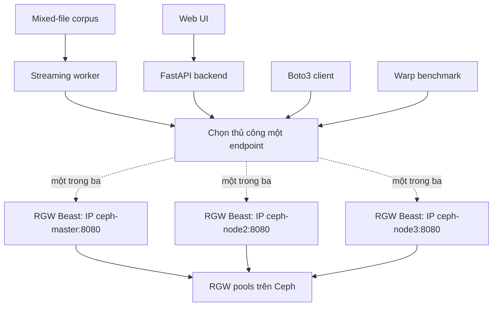

# Plan hoàn chỉnh: Ceph RGW + Mixed-object Streaming Web

Mục tiêu cuối cùng gồm ba luồng độc lập:

1. Client S3 chuẩn: PUT/GET đơn và streaming.
2. Warp benchmark trực tiếp RGW.
3. Website quản lý object và giả lập luồng upload nhiều loại file.



## Giai đoạn 0: Kiểm tra cụm Ceph

Kiểm tra:

* Cluster health.
* MON/OSD còn đủ dung lượng.
* Ba host đều được cephadm quản lý.
* Network giữa ba node.
* Đồng bộ thời gian.
* Xác định IP quản trị/truy cập của từng node.
* Kiểm tra port `8080` không bị chiếm và có thể truy cập từ client.
* Kiểm tra CRUSH rule và replication hiện tại.

Nếu cảnh báo MON thiếu dung lượng vẫn còn thì xử lý trước khi triển khai và benchmark.

Kết quả cần đạt:

```text
Cluster ổn định
Ba host hoạt động
Có IP của ba node và port 8080 sẵn sàng cho RGW Beast
```

## Giai đoạn 1: Triển khai RGW trên ba node

Triển khai một RGW daemon trên mỗi host:

* `ceph-master`
* `ceph-node2`
* `ceph-node3`

Cấu hình đề xuất:

```text
RGW frontend: Beast
RGW frontend port: 8080
```

Các endpoint dùng trực tiếp:

```text
http://<IP-ceph-master>:8080
http://<IP-ceph-node2>:8080
http://<IP-ceph-node3>:8080
```

Mỗi client, worker, backend hoặc lần chạy Warp chọn thủ công đúng một endpoint trong ba địa chỉ trên. Lưu endpoint trong cấu hình hoặc biến môi trường, ví dụ:

```text
RGW_ENDPOINT_URL=http://<IP-node-được-chọn>:8080
```

Ở giai đoạn hiện tại không có cân bằng tải hoặc tự động chuyển endpoint. Khi node đang được chọn gặp lỗi, người vận hành đổi `RGW_ENDPOINT_URL` sang IP của node còn hoạt động rồi chạy lại tiến trình liên quan.

Ba RGW này thuộc cùng một zone, cùng truy cập một tập pool. Không phải ba kho object riêng biệt.

Tham khảo: [Ceph Pacific RGW Service](https://docs.ceph.com/en/pacific/cephadm/services/rgw/)

## Giai đoạn 2: Tạo pool, placement, user và bucket

### Pool

RGW không chỉ cần một pool. Tạo placement riêng cho project:

```text
default.rgw.lab.data
default.rgw.lab.index
default.rgw.lab.non-ec
```

Mục đích:

| Pool            | Chức năng                         |
| --------------- | ----------------------------------- |
| `data`        | Chứa dữ liệu object              |
| `index`       | Chứa bucket index                  |
| `non-ec`      | Multipart upload và dữ liệu phụ |
| Pool hệ thống | Metadata, log, control, root        |

Đối với lab ba node:

* Replicated pool.
* Dự kiến `size=3`.
* Dự kiến `min_size=2`.
* Bật PG autoscaler.
* Dùng CRUSH rule phù hợp với OSD hiện có.

Tạo placement target:

```text
lab-placement
```

Ánh xạ ba pool vào placement trước khi tạo bucket, vì placement của bucket được chọn lúc bucket được tạo.

### RGW user và bucket

Tạo hai user riêng:

```text
rgw-app
rgw-warp
```

Tạo hai bucket riêng:

```text
rgw-lab-data
rgw-warp-bench
```

* `rgw-lab-data`: web và client thử nghiệm.
* `rgw-warp-bench`: chỉ dành cho Warp.

Không dùng bucket của website để benchmark nhằm tránh hàng nghìn object Warp làm nhiễu giao diện.

## Giai đoạn 3: Chuẩn bị mixed-file corpus

Dùng [Google Magika tests_data/basic](https://github.com/google/magika/tree/main/tests_data/basic) làm nguồn chính.

Các nhóm có sẵn:

* Image: JPEG, PNG, SVG, PSD.
* Document: PDF, DOCX, RTF, ODT, EPUB.
* Spreadsheet: XLSX, ODS, CSV, TSV.
* Presentation: PPTX, ODP.
* Audio: MP3, WAV, FLAC, OGG.
* Archive: ZIP.
* Data: JSON, XML, YAML.
* Email: EML, Outlook.
* Source code và một số binary.

Bổ sung thủ công:

```text
video/
├── sample.mp4
├── sample.mkv
├── sample.webm
└── sample.avi

data-engineering/
├── sample.parquet
├── sample.avro
└── sample.orc
```

Cấu trúc nguồn thống nhất:

```text
object-samples/
├── images/
├── documents/
├── spreadsheets/
├── presentations/
├── audio/
├── video/
├── archives/
├── data/
├── data-engineering/
└── code/
```

Mount read-only vào worker:

```text
/data/object-samples
```

Worker tạo `manifest` khi khởi động, bao gồm:

```text
path
filename
extension
MIME type
category
size
SHA-256
```

Manifest giúp chọn random file nhanh mà không phải quét thư mục lại mỗi lần PUT.

## Giai đoạn 4: Xây dựng client S3 chuẩn

Dùng Python `boto3`, kết nối trực tiếp vào endpoint Beast `http://<IP-node>:8080` đã chọn thủ công.

Endpoint được truyền qua `RGW_ENDPOINT_URL`. Mỗi lần chạy chỉ dùng một endpoint; muốn đổi RGW thì thay giá trị cấu hình và khởi động lạ	i client hoặc job liên quan.

### Luồng PUT/GET đơn giản

```text
Chọn file
→ Tính SHA-256
→ PutObject
→ HeadObject
→ GetObject
→ Tính lại SHA-256
→ So sánh
```

Kiểm tra:

* HTTP status.
* Object key.
* Content-Type.
* Content-Length.
* Metadata.
* Checksum.
* Latency PUT/GET.

### Streaming một object lớn

Sử dụng multipart upload:

```text
Đọc file theo chunk
→ Upload từng part
→ CompleteMultipartUpload
→ GET theo chunk
→ Kiểm tra checksum
```

Không đọc toàn bộ file lớn vào RAM.

### Continuous streaming PUT

Worker liên tục thực hiện các PUT độc lập:

```text
Chọn random loại file
→ Chọn random file thật
→ Tạo object key
→ PUT vào RGW
→ Ghi metrics
→ Chờ interval
→ Lặp lại
```

### Continuous streaming GET

Hai chế độ:

* Random GET: liên tục chọn random object đang có.
* New-object GET: phát hiện object mới rồi GET.

MVP dùng polling. Giai đoạn nâng cao có thể dùng RGW bucket notification tới HTTP hoặc Kafka.

## Giai đoạn 5: Warp benchmark

Warp gọi trực tiếp một endpoint Beast `http://<IP-node>:8080` được chọn thủ công, không đi qua website.

Các workload:

* PUT.
* GET.
* MIXED PUT/GET.
* LIST.
* Multipart.

Ma trận ban đầu:

| Object size | Concurrency |
| ----------: | ----------- |
|       4 KiB | 1, 8, 32    |
|       1 MiB | 1, 8, 32    |
|      64 MiB | 1, 8, 16    |

Thực hiện ba nhóm benchmark:

1. Gọi riêng từng RGW để so sánh từng daemon.
2. Chọn một endpoint cố định để đo baseline và contention.
3. Dừng RGW đang được chọn, xác nhận request thất bại, đổi thủ công sang endpoint còn hoạt động rồi benchmark lại.

Hai trạng thái workload:

* Baseline: chỉ Warp chạy.
* Contention: Warp chạy cùng website streaming.

Lưu lại:

* Object/s.
* MiB/s.
* p50/p95/p99 latency.
* Error rate.
* RGW CPU/RAM.
* Network throughput.
* OSD latency và utilization.
* `ceph -s` trước và sau benchmark.

Tham khảo: [MinIO Warp](https://github.com/minio/warp)

## Giai đoạn 6: Xây dựng website

Stack đề xuất:

```text
Frontend: React/Vite
Backend: FastAPI + boto3
Worker: Python process riêng
Database: PostgreSQL
Live metrics: SSE hoặc WebSocket
```

Credential RGW chỉ nằm trong backend/worker, không đưa xuống React.

Backend và worker nhận `RGW_ENDPOINT_URL` từ cấu hình triển khai. Khi cần chuyển node, người vận hành đổi giá trị này sang một trong ba địa chỉ `http://<IP-node>:8080` rồi khởi động lại tiến trình tương ứng.

### Feature 1: Upload một object

* Chọn một file bất kỳ.
* Nhập client ID.
* Chọn bucket/prefix.
* Hiển thị progress, latency và kết quả.
* Giữ đúng filename, extension và Content-Type.

### Feature 2: Upload nhiều file hỗn hợp

Một batch có thể chứa:

```text
image.jpg
document.pdf
data.json
video.mp4
report.xlsx
archive.zip
```

Mỗi file có:

* Progress riêng.
* Kết quả riêng.
* Retry riêng.
* Một file lỗi không làm toàn bộ batch thất bại.

### Feature 3: Upload cả folder

* Chọn folder từ trình duyệt; hoặc
* Chọn folder đã được mount trên backend.

Giữ cấu trúc folder bằng object prefix.

Backend chỉ được đọc những thư mục nằm trong allowlist, không cho truyền arbitrary filesystem path.

### Feature 4: Upload random một object

Các lựa chọn:

* Random từ tất cả loại file.
* Random trong một category.
* Random theo extension.
* Random theo khoảng kích thước.

Ví dụ:

```text
Random một PDF
Random một image
Random một file 1–10 MiB
Random bất kỳ trong corpus
```

### Feature 5: Mixed-object streaming PUT

Cấu hình trên giao diện:

* Client ID.
* Bucket và prefix.
* Loại file được phép.
* Tỷ lệ từng loại.
* Requests/second hoặc interval.
* Concurrency.
* Duration.
* Giới hạn số object.
* Chiến lược đặt tên.
* Start, pause và stop.

Ví dụ tỷ lệ:

| Loại            | Tỷ lệ |
| ---------------- | ------: |
| Image            |     35% |
| JSON/CSV/Parquet |     25% |
| PDF/Office       |     20% |
| Video/Audio      |     10% |
| Archive          |     10% |

### Feature 6: Object Explorer

Hiển thị:

* Object key.
* Client.
* Category.
* Extension/MIME.
* Size.
* Last modified.
* ETag.
* Nguồn tạo: web, streaming hoặc external.
* Bucket và prefix.

Bộ lọc:

* Client ID.
* Loại file.
* Bucket.
* Prefix.
* Kích thước.
* Khoảng thời gian.
* Tên object.

Phải hỗ trợ pagination vì `ListObjectsV2` chỉ trả từng trang kết quả.

### Feature 7: Xem và GET object

* Preview image.
* Preview text, JSON, CSV.
* Hiển thị metadata.
* Download object.
* Stream GET theo chunk.
* Range GET cho video hoặc file lớn.
* Không tự động render/execute file binary không tin cậy.

### Feature 8: Live dashboard

Hiển thị trực tiếp:

* Tổng PUT/GET.
* Success/failure.
* Bytes sent/received.
* Object/s.
* MiB/s.
* Latency gần nhất.
* p50/p95/p99.
* Object gần nhất.
* Số job đang chạy.

## Quy tắc đặt object key

```text
clients/{client_id}/{mode}/{category}/{yyyy-mm-dd}/{timestamp}-{uuid}.{ext}
```

Ví dụ:

```text
clients/host-01/stream/images/2026-09-02/172000-uuid.jpg
clients/host-02/batch/documents/2026-09-02/172010-uuid.pdf
clients/host-03/stream/data/2026-09-02/172020-uuid.parquet
```

Nhờ vậy trang “System Objects” có thể lọc object theo client mà không cần gọi `HEAD` cho từng object.

## Giai đoạn 7: Vận hành, bảo mật và nghiệm thu

Kiểm thử:

* PUT/GET thành công khi lần lượt chọn endpoint `IP:8080` của từng RGW.
* Dừng RGW đang được chọn, xác nhận request thất bại; sau khi đổi thủ công sang endpoint còn hoạt động, client PUT/GET thành công trở lại.
* Upload cùng lúc nhiều loại file.
* Streaming chạy trong thời gian dài.
* Stop job không làm mất trạng thái.
* File GET về có checksum giống file nguồn.
* List chính xác khi có trên 1.000 object.
* Backend restart và khôi phục trạng thái job phù hợp.
* Access key không xuất hiện trong frontend, log hoặc Git.
* Corpus được mount read-only.
* Có timeout, retry và giới hạn upload.
* Warp không tác động bucket ứng dụng.

## Tiêu chí hoàn thành cuối cùng

Project hoàn thành khi:

* Có ba RGW daemon; Beast frontend `IP:8080` của từng node đều truy cập được.
* Pool placement được cấu hình trước khi tạo bucket.
* PUT/GET đơn và multipart chạy đúng.
* Web upload được một file, nhiều file khác loại và cả folder.
* Random upload chọn được theo loại/kích thước.
* Streaming PUT tạo liên tục mixed object.
* Streaming GET tải object theo chunk.
* Object Explorer xem được object của mọi logical client trong bucket.
* Warp có báo cáo PUT/GET/MIXED/LIST/multipart.
* Khi một RGW daemon bị dừng, hệ thống hoạt động trở lại sau khi người vận hành đổi thủ công sang endpoint của node còn hoạt động.

Thứ tự triển khai thực tế nên là:

```text
Ceph health
→ RGW ba node
→ Kiểm tra từng Beast endpoint IP:8080
→ Pool placement
→ User và bucket
→ Client PUT/GET
→ Warp baseline
→ Mixed-file corpus
→ Web upload
→ Streaming worker
→ Object Explorer
→ Kiểm thử chuyển endpoint thủ công và contention
```
