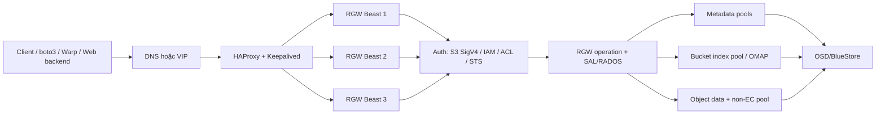

# Ceph RGW: kiến thức nền, thay đổi 16.2.5 → 16.2.15 và runbook triển khai

> Phạm vi: Ceph Pacific `v16.2.5` → `v16.2.15`, tập trung vào RADOS Gateway (RGW) và áp dụng trực tiếp cho [`plan.md`](./plan.md).
>
> Cơ sở phân tích: hai source tree cục bộ `ceph16.2.5/ceph` và `ceph16.2.15/ceph`, lịch sử Git giữa hai tag, tài liệu Pacific trong source, test/QA và release note chính thức của Ceph.
>
> Ngày lập tài liệu: 2026-09-02.

## 0. Kết luận cần nhớ trước tiên

1. **Nên nâng toàn cụm từ 16.2.5 lên 16.2.15 trước, đợi cụm ổn định, rồi mới triển khai RGW/Ingress/pool/application trong plan.** Không nên vừa benchmark/reshard/thay period vừa để cụm ở trạng thái mixed-version.
2. **16.2.15 là bản Pacific cuối cùng và Pacific đã hết vòng đời từ 2024-03-04.** Nâng lên 16.2.15 vẫn rất cần thiết để lấy toàn bộ bản vá cuối của Pacific, nhưng đây nên được xem là bước ổn định/hardening trước một kế hoạch nâng major lên bản Ceph còn được hỗ trợ.
3. **RGW là gateway HTTP gần như stateless; dữ liệu thật nằm trong RADOS.** Ba RGW daemon trong cùng một zone không phải ba kho object; chúng dùng chung metadata, bucket index và data pools.
4. **Ingress HA chỉ bảo vệ endpoint và phân phối request.** Khi một RGW chết, request mới đi sang daemon khác; request PUT/GET đang truyền có thể đứt và client phải retry đúng cách.
5. **Chọn placement trước khi tạo bucket.** Placement của bucket được cố định lúc bucket được tạo. Đổi default placement sau đó không di chuyển bucket cũ.
6. **Dùng Beast, không dùng Civetweb.** Civetweb đã bị đánh dấu deprecated trong Pacific; 16.2.15 có nhiều sửa lỗi/tối ưu trực tiếp cho Beast.
7. **Nếu endpoint là IP/VIP, cấu hình S3 client ở chế độ path-style.** Virtual-host style cần DNS wildcard và chứng thư TLS phù hợp.
8. **Không dùng ETag làm checksum nội dung tổng quát.** Với multipart, encryption hoặc một số luồng copy, ETag không phải SHA-256 và không nhất thiết là MD5 của toàn file. Plan phải giữ SHA-256 riêng.
9. **Không coi `ceph orch upgrade stop` là rollback.** Lệnh này chỉ dừng tiến trình nâng tiếp; daemon đã nâng không tự quay lại phiên bản cũ.
10. **Không chạy lệnh repair/xóa orphan/`--fix` trong lúc nâng cấp.** 16.2.15 bổ sung công cụ kiểm tra OLH/unlinked và nhiều sửa lỗi bucket index, nhưng chỉ dùng sửa chữa sau khi có bằng chứng, backup và maintenance window riêng.

## 1. Phạm vi và bằng chứng từ hai source tree

### 1.1 Hai mốc được xác minh

| Mốc         | Git commit checkout                          | Ngày commit release | Trạng thái                |
| ------------ | -------------------------------------------- | -------------------: | --------------------------- |
| `v16.2.5`  | `0883bdea7337b95e4b611c768c0279868462204a` |           2021-07-08 | Pacific patch release       |
| `v16.2.15` | `618f440892089921c3e944a991122ddc44e60516` |           2024-02-26 | Pacific patch release cuối |

Giữa hai tag có:

- 5.547 commit của toàn Ceph;
- 579 commit chạm phạm vi RGW đã chọn, tính cả merge;
- 375 commit RGW không phải merge;
- 223 file RGW/docs/test liên quan thay đổi, với 9.749 dòng thêm và 9.585 dòng xóa.

Phân rã diff:

| Phạm vi                       | File đổi | Dòng thêm | Dòng xóa |
| ------------------------------ | ---------: | ----------: | ---------: |
| `src/rgw`                    |        134 |       6.118 |      2.284 |
| `src/cls/rgw` + test CLS RGW |          9 |       1.292 |        585 |
| `doc/radosgw`                |         20 |       1.927 |        892 |
| RGW test/QA còn lại          |         60 |         412 |      5.824 |

Phần xóa lớn trong test chủ yếu do bỏ bộ test PubSub multisite cũ (`tests_ps.py`, `zone_ps.py`), không có nghĩa production RGW bị mất tương ứng hàng nghìn dòng chức năng.

### 1.2 Cách tái tạo đầy đủ inventory

Chạy tại `ceph16.2.15/ceph`:

```bash
git rev-list --count v16.2.5..v16.2.15

git rev-list --count v16.2.5..v16.2.15 -- \
  src/rgw src/cls/rgw src/test/rgw qa/suites/rgw \
  qa/tasks/rgw.py doc/radosgw

git log --no-merges --date=short \
  --format='%h|%ad|%s' v16.2.5..v16.2.15 -- \
  src/rgw src/cls/rgw src/test/rgw qa/suites/rgw \
  qa/tasks/rgw.py doc/radosgw

git diff --stat v16.2.5..v16.2.15 -- \
  src/rgw src/cls/rgw src/test/rgw src/test/cls_rgw \
  src/test/cls_rgw_gc qa/suites/rgw qa/tasks/rgw.py \
  doc/radosgw src/common/options.cc
```

Tài liệu này nhóm thay đổi theo tác động vận hành. Danh sách Git trên là nguồn đầy đủ nếu cần audit từng commit/PR.

## 2. RGW là gì và request đi như thế nào

RGW (`radosgw`) cung cấp API object storage tương thích S3 và Swift trên RADOS. Nó xử lý HTTP, xác thực, authorization, bucket/object semantics, metadata, bucket index, multipart, lifecycle, notification và multisite sync. RGW không phải OSD và không lưu bản sao dữ liệu lâu dài trên ổ cục bộ của host gateway.



Một request đi qua các bước chính:

1. Client phân giải DNS hoặc gọi VIP.
2. Ingress chọn một RGW backend còn khỏe.
3. Beast parse HTTP/TLS/header/body.
4. RGW xác định S3/Swift/Admin operation.
5. RGW xác thực access key/SigV4 hoặc identity provider, sau đó đánh giá IAM policy/ACL/quota/object lock.
6. Operation đọc/ghi metadata, bucket index và object data qua librados.
7. Background workers xử lý GC, lifecycle, reshard, usage log, notification và multisite sync nếu được bật.
8. RGW trả HTTP status, S3 error/XML/JSON và request ID.

### 2.1 Ý nghĩa của “stateless”

- Có thể scale-out bằng cách thêm RGW daemon cùng realm/zone.
- Không cần sticky session cho API thông thường; các part của cùng multipart upload có thể tới các RGW khác nhau.
- Mất một daemon không làm mất object vì object nằm trong RADOS.
- Tuy nhiên TCP/TLS request đang chạy trên daemon chết sẽ thất bại; load balancer không thể “chuyển tiếp giữa chừng”.
- Cache metadata cục bộ giữa các RGW phải được invalidation đúng; 16.2.15 có nhiều bản vá cho watch/notify/cache invalidation.

### 2.2 Thuật ngữ bắt buộc phải phân biệt

| Thuật ngữ         | Ý nghĩa thực tế                                                                                 |
| ------------------- | --------------------------------------------------------------------------------------------------- |
| Realm               | Không gian cấu hình multisite cao nhất; chứa các period                                       |
| Zonegroup           | Nhóm zone, đồng thời xác định API name, endpoints và placement targets toàn cục           |
| Zone                | Một site logic với các RGW và các pool cục bộ                                                |
| Period              | Snapshot có version của cấu hình realm/zonegroup/zone; thay đổi multisite phải commit period |
| Placement target    | Tên logic được bucket chọn khi tạo                                                            |
| Zone placement      | Ánh xạ placement target sang index/data/data-extra pool cục bộ                                  |
| Storage class       | Ánh xạ lớp dữ liệu như`STANDARD` sang data pool trong placement                             |
| Bucket instance     | Phiên bản nội bộ của bucket, có ID/marker và layout riêng                                   |
| Bucket index shard  | RADOS object chứa OMAP index của một phần bucket                                                |
| Head object         | RADOS object đầu, chứa metadata/manifest và có thể chứa chunk dữ liệu đầu                |
| Tail objects        | Các RADOS object còn lại của object lớn/striped object                                         |
| OLH                 | Object Logical Head, dùng quản lý versioned object và current version                           |
| GC                  | Garbage collection, xóa tail/incomplete data bất đồng bộ                                       |
| Lifecycle (LC)      | Background engine expire/transition object theo rule                                                |
| mdlog/bilog/datalog | Metadata, bucket index và data change logs phục vụ multisite/sync                                |

## 3. Data layout, pool và placement

### 3.1 Ba loại dữ liệu RGW

1. **Metadata**: user, access-key lookup, bucket mapping, bucket.instance, realm/zone/period.
2. **Bucket index**: tên object/version/delete marker, metadata dùng LIST và thống kê bucket, lưu trong OMAP.
3. **Object data**: head/tail RADOS objects và xattrs/manifest.

Một key có dấu `/` vẫn chỉ là chuỗi object key. “Folder” trong S3 là prefix, không phải thư mục thật.

### 3.2 Các pool thường gặp

| Pool                       | Vai trò                                                         | Khuyến nghị cho lab trong plan               |
| -------------------------- | ---------------------------------------------------------------- | ---------------------------------------------- |
| `.rgw.root`              | Realm/zonegroup/zone/global metadata                             | Để RGW quản lý; replicated                 |
| `<zone>.rgw.control`     | Watch/notify control                                             | Replicated                                     |
| `<zone>.rgw.meta`        | User/bucket/bucket.instance metadata qua namespace               | Replicated                                     |
| `<zone>.rgw.log`         | Usage, lifecycle, reshard, sync/notification log tùy cấu hình | Replicated; cần theo dõi latency             |
| `default.rgw.lab.index`  | Bucket index cho`lab-placement`                                | Replicated, OMAP workload                      |
| `default.rgw.lab.data`   | Object data`STANDARD`                                          | Plan lab: replicated`size=3`, `min_size=2` |
| `default.rgw.lab.non-ec` | Metadata của incomplete multipart/data-extra                    | Replicated, không dùng EC                    |

RGW có thể tự tạo pool còn thiếu bằng cluster defaults khi request đầu tiên tới. Với pool quan trọng, nên **pre-create, gắn application `rgw`, chọn CRUSH rule/replication/autoscaler và xác minh trước khi tạo bucket**, không phụ thuộc lazy creation.

### 3.3 Placement là quyết định không thể xem nhẹ

Zonegroup giữ tên `lab-placement`; zone ánh xạ tên đó tới ba pool:

```text
lab-placement
├── index_pool      = default.rgw.lab.index
├── data_pool       = default.rgw.lab.data
└── data_extra_pool = default.rgw.lab.non-ec
```

Bucket chọn placement lúc được tạo và không đổi trực tiếp về sau. Vì vậy thứ tự đúng là:

```text
pool → application/CRUSH/replication/autoscaler
→ zonegroup placement target
→ zone placement mapping
→ restart RGW hoặc commit period
→ user default placement
→ create bucket
```

Nếu là default single-site chưa có realm, thay đổi zone/zonegroup có hiệu lực sau khi restart RGW. Nếu đã có realm, phải `radosgw-admin period update --commit` theo quy trình multisite.

### 3.4 Replicated hay Erasure Coding

- Index, metadata và data-extra phải ở replicated pool vì phụ thuộc OMAP/ghi nhỏ/cập nhật metadata.
- Data pool có thể dùng EC trong production nếu workload/capacity yêu cầu và thiết kế đã được test.
- Với lab ba node trong plan, replicated `size=3`, `min_size=2` đơn giản và phù hợp hơn.
- `min_size=2` nghĩa là khi chỉ còn một replica, write sẽ dừng; nó không thay thế backup.
- CRUSH failure domain phải thực sự là `host`; ba replica trên cùng failure domain không tạo HA host-level.
- Bật PG autoscaler. Từ 16.2.8 có `--bulk`; chỉ nên cân nhắc cho data pool lớn, không gắn `bulk` một cách máy móc cho mọi system/index pool.

### 3.5 Bucket index và resharding

- Mặc định ngưỡng trigger dynamic reshard là khoảng 100.000 entry/shard.
- Mặc định tối đa 1.999 shard động trong Pacific.
- Version và delete marker cũng làm tăng index entries; số file logic không phải luôn bằng số entry.
- Một bucket index quá lớn gây chậm PUT/DELETE/LIST và tạo OMAP hotspot.
- **Pacific không hỗ trợ dynamic resharding trong multisite.** Nếu triển khai multisite phải pre-shard/manual plan và không dựa vào background dynamic reshard.
- Single-site trong plan có thể dùng dynamic reshard, nhưng phải theo dõi `reshard list/status` và không benchmark đúng lúc bucket đang reshard.

### 3.6 GC, lifecycle và dung lượng

- Delete/overwrite/multipart abort có thể đưa tail objects vào GC; dung lượng không nhất thiết giảm ngay.
- Incomplete multipart upload chiếm data/data-extra cho tới khi complete/abort/lifecycle cleanup.
- Lifecycle, GC, reshard và notification chạy background, có thể cạnh tranh I/O với Warp.
- Benchmark phải ghi nhận backlog và đợi background work ổn định trước khi so sánh hai lần chạy.
- Không dùng replica count như backup. Xóa nhầm, policy lỗi hoặc credential bị lạm dụng được nhân bản rất nhanh.

## 4. Những điều application/client phải hiểu

### 4.1 S3 compatibility không có nghĩa giống AWS 100%

RGW hỗ trợ phần lớn API S3 thường dùng, nhưng error code, header, notification destination, IAM condition và một số edge case có thể khác AWS. Test bằng đúng SDK/version và đúng feature của ứng dụng, không chỉ chạy một lệnh PUT/GET mẫu.

### 4.2 Path-style, virtual-host style, DNS và TLS

Với endpoint lab `http://<VIP>:7480`, cấu hình boto3 path-style:

```python
from botocore.config import Config
import boto3

s3 = boto3.client(
    "s3",
    endpoint_url="http://<VIP>:7480",
    config=Config(
        signature_version="s3v4",
        s3={"addressing_style": "path"},
        retries={"mode": "standard", "max_attempts": 5},
    ),
)
```

Nếu dùng `bucket.s3.example.com`:

- cần DNS wildcard hoặc record cho từng bucket;
- cấu hình RGW DNS name/hostnames đúng;
- chứng thư thường cần `*.s3.example.com` và tên endpoint gốc;
- phải quyết định TLS terminate ở ingress hay RGW backend;
- không tắt verify TLS trong client production.

### 4.3 SigV4 và thời gian

- Dùng SigV4; đồng bộ NTP/chrony trên client, ingress, RGW và Ceph hosts.
- Proxy phải giữ đúng `Host`, canonical path/query và các header đã ký.
- Không rewrite path/header sau khi client đã ký request.
- 16.2.15 sửa nhiều edge case SigV4: `x-amz-*` header bổ sung, `x-amz-date`/HTTP date và CORS `OPTIONS`.

### 4.4 Multipart upload

Ứng dụng phải:

1. tạo upload ID;
2. upload part theo stream, không đọc toàn file vào RAM;
3. lưu part number + ETag trả về;
4. complete đúng danh sách part;
5. abort khi job bị hủy hoặc thất bại vĩnh viễn;
6. có lifecycle rule để dọn incomplete multipart bị bỏ quên;
7. test re-upload cùng part number, retry timeout và retry complete.

Sự kiện notification cho multipart ở 16.2.15 được phát khi hoàn thành dưới dạng `s3:ObjectCreated:CompleteMultipartUpload`, không phát “object hoàn chỉnh” cho từng part.

### 4.5 Checksum và ETag

- Single-part không encryption thường có ETag giống MD5, nhưng không dùng điều đó làm hợp đồng ứng dụng.
- Multipart ETag thường là dạng tổng hợp và không phải MD5/SHA-256 toàn file.
- Lưu SHA-256 trong application DB và/hoặc user metadata `x-amz-meta-sha256`.
- Khi nghiệm thu, stream GET và tính SHA-256 lại.
- Không đưa manifest lớn vào user metadata: header limit Beast mặc định ở 16.2.15 là 16 KiB, tối đa 64 KiB bằng frontend option.

### 4.6 LIST và pagination

- `ListObjectsV2` trả tối đa từng trang; luôn xử lý `IsTruncated` và continuation token.
- Không dùng LIST toàn bucket cho mỗi lần refresh UI khi object lên hàng triệu.
- Key prefix trong plan giúp lọc theo client/date/category mà không cần HEAD từng object.
- PostgreSQL có thể làm index UI/job, nhưng object tồn tại trong RGW mới là source of truth; cần reconciliation định kỳ.

### 4.7 Retry và idempotency

- GET/HEAD/LIST dễ retry.
- PUT cùng key khi bucket không versioning thường overwrite; khi bật versioning sẽ tạo version mới.
- Client timeout không chứng minh server chưa ghi thành công. Sau timeout, dùng HEAD/checksum/request state để xác minh.
- In-flight request sẽ hỏng khi RGW/HAProxy failover; retry phải có backoff+jitter và giới hạn.
- Với multipart, lưu upload ID/part state để resume hoặc abort, không tạo upload mới vô hạn.
- Notification consumer phải idempotent và chấp nhận delayed/retried event.

### 4.8 Notification reliability

- Synchronous notification cộng latency endpoint vào PUT/DELETE; operation gốc vẫn có thể được coi là thành công dù notification lỗi.
- Asynchronous notification ghi bền vào storage rồi retry tới khi được acknowledge; log pool latency ảnh hưởng độ trễ commit notification.
- Theo dõi `pubsub_event_triggered`, `pubsub_event_lost`, `pubsub_push_ok`, `pubsub_push_fail`.
- MVP polling trong plan là lựa chọn đúng để làm reconciliation; notification không nên là nguồn duy nhất để lập inventory.

## 5. Inventory và điều kiện tiên quyết

### 5.1 Các quyết định phải chốt thành văn bản

| Quyết định   | Cần ghi lại                                                             |
| --------------- | ------------------------------------------------------------------------- |
| Deployment mode | Cephadm hay package/systemd; tài liệu này ưu tiên cephadm theo plan  |
| Topology        | Single-site hay multisite; realm/zonegroup/zone hiện tại                |
| RGW service     | Service ID, hosts, số daemon/host, backend port                          |
| Ingress         | Hosts, VIP/CIDR, frontend port, monitor port, TLS termination             |
| S3 addressing   | Path-style bằng IP/VIP hay virtual-host bằng DNS                        |
| Placement       | Target name, data/index/data-extra pool, storage class                    |
| Protection      | CRUSH rule, size/min_size hoặc EC profile, backup/DR                     |
| Scale           | Object count, average/max size, request rate, multipart concurrency       |
| Features        | Versioning, object lock, lifecycle, notification, encryption, STS/IAM     |
| SLO             | Availability, p95/p99, throughput, RPO/RTO, error budget                  |
| Rollback        | Trigger, người quyết định, image cũ, backup config và test restore |

### 5.2 Cluster precheck bắt buộc

- Tất cả host online, clock synchronized.
- Có ít nhất một standby MGR đang chạy.
- Không có degraded/inactive/peering/backfill/recovery bất thường.
- Không có `MON_DISK_LOW`, `OSD_NEARFULL`, `OSD_BACKFILLFULL`, pool full hoặc crash chưa xử lý.
- Dung lượng đủ cho dữ liệu test, replication, multipart tạm, GC backlog và recovery khi mất host.
- Cephadm quản lý đúng ba host; container runtime và registry reachable.
- Target image tồn tại và pull được trên mọi host.
- `ceph versions` không có daemon lạc phiên bản trước khi bắt đầu.
- Lưu service specs, config dump, CRUSH map/pool details và realm/zone/period JSON.

Không có một con số CPU/RAM RGW “đúng cho mọi nơi”. Sizing phải dựa trên concurrency, TLS, request size, cache, notification và benchmark. Với lab, bắt đầu có giới hạn CPU/RAM rõ ràng, đo saturation rồi scale; không tuyên bố kết quả Warp khi CPU, NIC hoặc OSD đã chạm trần mà không ghi lại bottleneck.

### 5.3 Network/Ingress precheck

- VIP chưa dùng, đúng CIDR và nằm trên interface/subnet Cephadm có thể chọn.
- Ba ingress host nhìn thấy backend RGW port 8080.
- Client tới được 7480/443; firewall mở đúng chiều.
- Keepalived/VRRP hoặc cơ chế unicast được network cho phép; gratuitous ARP không bị chặn.
- Monitor port HAProxy không xung đột.
- DNS TTL và certificate SAN phù hợp nếu dùng hostname.
- MTU thống nhất; test TCP reset/timeout dưới tải.
- Không đặt access key/secret key trong frontend, URL, Git, ảnh chụp, log hoặc Warp report.

### 5.4 Bộ lệnh khảo sát read-only

```bash
# Sức khỏe, version, host và service
ceph -s
ceph health detail
ceph versions
ceph orch host ls
ceph orch ps
ceph orch ls --export
ceph orch upgrade status

# Dung lượng, OSD, pool, CRUSH
ceph df detail
ceph osd df tree
ceph osd tree
ceph osd pool ls detail
ceph osd crush rule ls
ceph osd crush rule dump

# Cấu hình; output có thể chứa thông tin nhạy cảm, phải bảo vệ file
ceph config dump -f json-pretty

# RGW topology/config
radosgw-admin realm list
radosgw-admin zonegroup list
radosgw-admin zone list
radosgw-admin zonegroup get
radosgw-admin zone get
radosgw-admin period get
radosgw-admin sync status

# Inventory; tránh dump user info công khai vì có thể lộ key
radosgw-admin user list
radosgw-admin bucket list
radosgw-admin reshard list
radosgw-admin gc list
```

Lệnh `user info`, `metadata get user:*` và một số export có thể chứa access/secret keys. Nếu cần lưu bằng chứng, mã hóa file, giới hạn quyền và redact trước khi đưa vào ticket/report.

## 6. Những cải tiến RGW từ 16.2.5 lên 16.2.15

### 6.1 Tóm tắt theo patch release

| Release | Thay đổi RGW đáng chú ý                                                                                                                                                                                           |
| ------- | ----------------------------------------------------------------------------------------------------------------------------------------------------------------------------------------------------------------------- |
| 16.2.6  | Fix multisite retry/error, notification persistence/filter, bucket list/delete/manifest crash, MFA/STS/IAM; thêm Beast SSL options/ciphers, Vault TLS client auth; deprecate Civetweb                                  |
| 16.2.7  | Notification độc lập với bucket reshard, V4 auth cho topic/notification, sửa size/delete-marker event; ops log ra file; purge incomplete multipart; STS leak/copy fixes                                            |
| 16.2.8  | Beast timeout tối ưu; nhiều sửa bucket index/LIST/reshard/bucket check; multipart metadata đúng pool; FIPS/MD5; Object Lock output; RGW request ID ngẫu nhiên và hardening correctness                         |
| 16.2.9  | Hotfix MGR deadlock; release note chính thức không có thay đổi RGW                                                                                                                                                |
| 16.2.10 | Fix RGW segfault khi S3 website request không chỉ tới bucket                                                                                                                                                         |
| 16.2.11 | Cụm backport RGW lớn: data corruption khi timeout/network jitter, put vào shard đã decommission, Object Lock, SigV4, GC chain, ops log, notification/multipart, STS tag policy, listing/copy/multipart correctness |
| 16.2.12 | Hotfix ceph-volume; release note chính thức không liệt kê thay đổi RGW                                                                                                                                           |
| 16.2.13 | Fix racing-delete index; Beast keepalive/100-continue; multi-object delete concurrent; list/duplicate index/reshard/LC error semantics; multisite docs được làm rõ                                                 |
| 16.2.14 | Fix OLH/versioned-object consistency, LDAP resource leak, FIPS + OpenSSL 3 MD5 path; cephadm reschedule HAProxy khỏi host offline                                                                                      |
| 16.2.15 | Bản cuối: nhiều fix STS/IAM/OIDC, bucket check OLH/unlinked, cache/watch/notify, SigV4+CORS, ListBuckets/ListObjects, multipart/chunk upload, Object Lock, sync-policy, OPA, graceful shutdown và S3 website        |

### 6.2 Correctness và bảo vệ dữ liệu

Các thay đổi có giá trị nhất cho plan streaming/multipart:

- **Fix nguy cơ data corruption khi network jitter/timeout**: head object có thể đã được ghi dù librados trả `ETIMEDOUT`; logic cũ có thể xóa tail objects khi cleanup. Bản vá `b1ef8f95eb5` thay đổi cleanup của `RadosWriter`.
- **Fix cleanup multipart dùng sai head object**: `5a98f505fc4` dùng part-head thay vì final multipart head để tránh race khi re-upload part.
- **Không ghi PUT vào bucket shard đã decommission** sau reshard.
- **OLH/versioned object consistency**: cleanup pending xattrs khi `set_olh` lỗi, clear/apply OLH đúng hơn, tránh leftover OLH entries và sai accounting khi reshard/check index.
- **Racing delete cleanup**: xóa index entry sau khi cancel delete operation cuối cùng.
- **GC chain splitting**: chia chain để tránh `OSD_WRITETOOBIG`, đặc biệt quan trọng với multipart/overwrite/delete lớn.
- **Bucket index/List correctness**: sửa non-ASCII listing, duplicate index entries, pending multipart meta, truncated bucket list, shard accounting và `bucket check` stat.
- **Object Lock**: không cho xóa locked object version; tránh overflow retention date.

Đây là lý do nâng patch có giá trị lớn hơn việc chỉ “đổi số phiên bản”. Workload continuous PUT/multipart trong plan chạm đúng các đường code đã được sửa.

### 6.3 S3/API compatibility

- SigV4 đúng hơn với extra `x-amz-*` headers, `x-amz-date`/HTTP date và chunked upload.
- CORS `OPTIONS` được xác thực/chuẩn hóa đúng hơn; 16.2.15 xử lý preflight với expected method.
- `ListBuckets`, `ListObjectsV2`, multipart/common-prefix và owner output được sửa nhiều edge case.
- `UploadPartCopy` trả error phù hợp hơn khi source object/bucket không tồn tại.
- Complete multipart populate ETag đúng; complete lặp lại được trả OK trong edge case đã sửa.
- Lifecycle PUT không còn bắt buộc `Content-MD5` trong đường code được backport.
- Empty tagset được chấp nhận theo S3.
- Browser POST sửa điều kiện minimum `content-length-range`.
- Static website trả `NoSuchBucket`/404 và tránh prefetch/crash trong các trường hợp biên.
- Multi-object delete có output/log từng object tốt hơn và chạy concurrent khi dùng ASIO.

### 6.4 Hiệu năng và khả năng scale

- **Chunked upload memory efficiency**: code cũ có thể cấp buffer 4 MiB nhưng chỉ dùng khoảng 64 KiB cho mỗi chunk; commit `777caad8fe7` gom nhiều chunk vào buffer, xử lý trường hợp đã quan sát virtual memory cực lớn.
- **Concurrent multi-object delete** với mức song song có thể điều chỉnh.
- **Beast timeout/keepalive/100-continue** ổn định hơn, giảm crash và kết nối treo.
- **LIST/bucket index filtering** tiến bộ tốt hơn trong trường hợp nhiều entry bị lọc, prefix/delimiter, sibling prefixes hoặc non-ASCII.
- **Data sync** dùng window/yield tốt hơn và metadata sync concurrency được giới hạn.
- **GC chain split** tránh request quá lớn tới OSD.
- Dynamic reshard/index fixes giảm khả năng tiếp tục ghi vào layout cũ sau reshard.

Không suy ra một tỷ lệ tăng throughput cố định từ code. Phải chạy Warp trước/sau bằng cùng corpus, network, pool state và concurrency.

### 6.5 Ổn định daemon và HA

- Fix nhiều null dereference/segfault: S3 website, OPA, lifecycle+reshard, datalog trim, pubsub topic, async user refresh, coroutine và ops log realm reload.
- Beast kiểm tra lỗi `local_endpoint()`, nhớ connection error và xử lý socket timeout/concurrent use tốt hơn.
- Drain async request queue khi shutdown, giảm mất việc đang xếp hàng khi rolling restart.
- Fix unwatch crash lúc startup và cache invalidation sau unregister error.
- Retry metadata cache invalidation notification; giảm stale metadata giữa nhiều RGW.
- Cephadm 16.2.14 có sửa reschedule HAProxy khỏi offline host, trực tiếp có lợi cho ingress của plan.

### 6.6 IAM, STS, identity và encryption

- Session policy được đưa vào nhiều authorization path hơn, gồm CreateBucket.
- IAM resource/tenant validation trả lỗi đúng hơn, tránh policy tài nguyên tenant khác bị xử lý sai.
- Điều kiện tag được mở rộng: request/principal/resource/session tags và multi-valued claims.
- OIDC có thể lấy cert/config qua chuẩn `.well-known/openid-configuration`.
- Sửa GetSessionToken với LDAP/Keystone và chunked upload.
- STS không còn ghi assumed-role state không cần thiết vào user metadata trong đường code được sửa.
- LDAP wrong-credential resource leak được sửa.
- Vault KMS thêm verify SSL mặc định bật, custom CA, client certificate và private key.
- Keystone/Barbican/Vault HTTP error handling được sửa.

Nếu plan không dùng STS/KMS/LDAP, không cần bật chỉ vì phiên bản mới có; nhưng phải test nếu cụm hiện tại đã dùng chúng.

### 6.7 Multisite và notification

- Metadata sync retry/error handling và concurrency tốt hơn.
- Sync status chỉ đọc các zone được phép sync; sync-policy từ chối group name rỗng và sửa một số command status/group.
- Datalog flag thực sự điều khiển data logging.
- User create/modify qua admin API lấy key từ master zone đúng hơn.
- Notification tránh phụ thuộc bucket reshard, sửa size/metadata filters và multipart-complete semantics.
- Index completion thread tránh spurious/lost notification.
- Cache notification có retry và log watcher timeout tốt hơn.

Giới hạn vẫn còn: Pacific chưa hỗ trợ dynamic resharding trong multisite; thay đổi realm/zone/period vẫn là thao tác cấu hình có blast radius lớn.

### 6.8 Observability và admin tooling

- Ops log có thêm file sink, có thể reopen khi `SIGHUP`.
- Ops log ghi identity/auth/role/session và kết quả từng object trong multi-delete tốt hơn.
- `radosgw-admin bucket check` có output/stat chính xác hơn và 16.2.15 thêm kiểm tra OLH/unlinked.
- `reshard cancel/list/status`, datalog/mdlog trim, bucket check và sync status nhận nhiều sửa lỗi/crash.
- Notification có perf counters success/fail/lost.

Không ghi ops log vào path cục bộ trong container rồi mặc định coi là bền. Nếu dùng `rgw_ops_log_file_path`, phải có mount/rotation/collection rõ ràng; nếu không, ưu tiên pipeline log tập trung phù hợp cephadm.

### 6.9 Delta cấu hình quan trọng

| Option/frontend setting             | 16.2.15                                                 | Hành động                                                                        |
| ----------------------------------- | ------------------------------------------------------- | ----------------------------------------------------------------------------------- |
| `rgw_multi_obj_del_max_aio`       | Mới, default`16`                                     | Giới hạn concurrent RADOS requests cho mỗi multi-delete; chỉ tune sau benchmark |
| `rgw_ops_log_file_path`           | Mới, default rỗng                                     | Chỉ bật khi có durable mount + rotation                                          |
| `rgw_crypt_vault_verify_ssl`      | Mới, default`true`                                   | Giữ bật; không dùng`false` để chữa lỗi certificate                        |
| `rgw_crypt_vault_ssl_cacert`      | Mới, default rỗng                                     | Trỏ custom CA nếu dùng Vault private PKI                                         |
| `rgw_crypt_vault_ssl_clientcert`  | Mới                                                    | Client mTLS cert nếu Vault yêu cầu                                               |
| `rgw_crypt_vault_ssl_clientkey`   | Mới                                                    | Bảo vệ private key bằng quyền file/secret management                            |
| `rgw_rados_pool_pg_num_min`       | Bị bỏ                                                 | Dùng cluster/pool PG autoscaler defaults; không carry option cũ                  |
| `rgw_bucket_quota_soft_threshold` | Bị bỏ                                                 | Audit config hiện tại và loại bỏ sau test                                      |
| Beast`ssl_options`                | Documented/default disable SSLv2, SSLv3, TLSv1, TLSv1.1 | Dùng TLS hiện đại; test client cũ                                              |
| Beast`ssl_ciphers`                | Mới/documented                                         | Chốt cipher policy nếu terminate TLS ở RGW                                       |
| Beast`max_header_size`            | Default`16384`, max `65536`                         | Giữ metadata/header gọn; chỉ tăng có lý do                                    |
| Civetweb                            | Deprecated trong Pacific                                | Dùng Beast                                                                         |

Hai option `rgw_debug_inject_set_olh_err` và `rgw_debug_inject_olh_cancel_modification_err` chỉ dành cho fault-injection/test, không bật production.

## 7. Điều chỉnh trực tiếp cho `plan.md`

### 7.1 Điểm giữ nguyên và điểm phải sửa

| Phần plan hiện tại                          | Đánh giá             | Điều chỉnh                                                 |
| ---------------------------------------------- | ----------------------- | ------------------------------------------------------------- |
| 3 RGW daemon + 1 VIP                           | Đúng                  | Giữ; dùng Beast, một RGW/host trước                      |
| HAProxy + Keepalived qua cephadm ingress       | Đúng                  | Giữ; xác minh VIP/CIDR/VRRP/TLS và monitor port            |
| Backend 8080, frontend 7480/443                | Đúng                  | 7480 cho lab HTTP; 443 + TLS cho môi trường thật          |
| Ba RGW cùng zone/shared pools                 | Đúng                  | Nhấn mạnh không phải ba object store độc lập           |
| Ba custom placement pools                      | Đúng                  | Pre-create/config trước bucket; data-extra phải replicated |
| `size=3`, `min_size=2`                     | Hợp lý cho lab 3 host | Xác minh CRUSH failure domain`host` và free space         |
| `lab-placement` trước bucket               | Đúng                  | Thêm restart RGW hoặc period commit tùy có realm          |
| User/bucket tách app và Warp                 | Rất tốt               | Giữ; quota/credential/rotation tách biệt                   |
| SHA-256 sau GET                                | Đúng                  | Ghi rõ ETag không thay SHA-256                              |
| Multipart streaming                            | Đúng                  | Thêm abort/resume/retry/re-upload part test                  |
| Object Explorer pagination                     | Đúng                  | Dùng continuation token; tránh HEAD N+1                     |
| Notification ở giai đoạn nâng cao          | Đúng                  | Poll reconciliation vẫn cần                                 |
| Thứ tự bắt đầu từ “Ceph health → RGW” | Thiếu                  | Chèn**Stage -1: nâng 16.2.15** trước RGW            |

### 7.2 Thứ tự triển khai đã sửa

```text
Freeze thay đổi và backup cấu hình
→ Precheck cluster/registry/standby MGR
→ Nâng toàn cụm 16.2.5 → 16.2.15
→ Đợi HEALTH/version/background work ổn định
→ Pre-create pool + CRUSH/replication/autoscaler
→ Tạo zonegroup/zone placement
→ Triển khai 3 RGW Beast
→ Restart/commit period và xác minh placement
→ Triển khai ingress VIP
→ Tạo user/bucket
→ Smoke test trực tiếp từng RGW và qua VIP
→ Warp baseline
→ Mixed corpus + web/backend/worker
→ HA, contention, long-run và security acceptance
```

Pool/placement có thể được tạo trước hoặc sau daemon, nhưng **phải hoàn tất trước bucket/application write đầu tiên**. Với cụm mới chưa có system pools, triển khai RGW rồi pre-create custom placement pools là chấp nhận được nếu chưa cho client truy cập.

## 8. Runbook nâng 16.2.5 → 16.2.15 bằng cephadm

### 8.1 Nguyên tắc

- Đây là point-release upgrade trong cùng Pacific; cephadm hỗ trợ rolling upgrade.
- Từ 16.2.6, image chính thức chuyển khỏi Docker Hub; với source 16.2.5 phải chỉ rõ image `quay.io/ceph/ceph:v16.2.15`.
- 16.2.5 chưa có giao diện staggered upgrade mới của 16.2.11 (`--daemon-types`, `--services`, `--hosts`, `--limit`). Không dùng các flag đó ngay từ đầu rồi giả định manager cũ hiểu.
- Cách mặc định cho lab là full automated rolling upgrade. Staggered upgrade từ manager cũ cần manual MGR-first workaround và chỉ dùng khi đã rehearsal.

### 8.2 Trước upgrade

1. Freeze tạo pool, CRUSH edit, realm/zone/period edit, reshard, lifecycle change và benchmark.
2. Xử lý toàn bộ warning liên quan MON disk, full/nearfull, degraded/recovery và crash.
3. Xác minh ít nhất hai MGR, một active và một standby.
4. Export/bảo vệ:
   - `ceph config dump`;
   - `ceph orch ls --export`;
   - `ceph osd crush rule dump`, pool details;
   - realm/zonegroup/zone/period JSON nếu có RGW;
   - inventory daemon/version và dashboard/monitoring config.
5. Xác minh target image pull được trên mọi host; ghi lại image digest, không chỉ tag.
6. Chốt maintenance window, người Go/No-Go và trigger dừng.

### 8.3 Bắt đầu và theo dõi

```bash
ceph orch upgrade start --image quay.io/ceph/ceph:v16.2.15

ceph orch upgrade status
ceph -W cephadm
ceph -s
ceph versions
ceph orch ps
```

Cephadm giữ thứ tự daemon an toàn; tài liệu 16.2.15 mô tả thứ tự:

```text
mgr → mon → crash → osd → mds → rgw → rbd-mirror
→ cephfs-mirror → iscsi → nfs
```

Trong mỗi gate:

- không có daemon crash loop;
- PG availability giữ được;
- client error không tăng bất thường;
- không có full/backfillfull;
- daemon version tiến dần đúng target;
- host không offline và image pull không lỗi.

### 8.4 Khi có lỗi

```bash
ceph orch upgrade status
ceph health detail
ceph orch ps
ceph versions
ceph orch upgrade stop
```

`upgrade stop` là **pause/stop forward progress**, không phải downgrade. Sau đó

1. giữ nguyên bằng chứng/log;
2. xác định daemon/host/image/network lỗi;
3. khôi phục availability bằng restart/redeploy có kiểm soát hoặc fix-forward;
4. chỉ downgrade khi runbook downgrade đã test và owner dữ liệu phê duyệt;
5. không thay realm/period/pool format để “thử chữa” khi cụm đang mixed.

### 8.5 Sau upgrade

```bash
ceph versions
ceph orch ps
ceph -s
ceph health detail
ceph df detail
ceph osd pool ls detail
```

Tiêu chí:

- tất cả Ceph daemon cần thiết ở 16.2.15;
- không còn upgrade progress;
- health trở về baseline đã chấp thuận;
- không có crash mới, PG stuck hoặc recovery kéo dài;
- cập nhật package `cephadm`/`ceph-common` phía admin host tương thích target theo quy trình site;
- chạy smoke test RADOS/RBD/CephFS nếu cluster dùng chung, không chỉ test RGW;
- giữ ổn định một khoảng quan sát trước khi triển khai RGW mới.

## 9. Mẫu triển khai RGW và ingress cho plan

Các file dưới đây là template; thay host/VIP/certificate theo inventory thật.

### 9.1 RGW service

```yaml
service_type: rgw
service_id: lab
placement:
  hosts:
    - ceph-master
    - ceph-node2
    - ceph-node3
spec:
  rgw_frontend_type: beast
  rgw_frontend_port: 8080
```

Apply và kiểm tra:

```bash
ceph orch apply -i rgw-lab.yaml
ceph orch ps --daemon-type rgw
ceph orch ls --service-type rgw --export
```

Với multisite, spec phải có realm/zone đã được tạo trước. Cephadm deploy daemon nhưng không tự thiết kế/tạo đầy đủ realm/zone/period cho bạn.

### 9.2 Ingress service

```yaml
service_type: ingress
service_id: rgw.lab
placement:
  hosts:
    - ceph-master
    - ceph-node2
    - ceph-node3
spec:
  backend_service: rgw.lab
  virtual_ip: <VIP>/<PREFIX>
  frontend_port: 7480
  monitor_port: 1967
```

Cho HTTPS, dùng frontend port 443 và `ssl_cert` chứa certificate + private key PEM theo service spec Pacific. Không commit PEM private key vào Git.

Ceph docs Pacific khuyến nghị ít nhất ba RGW và ba ingress host; plan đáp ứng số lượng. Dùng cùng ba host là hợp lý cho lab nhưng tạo correlated resource/failure domain, nên theo dõi CPU/RAM/network khi chạy Warp.

### 9.3 Placement template

```bash
radosgw-admin zonegroup placement add \
  --rgw-zonegroup default \
  --placement-id lab-placement

radosgw-admin zone placement add \
  --rgw-zone default \
  --placement-id lab-placement \
  --data-pool default.rgw.lab.data \
  --index-pool default.rgw.lab.index \
  --data-extra-pool default.rgw.lab.non-ec
```

Sau đó:

- single-site default, không realm: restart/redeploy RGW sau khi lưu cấu hình;
- có realm: review diff rồi `radosgw-admin period update --commit`;
- xác minh lại bằng `zonegroup get`, `zone get`;
- gán `--placement-id lab-placement` cho user trước khi tạo bucket;
- tạo bucket qua S3 client và kiểm tra `radosgw-admin bucket stats` có `placement_rule` đúng.

## 10. Test matrix bắt buộc

### 10.1 Functional/API

| Test                    | Điều phải xác minh                                      |
| ----------------------- | ----------------------------------------------------------- |
| PUT nhỏ                | Status, length, content type, metadata, SHA-256             |
| GET/HEAD                | Byte-for-byte, range, conditional request, metadata         |
| Unicode/special key     | PUT/LIST/GET/DELETE không sai encoding                     |
| LIST > 1.000            | Continuation token, không thiếu/trùng key                |
| Multipart lớn          | Part retry, re-upload part, complete, SHA-256               |
| Abort multipart         | Không để upload/tail rác tăng vô hạn                 |
| Copy/UploadPartCopy     | Source missing/bucket missing/error code                    |
| Multi-delete            | Partial error, per-object result, concurrency               |
| Versioning              | Overwrite, current version, delete marker, restore version  |
| Object Lock nếu dùng  | Retention/legal hold và deny delete                        |
| CORS                    | Signed/unsigned OPTIONS theo policy và browser behavior    |
| SigV4                   | Extra`x-amz-*`, clock skew, wrong signature, chunked body |
| Lifecycle               | Expiration/abort multipart trong test policy/time window    |
| Notification nếu dùng | CompleteMultipart event, retry/failure counters, dedupe     |

### 10.2 HA

1. Test trực tiếp từng RGW backend.
2. Test qua VIP ở steady state.
3. Dừng một RGW: request mới vẫn thành công; request đang truyền được client retry.
4. Dừng active HAProxy/Keepalived host: VIP di chuyển, ARP/DNS/client reconnect đúng.
5. Khôi phục daemon/host: không duplicate job/object ngoài semantics đã thiết kế.
6. Chạy PUT/GET/multipart trong lúc rolling restart RGW.

Không dùng chỉ một request ngắn để chứng minh HA. Phải có continuous workload và log timestamp ở client, ingress, RGW, Ceph.

### 10.3 Performance/Warp

Giữ ba nhóm trong plan:

1. từng RGW trực tiếp;
2. qua VIP;
3. qua VIP khi một RGW bị dừng.

Mỗi case cần:

- pin Warp version/build;
- cùng object size, duration, concurrency, bucket state và network path;
- warm-up riêng, ít nhất ba lần đo;
- p50/p95/p99, throughput, error/timeout/retry;
- RGW CPU/RSS/file descriptors/network;
- HAProxy backend/session/errors;
- OSD apply/commit latency, utilization, recovery/backfill;
- pool bytes/objects, GC/LC/reshard backlog;
- `ceph -s` và `ceph health detail` trước/sau.

Không gộp kết quả baseline và contention. Không benchmark ngay sau recovery/reshard/large delete khi GC còn chạy rồi so với một lần chạy sạch.

## 11. Go/No-Go và rollback trigger

### 11.1 Go để nâng phiên bản

- Health baseline được phê duyệt; warning còn lại có owner/giải thích.
- Không degraded/full/nearfull/MON disk low.
- Standby MGR và mọi host online.
- Image 16.2.15 đã xác minh digest/pull.
- Backup config/spec/topology đã thử đọc lại.
- Monitoring và client smoke test đang hoạt động.
- Không có realm/period/reshard/LC change đồng thời.

### 11.2 No-Go hoặc dừng tiến trình

- Mất PG availability hoặc degraded tăng không kiểm soát.
- Daemon crash loop hay host offline.
- Client error vượt ngưỡng đã chốt.
- MON/OSD tiến gần full/backfillfull.
- Version không tiến hoặc image pull lỗi lặp lại.
- MGR không có standby.
- Không xác định được topology RGW/multisite/period hiện tại.

### 11.3 Go để mở traffic RGW

- Ba backend khỏe, VIP failover đã test.
- Placement/pool/CRUSH/size/min_size/application/autoscaler đúng.
- App và Warp dùng user/bucket riêng.
- TLS/DNS/path-style đúng, secret không lộ.
- PUT/HEAD/GET/LIST/multipart/delete/checksum đều pass.
- LIST >1.000, long streaming và failure test pass.
- Metrics/log/dashboard đủ để phát hiện lỗi.

### 11.4 Rollback thực tế

Rollback có bốn mức, không phải một lệnh:

1. **Client rollback**: dừng worker/Warp, chuyển traffic khỏi VIP hoặc tắt feature mới.
2. **Service rollback**: khôi phục RGW/ingress spec/config trước đó; không xóa pool/bucket.
3. **Upgrade containment**: `ceph orch upgrade stop`, giữ mixed cluster ổn định và fix-forward.
4. **Binary downgrade**: chỉ theo runbook đã rehearsal; xác minh tương thích on-disk/config và redeploy có thứ tự. Không mặc định rằng downgrade an toàn chỉ vì cùng major.

Pool deletion, bucket purge, period rollback và orphan cleanup là thao tác destructive riêng, không được dùng như “rollback nhanh”.

## 12. Observability tối thiểu

### Client/application

- request count theo operation/status/error;
- bytes in/out;
- latency p50/p95/p99;
- retries/timeouts;
- active multipart + abandoned multipart;
- checksum mismatch;
- job queue/running/stopped/recovered.

### Ingress/RGW

- backend up/down, connection errors, queue/session count;
- RGW request rate/latency và HTTP class;
- process CPU/RSS/FD/thread;
- Beast connection/timeout errors;
- cache notify errors/retries;
- pubsub triggered/lost/push ok/fail nếu dùng;
- crash and restart count.

### Ceph/pool/OSD

- health/PG states;
- pool bytes/objects/OMAP growth;
- OSD op latency/utilization;
- slow ops;
- nearfull/backfillfull;
- recovery/backfill/scrub;
- GC, lifecycle, reshard và multisite sync backlog/status.

## 13. Những lỗi thiết kế thường gặp cần tránh

1. Tạo bucket trước placement rồi mong đổi pool tại chỗ.
2. Cho index/data-extra vào EC pool.
3. Dùng VIP bằng IP nhưng để SDK virtual-host style.
4. Dùng ETag làm SHA-256.
5. Không abort/lifecycle cleanup incomplete multipart.
6. Retry PUT mù khi client timeout, tạo version/duplicate ngoài ý muốn.
7. Gọi HEAD cho từng object sau mỗi LIST, tạo N+1 requests.
8. Cho Warp và ứng dụng dùng chung bucket/keyspace.
9. Benchmark trong recovery/reshard/GC backlog mà không ghi nhận.
10. Chỉ test HA bằng cách curl một object nhỏ.
11. Đặt secret trong React, source, command history hoặc log.
12. Dùng Civetweb vì cấu hình cũ quen thuộc.
13. Bật debug fault-injection option trên production.
14. Chạy `bucket check --fix`, orphan delete hoặc period change trong upgrade window.
15. Dừng upgrade rồi tuyên bố đã rollback.
16. Xem 16.2.15 là đích hỗ trợ dài hạn dù Pacific đã EOL.

## 14. Nguồn cục bộ quan trọng

- Plan đang áp dụng: [`plan.md`](./plan.md)
- RGW pool layout: [`pools.rst`](../ceph16.2.15/ceph/doc/radosgw/pools.rst)
- Placement/storage class: [`placement.rst`](../ceph16.2.15/ceph/doc/radosgw/placement.rst)
- Data layout: [`layout.rst`](../ceph16.2.15/ceph/doc/radosgw/layout.rst)
- Dynamic resharding: [`dynamicresharding.rst`](../ceph16.2.15/ceph/doc/radosgw/dynamicresharding.rst)
- Beast/Civetweb frontend: [`frontends.rst`](../ceph16.2.15/ceph/doc/radosgw/frontends.rst)
- Notification semantics: [`notifications.rst`](../ceph16.2.15/ceph/doc/radosgw/notifications.rst)
- S3 notification compatibility: [`s3-notification-compatibility.rst`](../ceph16.2.15/ceph/doc/radosgw/s3-notification-compatibility.rst)
- Cephadm RGW/Ingress: [`rgw.rst`](../ceph16.2.15/ceph/doc/cephadm/services/rgw.rst)
- Cephadm upgrade/staggered upgrade: [`upgrade.rst`](../ceph16.2.15/ceph/doc/cephadm/upgrade.rst)
- Config definitions/defaults: [`options.cc`](../ceph16.2.15/ceph/src/common/options.cc)
- RGW production code: [`src/rgw`](../ceph16.2.15/ceph/src/rgw)
- RGW object-class/index code: [`src/cls/rgw`](../ceph16.2.15/ceph/src/cls/rgw)

## 15. Release note chính thức

- [Ceph release lifecycle — Pacific 16.2.15 EOL 2024-03-04](https://docs.ceph.com/en/latest/releases/)
- [Pacific cumulative release notes](https://docs.ceph.com/en/latest/releases/pacific/)
- [v16.2.6](https://ceph.io/en/news/blog/2021/v16-2-6-pacific-released/)
- [v16.2.7](https://ceph.io/en/news/blog/2021/v16-2-7-pacific-released/)
- [v16.2.8](https://ceph.io/en/news/blog/2022/v16-2-8-pacific-released/)
- [v16.2.9](https://ceph.io/en/news/blog/2022/v16-2-9-pacific-released/)
- [v16.2.10](https://ceph.io/en/news/blog/2022/v16-2-10-pacific-released/)
- [v16.2.11](https://ceph.io/en/news/blog/2023/v16-2-11-pacific-released/)
- [v16.2.12](https://ceph.io/en/news/blog/2023/v16-2-12-pacific-released/)
- [v16.2.13](https://ceph.io/en/news/blog/2023/v16-2-13-pacific-released/)
- [v16.2.14](https://ceph.io/en/news/blog/2023/v16-2-14-pacific-released/)
- [v16.2.15](https://ceph.io/en/news/blog/2024/v16-2-15-pacific-released/)

## 16. Definition of Done cho plan này

Plan chỉ được coi là hoàn tất khi đồng thời đạt:

- toàn cụm ở 16.2.15 và ổn định;
- quyết định single-site/multisite, endpoint, TLS, placement, pool và SLO được ghi lại;
- ba RGW Beast + ingress VIP hoạt động;
- failover RGW và failover ingress đã được test bằng continuous traffic;
- bucket đúng `lab-placement`, pool đúng policy;
- user/bucket app và Warp tách biệt;
- PUT/GET/LIST/multipart/range/checksum/pagination pass;
- long-run streaming không tăng lỗi, RSS, incomplete multipart hoặc GC backlog ngoài ngưỡng;
- Warp có baseline/direct/VIP/failure/contention report tái lập được;
- secret handling, log, monitoring, alert và rollback runbook đã nghiệm thu;
- có kế hoạch tiếp theo để rời Pacific EOL sang major release còn được hỗ trợ.
